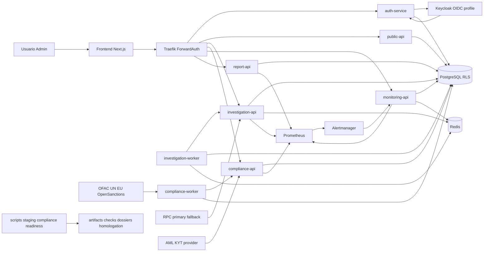
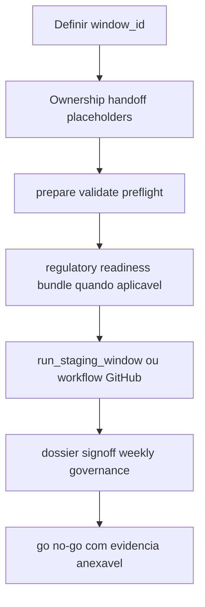

# Ontrackchain


Plataforma multi-tenant de investigacao e compliance on-chain com foco em trilha auditavel, billing por creditos, screening local de sancoes e enforcement forte em fluxos regulatorios sensiveis.

## Visao Geral

Este repositorio tem dois papeis:

- a raiz concentra onboarding, workflows e atalhos operacionais via `Makefile`
- a aplicacao vive em [`./ontrackchain`](./ontrackchain/README.md), com servicos, docs, infra, scripts e testes

Hoje o projeto ja opera como plataforma funcional, mas ainda nao concluiu toda a prontidao regulatoria/operacional para uma janela seria com prova real de ponta a ponta.

## Estado Atual

- scorecard oficial atual:
  - `91%` de construcao tecnica
  - `78%` de prontidao regulatoria/operacional
  - `87%` de construcao total consolidada
- stack executavel com `docker compose`:
  - `Traefik`
  - `FastAPI`
  - `Next.js 14`
  - `PostgreSQL`
  - `Redis`
  - `Prometheus`
  - `Alertmanager`
  - `Grafana`
  - `Keycloak` no profile `oidc`
- runtime segmentado por dominio:
  - `auth-service`
  - `public-api`
  - `investigation-api`
  - `investigation-worker`
  - `compliance-api`
  - `compliance-worker`
  - `monitoring-api`
  - `report-api`
  - `frontend`
- trilha operacional e regulatoria implementada:
  - `audit_logs`
  - `evidence_trail` append-only com encadeamento `SHA-256`
  - `preventive_blocks`
  - `counterparties` + `counterparty_history`
  - `sanctions_lists_meta` + `sanctions_hits_cache`
  - `ros_records`
- observabilidade operacional madura:
  - backlog global em `/monitoring`
  - ack em lote
  - filtros dinamicos
  - export auditado em `CSV|JSON`
- janela seria de staging consolidada com:
  - `prepare_staging_window.py`
  - `run_staging_window.py`
  - `run_regulatory_readiness_bundle.py`
  - war room
  - live tracking
  - sign-off
  - dossier anexavel

## Scorecard Oficial

| Lente | Leitura Atual | Fonte Canonica |
| --- | ---: | --- |
| Construcao tecnica | `91%` | [`project-kpi-scorecard.md`](./ontrackchain/docs/project-kpi-scorecard.md) |
| Prontidao regulatoria/operacional | `78%` | [`project-kpi-scorecard.md`](./ontrackchain/docs/project-kpi-scorecard.md) |
| Total consolidado | `87%` | [`project-kpi-scorecard.md`](./ontrackchain/docs/project-kpi-scorecard.md) |

Leitura mais honesta do momento:

- o produto esta majoritariamente construido
- o principal gargalo atual nao e mais ausencia de codigo
- o gap residual esta concentrado em homologacao externa, credenciais reais, URL tokenizada da UE, MFA federado serio e sign-off institucional recorrente

## Bloqueadores Atuais

| Iniciativa | Estado | O que falta para fechar |
| --- | --- | --- |
| `P0-01` OIDC + MFA federado serio | `blocked` | homologacao formal recorrente e trilho serio com evidencia real |
| `P0-02` `AML/KYT live` | `ready` | credencial real, gate de runtime verde e evidencia anexavel da janela |
| `P0-03` feed UE `EU_CONSOLIDATED` | `ready` | `COMPLIANCE_EU_SANCTIONS_SOURCE_URL` tokenizada e JSONs persistidos |
| Janela `stg-2026-07-06-a` | `no-go` | owners online, handoff, placeholders e secrets reais no `.env.staging.private` |

## Arquitetura em 60 Segundos

- edge: `Traefik + ForwardAuth` concentram roteamento, middleware e contexto autenticado
- identidade: `auth-service` suporta `dev` e `oidc`; `Keycloak` entra no profile `oidc`
- investigacao: `investigation-api` e `investigation-worker` fazem `estimate -> start -> queue -> result` com retry/backoff e metadados do provider RPC
- compliance: `compliance-api` expone `kyc-wallet`, `sanctions-check`, `preventive blocks` e `counterparties`; `compliance-worker` sincroniza OFAC, UN, EU e deadlines de ROS
- reports: `report-api` gera relatorios deterministas e implementa o fluxo `ROS/COAF`
- monitoring: `monitoring-api` recebe webhooks do `Alertmanager` e alimenta o backlog global operacional
- dados: `PostgreSQL` usa `RLS`; `Redis` suporta fila/cache; migrations versionam o core regulatorio
- governanca: scripts de preflight, homologacao, packet, dossier e postprocess sustentam o rito da janela seria



## Servicos Principais

| Componente | Responsabilidade |
| --- | --- |
| `auth-service` | `JWT`, `OIDC`, `2FA`, RBAC e headers de contexto |
| `public-api` | superficie publica e catalogos expostos pelo gateway |
| `investigation-api` | `estimate`, `start`, `status`, billing e metadados RPC |
| `investigation-worker` | fila real, retry/backoff, concorrencia e processamento assincrono |
| `compliance-api` | `kyc-wallet`, `sanctions-check`, `preventive blocks` e `counterparties` |
| `compliance-worker` | sync de listas, override de `source_url`, deadlines de ROS e readiness regulatorio |
| `monitoring-api` | webhooks do `Alertmanager`, backlog global e exports auditados |
| `report-api` | downloads fortes, relatorios deterministas e fluxo `ROS/COAF` |
| `frontend` | UI operacional, `/audit`, `/monitoring`, dashboard e callbacks OIDC |

## Fluxos Canonicos

### Investigacao + Billing

```text
estimate -> start -> PRE_HOLD -> queue -> RPC -> CONFIRMED ou REFUND
```

### Screening + Bloqueio + ROS

```text
compliance-worker -> sanctions_hits_cache
  -> GET sanctions-check
  -> preventive_blocks quando aplicavel
  -> ros_records quando o caso exige ROS
  -> evidence_trail + audit_logs
```

### Operacao Global

```text
Prometheus -> Alertmanager -> monitoring-api -> UI /monitoring -> export auditado
```

### Janela Seria



## Validacao e Qualidade

O baseline atual de validacao combina:

- `scripts/smoke_runtime.py` para fluxos core, `plan lock`, hashes e auditoria
- `Playwright` para `critical-path`, `compliance-flows`, `oidc-critical` e `dev-auth`
- testes focados de preflight, dossier, packet, postprocess, sanctions sync, provider runtime e readiness bundle
- quality gates por app em [`.github/workflows/quality-gates.yml`](./.github/workflows/quality-gates.yml)
- workflow dedicado da janela seria em [`.github/workflows/staging-serious-window.yml`](./.github/workflows/staging-serious-window.yml)

Comandos recomendados:

```bash
cd ontrackchain
python scripts/smoke_runtime.py

cd apps/frontend
npm ci
npm run typecheck
npm run test:e2e:oidc-critical
npm run test:e2e
```

## Operacao da Janela Seria

Atalhos principais pela raiz:

```bash
make help-serious-window
make prepare-serious-window-dispatch WINDOW_ID=stg-2026-07-06-a
make render-serious-window-dispatch-packet WINDOW_ID=stg-2026-07-06-a
make postprocess-serious-window-dry-run RUN_URL="https://github.com/<org>/<repo>/actions/runs/<run_id>"
make postprocess-serious-window RUN_URL="https://github.com/<org>/<repo>/actions/runs/<run_id>"
```

Atalhos adicionais relevantes:

```bash
make run-serious-window-local WINDOW_ID=stg-2026-07-06-a MODE=baseline
make check-compliance-provider-runtime INTERNAL_BASE_URL=http://compliance-api:8002 PUBLIC_BASE_URL=http://localhost:8080
make run-eu-sanctions-window-local WINDOW_ID=stg-2026-07-06-a
make run-regulatory-readiness-bundle WINDOW_ID=stg-2026-07-06-a
```

O workflow serio no GitHub Actions:

- materializa `.env.staging.private` a partir de secret do environment
- executa `prepare_staging_window.py --run`
- publica resumo do payload
- renderiza draft de sign-off
- sobe `ci-artifacts`, `artifacts/staging/*` e `artifacts/homologation`

Estado operacional atual da janela canônica:

- `window_id`: `stg-2026-07-06-a`
- status: `no-go`
- motivo principal: handoff humano e placeholders ainda nao preenchidos com dados reais
- artefatos vivos: war room, live tracking, manual fill sheet e sign-off versionado em `docs/governance-weekly/`

## Quick Start

### 1. Subir a stack local

```bash
cd ontrackchain
cp .env.example .env
docker compose up -d --build
```

Para exercitar OIDC localmente:

```bash
cd ontrackchain
docker compose --profile oidc up -d --build
```

### 2. Validar runtime e UI

```bash
cd ontrackchain
python scripts/smoke_runtime.py

cd apps/frontend
npm ci
npm run test:e2e:dev-auth
```

### 3. Endpoints locais padrao

Os ports abaixo refletem `ontrackchain/.env.example`.

- app gateway: `http://localhost:8080`
- dashboard do Traefik: `http://localhost:8081`
- Keycloak profile `oidc`: `http://localhost:8088`
- Prometheus: `http://localhost:9091`
- Alertmanager: `http://localhost:9093`
- Grafana: `http://localhost:3002`
- PostgreSQL: `localhost:5432`
- Redis: `localhost:6379`

## Navegacao Canonica

- [README interno da aplicacao](./ontrackchain/README.md)
- [Indice de documentacao](./ontrackchain/docs/README.md)
- [Arquitetura](./ontrackchain/docs/architecture.md)
- [Contratos de API](./ontrackchain/docs/api-contracts.md)
- [Deploy e Staging](./ontrackchain/docs/deploy-and-staging.md)
- [Gates de Release para Staging Serio](./ontrackchain/docs/project-release-gates.md)
- [Validacao e Auditoria](./ontrackchain/docs/validation-and-audit.md)
- [Scorecard Oficial do Projeto](./ontrackchain/docs/project-kpi-scorecard.md)
- [Readiness Regulatorio](./ontrackchain/docs/regulatory-readiness.md)
- [ADRs](./ontrackchain/docs/adrs/README.md)
- [Migrations PostgreSQL](./ontrackchain/infra/postgres/migrations/README.md)

## Estrutura do Repositorio

```text
Ontrackchain/
├── .github/
│   └── workflows/
├── Makefile
├── README.md
├── ONTRACKCHAIN  Arquitetura Expandida v3.0.md
└── ontrackchain/
    ├── apps/
    │   ├── auth-service/
    │   ├── public-api/
    │   ├── investigation-api/
    │   ├── compliance-api/
    │   ├── monitoring-api/
    │   ├── report-api/
    │   └── frontend/
    ├── docs/
    ├── infra/
    ├── packages/
    ├── scripts/
    ├── tests/
    ├── docker-compose.yml
    ├── Makefile
    ├── .env.example
    └── README.md
```

## Riscos Residuais Conhecidos

- `AML/KYT` live ainda depende de credenciais reais e homologacao recorrente
- `due_diligence` e `source_of_funds` seguem intencionalmente em `manual_review_required`
- o feed `EU_CONSOLIDATED` ainda depende de URL tokenizada real para fechar prova operacional seria
- `legal_report`, `ROS/COAF` e `block lift` exigem MFA serio homologado para janela forte
- retention/recovery, owners e sign-off ainda precisam de aceite institucional recorrente
- a janela `stg-2026-07-06-a` continua `no-go` ate o preenchimento humano dos placeholders e handoffs

## Proximo Passo Recomendado

Focar nas iniciativas que mais movem o scorecard e destravam a janela seria:

- fechar `P0-02` com provider `AML/KYT live` real
- fechar `P0-03` com feed UE tokenizado e bundle anexado
- avancar `P0-01` com MFA/OIDC federado serio homologado
- executar a primeira janela seria completa com owners online, artefatos reais e sign-off formal
