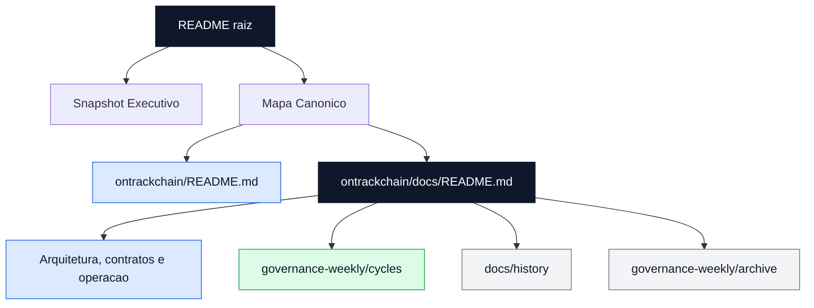
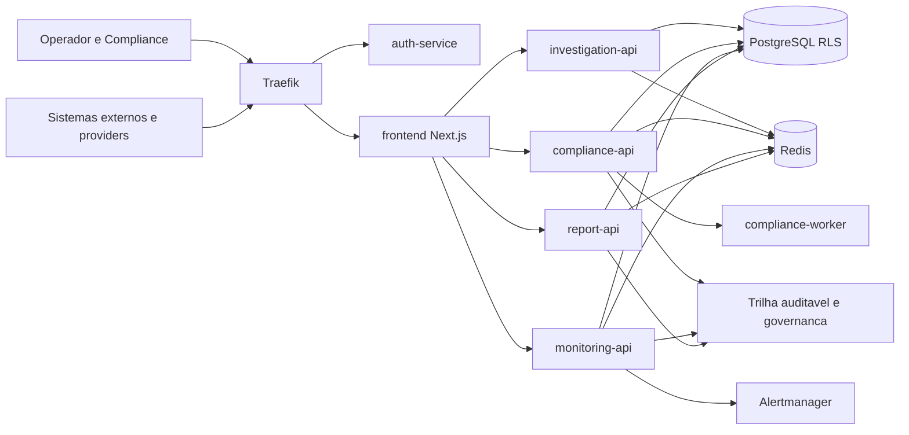
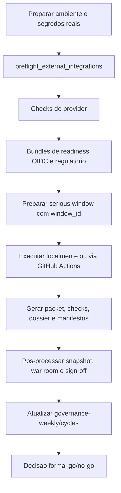

# Ontrackchain


Plataforma modular de investigacao e compliance on-chain com foco em trilha auditavel, operacao multiusuario, screening regulatorio, governanca de release e evidencia rastreavel.

## Leitura Rapida

Se este e seu primeiro contato com o repositorio, leia nesta ordem:

1. [Snapshot Executivo](#snapshot-executivo)
2. [Mapa Canonico](#mapa-canonico)
3. [README tecnico da aplicacao](./ontrackchain/README.md)
4. [Indice canonico da documentacao](./ontrackchain/docs/README.md)

Resumo em 30 segundos:

- baseline oficial: `93%` tecnico, `79%` regulatorio/operacional, `89%` consolidado
- o gargalo principal deixou de ser construcao de base e passou a ser homologacao externa, prova operacional revisavel e aceite institucional
- o ciclo ativo continua em `2026-07-13`, com a tentativa `stg-2026-07-13-a` ainda em `pending_no_go`
- a raiz existe para onboarding e navegacao; a fonte primaria do projeto vive em `ontrackchain/` e `ontrackchain/docs/`
- a trilha documental ja foi saneada para separar documento vivo, evidencia de ciclo, historico de apoio e historico frio

## Fluxo de Leitura Canonica

O diagrama abaixo mostra como navegar pelo workspace sem misturar baseline viva, evidencias datadas e historico.



## Snapshot Executivo

### Estado atual

- arquitetura modular operando sobre `frontend`, servicos `FastAPI`, `PostgreSQL`, `Redis`, workers e observabilidade
- trilha regulatoria funcional em `counterparties`, `preventive_blocks`, `evidence`, `reports` e `ROS/COAF`
- operacao multiusuario compartilhada por `regulatory_work_items`, timeline e comentarios estruturados
- cockpit frontend tri-locale com workspaces convergidos e contratos visuais endurecidos
- RCA cross-domain leve consolidada entre `alerts`, `/monitoring`, export operacional e governanca
- blueprint atual do Render restaurado para `staging full-stack`, aproximando o ambiente publico da topologia real

### O que ja foi consolidado

| Frente | Estado | Resultado atual |
| --- | --- | --- |
| `P1-01` metadata de work-items | `done` | contrato canonico unificado entre frontend, backend e `api-contracts.md` |
| `P2-02` timeline/comments compartilhados | `done` | modelo comum consolidado nos cockpits operacionais |
| `P2-03` RCA cross-domain | `done` | RCA leve persistida, lida por `monitoring` e refletida em governanca |
| `P2-05` RBAC incremental | `in_progress` | enforcement fino expandido por `team`, `reports`, `billing`, `investigate`, `compliance`, `alerts`, `counterparties` e navegacao global sensivel |

### O que ainda bloqueia o salto regulatorio

- `P0-01`: homologar `OIDC + MFA` federado em trilho serio
- `P0-02`: fechar `AML/KYT live` com credencial real e artefato revisavel
- `P0-03`: ativar feed UE real com URL tokenizada e persistencia auditavel
- `P0-04`: consolidar `P0-02 + P0-03` em bundle regulatorio oficial
- `P0-05`: executar a primeira janela seria material com `go/no-go` formal
- `P0-06`: formalizar sign-off recorrente de retention/recovery

## Arquitetura em 60 Segundos

- `Traefik` centraliza a borda e roteia requisicoes para os servicos internos
- `auth-service` resolve identidade, contexto federado, `2FA`, roles e headers internos
- `frontend` em `Next.js 14` atua como cockpit operacional e camada de orquestracao de UX
- `investigation-api` concentra `estimate`, `start`, `status`, ledger e superficies financeiras
- `compliance-api` concentra sanctions, counterparties, blocks, screening e fila operacional compartilhada
- `monitoring-api` recebe webhooks do `Alertmanager` e sustenta triagem, RCA e export operacional
- `report-api` gera relatorios deterministas e governa o workflow `ROS/COAF`
- `PostgreSQL` com `RLS` sustenta o dominio multi-tenant; `Redis` cobre fila, retry, DLQ e concorrencia

### Fluxo Macro da Plataforma



## Mapa Canonico

### Portas de entrada

- [README tecnico da aplicacao](./ontrackchain/README.md)
- [Indice canonico da documentacao](./ontrackchain/docs/README.md)

### Documentos principais

- [Arquitetura](./ontrackchain/docs/architecture.md)
- [Contratos de API](./ontrackchain/docs/api-contracts.md)
- [RBAC e Permissoes](./ontrackchain/docs/rbac-and-permissions.md)
- [Cobertura do Frontend](./ontrackchain/docs/frontend-coverage-matrix.md)
- [Resumo Executivo de Readiness](./ontrackchain/docs/project-executive-readiness-brief.md)
- [Scorecard Oficial](./ontrackchain/docs/project-kpi-scorecard.md)
- [Avaliacao de Maturidade](./ontrackchain/docs/project-maturity-assessment.md)
- [Board de Prioridades](./ontrackchain/docs/project-priority-board.md)
- [Board Operacional](./ontrackchain/docs/project-operational-execution-board.md)
- [Governanca Semanal](./ontrackchain/docs/governance-weekly/README.md)

### Evidencia datada e historico

- [Ciclo ativo 2026-07-13](./ontrackchain/docs/governance-weekly/cycles/2026-07-13/README.md)
- [Historico de apoio](./ontrackchain/docs/history/README.md)
- [Arquivo historico da governanca](./ontrackchain/docs/governance-weekly/archive/README.md)

## Leitura Recomendada por Perfil

### Arquiteto / Lider tecnico

1. [architecture.md](./ontrackchain/docs/architecture.md)
2. [api-contracts.md](./ontrackchain/docs/api-contracts.md)
3. [rbac-and-permissions.md](./ontrackchain/docs/rbac-and-permissions.md)
4. [adrs/README.md](./ontrackchain/docs/adrs/README.md)

### Operacao / SRE / DevOps

1. [operations.md](./ontrackchain/docs/operations.md)
2. [deploy-and-staging.md](./ontrackchain/docs/deploy-and-staging.md)
3. [project-release-gates.md](./ontrackchain/docs/project-release-gates.md)
4. [governance-weekly/README.md](./ontrackchain/docs/governance-weekly/README.md)

### Compliance / Regulacao

1. [regulatory-readiness.md](./ontrackchain/docs/regulatory-readiness.md)
2. [evidence-and-audit-matrix.md](./ontrackchain/docs/evidence-and-audit-matrix.md)
3. [compliance-and-security-controls.md](./ontrackchain/docs/compliance-and-security-controls.md)
4. [project-maturity-evidence-execution-kit.md](./ontrackchain/docs/project-maturity-evidence-execution-kit.md)
5. [compliance-reports/README.md](./ontrackchain/docs/compliance-reports/README.md)

### Stakeholders executivos

1. [project-executive-readiness-brief.md](./ontrackchain/docs/project-executive-readiness-brief.md)
2. [project-kpi-scorecard.md](./ontrackchain/docs/project-kpi-scorecard.md)
3. [project-priority-board.md](./ontrackchain/docs/project-priority-board.md)
4. [governance-weekly/cycles/2026-07-13/README.md](./ontrackchain/docs/governance-weekly/cycles/2026-07-13/README.md)

## Quick Start

### 1. Subir a stack local

```bash
cd ontrackchain
cp .env.example .env
docker compose up -d --build
```

Para exercitar `OIDC` localmente:

```bash
cd ontrackchain
docker compose --profile oidc up -d --build
```

### 2. Validar o baseline local

```bash
cd ontrackchain
python3 scripts/smoke_runtime.py
make apply-regulatory-work-items-migration
make smoke-work-items-ownership-backend

cd apps/frontend
npm ci
npm run typecheck
npm run test:e2e:stack-real-light
npm run test:e2e:browser-mocked
```

Observacoes:

- use `npm run test:e2e:dev-auth` apenas com `AUTH_MODE=dev`
- use `npm run test:e2e:oidc-critical` apenas quando o runtime real estiver em `AUTH_MODE=oidc`
- para mudancas server-side no frontend, prefira `docker compose up -d --build frontend`

### 3. Validar readiness serio

```bash
cd ontrackchain
python3 scripts/preflight_external_integrations.py
make check-compliance-provider-runtime \
  INTERNAL_BASE_URL=http://compliance-api:8002 \
  PUBLIC_BASE_URL=http://localhost:8080
make run-oidc-readiness-bundle-local WINDOW_ID=stg-$(date +%F)-oidc BASE_URL=http://localhost:8080
make run-regulatory-readiness-bundle-local \
  WINDOW_ID=stg-$(date +%F)-reg \
  INTERNAL_BASE_URL=http://compliance-api:8002 \
  PUBLIC_BASE_URL=http://localhost:8080
```

## Janela Seria

Comandos principais:

```bash
cd ontrackchain
make help-serious-window
make prepare-serious-window-dispatch WINDOW_ID=stg-2026-07-13-a
make render-serious-window-dispatch-packet WINDOW_ID=stg-2026-07-13-a
make run-serious-window-local WINDOW_ID=stg-2026-07-13-a MODE=baseline
make postprocess-serious-window RUN_URL="https://github.com/<org>/<repo>/actions/runs/<run_id>"
```

Estado atual da janela:

- `stg-2026-07-13-a` segue em `pending_no_go`
- o bloqueio principal continua sendo insumo externo real, ownership material e prova revisavel
- `ROS/COAF` segue sendo a trilha mais sensivel para validacao fim a fim do staging

### Fluxo da Janela Seria



## Politica Documental

- este `README.md` da raiz existe para onboarding, visao executiva curta e navegacao do GitHub
- [ontrackchain/README.md](./ontrackchain/README.md) e a porta de entrada tecnica da aplicacao
- [ontrackchain/docs/README.md](./ontrackchain/docs/README.md) e o indice canonico da documentacao
- artefatos datados ainda ativos devem viver em `ontrackchain/docs/governance-weekly/cycles/`
- historico datado de apoio deve viver em `ontrackchain/docs/history/`
- historico frio consolidado deve viver em `ontrackchain/docs/governance-weekly/archive/`
- outputs gerados, como relatorios de compliance, devem viver em `ontrackchain/docs/compliance-reports/` e nao devem ser editados manualmente
- `.publish_repo/` foi aposentado e removido em `2026-07-15`
- documentos paralelos, redundantes ou supersedidos devem ser consolidados, arquivados ou removidos

## Como Ler a Documentacao

Use esta precedencia quando houver duvida:

1. `ontrackchain/docs/README.md` e os documentos canonicamente indexados nele
2. `ontrackchain/docs/governance-weekly/cycles/` para evidencia datada ainda navegavel
3. `ontrackchain/docs/history/` e `ontrackchain/docs/governance-weekly/archive/` apenas como contexto historico

Leitura pratica:

- se voce quer o estado atual do projeto, comece por `docs/`
- se voce quer a prova de uma semana ou janela especifica, use `governance-weekly/cycles/`
- se voce quer entender uma decisao antiga, use `history/` ou `archive/`

## Estrutura do Repositorio

```text
Ontrackchain/
├── .github/
├── Makefile
├── README.md
└── ontrackchain/
    ├── apps/
    ├── docs/
    ├── infra/
    ├── packages/
    ├── scripts/
    ├── tests/
    ├── docker-compose.yml
    ├── Makefile
    ├── .env.example
    └── README.md
```

## Proximo Passo Recomendado

As frentes que mais movem a maturidade comprovada continuam sendo:

1. fechar `P0-02` com provider `AML/KYT live`
2. fechar `P0-03` com feed UE tokenizado
3. homologar `P0-01` com evidencias reais de `OIDC + MFA`
4. executar a janela seria completa com `go/no-go` formal

Trilha de prova tecnica prioritaria:

- usar `ROS/COAF` como fluxo de validacao fim a fim do staging, porque ele exige identidade federada, usuario persistido, `report-api`, MFA e trilha auditavel coerentes
