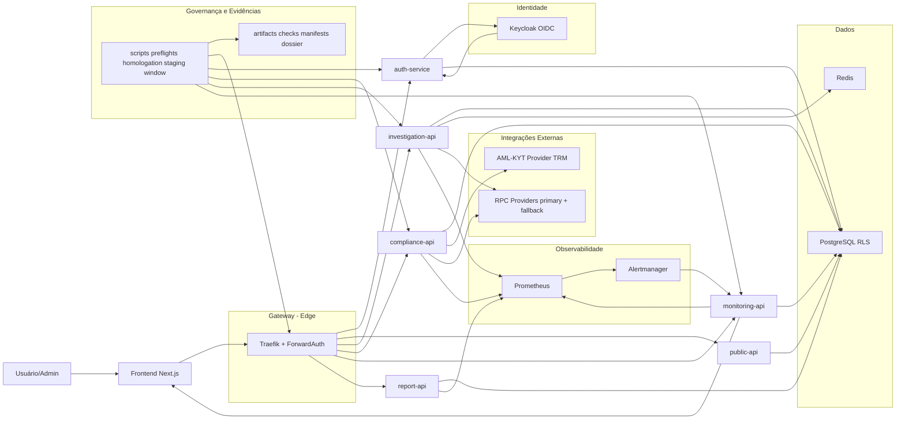
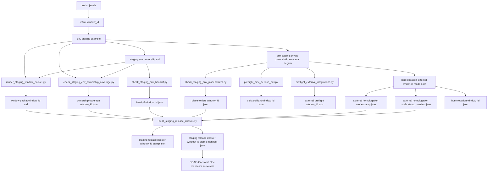
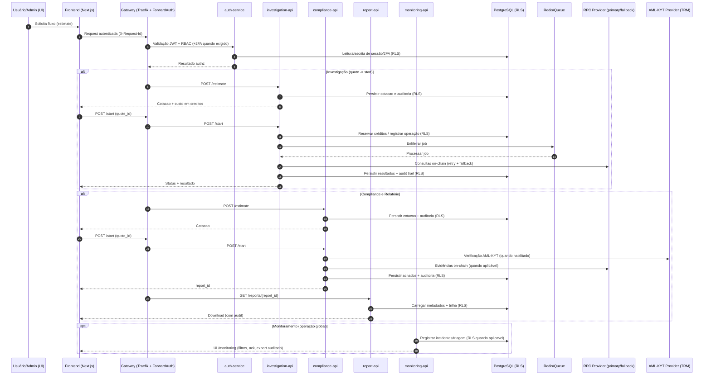
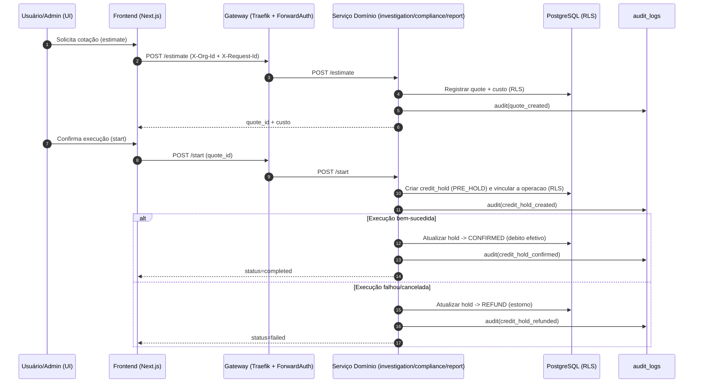
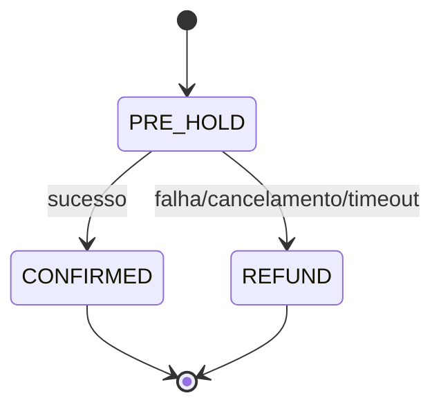
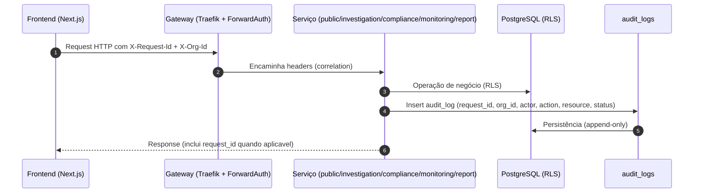
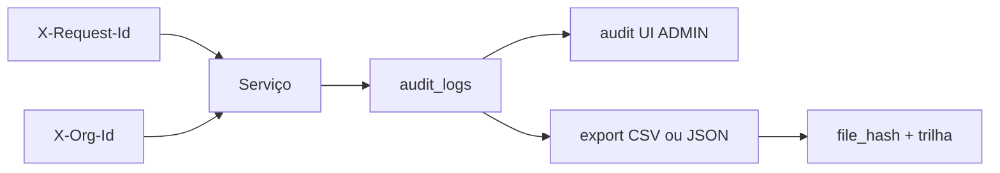

# Ontrackchain

<p align="center">
  
</p>

Plataforma multi-tenant de investigação e compliance on-chain com foco em trilha auditável, billing controlado por créditos e enforcement de segurança em fluxos sensíveis.

## Estado Atual

- Scaffold executável com `docker compose`
- Gateway central com `Traefik` + `ForwardAuth`
- Banco `PostgreSQL` com `RLS` obrigatório
- Frontend `Next.js` com proxies autenticados
- APIs separadas por domínio:
  - `auth-service`
  - `public-api`
  - `investigation-api`
  - `compliance-api`
  - `monitoring-api`
  - `report-api`
- Validação automatizada por:
  - `scripts/smoke_runtime.py`
  - `Playwright` (`critical-path` + `compliance-flows`)
- Observabilidade central inicial com `Prometheus` para `investigation`
- Dashboard operacional provisionado em `Grafana`
- Observabilidade central expandida para `monitoring`
- Observabilidade central expandida para `compliance`
- Observabilidade central expandida para `report`
- Alerting ativo com `Alertmanager` e receiver interno no `monitoring-api`
- UI administrativa `/audit` consulta `audit_logs` com filtros operacionais para `ADMIN`
- UI administrativa `/monitoring` exibe incidentes globais de plataforma recebidos do `Alertmanager`
- janela séria de `staging` agora pode ser executada ponta a ponta via `run_staging_window.py`, persistindo checks, preflights, homologação e dossier final
- Triagem manual separa `status` técnico do alerta e `triage_status` operacional na UI `/monitoring`
- Lista de incidentes globais agora suporta paginação cursor-based para backlog operacional
- Resumo da lista paginada agora exibe volume filtrado total do backlog operacional
- A triagem administrativa agora suporta filtro adicional por severidade (`info|warning|critical`)
- A triagem administrativa agora também suporta filtro por `receiver`
- Os filtros de `service` e `receiver` da UI administrativa agora são carregados dinamicamente do backend
- A UI administrativa permite reconhecimento em lote dos incidentes pendentes do recorte filtrado
- A UI administrativa agora suporta export do recorte filtrado ou dos incidentes selecionados em `CSV|JSON`
- Cada export administrativo agora gera trilha em `audit_logs` com `request_id`, escopo, formato e filtros aplicados
- A UI administrativa também suporta seleção manual por linha para reconhecimento parcial controlado
- A seleção manual agora pode acumular incidentes em múltiplas páginas dentro do mesmo recorte filtrado
- O recorte e a seleção manual acumulada agora sobrevivem a refresh da página na mesma aba via `sessionStorage`
- A mesma aba agora restaura também a página atual do backlog paginado após refresh

## Objetivo do MVP

Entregar uma base operacional para:

- investigação on-chain multi-chain com foco inicial EVM
- compliance e geração de relatórios auditáveis
- monitoramento com watchlists e alertas
- billing por créditos com cotação prévia e `plan lock`
- isolamento rigoroso por organização

## Princípios Arquiteturais

- `multi-tenant by design`: nenhuma query sensivel deve escapar de `org_id`
- `on-chain mínimo`: o MVP trabalha principalmente off-chain, com preparo para registro/evidência futura
- `quote -> start`: operações cobráveis exigem cotação prévia
- `append-only audit`: eventos relevantes geram trilha em `audit_logs`
- `request correlation`: fluxos criticos propagam `X-Request-Id`
- `segurança > funcionalidade`: `legal_report` exige `JWT + ADMIN + 2FA`

## Arquitetura em 60 segundos

- Edge: `Traefik + ForwardAuth` concentra roteamento e enforcement inicial de auth.
- Identidade: `Keycloak (OIDC)` + `auth-service` para sessão, RBAC e requisitos de `2FA` em fluxos sensíveis.
- Domínios: APIs separadas (`public`, `investigation`, `compliance`, `monitoring`, `report`) para reduzir acoplamento e facilitar governança.
- Dados: `PostgreSQL` com `RLS` como default e `Redis` para fila/cache onde aplicável.
- Observabilidade: `Prometheus -> Alertmanager -> monitoring-api`, com UI de triagem e export auditado.
- Governança: `scripts/` geram checks, manifests e dossier anexável para janelas sérias de `staging`.

## Navegação Rápida

- Diagramas:
  - [Fluxo do Projeto](#diagram-project)
  - [Janela Séria de Staging](#diagram-staging-window)
  - [Investigação e Compliance (MVP)](#diagram-mvp-flows)
  - [Billing por Créditos (MVP)](#diagram-billing)
  - [Trilha de Auditoria (request_id)](#diagram-audit)
- Docs operacionais: [Índice de Documentação](./ontrackchain/docs/README.md)
- Preparação completa do disparo real pela raiz: `make prepare-serious-window-dispatch WINDOW_ID=stg-2026-07-06-a`
- Preflight do disparo real pela raiz: `make preflight-serious-window-dispatch WINDOW_ID=stg-2026-07-06-a`
- Pacote copy/paste do disparo real pela raiz: `make render-serious-window-dispatch-packet WINDOW_ID=stg-2026-07-06-a`
- Fechamento oficial da janela pela raiz: `make postprocess-serious-window RUN_URL=<github-actions-run-url>`
- Ajuda complementar da raiz: `make help-serious-window`

<a id="diagram-project"></a>
## Diagrama de Fluxo do Projeto



<a id="diagram-staging-window"></a>
## Diagrama de Fluxo — Janela Séria de Staging



<a id="diagram-mvp-flows"></a>
## Diagrama de Fluxo — Investigação e Compliance (MVP)



<a id="diagram-billing"></a>
## Diagrama de Fluxo — Billing por Créditos (MVP)





<a id="diagram-audit"></a>
## Diagrama de Fluxo — Trilha de Auditoria (request_id)





## Documentação

- [Índice de Documentação](./ontrackchain/docs/README.md)
- [Arquitetura](./ontrackchain/docs/architecture.md)
- [Contratos de API](./ontrackchain/docs/api-contracts.md)
- [Board de Prioridades do Projeto](./ontrackchain/docs/project-priority-board.md)
- [Plano de Execução para 90%](./ontrackchain/docs/project-execution-plan-to-90.md)
- [Plano Operacional Trimestral para 95%](./ontrackchain/docs/project-operational-plan-to-95.md)
- [Matriz Operacional de Execução para 95%](./ontrackchain/docs/project-operational-execution-board.md)
- [Gates de Release para Staging Sério](./ontrackchain/docs/project-release-gates.md)
- [Deploy e Staging](./ontrackchain/docs/deploy-and-staging.md)
- [Checklist Pré-Produção](./ontrackchain/docs/pre-production-checklist.md)
- [CI/CD e Release](./ontrackchain/docs/ci-cd-and-release.md)
- [Validação e Auditoria](./ontrackchain/docs/validation-and-audit.md)
- [Compliance e Controles de Segurança](./ontrackchain/docs/compliance-and-security-controls.md)
- [Readiness Regulatório](./ontrackchain/docs/regulatory-readiness.md)
- [Variáveis de Ambiente](./ontrackchain/docs/environment-variables.md)
- [ADRs](./ontrackchain/docs/adrs/README.md)
- [Migrations PostgreSQL](./ontrackchain/infra/postgres/migrations/README.md)

## Quick Start

### 1. Subir a stack

```bash
cd ontrackchain
docker compose up -d --build
```

### 2. Validar o scaffold

```bash
cd ontrackchain
python scripts/smoke_runtime.py
cd apps/frontend && npx playwright test tests/e2e/critical-path.spec.ts tests/e2e/compliance-flows.spec.ts
```

### 2.1. Preparar e fechar a janela séria a partir da raiz

```bash
make prepare-serious-window-dispatch \
  WINDOW_ID="stg-2026-07-06-a"
make postprocess-serious-window-dry-run \
  RUN_URL="https://github.com/<org>/<repo>/actions/runs/<run_id>"
make postprocess-serious-window \
  RUN_URL="https://github.com/<org>/<repo>/actions/runs/<run_id>"
```

### 3. Endpoints locais

Os ports abaixo refletem o baseline atual do `.env.example`. Se o seu `.env` sobrescrever algum valor, use o port configurado localmente.

- App/Gateway: `http://localhost:8080`
- Dashboard Traefik: `http://localhost:8081`
- Prometheus: `http://localhost:9091`
- Alertmanager: `http://localhost:9093`
- Grafana: `http://localhost:3002`
- PostgreSQL: `localhost:5432`
- Redis: `localhost:6379`

## Estrutura do Repositório

```text
ontrackchain/
├── apps/
│   ├── auth-service/
│   ├── public-api/
│   ├── investigation-api/
│   ├── compliance-api/
│   ├── monitoring-api/
│   ├── report-api/
│   └── frontend/
├── infra/
│   ├── postgres/
│   └── traefik/
├── packages/
│   ├── shared/
│   └── agents/
├── scripts/
│   ├── smoke_runtime.py
│   ├── backup_postgres.sh
│   └── restore_postgres.sh
├── docker-compose.yml
└── .env.example
```

## Fluxos Críticos Cobertos

- Investigação: estimate -> start -> queue/concurrency -> complete/fail
- Compliance: estimate -> start -> report -> download
- Monitoring: estimate -> start -> watchlist -> alert
- Billing: `PRE_HOLD -> CONFIRMED/REFUND`
- Auditoria: `request_id -> action -> resource -> report_id -> file_hash`
- Segurança: `legal_report` bloqueado antes de `2FA`
- Operação global: incidente de plataforma pode ser marcado como `acknowledged` sem alterar `firing|resolved`
- Operação global: backlog administrativo de incidentes pode ser exportado em `CSV|JSON` com trilha `operational_alerts_exported`

## Riscos Residuais Conhecidos

- O fluxo de autenticação ainda depende do scaffold dev em ambiente local, mas o 2FA de sessões JWT agora usa TOTP real no `auth-service`
- A observabilidade central cobre `investigation`, `monitoring`, `compliance` e `report`
- O roteamento ativo de alertas depende do token interno `Alertmanager -> monitoring-api`
- Ambientes com volume persistido precisam aplicar `0006_add_operational_alert_triage.sql` para habilitar a triagem manual
- Ambientes com volume persistido precisam aplicar `0007_add_operational_alert_cursor_index.sql` para paginação estável de incidentes globais
- O export administrativo auditado dos incidentes globais depende de contexto válido no proxy server-side do frontend
- Integrações AML/KYT e providers blockchain ainda são mockadas/parciais
- Bitcoin continua limitado a `3 hops` no MVP

## Próximo Passo Recomendado

Seguir para Fase 2 com foco em:

- endurecimento de compliance/regulatório
- evoluir políticas de alerting, deduplicação e escalonamento
- evolução de UI de auditoria e operação
- integrações reais de dados e scoring
