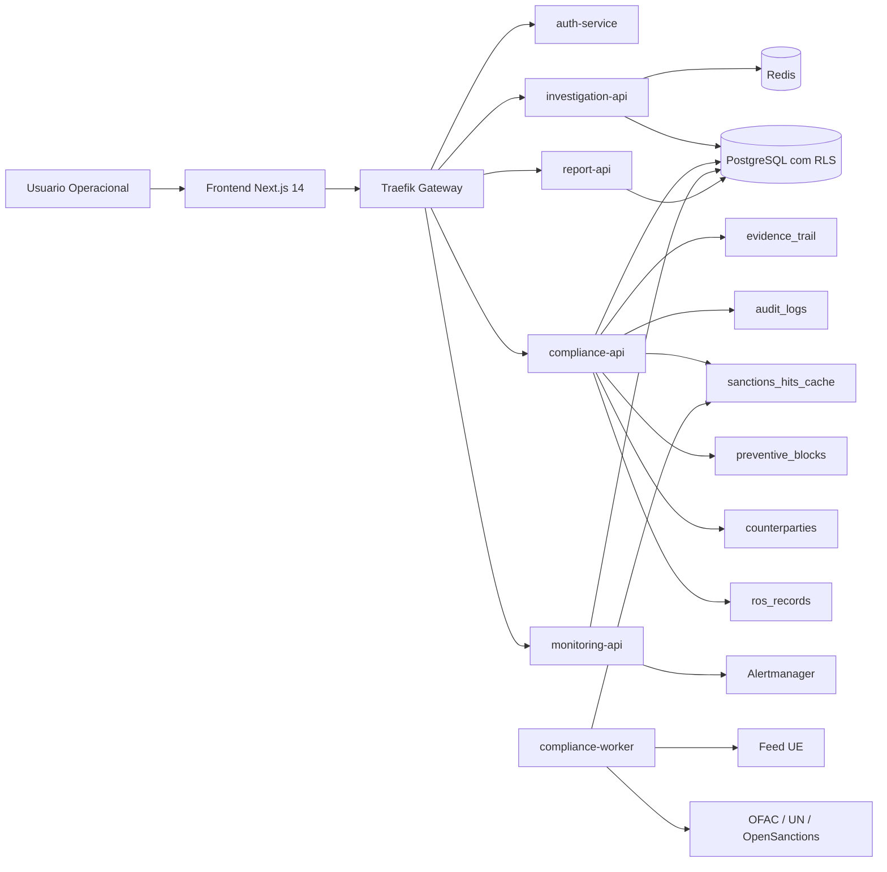
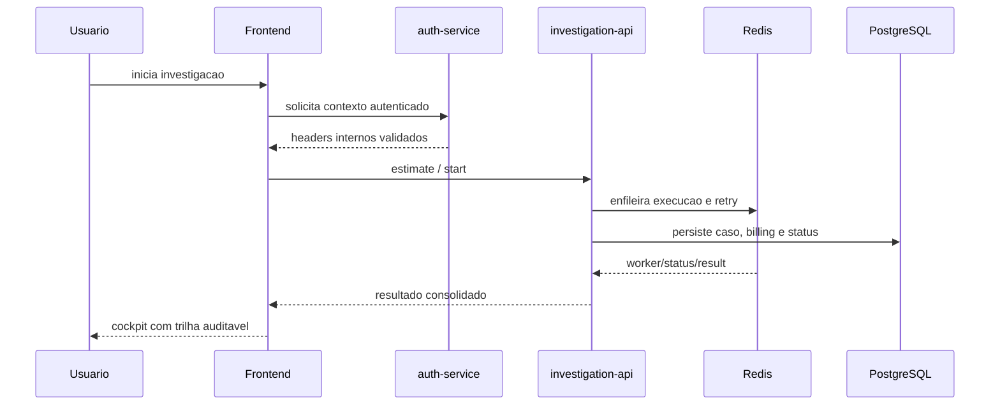
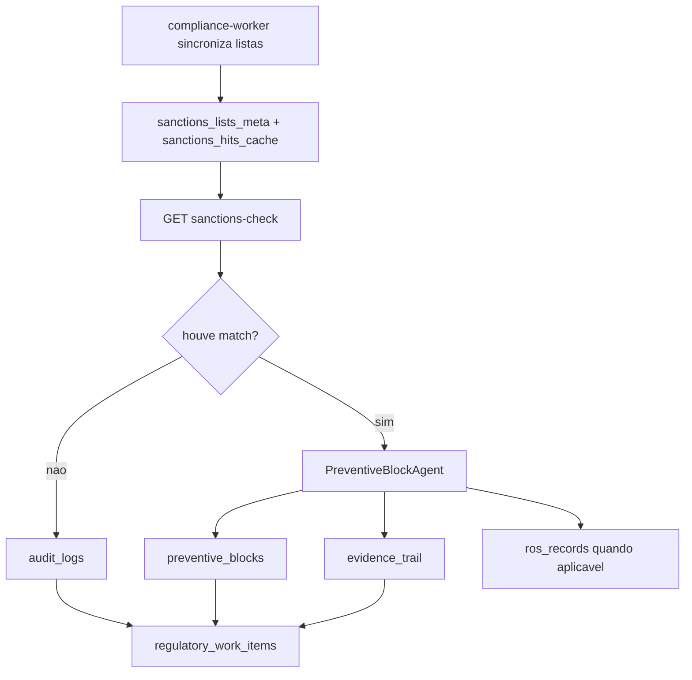
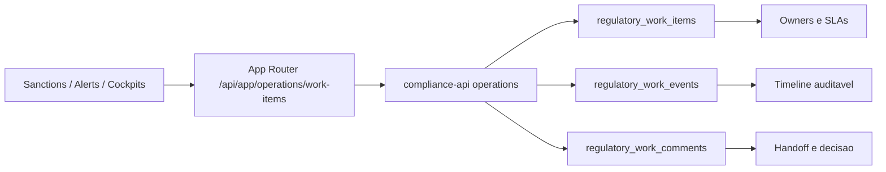
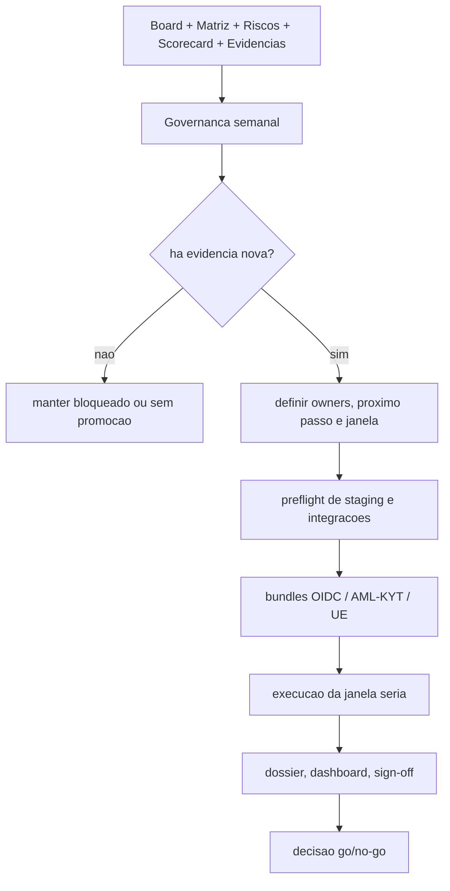

# Ontrackchain


Plataforma de investigacao e compliance on-chain com foco em trilha auditavel, fila operacional multiusuario, screening local de sancoes e governanca de release para ambientes serios.

## Sumario

- [O Que Este Repositorio Contem](#o-que-este-repositorio-contem)
- [Estado Atual](#estado-atual)
- [Arquitetura em 60 Segundos](#arquitetura-em-60-segundos)
- [Mapa Rapido de Modulos](#mapa-rapido-de-modulos)
- [Como os Modulos se Conectam](#como-os-modulos-se-conectam)
- [Leitura Recomendada por Perfil](#leitura-recomendada-por-perfil)
- [Matriz de Fluxos Criticos](#matriz-de-fluxos-criticos)
- [Prontidao Rumo a 95%](#prontidao-rumo-a-95)
- [Politica de Documentacao](#politica-de-documentacao)
- [Quick Start](#quick-start)
- [Mapa Canonico](#mapa-canonico)
- [Fluxos Canonicos do Projeto](#fluxos-canonicos-do-projeto)
- [Diagramas do Projeto](#diagramas-do-projeto)
- [Janela Seria](#janela-seria)
- [Estrutura do Repositorio](#estrutura-do-repositorio)
- [Riscos Residuais](#riscos-residuais)
- [Proximo Passo Recomendado](#proximo-passo-recomendado)

## O Que Este Repositorio Contem

Este repositorio e dividido em dois niveis:

- a raiz concentra onboarding, atalhos operacionais e delegacao de `Makefile`
- a aplicacao principal vive em [`./ontrackchain`](./ontrackchain/README.md)
- a documentacao canonica do produto vive em [`./ontrackchain/docs`](./ontrackchain/docs/README.md)

## Estado Atual

- baseline oficial atual:
  - `91%` de construcao tecnica
  - `78%` de prontidao regulatoria/operacional
  - `87%` de maturidade consolidada
- stack local executavel com `docker compose`:
  - `Traefik`
  - `FastAPI`
  - `Next.js 14`
  - `PostgreSQL`
  - `Redis`
  - `Prometheus`
  - `Alertmanager`
  - `Grafana`
  - `Keycloak` no profile `oidc`
- modulos principais ativos:
  - `auth-service`
  - `public-api`
  - `investigation-api`
  - `compliance-api`
  - `monitoring-api`
  - `report-api`
  - `frontend`
- capacidades ja institucionalizadas:
  - `audit_logs`
  - `evidence_trail` append-only
  - `regulatory_work_items` com timeline e comentarios
  - `preventive_blocks`
  - `counterparties`
  - `ros_records`
  - cockpits operacionais tri-locale no frontend
  - `monitoring` decomposto em hooks, loaders e paineis dedicados

## Arquitetura em 60 Segundos

- `Traefik` centraliza a borda e roteia requisicoes para os servicos internos
- `auth-service` valida identidade, contexto `OIDC`, MFA e headers internos de tenant/ator
- `frontend` em `Next.js 14` atua como cockpit operacional tri-locale e camada de orquestracao de UX
- `investigation-api` concentra estimativa, abertura, status e resultado de investigacoes on-chain
- `compliance-api` concentra screening, counterparties, bloqueios preventivos e fila operacional compartilhada
- `monitoring-api` recebe webhooks do `Alertmanager` e sustenta a operacao global de incidentes
- `report-api` gera relatorios deterministas e governa o workflow `ROS/COAF`
- `PostgreSQL` com `RLS` persiste o dominio multi-tenant; `Redis` sustenta fila, retry, DLQ e concorrencia
- `audit_logs` cobre trilha operacional; `evidence_trail` cobre cadeia regulatoria append-only
- `compliance-worker` sincroniza listas locais de sancoes e reduz dependencia externa por request

## Mapa Rapido de Modulos

| Modulo | Responsabilidade Principal | Documento Canonico |
| --- | --- | --- |
| `auth-service` | autenticacao, contexto federado, validacao de headers internos e MFA | [`ontrackchain/docs/keycloak-oidc-template.md`](./ontrackchain/docs/keycloak-oidc-template.md) |
| `frontend` | cockpits operacionais, App Router, tri-locale e UX regulatoria | [`ontrackchain/docs/frontend-coverage-matrix.md`](./ontrackchain/docs/frontend-coverage-matrix.md) |
| `investigation-api` | estimativa, abertura, execucao e resultado de investigacoes | [`ontrackchain/docs/architecture.md`](./ontrackchain/docs/architecture.md) |
| `compliance-api` | sanctions-check, counterparties, preventive blocks e work-items | [`ontrackchain/docs/architecture.md`](./ontrackchain/docs/architecture.md) |
| `monitoring-api` | ingestao de alertas, operacao global e remediacao | [`ontrackchain/docs/architecture.md`](./ontrackchain/docs/architecture.md) |
| `report-api` | reports deterministas, downloads sensiveis e `ROS/COAF` | [`ontrackchain/docs/api-contracts.md`](./ontrackchain/docs/api-contracts.md) |
| `PostgreSQL` | persistencia multi-tenant, trilhas operacionais e regulatorias | [`ontrackchain/docs/architecture.md`](./ontrackchain/docs/architecture.md) |
| `Redis` | fila, retry, backoff, DLQ e concorrencia operacional | [`ontrackchain/docs/architecture.md`](./ontrackchain/docs/architecture.md) |
| `governance-weekly` | ritos semanais, war room, sign-offs e historico operacional | [`ontrackchain/docs/governance-weekly/README.md`](./ontrackchain/docs/governance-weekly/README.md) |
| `release gates` | readiness, preflight, evidencias e decisao `go/no-go` | [`ontrackchain/docs/project-release-gates.md`](./ontrackchain/docs/project-release-gates.md) |

## Como os Modulos se Conectam

- `frontend` concentra a experiencia operacional e fala com a borda por rotas do `App Router` e chamadas internas
- `Traefik` recebe o trafego e encaminha para os servicos corretos por dominio funcional
- `auth-service` autentica o ator, resolve contexto federado e propaga headers de tenant, papel, MFA e correlacao
- `investigation-api` usa esse contexto para abrir casos, persistir billing/status e orquestrar execucao com apoio do `Redis`
- `compliance-api` reutiliza o mesmo contexto autenticado para screening, counterparties, bloqueios e `work-items`
- `monitoring-api` recebe eventos globais do `Alertmanager` e alimenta os cockpits de operacao de plataforma
- `report-api` consome o mesmo dominio persistido para gerar relatorios e governar o workflow `ROS/COAF`
- `PostgreSQL` com `RLS` unifica persistencia multi-tenant, enquanto `audit_logs` e `evidence_trail` separam trilha operacional de trilha regulatoria
- `compliance-worker` atualiza listas locais de sancoes e evita dependencia de provider externo em cada request

## Leitura Recomendada por Perfil

### Arquiteto / Lider Tecnico

1. [`ontrackchain/docs/architecture.md`](./ontrackchain/docs/architecture.md)
2. [`ontrackchain/docs/api-contracts.md`](./ontrackchain/docs/api-contracts.md)
3. [`ontrackchain/docs/project-release-gates.md`](./ontrackchain/docs/project-release-gates.md)
4. [`ontrackchain/docs/adrs/README.md`](./ontrackchain/docs/adrs/README.md)

### Operacao / SRE / DevOps

1. [`ontrackchain/docs/operations.md`](./ontrackchain/docs/operations.md)
2. [`ontrackchain/docs/deploy-and-staging.md`](./ontrackchain/docs/deploy-and-staging.md)
3. [`ontrackchain/docs/validation-and-audit.md`](./ontrackchain/docs/validation-and-audit.md)
4. [`ontrackchain/docs/staging-serious-window-war-room-matrix.md`](./ontrackchain/docs/staging-serious-window-war-room-matrix.md)

### Compliance / Regulacao

1. [`ontrackchain/docs/regulatory-readiness.md`](./ontrackchain/docs/regulatory-readiness.md)
2. [`ontrackchain/docs/evidence-and-audit-matrix.md`](./ontrackchain/docs/evidence-and-audit-matrix.md)
3. [`ontrackchain/docs/compliance-and-security-controls.md`](./ontrackchain/docs/compliance-and-security-controls.md)
4. [`ontrackchain/docs/project-maturity-evidence-execution-kit.md`](./ontrackchain/docs/project-maturity-evidence-execution-kit.md)

### Produto / Stakeholders Executivos

1. [`ontrackchain/docs/project-executive-readiness-brief.md`](./ontrackchain/docs/project-executive-readiness-brief.md)
2. [`ontrackchain/docs/project-kpi-scorecard.md`](./ontrackchain/docs/project-kpi-scorecard.md)
3. [`ontrackchain/docs/project-priority-board.md`](./ontrackchain/docs/project-priority-board.md)
4. [`ontrackchain/docs/governance-weekly/README.md`](./ontrackchain/docs/governance-weekly/README.md)

## Matriz de Fluxos Criticos

| Fluxo | API / Entrada Principal | Tabelas / Estado Principal | Evidencia / Prova |
| --- | --- | --- | --- |
| Investigacao on-chain | `investigation-api` (`estimate`, `start`, `status`, `result`) | `credit_ledger`, trilha do caso, auditoria operacional | `audit_logs`, smoke runtime, suites E2E e resultado do caso |
| Screening de sancoes | `GET /api/v1/compliance/sanctions-check` | `sanctions_lists_meta`, `sanctions_hits_cache` | `audit_logs`, `evidence_trail`, checks pos-sync e janela UE |
| Bloqueio preventivo | `PreventiveBlockAgent` via `compliance-api` | `preventive_blocks` | `audit_logs`, `evidence_trail`, vinculo regulatorio e eventual `ros_records` |
| Onboarding de contraparte | `POST /api/v1/compliance/counterparties` | `counterparties`, `counterparty_history` | `evidence_trail`, hash deterministico e historico regulado |
| ROS/COAF | `report-api` e rotas `ros-coaf` | `reports`, `ros_records` | `evidence_trail`, aprovacao/rejeicao auditada e comprovante manual |
| Fila operacional compartilhada | `/api/app/operations/work-items*` -> `compliance-api` | `regulatory_work_items`, `regulatory_work_events`, `regulatory_work_comments` | timeline, comentarios estruturados e ownership por organizacao |
| Monitoring operacional | `monitoring-api` + webhooks do `Alertmanager` | `operational_alert_events` | alertas, ack auditado, export e contexto operacional |
| Janela seria de staging | `prepare -> validate -> preflight -> run` | artefatos de bundle, snapshots e sign-offs | dossier, dashboard, bundles, war room e decisao `go/no-go` |

## Prontidao Rumo a 95%

### O Que Ja Esta Forte

- arquitetura modular com boundaries claros, gateway unico, `RLS` e servicos por dominio
- frontend operacional real com cockpits tri-locale, contratos compartilhados e hardening recente
- camada regulatoria funcional com `evidence_trail`, `preventive_blocks`, `counterparties`, `ROS/COAF` e screening local de sancoes
- operacao multiusuario sustentada por `regulatory_work_items`, timeline e comentarios estruturados
- observabilidade, runbooks, bundles de readiness e harnesses de validacao ja institucionalizados

### O Que Ainda Bloqueia `95%`

- `P0-01`: homologar `OIDC + MFA` federado em trilho serio e recorrente
- `P0-02`: fechar `AML/KYT live` com credencial real, check verde e evidencia anexavel
- `P0-03`: ativar feed UE real com URL tokenizada e persistencia auditavel
- executar uma janela seria completa com `go/no-go` formal e evidencias de ponta a ponta
- institucionalizar sign-off recorrente de retention/recovery, owners e SLAs operacionais

### Ordem Recomendada de Fechamento

1. fechar `P0-02`
2. fechar `P0-03`
3. homologar `P0-01`
4. executar a janela seria completa
5. publicar a nova baseline oficial

## Politica de Documentacao

- este README da raiz existe para onboarding, visao executiva e navegacao
- [`ontrackchain/README.md`](./ontrackchain/README.md) e a porta de entrada tecnica da aplicacao
- [`ontrackchain/docs/README.md`](./ontrackchain/docs/README.md) e o indice canonico da documentacao
- [Governanca Semanal](./ontrackchain/docs/governance-weekly/README.md) guarda artefatos datados, sign-offs, war room e historico operacional
- documentos paralelos fora dessa trilha devem ser consolidados ou removidos para evitar drift

## Quick Start

### 1. Subir a stack local

```bash
cd ontrackchain
cp .env.example .env
docker compose up -d --build
```

Para exercitar OIDC localmente:

```bash
cd ontrackchain
docker compose --profile oidc up -d --build
```

### 2. Validar o baseline local

```bash
cd ontrackchain
python scripts/smoke_runtime.py
make apply-regulatory-work-items-migration
make smoke-work-items-ownership-backend

cd apps/frontend
npm ci
npm run typecheck
npm run test:e2e:stack-real-light
npm run test:e2e:browser-mocked
```

Comandos adicionais de frontend:

- `npm run test:e2e:dev-auth`: usar apenas quando o scaffold local estiver em `AUTH_MODE=dev`
- `npm run test:e2e:oidc-critical`: usar quando o runtime real estiver em `AUTH_MODE=oidc` e o provedor federado estiver pronto
- `npm run test:e2e:ssr-mocked`: usar para suites que dependem de backend SSR mockado

### 3. Validar integracoes externas e readiness serio

```bash
cd ontrackchain
python scripts/preflight_external_integrations.py
make check-compliance-provider-runtime \
  INTERNAL_BASE_URL=http://compliance-api:8002 \
  PUBLIC_BASE_URL=http://localhost:8080
make run-oidc-readiness-bundle-local WINDOW_ID=stg-$(date +%F)-oidc BASE_URL=http://localhost:8080
make run-regulatory-readiness-bundle-local \
  WINDOW_ID=stg-$(date +%F)-reg \
  INTERNAL_BASE_URL=http://compliance-api:8002 \
  PUBLIC_BASE_URL=http://localhost:8080
```

## Mapa Canonico

- [README Tecnico da Aplicacao](./ontrackchain/README.md)
- [Indice de Documentacao](./ontrackchain/docs/README.md)
- [Arquitetura](./ontrackchain/docs/architecture.md)
- [Contratos de API](./ontrackchain/docs/api-contracts.md)
- [Cobertura do frontend](./ontrackchain/docs/frontend-coverage-matrix.md)
- [Operacao local](./ontrackchain/docs/operations.md)
- [Deploy e staging](./ontrackchain/docs/deploy-and-staging.md)
- [Validacao e auditoria](./ontrackchain/docs/validation-and-audit.md)
- [Readiness Regulatorio](./ontrackchain/docs/regulatory-readiness.md)
- [Gates de release](./ontrackchain/docs/project-release-gates.md)
- [ADRs](./ontrackchain/docs/adrs/README.md)

## Fluxos Canonicos do Projeto

Os fluxos abaixo resumem o comportamento atual institucionalizado do `Ontrackchain`. Eles existem para onboarding executivo e navegacao rapida; o detalhamento normativo continua em `ontrackchain/docs/`.

### 1. Fluxo de investigacao on-chain

1. o usuario inicia a jornada pelo `frontend`
2. o `auth-service` valida o contexto do ator e propaga headers internos
3. o `investigation-api` calcula estimativa, inicia o caso e coordena a execucao
4. `Redis` sustenta fila, retry, backoff, DLQ e limites de concorrencia
5. o resultado consolidado volta para o cockpit com trilha de billing e auditoria

### 2. Fluxo de screening e decisao regulatoria

1. o `compliance-worker` sincroniza listas de sancoes localmente
2. o `compliance-api` consulta `sanctions_hits_cache` sem depender de chamada externa por request
3. o resultado pode gerar `audit_logs`, `evidence_trail`, `preventive_blocks` e `ros_records`
4. a fila operacional compartilhada organiza handoff, ownership, SLA e comentarios entre operadores

### 3. Fluxo de onboarding e contrapartes

1. a contraparte entra por `POST /api/v1/compliance/counterparties`
2. o `CounterpartyAgent` classifica risco, PEP, KYC/KYB e periodicidade de revisao
3. a decisao persiste em `counterparties` e `counterparty_history`
4. a evidência regulatoria e encadeada em `evidence_trail`

### 4. Fluxo de reports e ROS/COAF

1. o `report-api` gera relatorios deterministas e artefatos formais
2. o workflow `ROS/COAF` passa por `PENDING_GENERATION`, `PENDING_APPROVAL`, `APPROVED`, `REJECTED` e `SUBMITTED_MANUAL`
3. cada transicao relevante emite trilha em `evidence_trail`
4. submissao final ao regulador permanece manual e auditada

### 5. Fluxo de governanca e janela seria

1. o ciclo semanal revisa prioridades, matriz operacional, riscos e evidencias
2. a promocao de maturidade depende de execucao real, evidência preservada, revisao humana e aprovacao formal
3. a janela seria de staging executa preflight, readiness bundles, validacao operacional e dossier de fechamento
4. a decisao final segue rito `go/no-go` com owners, sign-off e bloqueios explicitados

## Diagramas do Projeto

### Arquitetura Geral



### Fluxo de Investigacao On-Chain



### Fluxo de Compliance Regulatorio



### Fluxo da Fila Operacional Compartilhada



### Fluxo de Governanca Semanal e Janela Seria



## Janela Seria

Atalhos principais pela raiz:

```bash
make help-serious-window
make prepare-serious-window-dispatch WINDOW_ID=stg-2026-07-06-a
make render-serious-window-dispatch-packet WINDOW_ID=stg-2026-07-06-a
make run-serious-window-local WINDOW_ID=stg-2026-07-06-a MODE=baseline
make postprocess-serious-window RUN_URL="https://github.com/<org>/<repo>/actions/runs/<run_id>"
```

Situacao executiva atual:

- `P0-01`: homologacao OIDC + MFA federado ainda depende de evidencia real recorrente
- `P0-02`: provider `AML/KYT live` pronto para validacao com credencial real
- `P0-03`: feed `EU_CONSOLIDATED` pronto para fechar com URL tokenizada real
- janela `stg-2026-07-06-a`: segue `no-go` ate preencher handoff, ownership e secrets reais

## Estrutura do Repositorio

```text
Ontrackchain/
├── .github/
├── Makefile
├── README.md
└── ontrackchain/
    ├── apps/
    │   ├── auth-service/
    │   ├── public-api/
    │   ├── investigation-api/
    │   ├── compliance-api/
    │   ├── monitoring-api/
    │   ├── report-api/
    │   └── frontend/
    ├── docs/
    ├── infra/
    ├── packages/
    ├── scripts/
    ├── tests/
    ├── docker-compose.yml
    ├── Makefile
    ├── .env.example
    └── README.md
```

## Riscos Residuais

- integracoes externas serias ainda dependem de credenciais e URLs reais
- `due_diligence` e `source_of_funds` seguem intencionalmente em fluxo manual
- `legal_report`, `ROS/COAF` e `block lift` exigem MFA forte homologado
- retention/recovery e sign-off institucional ainda precisam de aceite recorrente

## Proximo Passo Recomendado

As quatro frentes que mais movem a prontidao real do projeto sao:

1. homologar `OIDC` + MFA federado serio
2. fechar `AML/KYT live` com evidencia anexavel
3. ativar feed UE real para `EU_CONSOLIDATED`
4. executar uma janela seria completa com owners, handoff e sign-off formal
