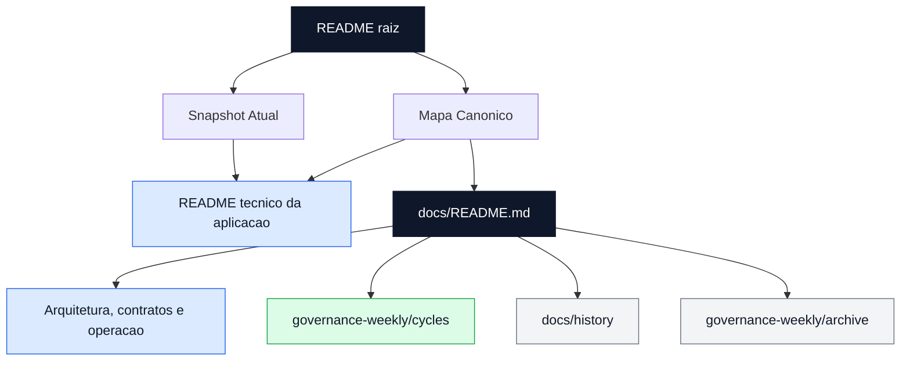
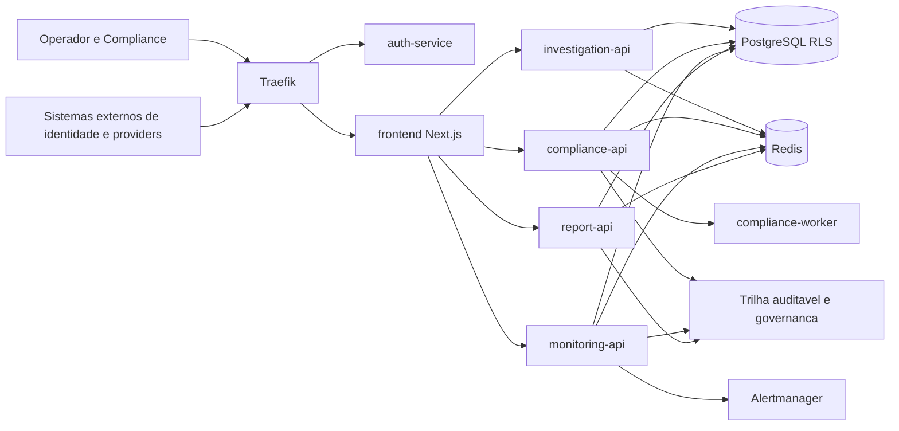
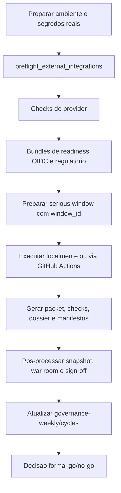

# Ontrackchain


Plataforma modular de investigacao e compliance on-chain com foco em trilha auditavel, operacao multiusuario, screening local de sancoes, governanca de release e evidência regulatoria rastreavel.

## Leitura em 2 Minutos

Se este e seu primeiro contato com o repositório, leia nesta ordem:

1. [Snapshot Atual](#snapshot-atual)
2. [Mapa Canonico](#mapa-canonico)
3. [README tecnico da aplicacao](./ontrackchain/README.md)
4. [Indice canonico da documentacao](./ontrackchain/docs/README.md)

Resumo executivo:

- baseline oficial: `92%` tecnico, `79%` regulatorio/operacional, `88%` consolidado
- o gargalo principal deixou de ser scaffold e passou a ser homologacao externa, prova operacional e aceite institucional
- o ciclo ativo e `2026-07-13`, com a tentativa `stg-2026-07-13-a` ainda em `pending_no_go`
- a raiz serve para onboarding e navegacao; a verdade canônica do projeto vive em `ontrackchain/docs/`
- a malha documental foi saneada para separar fonte viva, evidência datada e historico frio sem competir pela mesma narrativa

## Diagramas de Fluxo

### Fluxo de Leitura Canonica

O diagrama abaixo mostra como navegar pelo repositório sem confundir fonte viva, evidência datada e histórico.



## Snapshot Atual

### O que ja esta forte

- arquitetura modular conectada entre `frontend`, servicos `FastAPI`, `PostgreSQL`, `Redis` e observabilidade
- trilha regulatoria funcional com `evidence_trail`, `preventive_blocks`, `counterparties`, `ROS/COAF` e screening local de sancoes
- operacao multiusuario compartilhada via `regulatory_work_items`, timeline e comentarios estruturados
- cockpit frontend tri-locale com 7 modulos operacionais sincronizados ao mesmo modelo de workspace
- RCA cross-domain leve consolidada entre `alerts`, `/monitoring`, export administrativo e governanca

### O que ainda bloqueia o salto para `90%+`

- `P0-01`: homologar `OIDC + MFA` federado em trilho serio
- `P0-02`: fechar `AML/KYT live` com credencial real e artefato revisavel
- `P0-03`: ativar feed UE real com URL tokenizada e persistencia auditavel
- `P0-04`: consolidar `P0-02 + P0-03` em bundle regulatorio oficial
- `P0-05`: executar a primeira janela seria material com `go/no-go` formal
- `P0-06`: formalizar sign-off recorrente de retention/recovery

## Frentes Recentes

| Frente | Estado | Resultado atual |
| --- | --- | --- |
| `P1-01` metadata de work-items | `done` | contrato canonico unificado entre frontend, backend e `api-contracts.md` |
| `P2-02` timeline/comments compartilhados | `done` | `useWorkItemTimeline` consolidado nos 7 cockpits |
| `P2-03` RCA cross-domain | `done` | RCA leve persistida em `alerts`, leitura em `/monitoring` e resumo para export/governanca |
| `P2-05` RBAC incremental | `in_progress` | `REVIEWER` e `BILLING_ADMIN` ja endurecidos em superficies reais, incluindo `billing/reconciliation` |

## Arquitetura em 60 Segundos

- `Traefik` centraliza a borda e roteia requisicoes para os servicos internos
- `auth-service` resolve identidade, contexto federado, MFA e headers internos de tenant/ator
- `frontend` em `Next.js 14` atua como cockpit operacional e camada de orquestracao de UX
- `investigation-api` concentra estimativa, abertura, status, billing e resultado de investigacoes
- `compliance-api` concentra sanctions, counterparties, preventive blocks e fila operacional compartilhada
- `monitoring-api` recebe webhooks do `Alertmanager` e sustenta a operacao global de incidentes
- `report-api` gera relatorios deterministas e governa o workflow `ROS/COAF`
- `PostgreSQL` com `RLS` persiste o dominio multi-tenant; `Redis` sustenta fila, retry, DLQ e concorrencia

### Fluxo Macro da Plataforma

O diagrama abaixo resume a topologia funcional para leitura executiva, sem substituir a arquitetura detalhada em `ontrackchain/docs/architecture.md`.



## Mapa Canonico

### Portas de entrada

- [README tecnico da aplicacao](./ontrackchain/README.md)
- [Indice de documentacao](./ontrackchain/docs/README.md)

### Documentos principais

- [Arquitetura](./ontrackchain/docs/architecture.md)
- [Contratos de API](./ontrackchain/docs/api-contracts.md)
- [Resumo Executivo de Readiness](./ontrackchain/docs/project-executive-readiness-brief.md)
- [Scorecard Oficial](./ontrackchain/docs/project-kpi-scorecard.md)
- [Avaliacao de Maturidade](./ontrackchain/docs/project-maturity-assessment.md)
- [Board de Prioridades](./ontrackchain/docs/project-priority-board.md)
- [Board Operacional](./ontrackchain/docs/project-operational-execution-board.md)
- [Governanca Semanal](./ontrackchain/docs/governance-weekly/README.md)

### Evidencia datada e historico

- [Ciclo ativo 2026-07-13](./ontrackchain/docs/governance-weekly/cycles/2026-07-13/README.md)
- [Historico de apoio](./ontrackchain/docs/history/README.md)
- [Arquivo historico da governanca](./ontrackchain/docs/governance-weekly/archive/README.md)

## Leitura Recomendada por Perfil

### Arquiteto / Lider Tecnico

1. [`ontrackchain/docs/architecture.md`](./ontrackchain/docs/architecture.md)
2. [`ontrackchain/docs/api-contracts.md`](./ontrackchain/docs/api-contracts.md)
3. [`ontrackchain/docs/rbac-and-permissions.md`](./ontrackchain/docs/rbac-and-permissions.md)
4. [`ontrackchain/docs/adrs/README.md`](./ontrackchain/docs/adrs/README.md)

### Operacao / SRE / DevOps

1. [`ontrackchain/docs/operations.md`](./ontrackchain/docs/operations.md)
2. [`ontrackchain/docs/deploy-and-staging.md`](./ontrackchain/docs/deploy-and-staging.md)
3. [`ontrackchain/docs/project-release-gates.md`](./ontrackchain/docs/project-release-gates.md)
4. [`ontrackchain/docs/governance-weekly/README.md`](./ontrackchain/docs/governance-weekly/README.md)

### Compliance / Regulacao

1. [`ontrackchain/docs/regulatory-readiness.md`](./ontrackchain/docs/regulatory-readiness.md)
2. [`ontrackchain/docs/evidence-and-audit-matrix.md`](./ontrackchain/docs/evidence-and-audit-matrix.md)
3. [`ontrackchain/docs/compliance-and-security-controls.md`](./ontrackchain/docs/compliance-and-security-controls.md)
4. [`ontrackchain/docs/project-maturity-evidence-execution-kit.md`](./ontrackchain/docs/project-maturity-evidence-execution-kit.md)

### Produto / Stakeholders Executivos

1. [`ontrackchain/docs/project-executive-readiness-brief.md`](./ontrackchain/docs/project-executive-readiness-brief.md)
2. [`ontrackchain/docs/project-kpi-scorecard.md`](./ontrackchain/docs/project-kpi-scorecard.md)
3. [`ontrackchain/docs/project-priority-board.md`](./ontrackchain/docs/project-priority-board.md)
4. [`ontrackchain/docs/governance-weekly/cycles/2026-07-13/README.md`](./ontrackchain/docs/governance-weekly/cycles/2026-07-13/README.md)

## Quick Start

### 1. Subir a stack local

```bash
cd ontrackchain
cp .env.example .env
docker compose up -d --build
```

Para exercitar `OIDC` localmente:

```bash
cd ontrackchain
docker compose --profile oidc up -d --build
```

### 2. Validar o baseline local

```bash
cd ontrackchain
python3 scripts/smoke_runtime.py
make apply-regulatory-work-items-migration
make smoke-work-items-ownership-backend

cd apps/frontend
npm ci
npm run typecheck
npm run test:e2e:stack-real-light
npm run test:e2e:browser-mocked
```

### 3. Validar readiness serio

```bash
cd ontrackchain
python3 scripts/preflight_external_integrations.py
make check-compliance-provider-runtime \
  INTERNAL_BASE_URL=http://compliance-api:8002 \
  PUBLIC_BASE_URL=http://localhost:8080
make run-oidc-readiness-bundle-local WINDOW_ID=stg-$(date +%F)-oidc BASE_URL=http://localhost:8080
make run-regulatory-readiness-bundle-local \
  WINDOW_ID=stg-$(date +%F)-reg \
  INTERNAL_BASE_URL=http://compliance-api:8002 \
  PUBLIC_BASE_URL=http://localhost:8080
```

### Fluxo da Janela Seria

O diagrama abaixo mostra a sequência mínima esperada entre preparo, execução, artefatos e decisão formal de `go/no-go`.



## Politica de Documentacao

- este `README.md` da raiz existe para onboarding, visao executiva curta e navegacao do GitHub
- [`ontrackchain/README.md`](./ontrackchain/README.md) e a porta de entrada tecnica da aplicacao
- [`ontrackchain/docs/README.md`](./ontrackchain/docs/README.md) e o indice canônico da documentacao
- artefatos datados ainda operacionais vivem em `ontrackchain/docs/governance-weekly/cycles/`
- historico datado de apoio fora da trilha viva deve viver em `ontrackchain/docs/history/`
- historico frio consolidado de governanca deve viver em `ontrackchain/docs/governance-weekly/archive/`
- se existir `.publish_repo/`, trate-o como espelho de publicacao e nunca como fonte primaria de status ou contrato
- documentos paralelos, redundantes ou supersedidos devem ser consolidados, arquivados ou removidos

## Como Ler a Documentacao

Use esta precedencia quando houver duvida sobre qual arquivo vale mais:

1. `ontrackchain/docs/README.md` e os documentos canonicamente indexados nele
2. `ontrackchain/docs/governance-weekly/cycles/` para evidencias datadas ainda navegaveis por ciclo
3. `ontrackchain/docs/history/` e `ontrackchain/docs/governance-weekly/archive/` apenas como contexto historico

Leitura pratica:

- se voce quer o estado atual do projeto, comece por `docs/`
- se voce quer a prova de uma janela ou semana especifica, use `governance-weekly/cycles/`
- se voce quer entender como uma decisao antiga foi tomada, use `history/` ou `archive/`

## Estrutura do Repositorio

```text
Ontrackchain/
├── .github/
├── Makefile
├── README.md
└── ontrackchain/
    ├── apps/
    ├── docs/
    ├── infra/
    ├── packages/
    ├── scripts/
    ├── tests/
    ├── docker-compose.yml
    ├── Makefile
    ├── .env.example
    └── README.md
```

## Proximo Passo Recomendado

As frentes que mais movem a maturidade comprovada do projeto continuam sendo:

1. fechar `P0-02`
2. fechar `P0-03`
3. homologar `P0-01`
4. executar a janela seria completa com `go/no-go` formal
