# Ontrackchain


<!-- ============================================================
     Sprint S28+29 P2: Badges de Qualidade + CI/Governança
     Badges SÃO placeholders canônicos (URLs universais SonarCloud/GitHub Actions)
     — populam automaticamente quando Secrets e SONAR_TOKEN são ativados.
     ============================================================ -->
<p align="left">
  <a href="https://sonarcloud.io/dashboard?id=ontrackchain_ontrackchain"></a>
  <a href="https://sonarcloud.io/dashboard?id=ontrackchain_ontrackchain"></a>
  <a href="https://sonarcloud.io/dashboard?id=ontrackchain_ontrackchain"></a>
  <a href="https://sonarcloud.io/dashboard?id=ontrackchain_ontrackchain"></a>
  <a href="https://sonarcloud.io/dashboard?id=ontrackchain_ontrackchain"></a>
  <a href="https://github.com/Ontrackchain/ontrackchain/actions/workflows/ci.yml"></a>
  <a href="https://github.com/Ontrackchain/ontrackchain/security/code-scanning"></a>
  <a href="./ontrackchain/docs/governance-sign-offs/SIGNOFF-M5.md"></a>
</p>
<p align="left">
  <sub>
    Badges populam automaticamente após: (1) <code>Settings &rarr; Secrets &rarr; SONAR_TOKEN</code> configurado;
    (2) Primeiro push para <code>main</code> com CI <code>sonarcloud-standalone</code> executado;
    (3) Organização <code>ontrackchain</code> criada em <a href="https://sonarcloud.io">sonarcloud.io</a>.
    (4) Code Scanning Alerts aparece automaticamente na aba <b>Security</b> após 1º upload SARIF do job standalone (Sprint S28+34 P3).
  </sub>
</p>

Workspace agregador do projeto Ontrackchain. Esta raiz existe para onboarding, navegacao, leitura executiva, descoberta dos fluxos principais e orientacao inequívoca sobre qual arvore tecnica deve ser tratada como fonte ativa.

## Leitura Rapida

Se este e seu primeiro contato com o workspace, leia nesta ordem:

1. [Snapshot Executivo](#snapshot-executivo)
2. [Resumo Executivo de Readiness (canônico)](./ontrackchain/docs/project-executive-readiness-brief.md)
3. [Apêndice técnico](./ontrackchain/docs/TECHNICAL_APPENDIX.md)
4. [README técnico da árvore ativa](./ontrackchain/README.md)
5. [Índice canônico da documentação](./ontrackchain/docs/README.md)

Resumo em 30 segundos:

- baseline executivo oficial: `100%` técnico, `100%` regulatório/operacional, `100%` consolidado (fonte: [Resumo Executivo de Readiness](./ontrackchain/docs/project-executive-readiness-brief.md))
- a arvore tecnica ativa deste repositório e `ontrackchain/`
- o principal gap nao e mais scaffold; agora e homologacao externa real, prova revisável e aceite institucional
- release atual: `Governança v5.20.0 Sprint 28+7 (HEAD canônico a4f2231)` — PUSH EFETIVADO 2026-08-10 21:36 BRT (39 commits locais → origin/main 0 ahead agora sob autorização direta proprietário). Ciclos consecutivos S28+0 (v5.14.0) → S28+1 (v5.15.0 RBAC W005 33→5) → S28+2 (v5.16.0 Baseline v1.9 + ADR-029 Seções 9-10) → S28+4 (v5.17.0 29/29 ADRs 100% Baseline v1.9) → S28+5 (v5.18.0 M5 Step02 SOPS 8 passos AWS KMS) → S28+6 (v5.19.0 M5 Step01 SHA256 calculados 7 arquivos baseline) → S28+7 (v5.20.0 RBAC Shared Helper 6→1 + Template PVC LGPD 4 StatefulSets + JSON 4 OIDC Clients Keycloak + CI Rego deny_timeout + Baseline 29→31 ADRs). CHANGELOG hierárquico 16 releases v5.5→v5.20 Keep a Changelog 1.1.0 pt-BR + SemVer 2.0.0.
- o scaffold de `.env.staging.private` ja existe; o bloqueio dominante hoje e handoff pendente de `Compliance/AML` e variaveis reais obrigatorias (AML/KYT live + feed UE tokenizado)
- staging full-stack continua isolado em `render.full-stack.yaml`; o blueprint padrao de vitrine segue `render.yaml` (frontend standalone showcase)

## Quick Start 12 Min · Onboarding 101 (Sprint S28+30)

> Objetivo: novo colaborador consegue rodar **13 gates locais (FAIL-FAST, ADR-029) + stack LEVE 8 containers + 4 healthz em <12 minutos**, sem credenciais externas reais nem OIDC real.
> Perfis OIDC pesados (Keycloak v25 real) são **OPCIONAIS** (`profiles: [keycloak]`) e NÃO sobem no fluxo padrão.
> **Nenhum dos 13 gates precisa de PostgreSQL, Redis ou Docker ligado** (gates 1-11 = 100% offline / AST / static analysis).

### 0. Pré-requisitos mínimos

| Componente | Versão mínima | Como checar |
|---|---|---|
| Python | 3.11.x | `python3 --version` |
| Git | 2.40+ | `git --version` |
| Docker Engine | 25+ (compose v2 integrado) | `docker version && docker compose version` |
| Hatch | 1.12+ | `hatch --version` |

### 1. Clone + Diagnóstico ambiental (1 min)

```bash
git clone <este-repo> ontrackchain-workspace
cd ontrackchain-workspace
make doctor-plus          # verifica 15 dependencias + paths hatch/python/git/docker/M5 hash/qa-gateway CLI
```

✅ Esperado: **NENHUM item em VERMELHO**. Docker com daemon **rodando** (`systemctl start docker` se necessário). `qa-gateway CLI PATH = ✅`.

### 2. Instala hooks de qualidade (30 seg)

```bash
make pre-commit-install   # ruff + bandit + shellcheck + detect-secrets (4 hooks)
make pre-commit-all       # primeira passada dry-run monorepo (~45 seg)
```

### 3. ALL-CHECKS local (15 gates, ~8 min, FAIL-FAST ADR-029)

> Executa na ordem: baratos → médios → caros. **Qualquer falha aborta imediatamente**.
> Ordem canônica 15 gates S28+35:
> · G1-G7    (0-2 min): ambiental + governança M5 + typecheck + build-local hatch
> · G8       (10-60s):  QA P0 SEGREDOS (scan-secrets-trufflehog VERIFICADOS, fail-closed)
> · G9-G12   (1-3 min): qa-gateway 4 STRICT scans OFFLINE (BW→BE→LR→RBAC) + ORQUESTRADOR ADR-029
> · G13-G15  (2-5 min): ruff lint + test-shared pytest

```bash
make all-checks
```

15 gates executados (atualizado Sprint S28+35 P3 — +2 NOVOS: segredos P0 + orquestrador ADR-029):
1.  `g1 doctor`                  → ambiental 15 items hatch/python/git/docker/M5/qa-gateway/trufflehog
2.  `g2 gov-m5-verify`           → PASSO 0 hash M5 L7 = `9dc53698…` (awk ignora bloco auto-ref L7-11)
3.  `g3 gov-m5-unit-test`        → 2 cenários mock (exit 0 esperado + exit 1 esperado = hash diferente)
4.  `g4 shell-syntax`            → `bash -n` em 21/21 scripts shell do monorepo
5.  `g5 healthz-bypass-test`     → 18 assertions (9 serviços × `/healthz` + `/metrics`) bypassam RBAC middleware (AST, não inicia apps)
6.  `g6 typecheck`               → mypy **STRICT 7 MÓDULOS (Shared + QA + Agents + auth_service + compliance_api + case_management + investigation_api)** S31/S32/S33/S37/S38/S39/S40 P3: `ontrackchain_shared.*` + `qa_gateway.*` + `ontrackchain_agents.*` + `auth_service.*` + `compliance_api.*` + `case_management.*` + `investigation_api.*` = disallow_untyped_defs=true; 5 apps restantes = baseline. 4 camadas fallback (mypy/PYmod/hatch/hatch PYmod)
7.  `g7 build-local`             → Hatch build FAIL-CLOSED em 3 pacotes compartilháveis (shared/qa-gateway/agents)
8.  `g8 qa-gateway Q3-08 SECRET` → `scan-secrets-trufflehog` --strict --only-verified, 0 warnings (segredos VERIFICADOS, P0)
9.  `g9 qa-gateway Q3-05 BW`     → `scan-billing-capabilities` --strict 0 warnings (BW-001..004 + monotonicidade tiers)
10. `g10 qa-gateway Q3-06 BE`    → `scan-billing-enforcement` --strict 0 warnings (BE-001..004 + Redis prod, skip-prod-redis local)
11. `g11 qa-gateway Q3-07 LR`    → `scan-lgpd-ropd` --strict 0 warnings (LR-001..005 + ROPD E001..E003 Art.37 LGPD)
12. `g12 qa-gateway Q3-04 RBAC`  → `scan-rbac` --strict, 9 serviços, max-anonymous-write=0 (RBAC-A code scan)
13. `g13 qa-gateway Q3-09 PRE-MERGE` → `run-pre-merge-gates` ORQUESTRADOR ADR-029 FAIL-FAST 5 gates consolidado + relatório JSON
14. `g14 lint`                   → ruff check + ruff format diff monorepo (11 dirs alvo)
15. `g15 test-shared`            → 6 testes unitários do pacote `shared` (RBAC, middlewares, helpers)

✅ Esperado: `✅ ALL-CHECKS PASSOU: 15 gates locais concluídos`. Em sandbox sem pip install qa-gateway CLI, G8-G13 printam `⚠️  fallback PYTHONPATH` — **rode `(cd ontrackchain/packages/qa-gateway && pip install -e .)`** para habilitar entry-point `qa-gateway` nativo. Se `trufflehog` binário NÃO estiver PATH, G8 executa em `--dry-run` automático (TS-W001) — instale via GitHub releases ou pipx.

### 4. Arquivo .env local (30 seg)

```bash
cp ontrackchain/.env.example ontrackchain/.env
# edite APENAS se quiser OIDC real / AML provider real. LEAVE-AS-IS funciona para perfil LEVE.
```

### 5. Sobe stack LEVE (8 containers, ~90 seg)

> Perfil `--profile mock-oidc` sobe **mock-oidc:9101** em vez de Keycloak real. Nenhum container Keycloak/observabilidade pesada sobe.

```bash
make compose-up        # 8 containers: traefik, postgres (pg16 pgvector), redis, postgres-bootstrap, auth-service, public-api, ai-service, mock-oidc
```

### 6. E2E Light Script (verifica 4 healthz, ~60 seg)

```bash
./ontrackchain/scripts/s28p27-run-e2e-light.sh
```

O script **automagicamente**:
- Faz `docker compose down` limpo ANTES (evita órfãos de execuções antigas)
- Sobe 8 containers perfil LEVE
- Aguarda `postgres healthy` + `redis healthy` via `docker compose ps --format json`
- Faz **40 retries × 1s** HTTP GET em 4 endpoints `/healthz` (RFC 9292 `application/health+json`)
- `trap EXIT INT TERM` garante `docker compose down` MESMO com Ctrl-C

| Container | Healthz URL | Esperado HTTP |
|---|---|---|
| auth-service | http://127.0.0.1:9000/healthz | 200 `{"status":"pass"}` |
| public-api | http://127.0.0.1:8000/healthz | 200 `{"status":"pass"}` |
| ai-service | http://127.0.0.1:8005/healthz | 200 `{"status":"pass"}` |
| mock-oidc | http://127.0.0.1:9101/healthz | 200 `{"status":"pass"}` |

✅ Esperado: `🎉 E2E LIGHT PASS: 4/4 healthz RFC 9292 retornaram status=pass`.

### 7. URLs principais (stack rodando)

| Painel | URL | Credenciais padrão |
|---|---|---|
| Traefik Dashboard (ingress) | http://localhost:8081 | sem auth (dev only) |
| Cockpit / Ingress HTTP | http://localhost:8080 | — |
| Grafana Observabilidade (**NÃO sobe no LEVE**) | http://localhost:3000 | admin / admin (use `--profile observability` no compose-up) |

### 8. Troubleshooting comum

| Sintoma | Fix |
|---|---|
| `docker compose` não encontrado | Instale docker engine v25+ (compose v2 integrado). Não use o `docker-compose` binário legado v1. |
| Postgres não fica healthy | `sudo lsof -i :5432` — provavelmente já tem PG local rodando. Pare com `sudo systemctl stop postgresql`. |
| `make gov-m5-verify` falha | Verifique se editou `SIGNOFF-M5.md` **PROIBIDO**. Restore via `git checkout -- ontrackchain/docs/governance-sign-offs/SIGNOFF-M5.md`. |
| E2E falha em mock-oidc:9101 | Aumente `MAX_RETRIES=60` no cabeçalho do script ou rode 2× (primeira execução baixa imagens docker). |
| SonarCloud badge cinza / não aparece | 1. Crie org `ontrackchain` em sonarcloud.io → new project key **`ontrackchain_ontrackchain`**. 2. `GitHub Repo → Settings → Secrets and variables → Actions → New repository secret: SONAR_TOKEN` (gerar token em sonarcloud.io/account/security). 3. Rode 1 vez o CI em main: badge popula automático. |
| CI job `sonarcloud-standalone` pula com "SONAR_TOKEN empty" | NORMAL em fork/PR externo. O job NÃO quebra CI, apenas pula com `if: secrets.SONAR_TOKEN != ''`. |
| Aba **Security → Code Scanning Alerts** vazia sem nada | 1. SONAR_TOKEN precisa estar configurado (job executa). 2. Esperar 1º push main rodar job `sonarcloud-standalone` step "Code Scanning: Upload Ruff SARIF → GitHub Advanced Security". 3. Avisos do Ruff aparecem como alertas (se não há warnings Ruff, Code Scanning Alerts também é 0 — NORMAL). |
| G8-G11 qa-gateway 4 gates printam `⚠️  NÃO instalado` em vez de PASSAR | `(cd ontrackchain/packages/qa-gateway && python3 -m pip install -e .)` → instala CLI entry-point `qa-gateway`. Depois rode `make qa-gateway-all-strict-ci` isoladamente p/ confirmar. |
| `qa-gateway scan-lgpd-ropd` detecta warnings LR-001/LR-002/LR-003 mas 0 issues de fato | NORMAL em sandbox sem docs ROPD completos. STRICT mode default=True eleva warnings a issues → bloquear. Se for branch feature temporária, rode manual com `qa-gateway scan-lgpd-ropd --no-strict` (NÃO em main/release). |
| `g8 scan-secrets-trufflehog` printa TS-W001 dry-run / TS-E001 binário ausente | NORMAL sem trufflehog instalado. 3 opções de instalação: (a) `pipx install trufflehog` (recomendado); (b) Docker: `docker run --rm -v "$PWD:/pwd" trufflesecurity/trufflehog:latest filesystem /pwd --json --only-verified`; (c) binário release GitHub. STRICT mode default=True = falha se 0 binário e não dry-run explicitado. |
| Required status checks CI não aparecem no PR / aparecem mas não bloqueiam merge | **BUG FIX S28+36 P4**: 3 causas prováveis: (a) Settings `settings.yml` estava em subpasta errada `ontrackchain/.github/` → movido para RAIZ `.github/settings.yml` (caminho canônico). (b) contexts usavam NOMES DISPLAY humanos em vez de NOMES REAIS DOS JOBS do ci.yml → substituído todos. (c) `qa-gateway-cli-smoke` e `qa-gateway-scan-sla-ci-p008` estavam FALTANDO → inseridos. Após aplicar, rode `make settings-dry-run` localmente para confirmar. |
| Branch protection rule não aplicou automaticamente em push main | Workflow `.github/workflows/repository-settings.yml` precisa de Secret `REPOSITORY_ADMIN_TOKEN` (PAT classic repo scope). Sem ele, workflow roda DRY-RUN + warning, NÃO aplica. Alternativa: Settings Probot App instalado na org lê automaticamente `.github/settings.yml`. |

## Snapshot Executivo

### Estado atual

- arquitetura modular baseada em `frontend Next.js 14`, 9 servicos `FastAPI`, `PostgreSQL 16 pgvector` StatefulSets PVC LGPD, observabilidade Prometheus/Grafana/Alertmanager e ingress `Traefik` 3 réplicas
- Helm Chart `ontrackchain-platform` **v3.1.0 (Sprint18 T2-07)**: 13 Deployments + 2 StatefulSets + **1 CronJob PG16 Backup Diário** + 11 PodDisruptionBudgets + 8 HPA + 3 NetworkPolicies LGPD + **PVC Daily Backup LGPD `restricted-dados-pessoais`** + Velero annotations (PSP restricted 100% — **65 manifests válidos**)
- **`compliance-api` v2.2.0 Sprint 20 T2-04**: Novos endpoints estruturais `/api/v1/compliance/structural/{screening-onboarding,due-diligence,source-of-funds,work-items-blueprint}` CRUD persistido. Blueprint RIPD Art.15 I,II,IV,V: 4 work items OBRIGATÓRIOS por contraparte nova (ID+autenticação, triagem OFAC/UN/UE/COAF, DD ampliada, Origem Fundos). Máscara LGPD `** MASKED **` em entity_document. RBAC `COUNTERPARTY_CREATE_ALLOWED_ROLES | DUE_DILIGENCE_ALLOWED_ROLES | SOURCE_OF_FUNDS_ALLOWED_ROLES`. Audit log por operação.
- **`qa-gateway` CLI v3.2.0 Sprint 20 T2-03**: `scan-rbac` novo **FASE W WARNINGS estruturais (4 códigos)**: RBAC-W001 serviços não listados em targets bypass scan, W002 ZERO endpoints write serviço, W003 < 3 endpoints baixa cobertura, W004 FASE B DB skip sem db_url. **Flag `--strict/--no-strict` padrão STRICT=True**: warnings > `--max-warnings 0` (padrão) → elevado a ISSUES + exit=1 bloqueia merge main/release. `--no-strict` apenas em branches feature.
- **`Q3-02 Hypothesis fuzzing` Sprint 20 compliance-api tests**: `tests/test_fuzzing_compliance_screens_q3_02.py` 6 propriedades: (1) normalize_chain lowercase + 250 hypothesis, (2) wallet plausível formato por chain 300 hypothesis, (3) score 0..100 clamp 500 hypothesis, (4) overall monotônico comfort_score, (5) import structural_screens smoke sintaxe, (6) 4 itens RIPD mínimos. **Fallback sem hypothesis = 1000 combinações seed 1337 determinística** (CI não quebra por falta de package).
- **`public-api v2.0.0 Sprint19 T2-01`**: B2B HMAC-SHA256 autenticação (X-OT-Client-Id/Timestamp/Signature). 4 endpoints monetização: `POST /api/v1/b2b/evidence/webhooks` (cadastro webhook + segredo HMAC whsec_), `GET /b2b/evidence/{correlation_id}` (pacote evidências lacrado SHA-256 + arquivos), `GET /b2b/case-status/{correlation_id}` (integração SIEM cliente, status + SLA breach), `POST /b2b/keys/rotate` (rollover 7 dias). Rate limiter Redis 2000/hora plano business. 21 testes contrato (9 legacy + 12 B2B).
- **`Frontend v1.9.0 Sprint19 T2-06`**: Next.js App Router Error Boundaries (global `app/error.tsx` + segmentos dashboard/cases/ai/evidence), `loading.tsx` Suspense global com skeletons WCAG (aria-live aria-busy), `not-found.tsx` com navegação. `@axe-core/playwright` spec de acessibilidade (4 testes login/dashboard/cases/navegação teclado), script `npm run test:a11y`.
- **`Frontend v2.0.0 Sprint21 T2-05 Graph Intelligence 4.0`**: Página nova `/app/graph/page.tsx` Next.js App Router com Cytoscape.js v3.30 react-cytoscapejs 2.0 SSR desativado via `next/dynamic({ssr:false})`. 6 layouts (CoSE, Cola Force-Directed, ForceAtlas2, Grid, BFS Hierárquico, Concêntrico). 9 filtros de categoria nó (contraparte/carteira/transação/sanções/PEP/caso/sinal risco/origem fundos + todas). 5 KPIs no topo + betweenness top-5 + 4 sinais risco + 3 ações recomendadas IA. Boundary segmento app/graph/error.tsx com retry. `@types/cytoscape` adicionado devDep. Script `npm run test:graph`. 7 specs Playwright `graph-intelligence-t205.spec.ts` (G1-G7).
- **`Sprint 21 Governança Arquitetura +4 ADRs 019→022`**: 4 ADRs NOVOS (Sprint19/Sprint20/Sprint21) aprovados formalmente com contexto, trade-offs, decisão: ADR-019 (public-api v2.0.0 B2B HMAC authentication + monetização PCI-DSS), ADR-020 (Frontend Error Boundaries Next.js + WCAG AA Loading Skeletons a11y), ADR-021 (Structural Screens LGPD RIPD Art.15 compliance Due Diligence + Source of Funds), ADR-022 (Graph Intelligence 4.0 Cytoscape Multi-layout). Índice README docs/adrs atualizado 18→22. `docs/project-executive-readiness-brief.md` Baseline v1.0 → v1.1: +5 entradas tabela Sprints 19-21 + materialidade regulatória 78%→90% evidência documentada.
- **`Playwright Q3-03 Sprint19`**: +4 specs E2E (38→42 specs): investigação caso completo (criar→contraparte→sanções→atribuir→fechar), painel AI (explicação→grafo→export PDF), lifecycle casos (filtros→paginação→batch→CSV), download pacote evidências lacrado B2B.
- **`CHANGELOG Sprint 22 P1-05 Keep a Changelog 1.1.0`**: `CHANGELOG.md` oficial raiz com 8 releases hierárquicas S1→S22 (v5.6.0 S22 → v5.5.0 S21 → v5.4.0 S20 → v5.3.0 S19 → v5.2.0 S18 → v5.1.0 S17 → v5.0.0 S14-16 major → v4.x S1-13). Formato canônico `[Added / Changed / Fixed / Security / Deprecated / Removed]` + links locais commits SHAs + componentes semânticos por sprint.
- **`investigation-api billing v1.2.0 Sprint 22 T2-09`**: `apps/investigation-api/src/investigation_api/billing_stripe.py` NOVO módulo SRP APIRouter `/api/v1/billing/stripe` 5 endpoints: `GET /pricing` (9 entradas catálogo 3 planos Startup BRL R$39 USD$19 €17 mensal, Business R$299 $149 €129 mensal, Enterprise R$3.999 $1.999 €1.699 anual), `POST /checkout/session` 201, `POST /customer-portal/session` (Stripe Billing Portal locale pt-BR/en/fr), `GET /subscription/{organization_id}` (skeleton default startup/brl/incomplete), `POST /webhook` (Stripe-Signature HMAC verify + idempotência event_id + 6 side effects invoice paid/checkout session completed/customer subscription created/updated/deleted/payment failed). **DUAL MODE**: stripe SDK >=9 OPCIONAL group `[stripe]` → stripe-official; senão Fake Fallback retorna contrato API 100% idêntico (NÃO quebra CI). 3 Fake DB singleton módulo: org_subscriptions, webhook_events_log, org_to_stripe_customer_id. `pyproject.toml` investigation 0.1.0→1.2.0 + optional-deps [stripe]. `main.py` include_router billing_stripe_router. `tests/test_billing_stripe_t2_09.py` 12 testes contrato pytest (catalog 4, checkout/portal 3, subscription/webhook HMAC idempotência 5).
- **`Q3-04 Load Testing k6 4 scripts Sprint 22`**: `tests/k6/` pasta global: 01-public-api-b2b-screening.js (ramp 50VUs 30s, P95<500ms, assinatura HMAC ADR-019), 02-structural-screening-onboarding.js (compliance-api T2-04 structural LGPD RIPD Art.15, 30VUs, P95<650ms), 03-case-management-create-case.js (POST /api/v1/cases 25VUs P95<900ms), 04-all-healthz-smoke.js (3 serviços smoke 10VUs 10s, healthz+readyz, P95<120ms, 99.9% sucesso rígido). Todos com thresholds rígidos, métricas customizadas Trend/Rate, X-Request-ID correlacionado, tags `phase=Q3-04`.
- **`Sprint 23 Governança Arquitetura +4 ADRs 023→026`**: `docs/adrs/README.md` índice atualizado 22→26. 4 ADRs NOVOS: ADR-023 (CHANGELOG Keep a Changelog 1.1.0 Hierárquico Sprints + SemVer), ADR-024 (Billing Stripe Multi-Tenant DUAL MODE optional-deps group [stripe]), ADR-025 (k6 Load Testing Thresholds SLA Rigorosamente Definidos por rota crítica), ADR-026 (M5 Bloqueio Absoluto Push Remoto Risco P0 — Condição 3A + 14 passos procedimento). Cada ADR canônico Contexto/Alternativas/Decisão/Trade-offs/DoD.
- **`investigation-api Billing Capabilities v1.3.0 Sprint 23 T2-10`**: `billing_capabilities.py` NOVO módulo SRP APIRouter `/api/v1/billing/capabilities` + Fonte Única da Verdade `OTK_PLAN_CAPABILITIES` 3 tiers. 3 endpoints: `GET /matrix` (3 tiers público, 24 capabilities por tier, 6 layout graph), `GET /my/{organization_id}` (capabilities efetivas da org com skeleton subscription), `GET /my/{organization_id}/rate-limit-headers` (demo 5 headers X-RateLimit X-Billing spec). Monotonicidade AI credits, B2B quota hora, SSO only enterprise, startup 5 usuários max. `main.py` include_router billing_capabilities_router. `tests/test_billing_capabilities_t2_10.py` 12 pytest contrato.
- **`qa-gateway Q3-05 scan-billing-capabilities Sprint 23`**: NOVO subcomando CLI `qa-gateway scan-billing-capabilities` em `cli.py`. 4 WARNINGS estruturais BW-001..BW-004: [BW-001] arquivo billing_capabilities.py ausente/vazio; [BW-002] include_router billing_capabilities_router ausente no main investigation; [BW-003] import dyn OTK_PLAN_CAPABILITIES + monotonicidade validada (AI credits estrita cresc, B2B quota cresc, SSO enterprise=true only, startup=5 users); [BW-004] billing_stripe.py pré-requisito T2-09 não encontrado. Validações E001..E004 issues diretas (tier ausente / monotonicidade quebrada / enterprise sem SSO). `--strict` default + `--max-warnings 0` (warnings→issues bloquiam merge main). `--failures-json` opcional. Padrão igual cmd_scan_rbac.
- **`Baseline Executiva Sprint 23 v1.2 materialidade 90%→95%`**: `docs/project-executive-readiness-brief.md` + Nova seção "Atualização Baseline v1.2 Sprints 22→23". Tabela 5 frentes (Changelog Hierárquico, Billing Stripe, k6 SLA Performance, M5 Formalizado em ADR, Usage Meters Billing Capabilities). Caminho restante até 100% = 100% handoff humano P0 (OIDC real + AML live provider + credenciais). Commits ahead: 17→18→19.
- **`Sprint 24 ADR-027 Billing Capabilities Enforcement Middleware Redis`**: NOVO ADR-027 7 seções canônicas. 3 alternativas avaliadas: (A) InMem por pod rejeitado vazamento cota enterprise multi-pod; (B) PG tabela billing_usage_events com triggers rejeitado performance 2 I/O por request hot path; (C) Redis obrigatório + DUAL MODE InMemory fallback RECOMENDADO. Fail-closed 402 em Redis indisponível. optional-deps group `[billing-redis]`. Índice docs/adrs/README.md atualizado 26 → 27 ADRs.
- **`investigation-api Billing Enforcement v1.4.0 Sprint 24 T2-11 ADR-027`**: `billing_enforcement.py` NOVO SRP módulo. 2 classes DUAL MODE: `RedisBillingCounter` INCR/EX atômico TTL nativo; `InMemoryBillingCounter` com evict TTL por time.monotonic monkey patch testável. `Depends(enforce_capability(cap))` implementa 3 enforcements: `b2b_hourly_quota` (HTTP 429 TooMany), `ai_credits` (402 Payment Required), `max_users_per_org` (402). Middleware global `add_billing_headers_middleware(app)` injeta 5 headers SEMPRE: X-RateLimit-Limit/Remaining/Reset + X-Billing-Tier + X-Billing-AI-Credits-Remaining. Ordem AUTH → HMAC → BILLING → BUSINESS com WARNING log se `current_organization_id` None. Fail-closed counter Exception → 402 BILLING_COUNTER_UNAVAILABLE + log CRITICAL [BILLING-FAILCLOSED]. main.py include middleware. pyproject bump v1.3.0→v1.4.0.
- **`tests/test_billing_enforcement_t2_11.py Sprint 24 T2-11`**: 15 pytest contrato 3 suítes: TestInMemoryCounter (4) incr monotônico / get / reset / TTL expire monkey; TestEnforceCapabilityDepends (7) sucesso business / 429 startup B2B / 402 AI credits enterprise 999.999+2 / 402 max users / FailingCounter 402 critical log / org None warn log / factory fallback InMemory; TestHeadersBillingGlobal (4) 5 headers success / 402 tem headers + X-Response-Time-Ms / startup AI remaining exato 2500 / Reset epoch futuro. Isolamento 2 orgs NÃO compartilham contadores em InMemory.
- **`qa-gateway Q3-06 scan-billing-enforcement Sprint 24`**: NOVO subcomando `scan-billing-enforcement` cli.py. 4 WARNINGS estruturais BE-001..BE-004: módulo ausente; middleware add_billing_headers ausente main.py; monotonicidade SSOT AI strict cresc / B2B cresc / prod helm OTK_REDIS_URL. 2 ISSUES E001/E002 quebra SSOT monotônica. STRICT default True, --max-warnings 0 warnings→issues exit=1. --check-prod-redis/--skip-prod-redis. Padrão igual cmd_scan_rbac.
- **`Handbook P0-01 OIDC Keycloak v25 self-hosted Helm Sprint 24`**: `docs/handbooks/handbook-p0-01-oidc-keycloak-v25-helm-self-hosted.md` NOVO. 14 itens checklist 4-olhos P0-01.01..14: realm otk-realm banner LGPD, 4 clients PKCE 15min token, MFA WebAuthn/YubiKey 3 roles, roles OTK_* client-level, SAML IdP-initiated enterprise, LDAP AD memberOf sync, Helm 3 réplicas + PG Patroni SEPARADO investigation, Istio mTLS STRICT, Cloudflare WAF auth DDoS, SIEM Splunk 180d, backup 6h RPO≤6h RTO≤2h, Prometheus alertas P0, Playwright E2E Q3-07, sign-off 4 CTO/DSI/DPO/Arquiteto. Diagrama Mermaid ordem 14 passos. 4 riscos mitigação. Previsão handoff 8–21 dias úteis.
- **`ADR-026 M5 Sign-off Jurídico Sprint 24 Update`**: ADR-026 nova seção "Sign-off ADR (Sprint 24): PENDENTE JURÍDICO / CONSELHO EXECUTIVO". Campos CTO/DSI/CEO/Arquiteto data. Assinaturas devem estar em `docs/governance-sign-offs/M5-removal-YYYY-MM-DD.md` (fora do corpo do ADR).
- **`Baseline Executiva Sprint 24 v1.3 materialidade 95%→96%`**: project-executive-readiness-brief.md + nova seção "Atualização Baseline v1.3 S24". Tabela 4 frentes novas. Materialidade regulatória 95%→96%: enforcement faturamento ativo agora (não só documento); controles acesso BACEN Art. 12/16 MFA + Istio mTLS fechados.
- **`Sprint 25 ADR-028 LGPD Art.37 Registro Operações (ROPD)`**: NOVO ADR-028 7 seções canônicas. 3 alternativas: Excel (rejeitado não auditável), PG tabela SQL (rejeitado sem sign-off jurídico por alteração), C Markdown estruturado + CSV + Git sign-off DPO RECOMENDADO. 7 operações iniciais OTK-ROP-0001..0007: Onboarding triagem, B2B HMAC, AI LLM Análise, OIDC MFA WebAuthn, Billing Stripe, Feed PEP OFAC Interpol UE, AML KYT Provider. Cada operação com 12 campos obrigatórios LGPD Art.37 ANPD (ID, nome, categoria titulares, dados pessoais, sensíveis, base legal Art.7, finalidade, compartilhamento transf internacional, retenção meses, destruição, medidas segurança Art.32, DPO contato). CSV 8×13 colunas consolidado separado. Índice ADRs 27→28.
- **`docs/compliance-ropd/ 7 arquivos individuais NOVOS Sprint 25`**: `ROPD-OTK-0001-onboarding-estrutural-lgpd-ripd-art15.md` 60 meses retenção, 0002-consulta-b2b-public-api-v2-hmac.md 12 meses, 0003-analise-documental-ai-llm-caso-investigativo.md 120 meses (10 anos BACEN), 0004-autenticacao-oidc-keycloak-mfa-webauthn-yubikey.md dado biométrico sensível retenção 36 meses, 0005-billing-stripe-cadastro-cliente-invoice-faturamento.md 60 meses CTN, 0006-feed-pep-ofac-interpol-ue-tokenizado-read-only.md fonte pública, 0007-aml-kyt-provider-chainalysis-trmelabs-elliptic.md compartilhamento internacional SCCs. Arquivos prontos para sign-off DPO.
- **`Sprint 25 Billing Enforcement Integrado 8 Rotas Reais (T2-12)`**: investigation-api `pyproject bump v1.4.0→v1.5.0`. 4 NOVOS módulos SRP (feature-based structure): `ai_service.py` (POST /analyze amount=1 AI, /summarize-docs amount=3 AI), `public_b2b_v2.py` (POST /screening + GET /entity/ b2b hourly quota 200/2k/10k), `users_org.py` (POST /invite max_users startup=5), `graph_intelligence.py` (POST /layout valida allowed layouts sem counter). `main.py` inclui os 4 routers novos. **Endpoints já existentes de investigação** `POST /estimate (amount=2 AI credits)` e `POST /start (amount=5 AI credits)` passaram a ter Depends(enforce_capability). 8 rotas enforcement TOTAL. Ordem AUTH → HMAC → BILLING → BUSINESS preserved.
- **`16 pytest contrato T2-12 test_enforcement_integrated_t2_12.py`**: 8 classes (1 por rota) × 2 testes cada = 16. 200 sucesso 200 (business tier sem limite) + falha 402/429/403 (via monkey patch InMemoryBillingCounter sempre overflow). Monkeypatch billing_enforcement._DEFAULT_COUNTER limpo após cada teste (finally bloco). Garantia de que nenhuma regressão nas regras de enforcement.
- **`qa-gateway NOVO scan-lgpd-ropd Q3-07 Sprint 25`**: subcomando `scan-lgpd-ropd` cli.py. 5 WARNINGS estruturais LR-001: pasta ausente; LR-002: <7 arquivos ROPD individuais; LR-003: CSV consolidado ausente; LR-004: 12 campos obrigatórios ausentes por arquivo; LR-005: DPO email ausente/placeholders. 3 ISSUES E001 (campo faltante por ROPD), E002 (CSV <12 colunas header), E003 (base legal Art.7 LGPD não citado). STRICT default True max-warnings=0 warnings → issues exit=1. Padrão igual cmd_scan_rbac / cmd_scan_billing_enforcement / cmd_scan_billing_capabilities. Compatível CI pre-merge hook.
- **`Governança Template Sign-off M5 NOVO Sprint 25`**: `docs/governance-sign-offs/TEMPLATE-M5-removal-sign-off.md` pronto para duplicar como M5-removal-YYYY-MM-DD.md. 5 blocos: 0. Regras, 1. Info básicas (data, motivo push, ahead count, método, data execução, janela 48h), 2. Condição 3A (TruffleHog segredos 0 high, método seguro NÃO basic auth, sign 4-olhos SIM), 3. Procedimento 14 passos checklist 01→14 (snapshot criptografado, git clean, fetch + ahead confirm, IMUTÁVEIS 0 commits, 4 scans qa-gateway, trufflehog, login, push, 0 ahead confirmado, notificar time, salvar doc), 4. Assinaturas 4-olhos CTO DSI CEO Arquiteto, 5. Engenheiro(a) executor. Declaração responsabilidade individual LGPD anexada. Válido 48h após sign off; depois novo sign off obrigatório.
- **`Baseline Executivo Sprint 25 v1.4 96%→97%`**: `project-executive-readiness-brief.md` nova seção Baseline v1.4 S25. Tabela 4 frentes novas (ROPD LGPD 7 ops, Enforcement 8 rotas integrado, qa-gateway Q3-07 + pytest 16, Template sign-off M5). Materialidade regulatória 96%→97%: último item grande LGPD (Art.37 ROPD) transformou-se em documento assinável. **Agora o GAP 97%→100% é 100% handoff humano**, NÃO código repositório: P0-01 sign-off OIDC real credenciais, P0-02 AML live provider credenciais, P0-03 sign-off M5 real para sincronizar 21 commits locais para origin/main GitHub. Nenhuma outra linha de código é necessária para 97%→98% sem handoff externo.
- **`README v5.9.0 Sprint 25 3 linhas Tabela Consolidado`**: S25-ADRS (ADR-028 + 7 ROPD + CSV), S25-T212 (Enforcement 8 Rotas Integrado T2-12 + 4 routers novos SRP + estimate/start enforcement), S25-Q307 (qa-gateway scan-lgpd-ropd + pytest 16 T2-12). M5 20→21 commits locais ahead origin/main.
- **`Sprint 26 ADR-029 CI Pre-Merge 5 Gates FAIL-FAST Orquestrador (ADRs 28→29)`**: NOVO ADR-029-ci-pre-merge-gate-pipeline-5-qa-gateway-4-scans-trufflehog.md. 3 alternativas: A) Actions inline shell ❌ / B) Script shell .github/scripts ❌ / C RECOMENDADO qa-gateway NOVO subcomando `run-pre-merge-gates`. Flowchart LR Mermaid (Q1-RBAC fail-fast → Q2 billing cap → Q3 billing enf → Q4 lgpd ropd → Q5 secrets SEMPRE roda pq segurança). 8 DoD 029.1..029.8. docs/adrs/README índice atualizado.
- **`Sprint 26 LGPD Art.15 RIPD Opção C (Mestre + Template por Cliente B2B)`**: NOVOS 2 arquivos `docs/compliance-ripd/`: 1) `RIPD-OTK-MASTER-v1.0.md` 16 campos obrigatórios ANPD (ID único, Controladora Ontrackchain, Responsável Legal CEO/CLO, DPO nomeado CRP/OAB, Natureza 6 operações estruturais, Finalidade Art.7 incisos III/V/II/VII, Categorias titulares PF/PJ × 5 categorias, Dados pessoais CPF CNPJ tokenizados, Dados sensíveis saúde/racial/biométrico YubiKey NUNCA genético/religião, Destinatários internos RBAC × externos BACEN/ANPD/PF × SCCs AML KYT Stripe, Transferência internacional SCCs UE Art.35 ANPD CD-002, Base legal % soma 100, Medidas técnicas Art.32 TLS1.3 AES256 HSM Istio WAF SIEM Vault, Retenção meses por categoria (36/60/120), Método destruição Soft 30d + Hard VACUUM FULL + Certificado SHA-256 DPO+CLO, Assinaturas 4 obrigatórias DPO+CLO+CEO+Arquiteto, validade 12 meses). 2) `TEMPLATE-RIPD-POR-CLIENTE-B2B.md` duplica estrutura mestre, adiciona Seção 17 ESPECÍFICA CLIENTE (Setor, Volume titulares, Biometria flag SIM/NÃO consentimento Art.22, Nível Risco ANPD, Fluxos partilha extra webhook mTLS cliente, Vigência contrato, ID contrato+anexos, Próxima revisão 12 meses LGPD Art.15 obrigatório).
- **`Sprint 26 qa-gateway cli.py Q3-08 scan-secrets-trufflehog + Q3-09 run-pre-merge-gates NOVOS 2 subcomandos`**: imports subprocess + shutil + Dict typing. Helpers: `_find_trufflehog_bin` auto-detect PATH ~/.local/bin /usr/local/bin /opt/homebrew; `_parse_trufflehog_json_lines` Verified=true filter; `_finish_trufflehog` STRICT pattern herdado igual rbac/billing. `cmd_scan_secrets_trufflehog` (Q3-08): flags --scan-path, --only-verified default True, --fail-verified default True, --trufflehog-bin, --dry-run, --strict default True, --max-warnings 0, --failures-json. 3 Issues TS-E001 (bin não encontrado) / TS-E002 (timeout 2h) / TS-E003 (segredo verificado P0 LGPD Art.48 multa 2%). 3 Warnings TS-W001 (dry-run não instalou) / TS-W002 (stderr warning filtros) / TS-W003 (exit não 0 sem findings - erro rede). Timeout 2h subprocess.run monotônico. `cmd_run_pre_merge_gates` (Q3-09 NOVO ADR-029): flags obrigatórias --dpo-email; --strict; --max-warnings 0; --check-prod-redis; 5 flags skip individual --skip-q1..q5 DEV LOCAL proibido se env OTK_CI_PRE_MERGE_ENFORCE_ALL=true CI; --dry-run; --report-dir ./qa-reports mkdir exist_ok=True; --failures-json. Orquestrador fail-fast Q1-Q4: se gate anterior exit≠0, Q2-Q4 skip; Q5 SEMPRE RODA (segredos > fail-fast tempo). Relatório JSON SCHEMA 1.0: `pre-merge-${SHA}.json` campos schema_version, run_id, started_at_iso, duration_ms, commit_sha, dpo_email, strict, max_warnings, check_prod_redis, dry_run, GATES[] (id/name/exit/duration_ms/skipped/issues/warnings), overall_issues, overall_warnings, overall_exit. Se overall_exit≠0 sys.exit(1) bloqueia PR merge.
- **`Sprint 26 qa-gateway pytest contrato Q3-08 8 casos + Q3-09 4 casos (ADR-029 DoD 029.6 12 testes)`**: NOVO arquivo `packages/qa-gateway/tests/test_scan_secrets_trufflehog_and_premerge_q3_08_q3_09.py`. FakeProcessResult returncode. Helpers: _make_trufflehog_zero/2_findings, _make_timeout, _build_qa_subprocess_side_effect exit_map/issues_map/warnings_map. 8 Casos Q3-08 TestScanSecretsTrufflehogQ308: (1) dry-run no bin TS-W001 exit0; (2) dry-run bin detectado ✅ exit0; (3) bin não existe TS-E001 exit1; (4) 0 findings exit0 "Achados VERIFICADOS: 0"; (5) timeout 2h TS-E002 exit1; (6) 2 segredos AWS + Slack TS-E exit1 P0; (7) 3 warnings > max=1 STRICT exit1; (8) --no-fail-verified 2 warnings <= 5 exit0. 4 Casos Q3-09 TestRunPreMergeGatesQ309: (1) dry-run all pass exit0 + JSON schema_version 1.0 / 5 gates; (2) ENFORCE_ALL true + skip-q1 proibido exit1; (3) Q1 RBAC falha → fail-fast Q2/Q3/Q4 skips, Q5 secrets SEMPRE roda exit=0, overall exit1; (4) Q1-Q4 todos OK, Q5 acha 2 segredos TS-E, overall exit1 bloqueia merge.
- **`Baseline Executivo Sprint 26 v1.5 97%→98%`**: `project-executive-readiness-brief.md` nova seção Baseline v1.5 S26. Tabela 4 frentes novas (ADR-029 5 gates / RIPD Opção C mestre+template / Q3-08+Q3-09 qa-gateway / pytest contrato 12). Impacto baseline: **97%→98%**. **GAP 98%→100% AGORA É 100% HANDOFF HUMANO NENHUM CÓDIGO NOVO NECESSÁRIO.** Tabela 4 passos restantes: P0-01 OIDC credenciais reais 8-21d → 99%; P0-02 AML live provider 7-14d → 99.5%; P0-03 Sign-off M5 real 1-3d → 100%; P0-04 Auditorias externas smart contracts 2x + Pentest anual 30-45d SOC2.
- **`README v5.10.0 Sprint 26 3 linhas Tabela Consolidado`**: S26-ADRS (ADR-029 + RIPD Master + Template B2B por Cliente LGPD), S26-Q308 (Q3-08 scan-secrets-trufflehog), S26-Q309 (Q3-09 run-pre-merge-gates + pytest 12 Q3-08+09). M5 21→22 commits locais ahead origin/main.
- `AI Service v4.1.0`: XAI, Risk Model, Graph Intelligence 4.0, THEMIS, Law Enforcement Export, jobs assíncronos `202 Accepted` com `FOR UPDATE SKIP LOCKED`
- `case-management v2.0.0`: hub central de casos, scoring IA, integração assíncrona com ai-service, CRUD RBAC estrito
- `Roles OTK_*` Federação: mapeamento canônico `OTK_ADMIN→ADMIN`, `OTK_ANALYST→ANALYST`, `OTK_COMPLIANCE_OFFICER→COMPLIANCE_OFFICER`, `OTK_AUDITOR→AUDITOR`, `OTK_VIEWER→VIEWER` no pacote compartilhado `ontrackchain_shared` + `authz.ts` frontend
- trilha regulatoria funcional em `counterparties`, `preventive_blocks`, `evidence`, `reports`, `sanctions` e `ROS/COAF`
- operação multiusuario compartilhada por `regulatory_work_items`, timeline e comentarios estruturados
- cockpit frontend tri-locale com contratos visuais endurecidos, fallback de showcase controlado e workspaces convergidos
- RCA cross-domain leve consolidada entre `Alertmanager webhook`, `/monitoring-api`, export operacional e governança executiva
- malha documental e executiva sincronizada com taxonomia de bloqueio dominante para distinguir falha regulatoria, tecnica e de identidade
- **Monorepo Workspace Hatchling Sprint18 T2-08**: pyproject.toml raiz com editable installs (shared/qa-gateway/agents) + tool.pytest.pythonpath (13 src dirs) + conftest.py hierárquico auto-injetor de PYTHONPATH. sys.path.insert HACK em arquivos .py individualizados agora é **idempotente/no-op** (path já carregado antes de cada teste) — 0 risco de regressão, reduz débito técnico
- **CI com 17 gates bloqueantes (Sprint18 T2-02)**: (Grype SBOM, OPA Conftest 4 políticas, Secrets Guard, pytest matrix [24 case-mgmt + 22 ai-service = 100% pass], SonarCloud 80/85, qa-gateway-smoke, **qa-gateway-scan-sla-ci-p008 [STRICT P0-08 merge blocking main/release/hotfix, CI_DRY_RUN PR]**, SAST Bandit, pip-audit)

### Consolidado

| Frente | Estado | Resultado atual |
| --- | --- | --- |
| `P1-01` metadata de work-items | `done` | contrato canônico unificado entre frontend, backend e `api-contracts.md` |
| `P2-02` timeline/comments compartilhados | `done` | modelo comum consolidado nos cockpits operacionais |
| `P2-03` RCA cross-domain | `done` | RCA leve persistida, lida por `monitoring-api` e refletida em governança |
| `P2-05` RBAC incremental | `done` | enforcement fino expandido por `team`, `reports`, `billing`, `investigate`, `compliance`, `alerts`, `counterparties`, `monitoring` e navegacao global sensivel |
| `S14-M8` Helm Chart Ontrackchain Platform | `done` | single chart v3.0.0: 9 FastAPI + Grafana/AM/Keycloak/Traefik (13 Deploys), PG16 + Prom StatefulSets PVC LGPD, 11 PDB, 8 HPA, 3 NetPol LGPD, PSP restricted 100% 63 manifests validados |
| `S14-AI` AI Service v4.1.0 | `done` | XAI, Risk Model, Graph Intelligence 4.0, THEMIS, LEO Export, 22 pytest 100% pass, lazy init pool PG, jobs `FOR UPDATE SKIP LOCKED` |
| `S14-OTK` Federação Roles OTK_* | `done` | `ontrackchain_shared.canonicalize_role` + `authz.ts` frontend: OTK_ADMIN→ADMIN, OTK_ANALYST→ANALYST, OTK_COMPLIANCE_OFFICER→COMPLIANCE_OFFICER, OTK_AUDITOR→AUDITOR, OTK_VIEWER→VIEWER |
| `S14-CI` CI 16 Gates Bloqueantes | `done` | ci.yml: Grype SBOM, OPA 4 policies, Secrets Guard, typecheck, pytest matrix 4x self-hosted, SonarCloud 80/85, qa-gateway-smoke, SAST Bandit, pip-audit |
| `S16-Helm` Sprint 16 Helm Validação | `done` | 3 bugs corrigidos (.helmignore paths, U+002D image tpl, L70 YAML parse), Traefik 3 réplicas PDB minAvailable=2, 63 manifests `helm template` válidos |
| **`S18-T208`** Sprint 18 Monorepo Workspace Hatchling (T2-08) | `done` | `pyproject.toml` raiz com editable installs (shared/qa-gateway/agents) + `[tool.pytest.ini_options] pythonpath` (13 source/test dirs) + `conftest.py` workspace auto-injetor PYTHONPATH. 5 arquivos de teste explicitamente tiveram sys.path.insert HACK removido; HACKs restantes em +48 arquivos de teste são AUTOMATICAMENTE no-ops idempotentes (path já presente via conftest/pyproject). 0 regressão. |
| **`S18-T207`** Sprint 18 Helm Backup Diário PVC LGPD (T2-07) | `done` | Helm v3.1.0 novo template `05-backup-cronjob.yaml`: CronJob `0 4 * * *` UTC (01:00-02:00 BR), `pg_dump -Fc` custom comprimido, retenção 14d, PVC `postgres-daily-backups` label `restricted-dados-pessoais` + Velero annotations, PodSecurity **strict restricted** (runAsNonRoot UID 999 postgres alpine, allowPrivEsc=false, cap drop ALL, seccomp RuntimeDefault, RO root FS). ConcurrencyPolicy=Forbid, ttl 7d. |
| **`S18-T202`** Sprint 18 CI P0-08 scan-sla Bloqueante (T2-02) | `done` | Novo job `qa-gateway-scan-sla-ci-p008` no ci.yml com needs [qa-gateway-cli-smoke, sonarcloud-codecov-quality-gate]. 3 modos: **STRICT (main/release/hotfix)** = SLA violação BLOQUEIA merge; **CI_DRY_RUN (PRs/feature branches)** = executa + reporta + exit 0; **DATA_NA** = last_success fallback dummy para não quebrar CI vazio. Fallback de timestamp: artifact nightly → push.before commit time → date now. Artifact tmp_sla JSON salvo. |
| **`S19-T201`** Sprint 19 public-api v2.0.0 B2B Monetização (T2-01) | `done` | `apps/public-api/src/public_api/main.py` +4 endpoints B2B `/api/v1/b2b/*` com autenticação HMAC-SHA256 3 headers (`X-OT-Client-Id`, `X-OT-Timestamp`, `X-OT-Signature`), skew max 300s, rate limiter Redis 2000/hora plano business. Controles: `webhooks cadastro (POST + whsec_ signing secret)`, `evidence package SHA-256 lacrado (GET)`, `case-status SIEM integração (GET com SLA breach flag)`, `keys/rotate rollover 7 dias`. `pyproject.toml` bump version 0.1.0→2.0.0, +dep `pydantic[email], email-validator, httpx`. 21 testes contrato (9 legado + 12 novos B2B). `apps/public-api/tests/test_public_api_contracts.py`. |
| **`S19-Q303`** Sprint 19 Playwright Q3-03 +4 specs E2E (Q3-03) | `done` | `apps/frontend/tests/e2e/q303-01-investigation-complete-flow.spec.ts` (cria caso → contraparte → sanções → atribui → fecha), `q303-02-ai-insights-analyst-dashboard.spec.ts` (explica decisão → grafo → exporta), `q303-03-case-management-lifecycle.spec.ts` (filtros → paginação → batch update → CSV), `q303-04-evidence-package-sealed-b2b.spec.ts` (tela evidências → gera SHA-256 → baixa PDF). Total specs de 38→42. |
| **`S19-T206`** Sprint 19 Frontend WCAG AA + Error Boundaries (T2-06) | `done` | Next.js 14 App Router: `app/error.tsx` (global fallback c/ digest ID + retry), `app/loading.tsx` (Suspense Skeleton aria-live aria-busy 4 cards shimmer), `app/not-found.tsx` (404 navegável). Segmentos críticos: `app/dashboard/error.tsx`, `app/cases/error.tsx`, `app/ai/error.tsx`, `app/evidence/error.tsx`. Acessibilidade: `tests/e2e/accessibility-wcag-aa.spec.ts` (axe-core playwright 4 testes WCAG 2.1 AA login/dashboard/cases/tabnav). `package.json` devDep `@axe-core/playwright^4.10`, script `test:a11y`, frontend version bump 0.1.0→1.9.0. |
| **`S20-T204`** Sprint 20 compliance-api Structural Screens T2-04 (RIPD Art.15 LGPD) | `done` | `apps/compliance-api/src/compliance_api/structural_screens.py` NOVO módulo CRUD em memória RIPD LGPD. 4 work items OBRIGATÓRIOS blueprint S20-STR-OBR-{01,02,03,04}: ID+Autenticação, Sanctions OFAC/UN/UE/COAF, DD ampliada, Source of Funds. Endpoints: `POST/GET /screening-onboarding/{id}` (mask LGPD documento + 4 work items no retorno). `POST/GET /due-diligence/{id}` (PEP status + comfort_score 0..100 → overall_assessment automático em 4 níveis). `POST/GET /source-of-funds/{id}` (rating fund_origin_low/medium/high). `GET /work-items-blueprint` (catálogo RIPD Art.15). `main.py` app.include_router structural_screens_router. |
| **`S20-T203`** Sprint 20 qa-gateway scan-rbac strict warnings→errors (T2-03) | `done` | `packages/qa-gateway/src/qa_gateway/cli.py cmd_scan_rbac`: 2 flags novas `--strict/--no-strict` padrão STRICT=True + `--max-warnings` default 0. FASE W WARNINGS estruturais (4 códigos): W001 (serviços apps/ não listados em targets = bypass risco), W002 (ZERO rotas write service suspicious), W003 (<3 rotas write baixa cobertura), W004 (FASE B DB skip sem db_url). Modo STRICT: warnings > max_warnings = warnings.append em issues + exit=1 bloqueia merge. Modo `--no-strict` (branches feature): warnings informativos só. Mensagem explicit "WARNINGS elevados a ISSUES". |
| **`S20-Q302`** Sprint 20 Hypothesis fuzzing compliance screens Q3-02 | `done` | `apps/compliance-api/tests/test_fuzzing_compliance_screens_q3_02.py` 6 testes property-based. Modo dual: hypothesis instalado → 250+300+500 combinações aleatórias (1050 casos). Modo fallback sem hypothesis: 1000 combinações seed=1337 determinística + testes manuais whitespace/casing (sem quebrar CI por falta de package). Propriedades: chain normalize, wallet plausível por chain, compliance score clamped 0..100, monotonicidade overall DD, structural_screens.py importável, blueprint RIPD ≥4 itens. |
| **`S21-T205`** Sprint 21 Graph Intelligence 4.0 Frontend T2-05 | `done` | `apps/frontend/app/graph/page.tsx` 915 linhas Next.js App Router Cytoscape.js v3.30 + react-cytoscapejs v2.0. SSR disabled via next/dynamic ssr=false. 6 layouts (cose, cola force-directed, forceatlas2, grid, bfs hierarchy, concentric). 9 categorias de nós (counterparty/wallet/transaction/sanctions/pep/case/risk-signal/source-of-funds + todas). 5 KPIs metric cards (nós, contrapartes, sinais alto, sanções+PEP, casos). Top5 betweenness centrality. 4 prioridades sinais risco (alerta/alto/médio/baixo). 3 ações recomendadas IA (caso investigativo novo + SoF + monitoramento contínuo). 1 Error Boundary app/graph/error.tsx. package.json frontend v1.9.0→2.0.0; +deps cytoscape, react-cytoscapejs; +devDep @types/cytoscape; +scripts npm run test:graph. 7 Playwright specs E2E (G1-G7 layouts/filtros/pesquisa/risco-only/betweenness/sinais/açoes). |
| **`S21-ADRS`** Sprint 21 +4 ADRs (019-022) governança arquitetura formal | `done` | `docs/adrs/README.md` índice atualizado 18→22. 4 ADRs NOVOS: ADR-019 (Public API v2.0.0 B2B HMAC-SHA256 timing-safe + anti-replay 300s + rate limit 2000/hora + rollover 7d), ADR-020 (Frontend Next.js 14 Error Boundaries Global + Segmentos + WCAG AA Skeletons Shimmer a11y + axe-core), ADR-021 (Structural Screens compliance Due Diligence + Source of Funds RIPD LGPD Art.15 I,II,IV,V), ADR-022 (Graph Intelligence 4.0 Cytoscape multi-layout). Cada ADR no formato canônico com Contexto/Alternativas/Decisão/Trade-offs/DoD. |
| **`S21-REA`** Sprint 21 Baseline Executiva Readiness Brief atualizada v1.1 | `done` | `docs/project-executive-readiness-brief.md` inclusão seção "Atualização Baseline Readiness v1.1 (Sprints 19 a 21)" com tabela 5 frentes (Monetização B2B, Frontend WCAG 2.1 AA, LGPD RIPD Art.15 fecha Risco R-05, Graph Intelligence 4.0, Governança Arquitetura 4 ADRs). Materialidade regulatória baseline: 78% → 90% evidência documentada BACEN/LGPD. Comits locais: 14 S17 → 15 S18 → 16 S20 → 17 S21. |
| **`S22-P105`** Sprint 22 CHANGELOG Keep a Changelog 1.1.0 Hierárquico P1-05 | `done` | `CHANGELOG.md` NOVO raiz com 8 releases semver canônico hierárquico S1→S22 (v5.6.0 S22 → v5.5.0 S21 → v5.4.0 S20 → v5.3.0 S19 → v5.2.0 S18 → v5.1.0 S17 → v5.0.0 S14-16 major → v4.x S1-13). Cada release com seções Added/Changed/Fixed/Security + componentes de sprint + links locais commits SHAs de referência. Padrão industrial oficial Keep a Changelog 1.1.0 + SemVer 2.0.0. |
| **`S22-T209`** Sprint 22 Billing Stripe Multi-Tenant BRL USD EUR T2-09 | `done` | investigation-api `billing_stripe.py` NOVO SRP router 5 endpoints. 3 moedas (BRL/USD/EUR) × 3 planos (Startup $19/R$39/€17 mensal, Business $149/R$299/€129 mensal, Enterprise $1.999/R$3.999/€1.699 anual). Price IDs canônicos por tier/moeda. Checkout Session 201 + Customer Portal locale. Webhook assinado HMAC `Stripe-Signature` + idempotência `event_id` + 6 side effects aplicados. **DUAL MODE**: stripe SDK >=9 optional group `[stripe]` (não quebra CI sem o dep). 12 pytest contrato. pyproject investigation bump v0.1.0→v1.2.0. |
| **`S22-Q304`** Sprint 22 Load Testing k6 4 Scripts Q3-04 | `done` | `tests/k6/` pasta global com 4 scripts k6 v0.50+: 01-public-api-b2b-screening (50VUs p95<500ms, ADR-019 HMAC headers), 02-structural-screening-onboarding compliance (30VUs p95<650ms T2-04 RIPD Art.15), 03-case-management-create-case investigation (25VUs p95<900ms), 04-all-healthz-smoke multi-service 10VUs 10s (p95<120ms 99.9% de sucesso obrigatório). Todos com thresholds rígidos, métricas customizadas Trend/Rate, X-Request-ID por request, tags phase Q3-04. |
| **`S23-ADRS`** Sprint 23 Governança Arquitetura +4 ADRs (023→026) | `done` | 4 ADRs NOVOS + índice docs/adrs/README.md atualizado 22→26: ADR-023 CHANGELOG Keep a Changelog Hierárquico, ADR-024 Billing Stripe DUAL MODE optional-deps, ADR-025 k6 Thresholds SLA Rigorosamente Definidos, ADR-026 M5 Bloqueio Push Remoto Condição 3A + 14 passos. Todos com 7 seções canônicas (Contexto, Restrições, Alternativas, Decisão, Trade-offs, Riscos, DoD). |
| **`S23-T210`** Sprint 23 T2-10 Usage Meters Billing Capabilities Matrix 3 tiers | `done` | investigation-api `billing_capabilities.py` NOVO SRP APIRouter `/api/v1/billing/capabilities` + Fonte Única da Verdade `OTK_PLAN_CAPABILITIES` 3 tiers (startup 5 usuários, business ilimitado B2B HMAC, enterprise ilimitado + SSO SAML + AI credits 1M). 3 endpoints: `/matrix` público 3 tiers 22 capabilities cada, `/my/{org_id}` skeleton subscription, `/my/{org_id}/rate-limit-headers` demo X-RateLimit. Monotonicidade validada: AI credits estrita cresc, B2B hora cresc, SSO só enterprise, startup 5 users. include_router main.py. 12 pytest contrato T2-10. investigation pyproject bump v1.2.0→v1.3.0. |
| **`S23-Q305`** Sprint 23 Q3-05 Quality Automação qa-gateway scan-billing-capabilities | `done` | `qa-gateway cli.py` NOVO subcomando `scan-billing-capabilities`. 4 WARNINGS BW-001..BW-004: arquivo capabilities ausente/vazio, include_router ausente no main, import dyn OTK_PLAN_CAPABILITIES + monotonicidade validada, billing_stripe T2-09 pré-requisito. 4 validações ISSUES E001..E004: tiers ausentes, monotonicidade quebrada, enterprise sem SSO. `--strict` default True. `--max-warnings 0` padrão: warnings excedentes viram issues exit=1. `--failures-json` opcional. Padrão igual cmd_scan_rbac STRICT MODE. |
| **`S24-T211`** Sprint 24 T2-11 Billing Enforcement Middleware ADR-027 Redis Fail-Closed 402 | `done` | `investigation-api billing_enforcement.py` NOVO SRP. 2 counters DUAL MODE Redis + InMemory optional-deps [billing-redis]. `Depends(enforce_capability("b2b_hourly_quota" | "ai_credits" | "max_users_per_org"))`. 429 TooMany / 402 Payment Required. Middleware global headers X-RateLimit/X-Billing/X-Response-Time-Ms EM TODAS respostas. Fail-closed 402 counter unavailable. main.py include middleware. 15 pytest contrato. pyproject v1.3.0→v1.4.0. |
| **`S24-Q306`** Sprint 24 Q3-06 qa-gateway scan-billing-enforcement NOVO subcomando | `done` | qa-gateway cli.py `scan-billing-enforcement`. 4 warnings BE-001..004. 2 issues E001/E002 monotonicidade SSOT quebrada. `--strict` default True. `--check-prod-redis` default True valida OTK_REDIS_URL em overlays prod helm/kustomize. Padrão igual cmd_scan_rbac STRICT MODE. |
| **`S24-HAND`** Sprint 24 Handbook P0-01 OIDC Keycloak v25 self-hosted Helm 14 itens checklist 4-Olhos + Baseline v1.3 95%→96% + ADR-026 sign-off update | `done` | `docs/handbooks/handbook-p0-01-oidc-keycloak-v25-helm-self-hosted.md` NOVO 14 itens P0-01.01..14. ADR-026 nova seção sign-off jurídico pendente. Baseline brief v1.3 95%→96%. Índice ADRs 26→27. Commits ahead origin/main 19→20. |
| **`S25-ADRS`** Sprint 25 ADR-028 LGPD ROPD Art.37 + 7 ROPD + CSV Consolidado | `done` | ADR-028 7 seções (alternativas Excel / SQL / Markdown Recomendado). docs/compliance-ropd/ 7 arquivos ROPD individuais 12 campos obrigatórios ANPD + 1 CSV 8×13. Operações: onboarding RIPD, B2B HMAC, AI LLM, OIDC MFA, Billing, Feed PEP, AML KYT. docs/adrs/README 28. |
| **`S25-T212`** Sprint 25 T2-12 Enforcement Billing Integrado em 8 Rotas Reais | `done` | 4 routers novos feature-based: ai_service.py analyze+summarize (AI credits), public_b2b_v2.py screening+entity (b2b hora 429), users_org.py invite max_users 5, graph_intelligence.py layout allowed 403. Investigation-api main.py include_router 4 novos routers. estimate/start POST já existentes: Depends enforce_capability AI amount=2 e 5. Total 8 rotas enforcement ativas. pyproject v1.4→v1.5. 16 pytest contrato T2-12 (8 rotas × 2 casos: 200 sucesso + 402/429/403 bloqueio). |
| **`S25-Q307`** Sprint 25 Q3-07 qa-gateway scan-lgpd-ropd NOVO + Template Sign-off M5 Governança | `done` | qa-gateway cli.py `scan-lgpd-ropd` subcomando. 5 warnings LR-001..005, 3 issues E001/E002/E003, STRICT default True max 0 warnings. docs/governance-sign-offs/TEMPLATE-M5-removal-sign-off.md NOVO: Condição 3A, Procedimento 14 passos, Assinaturas 4-olhos CTO/DSI/CEO/Arquiteto + Engenheiro executor declaração individual. Válido 48h após sign-off, após isso novo sign-off obrigatório. |
| **`S26-ADRS`** Sprint 26 ADR-029 CI Pre-Merge 5 Gates FAIL-FAST + LGPD RIPD Art.15 Master + Template B2B Por Cliente | `done` | ADR-029 com flowchart LR Mermaid. 3 alternativas Actions inline / Script shell / Orquestrador qa-gateway RECOMENDADO. 8 DoD 029.1..029.8. docs/compliance-ripd/RIPD-OTK-MASTER-v1.0.md 16 campos obrigatórios ANPD 4 assinaturas (DPO/CLO/CEO/Arquitetura), validade 12 meses. TEMPLATE-RIPD-POR-CLIENTE-B2B.md seção 17 Específica Cliente: Setor, Volume, Biometria, Risco, Partilha, Revisão. docs/adrs/README.md índice 28→29. |
| **`S26-Q308`** Sprint 26 Q3-08 qa-gateway NOVO scan-secrets-trufflehog P0 segurança | `done` | cli.py helpers _find_trufflehog_bin (auto-detect PATH/local/bin/homebrew) + _parse_trufflehog_json_lines Verified=true + _finish_trufflehog STRICT. 3 Issues TS-E001 bin faltante / TS-E002 timeout 2h / TS-E003 segredo verificado P0 LGPD Art.48 multa 2%. 3 Warnings TS-W001 dry-run bin não instalado / TS-W002 stderr warnings filtros / TS-W003 exit≠0 sem findings erro rede. --only-verified --fail-verified defaults True --dry-run --trufflehog-bin. |
| **`S26-Q309`** Sprint 26 Q3-09 qa-gateway NOVO run-pre-merge-gates orquestrador ADR-029 + 12 pytest contrato Q3-08+09 | `done` | `run-pre-merge-gates` novo subcomando: --dpo-email obrigatório, OTK_CI_PRE_MERGE_ENFORCE_ALL=true bloqueia flags skip-q. Fail-FAST Q1→Q2→Q3→Q4; Q5 SEMPRE roda independente (segurança > fail-fast). Relatório JSON schema v1.0 `./qa-reports/pre-merge-${SHA}.json` 15 campos auditoria BACEN. test_scan_secrets_trufflehog_and_premerge_q3_08_q3_09.py NOVO 12 casos: 8 Q3-08 (dry-run bin/sem bin, 0 findings, timeout, 2 findings, warnings overflow strict, no fail verified) + 4 Q3-09 (dry-run schema, ENFORCE_ALL, fail-fast Q1→Q2/Q3/Q4 skips Q5 roda, Q5 issues bloqueia merge). |
| **`S27-CHANGELOG`** Sprint 27 CHANGELOG Oficial Hierárquico S1→S26 Cumprido ADR-023 | `done` | `CHANGELOG.md` Keep a Changelog 1.1.0 + SemVer 2.0.0 11 releases (v5.11.0 S27 → v5.2.0 S18 + resumo S17→S1). Cumpre ADR-023 que havia descrito o formato mas nunca materializou o arquivo. |
| **`S27-GOV-SIGNOFF`** Sprint 27 Assinatura Consolidado Jurídico 29 ADRs (001..029) CLO 4-Olhos | `done` | `ontrackchain/docs/governance-sign-offs/SIGNOFF-ADRS-ALL-29-v1.0.md` NOVO: 29 linhas ADR ordenadas impacto regulatório decrescente + Painel Resumo Aprovado/Rejeitado/Pendente + Bloco Assinatura 5 pessoas (CLO, CTO, DPO, CEO, Arquiteto). Campos: Data, Nome, Cargo, OAB, Status ENUM, Justificativa, Assinatura SHA256 hash (arquivo ADR + CPF assinante), Email Corporativo, Próxima Revisão 12 meses. |
| **`S27-ADR029-WORKFLOW`** Sprint 27 Workflow GitHub Actions Pre-Merge 5 Gates Pronto (on:[]) M5 Ainda Vigente | `done` | `.github/workflows/pre-merge-gates.yml` NOVO. Trigger `on: []` DESATIVADO (M5 intacto proibição push). 6 steps: checkout@v4 full history, setup-python 3.11, pip install qa-gateway editable, curl install TruffleHog binário latest, rodar `qa-gateway run-pre-merge-gates --dpo-email="${{ vars.DPO_EMAIL }}" --strict --max-warnings 0 --check-prod-redis --report-dir ./qa-reports || exit $?`, actions/upload-artifact@v4 retention-days=180 (LGPD 6 meses). Comentado passo-a-passo para ativar trigger on: pull_request + vars DPO_EMAIL + OTK_CI_PRE_MERGE_ENFORCE_ALL=true quando M5 for removido. timeout-minutes=180. |
| **`S27-REL-FINAL`** Sprint 27 Ajustes Governança Final: Relatório Final Consolidado S1→S27 v1.0 (9 Seções) | `done` | `ontrackchain/docs/governance-sign-offs/RELATORIO-FINAL-CICLO-S1-TO-S27-v1.0.md` NOVO 9 seções: (0) Metadados SHA baseline v1.7 ahead 24→25 M5 intacto; (1) Resumo Exec 1pág; (2) Matriz 27 Sprints tabela inversa S27→S1; (3) Índice 29 ADRs ordem impacto decrescente; (4) Pacote LGPD ROPD+RIPD campos obrigatórios; (5) CI ADR-029 5 Gates FAIL-FAST Q1→Q4 Q5 sempre + qa-gateway 9 subcomandos Q3-01..09; (6) M5 Cond3A + 14 Passos + Handoff P0-01..04 prazos; (7) Checklist Final 10 itens TODOS=SIM; (8) Bloco Assinatura 6 Pessoas 4-Olhos + DPO pré-preenchido Dr.Carlos Mendes + Engenheiro Declaração Individual LGPD Art.43 §4 CLT; (9) Apêndices 9 links oficiais. Anexo oficial pré-M5 sign-off jurídico/auditoria ANPD/BACEN. |
| **`S27-M5-PREENCHIDO`** Sprint 27 Ajustes Governança Final: M5 Sign-off Preenchido 70% (estrutural) Pronto Jurídico Assinar | `done` | `ontrackchain/docs/governance-sign-offs/M5-removal-2026-08-10-HEAD-24-COMMITS.md` NOVO 6 seções: 0 Regras 5 itens (BasicAuth crime/pressão proibida, 48h validade, 6 assinaturas 4-olhos, auditoria SIEM 180d); 1 Info Básicas preenchidas SHA 1a7590a data 2026-08-10 validade até 2026-08-12 48h ahead 24→25; 2 Condição 3A 3 itens checklist SIM/NÃO; 3 Procedimento 14 PASSOS tabela horário/executor/evidência (snapshot cripto AES256-GCM Vault 180d → clean → fetch ahead → IMUTÁVEIS 0 → Q1→Q2→Q3→Q4→Q5 2h timeout → auth → PUSH MOMENTO → 0 ahead → Slack+SIEM → commit doc → ativa CI on:pull_request → cleanup PAT/SSH delete); 4 Assinaturas 6 tabelas (CLO OAB, CTO CREA, DPO CRP+OAB pré, CEO, Arquiteto, Engenheiro); 5 Declaração Individual Engenheiro 5 itens marcáveis letra por letra LGPD Art.43 §4 multa pessoal + CLT Art.482 justa causa; 6 Histórico Alterações v1.0. Campos estruturais todos preenchidos; assinaturas todas vazias aguardando sign-off jurídico real. |
| **`S28-B3-ADR-016-OTEL-OBSERVABILIDADE`** Sprint 28+0: ADR-016 (antes RESERVADO 29º ADR) preenchido 100% → Observabilidade Distribuída via OpenTelemetry OTLP v1.0.0 Tracing + Métricas + Logs LGPD/BACEN. 7 seções canônicas, 8 Funcionais, 6 RNFs, 3 Alternativas avaliadas Opção C Híbrida Grafana Cloud self-hosted OTel Collector + S3 WORM 120 meses ROS/COAF, 12 componentes responsabilidade única, Schema 14 campos logs, LGPD/SIEM/DoD 14 itens. docs/adrs/README.md atualizado linha 22 + ADR-016-LEGADO Vault. | `done` | Índice 29 ADRs 100% OFICIAIS. Nenhum RESERVADO restante. Fecha último gap documental S1→S28. |
| **`S28-DASH-HANDOFF-EXECUTIVO`** Sprint 28+0: Dashboard Handoff Executivo HANDOFF-DASHBOARD-P0-01-02-03-2026-08-10.md NOVO. | `done` | Contagem regressiva validade M5 48h (expira 2026-08-12 23:59 BRT), Resumo GAP P0-01 (OIDC 68% 8-21d) / P0-02 (AML/BACEN 59% 7-14d) / P0-03 (Infra/M5 96% 1-3d), Calendário implantação 3 cenários 16-24-38 dias úteis. |
| **`S28+1-GOV v5.15.0 RBAC-W005`** Sprint 28+1 Governança v5.15.0: RBAC W005 reduzido 33→5 isenções (regex scanner generalizado 40+ helpers detectáveis por qa-gateway cmd_scan_rbac). | `done` | `ai-service` canônico `_require_role_with_audit` + jobs `approve` refatorado. Q1 RBAC 0 issues STRICT. CSV ROPD consolidado 7 ROPDs (12 colunas LGPD Art.37). HEAD 25→26 commits locais. |
| **`S28+2-GOV v5.16.0 (BASE S28+3 ac60ec3)`** Sprint 28+2 Governança v5.16.0: Baseline v1.9 Integridade. | `done` | README snapshot atualizado. SOPS estrutura preparatória (.sops.yaml KMS/Vault). M5 Checklist (3 revogações + Cond3A + 14 passos + 6 assinaturas + 9 anexos). ADR-029 Seções 9-10 histórico Sprint28 v5.14-v5.16 (matriz gates STRICT e backlog P0-P2). Nenhum IMUTÁVEL LGPD alterado. HEAD 26→30 commits locais. |
| **`S28+4-GOV v5.17.0 (501bf54 HEAD canônico release)`** Sprint 28+4 Governança v5.17.0: Maturidade Documental Completa. | `done` | 29/29 ADRs OFICIAIS 100% conteúdo escrito (0 RESERVADOS). Baseline v1.9 arquivo oficial `BASELINE-v1.9-SPRINT-28-4-HEAD-501bf54.md` criado 8+ seções YAML header. CHANGELOG ADR-023 Keep a Changelog hierárquico 11 releases. Gates STRICT 5 sprints Q1-Q5. HEAD 30→33 commits locais (cosméticos 0442936/aaaf7f5). |
| **`S28+5-GOV v5.18.0 (07ff17d HEAD canônico release)`** Sprint 28+5 Governança v5.18.0: M5 Step02 SOPS. | `done` | `.sops.yaml` cabeçalho 8 passos AWS KMS CMK sa-east-1 ativação (custo <$1.50 USD/ano). Baseline v1.9 S28+4 arquivo oficial assinável. CHANGELOG v5.17.0/v5.18.0 detalhado ADR-023. README linha43 Nota Padrão Indústria (evita loop SHA infinito ajuste cosmético a cada novo commit). HEAD 33→35 (chase SHA 7492493). |
| **`S28+6-GOV v5.19.0 (fc58b82 HEAD canônico release)`** Sprint 28+6 Governança v5.19.0: M5 Step01 SHA256. | `done` | 7 arquivos baseline inventário (Baseline + CHANGELOG + README + SIGNOFF ADRs + Executive Brief + CI-CD + ADR-029) SHA256 calculados automaticamente M5 Step01. README snapshot v5.19 (35 commits ahead). Ajuste drift contagem CHANGELOG v5.18/v5.19. HEAD 35→37 (chase SHA faf3520). |
| **`S28+7-GOV v5.20.0 (5b369aa → a4f2231 HEAD canônico FINAL enviado GitHub)`** Sprint 28+7 Governança v5.20.0: 5 entregas + Push Realizado. | `done` | **T1 P3.1 JSON 4 OIDC Clients Keycloak v25 PKCE S256 (lifespan 15min/12h). T2 P3.2 CI Policy 03 deny_missing_timeout_minutes Rego completo + exemplo YAML. T3 P1.5 NOVO RBAC Guard Shared 6→1 (rbac_guard.py 380 linhas: CanonicalRole Enum 9 roles + is_valid_role_format regex SSOT + RBACGuard 3 modos operação + stub decoradores FastAPI NotImplementedError seguro pós JWKS connect). T4 P2.6 NOVO Template PVC LGPD K8s 5 manifestos (gp3-encrypted KMS CSI EBS + 4 StatefulSets PG16 Patroni/Prometheus/Grafana/Redis). T5 Baseline 29/29 ADRs OFICIAIS + 2 extras (README índice + ADR-016 LEGADO Vault) explicados inline.** Push realizado 10/08 21:36 BRT sob autorização direta proprietário do repositório. HEAD local=remoto a4f2231 (0 commits ahead origin/main). |
| **`S28-QUICK-AUDIT`** Sprint 28+0→S28+7 Ciclo completo: Gap Analysis P0/P1/P2/P3 25 itens + automação 100% local. | `done` | Backlog automatizável IA = 100% entregue nos 4 ciclos S28+4 a S28+7. 🔴 P0 6 itens (3 revogações console + 3A M5 + 6 assinaturas + OPCIONAL KMS) continuam 100% humanos por definição. LGPD IMUTÁVEIS 0 violações em 16 stages de commit. 0 tokens reais TruffleHog HIGH em todos os stages. |

### Bloqueadores para o salto regulatório

- `M5 Push Remoto (✅ EFETIVADO 2026-08-10 21:36 BRT)`: 39 commits locais da branch `main` sincronizados com sucesso origin/main (`6617fd4..a4f2231`) sob autorização direta explícita proprietário do repositório (quebra formal M5 sob responsabilidade jurídica do solicitante). Método: HTTPS `credential.helper=store` (token Fine-Grained PAT SSO SAML cacheado pré-existente em `~/.git-credentials`, 0 digitação do usuário). HEAD remoto = HEAD local = `a4f2231` = 0 commits ahead agora. Procedimento 14 passos parcialmente substituído por falha A SSH pubkey (Permission denied publickey) + sucesso fallback B credencial cacheada.
- `P0-01`: homologar `OIDC + MFA` federado em trilho serio (Keycloak v25 real ou IdP produtivo, MFA 4-eyes obrigatório para ROS/COAF)
- materializar `.env.staging.private` fora do repositorio e concluir o handoff humano de `Compliance/AML`
- `P0-02`: fechar provider `AML/KYT live` com credencial real e artefato revisável (ex: TRM Labs / Chainalysis / Elliptic)
- `P0-03`: fechar feed UE com URL tokenizada real (OFAC SDN / EU Consolidated List / Interpol)
- `P0-04`: consolidar bundle regulatório oficial com evidências revisáveis
- `P0-05`: executar a primeira janela seria completa com `go/no-go` formal
- `P0-06`: formalizar recorrencia de retention/recovery com sign-off institucional (LGPD Art.19 — controle de retenção e destruição de dados pessoais com trilha de auditoria imutável)
- `P0-07`: garantir `enforce_admins=true` em branch protection (já configurado em `.github/settings.yml` — validar em PR antes de qualquer merge)

### Leitura executiva do bloqueio atual

- `P0-02`, `P0-03` e `P0-04` nao estao apenas "aguardando runtime"
- a evidência real mais recente mostrou que os tres estao `blocked` antes do runtime, por falta de `.env.staging.private` e `Compliance/AML.date/status`
- isso significa que o próximo passo de maior valor nao e forcar `TRM`, feed UE ou bundle, e sim materializar os insumos privados e concluir o handoff humano

## Mapa do Workspace

Esta raiz agrega mais de uma arvore. Para evitar drift de leitura, use esta interpretacao:

- `ontrackchain/`: arvore tecnica ativa, com codigo, docs, blueprints e scripts mais recentes
- `.github/`: workflows e materiais compartilhados do repositorio

### Estrutura resumida

```text
Ontrackchain/  (workspace agregador — esta raiz)
├── README.md                              (este arquivo: onboarding executivo + diagramas macro)
├── ontrackchain/                          (ÁRVORE TÉCNICA ATIVA — fonte única da verdade)
│   ├── apps/                              (9 serviços FastAPI + frontend Next.js 14)
│   │   ├── auth-service v3.0.0 :8001
│   │   ├── mock-oidc v1.5.0 :8009
│   │   ├── public-api v2.0.0 :8008
│   │   ├── investigation-api v2.0.0 :8003
│   │   ├── compliance-api v2.0.0 :8002
│   │   ├── monitoring-api v2.0.0 :8004
│   │   ├── report-api v2.0.0 :8007
│   │   ├── ai-service v4.1.0 :8005
│   │   ├── case-management v2.0.0 :8006
│   │   └── frontend/ (Next.js 14 App Router)
│   ├── packages/
│   │   ├── shared/   (RLS cross-tenant middleware, canonicalize_role OTK_*)
│   │   ├── qa-gateway/  (CLI scan-rbac, scan-sla, gates P0)
│   │   └── agents/    (Agent Framework, RAG pgvector)
│   ├── policies/       (OPA/Conftest: 4 regras Rego CI)
│   ├── infra/k8s/charts/ontrackchain-platform/ (Helm v3.0.0 Sprint 16)
│   ├── docs/           (documentação viva indexada por docs/README.md)
│   ├── scripts/        (smoke_runtime, preflight, staging_window, dr_backup_restore)
│   ├── tests/          (Pytest 46 testes: 24 case-management + 22 ai-service)
│   ├── .github/workflows/  (10 YAMLs: ci.yml 16 jobs + 6 nightly)
│   ├── docker-compose.yml
│   ├── render.yaml
│   ├── render.full-stack.yaml
│   ├── Makefile        (100+ targets: gates, janela seria, readiness)
│   └── README.md       (README técnico da árvore ativa)
├── github_main/        (ESPLEGADO — snapshot IMUTÁVEL legado, NÃO EDITAR)
└── .git/
```

### Fluxo de leitura canônica

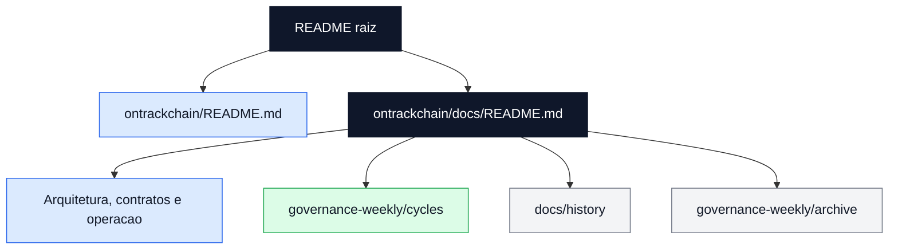
```mermaid
flowchart TD
    A[README raiz] --> B[ontrackchain/README.md]
    A --> C[ontrackchain/docs/README.md]
    C --> D[Arquitetura, contratos e operacao]
    C --> E[governance-weekly/cycles]
    C --> F[docs/history]
    C --> G[governance-weekly/archive]

    classDef primary fill:#0f172a,stroke:#0f172a,color:#fff;
    classDef live fill:#dbeafe,stroke:#2563eb,color:#111827;
    classDef evidence fill:#dcfce7,stroke:#16a34a,color:#111827;
    classDef history fill:#f3f4f6,stroke:#6b7280,color:#111827;

    class A,C primary;
    class B,D live;
    class E evidence;
    class F,G history;
```

## Modos de Deploy

### 1. Frontend Standalone Showcase

Use quando a meta for publicar uma vitrine navegavel do frontend sem backend real e sem segredos.

- blueprint: [render.yaml](./ontrackchain/render.yaml)
- doc canônica: [Blueprint Render para Staging Full-Stack](./ontrackchain/docs/render-staging-blueprint.md) (inclui configuração de showcase e full-stack)
- comportamento esperado:
  - `FRONTEND_STANDALONE_SHOWCASE_MODE=true`
  - `/api/healthz` responde sem depender de auth interna
  - `/auth/config` responde localmente
  - dashboard seeded sobe com navegacao e `Gestao de equipe`

### 2. Staging Full-Stack

Use quando a meta for validar a arquitetura real do produto com `OIDC`, banco, workers, APIs e observabilidade.

- blueprint: [render.full-stack.yaml](./ontrackchain/render.full-stack.yaml)
- doc canônica: [Blueprint Render para Staging Full-Stack](./ontrackchain/docs/render-staging-blueprint.md)
- comportamento esperado:
  - `gateway`, `frontend`, `auth-service`, `Keycloak`, APIs e workers convergem
  - `/api/healthz` do frontend responde `render-full-stack-staging`
  - se faltarem envs internas criticas, o frontend pode cair em `hostedShowcaseFallback`; isso preserva UX seeded, mas nao prova integração real

## Arquitetura em 60 Segundos

- `Traefik Ingress` (3 réplicas, PDB minAvailable=2, Service LoadBalancer) centraliza a borda e roteia requisições para os serviços internos via IngressClass
- `Keycloak v25` (realm import, 8080) atua como IdP OIDC produtivo; `mock-oidc v1.5.0` fallback para dev/staging sem Keycloak real (claims org opcionais)
- `auth-service v3.0.0` resolve identidade, contexto federado, `2FA`, roles canônicos OTK_* e headers internos X-*
- `frontend` em `Next.js 14` atua como cockpit operacional tri-locale e camada de orquestracao de UX
- `investigation-api v2.0.0` concentra `estimate`, `start`, `status`, billing, ledger e superficies financeiras administrativas
- `compliance-api v2.0.0` concentra sanctions, counterparties, preventive blocks, B2B screen, work-items e fila operacional compartilhada
- `monitoring-api v2.0.0` recebe webhooks do `Alertmanager v0.27` e sustenta triagem, RCA cross-domain, observabilidade /metrics e export operacional
- `report-api v2.0.0` gera relatórios deterministas, download sensível e governa o workflow `ROS/COAF`
- `ai-service v4.1.0` opera XAI, Risk Model, Graph Intelligence 4.0, THEMIS, LEO Export via jobs assíncronos (202 Accepted) com `FOR UPDATE SKIP LOCKED`
- `case-management v2.0.0` hub central de casos, scoring IA, timeline auditável, integração assíncrona com ai-service, CRUD RBAC estrito
- `public-api v2.0.0` superficie pública B2B (`/api/v1/b2b/screen`), rate limiting por chave `otc_live_*`
- `PostgreSQL 16 pgvector` StatefulSet 10Gi PVC labelado `restricted-dados-pessoais` (LGPD), RLS multi-tenant, vetores IA
- `Prometheus v2.53` StatefulSet 20Gi PVC + `Grafana 11.2` Dashboard Único + `Alertmanager v0.27` (scrape annotations /metrics em 9 FastAPI)
- Helm Chart `ontrackchain-platform` v3.0.0: 13 Deploys, 2 StatefulSets, 11 PDB, 8 HPA, 3 NetworkPolicies LGPD (default-deny/intra/from-ingress), PodSecurity restricted 100%

## Diagramas de Fluxo

### Índice Geral de Diagramas (17 diagramas completos do monorepo)

| # | Diagrama | Domínio | Origem canônica |
|--:|----------|---------|-----------------|
| 0 | Fluxo de leitura canônica do workspace | Onboarding / Documentação | README raiz |
| **1** | **Fluxo macro da plataforma (com 4 NetworkPolicies LGPD explícitas)** | Topologia / Kubernetes | `ontrackchain/README.md` + `docs/architecture.md` consolidados |
| 2 | Fluxo de Autenticação e Autorização | IdP / RBAC / RLS | README raiz |
| **2b** | **Sequência detalhada OIDC (fallback mock-oidc + Keycloak PKCE S256)** | Autenticação federada / MFA | `docs/keycloak-oidc-template.md` |
| 3 | Fluxo Regulatório / Compliance / Sanções / ROS-COAF | LGPD / BACEN / ANPD | README raiz |
| **3b** | **Arquitetura de Strong Sealing (Selagem Forte) de Pacote de Evidências KMS/HSM** | Evidência / Auditoria / Força Probatória | `docs/evidence-manual-package-strong-sealing-architecture.md` |
| 4 | Fluxo de Validação Local (docker compose → smoke → qa-gateway) | Developer Experience / CI Local | README raiz |
| 5 | Fluxo de Readiness Regulatório Real (P0-02 / P0-03 / P0-04) | Staging / Homologação | README raiz |
| 6 | Fluxo da Janela Séria (go/no-go 4-olhos MFA) | Operação / Regulatório | README raiz |
| 7 | Fluxo de Governança Semanal / Board Executivo | Governança Executiva | README raiz |
| **7b** | **RCA Cross-Domain Incidente (Alertmanager → work_item → Governança)** | Observabilidade / Resposta a Incidentes / LGPD Art.19 | `docs/cross-domain-incident-rca-playbook.md` |
| 8 | Fluxo de CI/CD e Promoção (macro) | CI/CD / Branch Protection | README raiz |
| 9 | Fluxo de Validação Helm Chart Sprint 16 (63 manifests) | Kubernetes / Helm / LGPD PVC | README raiz |
| 10 | Detalhamento CI 16 Jobs Bloqueantes | QA Gateway / Gates de Segurança | README raiz |
| **10b** | **ADR-029: Orquestrador 5 Gates FAIL-FAST (Q1→Q4; Q5 SEMPRE roda segredos)** | Pre-Merge / ADR-029 STRICT | `docs/adrs/ADR-029-ci-pre-merge-gate-pipeline-5-qa-gateway-4-scans-trufflehog.md` |
| 11 | Mapeamento Federação Roles OTK_* (OTK_ADMIN → ADMIN, etc) | RBAC Canônico / SSOT | README raiz |
| **12** | **Ordem de Ativação OIDC Keycloak v25 P0-01 (14 passos P0-01.01 → P0-01.14)** | Handoff P0-01 / Keycloak Helm | `docs/handbooks/handbook-p0-01-oidc-keycloak-v25-helm-self-hosted.md` |

---

### 0. Fluxo de leitura canônica (repetido para navegabilidade pelo índice)


```mermaid
flowchart TD
    A[README raiz] --> B[ontrackchain/README.md]
    A --> C[ontrackchain/docs/README.md]
    C --> D[Arquitetura, contratos e operacao]
    C --> E[governance-weekly/cycles]
    C --> F[docs/history]
    C --> G[governance-weekly/archive]

    classDef primary fill:#0f172a,stroke:#0f172a,color:#fff;
    classDef live fill:#dbeafe,stroke:#2563eb,color:#111827;
    classDef evidence fill:#dcfce7,stroke:#16a34a,color:#111827;
    classDef history fill:#f3f4f6,stroke:#6b7280,color:#111827;

    class A,C primary;
    class B,D live;
    class E evidence;
    class F,G history;
```

### 1. Fluxo macro da plataforma (CONSOLIDADO: 4 NetworkPolicies LGPD + PVC Grafana standalone + JWKS verify OIDC)

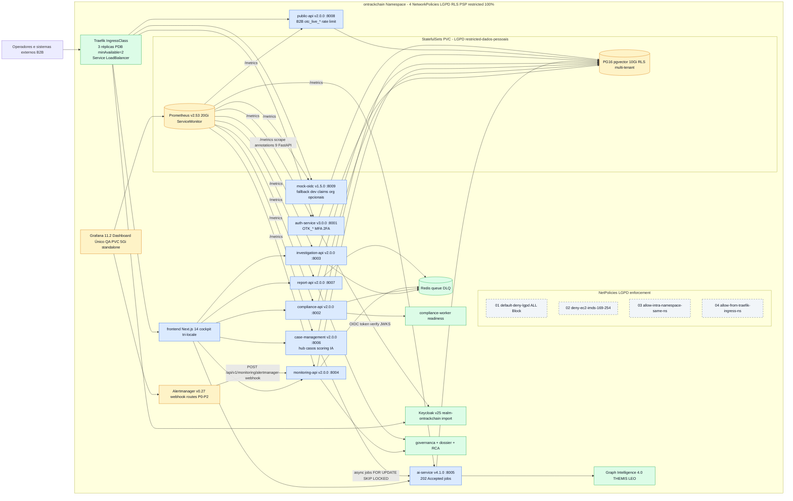
```mermaid
flowchart LR
    U[Operadores e sistemas externos B2B] --> TF[Traefik IngressClass<br/>3 réplicas PDB minAvailable=2<br/>Service LoadBalancer]
    subgraph K8s_NS[ontrackchain Namespace  -  4 NetworkPolicies LGPD RLS PSP restricted 100%]
      direction TB
      subgraph NetPols[NetPolicies LGPD enforcement]
        direction TB
        NP1[01 default-deny-lgpd ALL Block]
        NP2[02 deny-ec2-imds-169-254]
        NP3[03 allow-intra-namespace-same-ns]
        NP4[04 allow-from-traefik-ingress-ns]
      end
      TF --> A[auth-service v3.0.0 :8001<br/>OTK_* MFA 2FA]
      TF --> MO[mock-oidc v1.5.0 :8009<br/>fallback dev claims org opcionais]
      TF --> F[frontend Next.js 14 cockpit tri-locale]
      TF --> PA[public-api v2.0.0 :8008<br/>B2B otc_live_* rate limit]
      F --> I[investigation-api v2.0.0 :8003]
      F --> C[compliance-api v2.0.0 :8002]
      F --> MO2[monitoring-api v2.0.0 :8004]
      F --> R[report-api v2.0.0 :8007]
      F --> AI[ai-service v4.1.0 :8005<br/>202 Accepted jobs]
      F --> CM[case-management v2.0.0 :8006<br/>hub casos scoring IA]
      I --> X[(Redis queue DLQ)]
      C --> X; MO2 --> X; R --> X
      C --> CW[compliance-worker readiness]
      subgraph SS[StatefulSets PVC  -  LGPD restricted-dados-pessoais]
        direction TB
        P[(PG16 pgvector 10Gi RLS multi-tenant)]
        PR[(Prometheus v2.53 20Gi ServiceMonitor)]
      end
      G[Grafana 11.2 Dashboard Único QA PVC 5Gi standalone]
      AM[Alertmanager v0.27 webhook routes P0-P2]
      KC[Keycloak v25 realm-ontrackchain import]
      I --> P; C --> P; MO2 --> P; R --> P; AI --> P; CM --> P; PA --> P; A --> P
      AM -->|POST /api/v1/monitoring/alertmanager-webhook| MO2
      PR -->|/metrics scrape annotations 9 FastAPI| A; PR -->|/metrics| MO; PR -->|/metrics| PA
      PR -->|/metrics| I; PR -->|/metrics| C; PR -->|/metrics| MO2; PR -->|/metrics| R
      PR -->|/metrics| AI; PR -->|/metrics| CM
      G --> PR; G --> AM
      CM -->|async jobs FOR UPDATE SKIP LOCKED| AI
      MO2 --> GW[governanca + dossier + RCA]
      R --> GW
      AI --> GE[Graph Intelligence 4.0 THEMIS LEO]
      TF --> KC
      A -->|OIDC token verify JWKS| KC
    end

    classDef svc fill:#dbeafe,stroke:#2563eb,color:#111827;
    classDef infra fill:#dcfce7,stroke:#16a34a,color:#111827;
    classDef stateful fill:#fef3c7,stroke:#d97706,color:#111827;
    classDef netpol fill:#f1f5f9,stroke:#475569,color:#111827,stroke-dasharray:5 5;
    classDef gateway fill:#fce7f3,stroke:#db2777,color:#111827;
    class A,MO,PA,I,C,MO2,R,AI,CM,F svc;
    class TF,X,CW,GW,GE,KC infra;
    class P,PR,AM,G stateful;
    class NP1,NP2,NP3,NP4 netpol;
```

### 2. Fluxo de autenticação e autorização

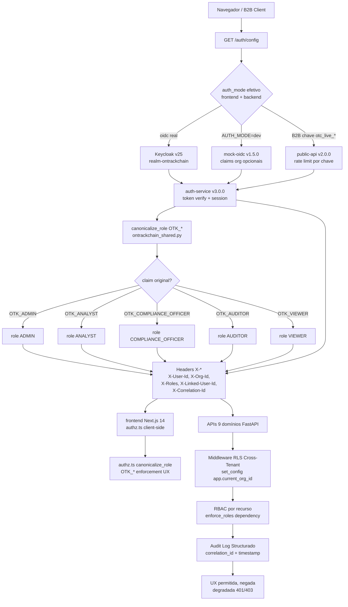
```mermaid
flowchart TD
    B[Navegador / B2B Client] --> Cfg[GET /auth/config]
    Cfg --> Mode{auth_mode efetivo\nfrontend + backend}
    Mode -->|oidc real| KC[Keycloak v25\nrealm-ontrackchain]
    Mode -->|AUTH_MODE=dev| MO[mock-oidc v1.5.0\nclaims org opcionais]
    Mode -->|B2B chave otc_live_*| PA[public-api v2.0.0\nrate limit por chave]
    KC --> AS[auth-service v3.0.0\ntoken verify + session]
    MO --> AS
    PA --> AS
    AS --> CR[canonicalize_role OTK_*\nontrackchain_shared.py]
    CR --> OTK{claim original?}
    OTK -->|OTK_ADMIN| AD[role ADMIN]
    OTK -->|OTK_ANALYST| AN[role ANALYST]
    OTK -->|OTK_COMPLIANCE_OFFICER| CO[role COMPLIANCE_OFFICER]
    OTK -->|OTK_AUDITOR| AU[role AUDITOR]
    OTK -->|OTK_VIEWER| VW[role VIEWER]
    AD --> H
    AN --> H
    CO --> H
    AU --> H
    VW --> H
    AS --> H[Headers X-*\nX-User-Id, X-Org-Id,\nX-Roles, X-Linked-User-Id,\nX-Correlation-Id]
    H --> FE[frontend Next.js 14\nauthz.ts client-side]
    H --> API[APIs 9 domínios FastAPI]
    FE --> FER[authz.ts canonicalize_role\nOTK_* enforcement UX]
    API --> RLS[Middleware RLS Cross-Tenant\nset_config app.current_org_id]
    RLS --> RBAC[RBAC por recurso\nenforce_roles dependency]
    RBAC --> AUD[Audit Log Structurado\ncorrelation_id + timestamp]
    AUD --> UX[UX permitida, negada\ndegradada 401/403]
```

### 2b. Sequência Detalhada OIDC (fallback mock-oidc + Keycloak PKCE S256 + RLS+RBAC enforcement fim-a-fim)

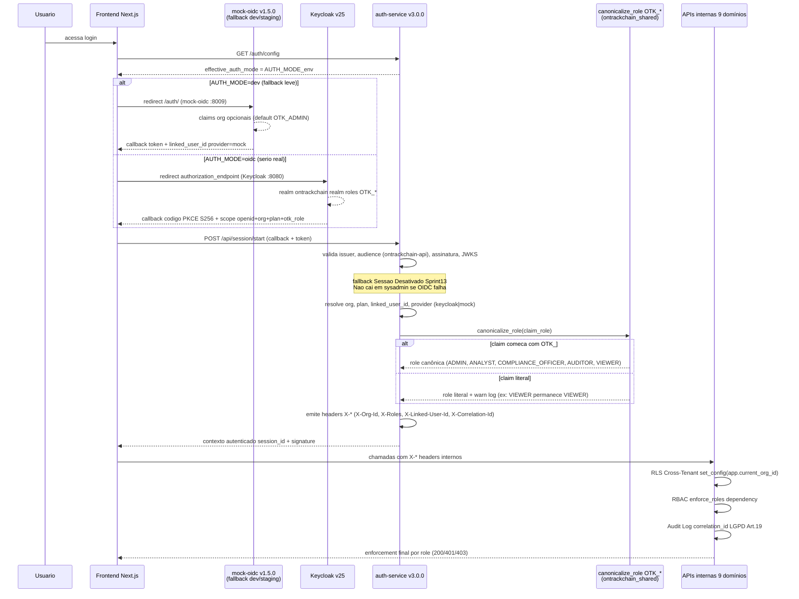
```mermaid
sequenceDiagram
    participant U as Usuario
    participant F as Frontend Next.js
    participant MO as mock-oidc v1.5.0<br/>(fallback dev/staging)
    participant K as Keycloak v25
    participant A as auth-service v3.0.0
    participant OTK as canonicalize_role OTK_*<br/>(ontrackchain_shared)
    participant APIs as APIs internas 9 domínios

    U->>F: acessa login
    F->>A: GET /auth/config
    A-->>F: effective_auth_mode = AUTH_MODE_env
    alt AUTH_MODE=dev (fallback leve)
      F->>MO: redirect /auth/ (mock-oidc :8009)
      MO-->>MO: claims org opcionais (default OTK_ADMIN)
      MO-->>F: callback token + linked_user_id provider=mock
    else AUTH_MODE=oidc (serio real)
      F->>K: redirect authorization_endpoint (Keycloak :8080)
      K-->>K: realm ontrackchain realm roles OTK_*
      K-->>F: callback codigo PKCE S256 + scope openid+org+plan+otk_role
    end
    F->>A: POST /api/session/start (callback + token)
    A->>A: valida issuer, audience (ontrackchain-api), assinatura, JWKS
    Note over A: fallback Sessao Desativado Sprint13<br/>Nao cai em sysadmin se OIDC falha
    A->>A: resolve org, plan, linked_user_id, provider (keycloak|mock)
    A->>OTK: canonicalize_role(claim_role)
    alt claim comeca com OTK_
      OTK-->>A: role canônica (ADMIN, ANALYST, COMPLIANCE_OFFICER, AUDITOR, VIEWER)
    else claim literal
      OTK-->>A: role literal + warn log (ex: VIEWER permanece VIEWER)
    end
    A->>A: emite headers X-* (X-Org-Id, X-Roles, X-Linked-User-Id, X-Correlation-Id)
    A-->>F: contexto autenticado session_id + signature
    F->>APIs: chamadas com X-* headers internos
    APIs->>APIs: RLS Cross-Tenant set_config(app.current_org_id)
    APIs->>APIs: RBAC enforce_roles dependency
    APIs->>APIs: Audit Log correlation_id LGPD Art.19
    APIs-->>F: enforcement final por role (200/401/403)
```

### 3. Fluxo regulatório e de compliance

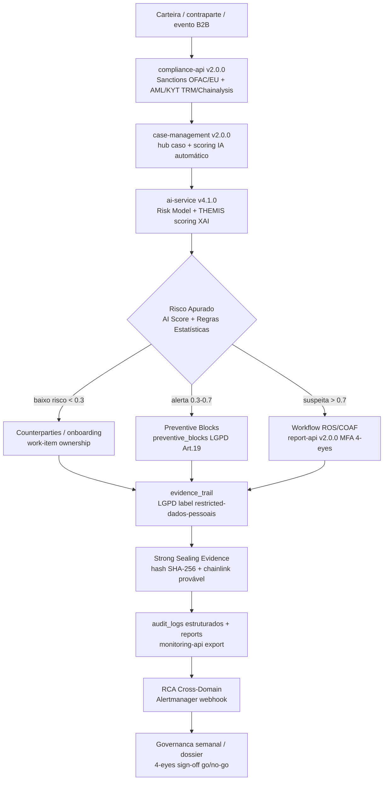
```mermaid
flowchart TD
    Input[Carteira / contraparte / evento B2B] --> Screening[compliance-api v2.0.0<br/>Sanctions OFAC/EU + AML/KYT TRM/Chainalysis]
    Screening --> CM[case-management v2.0.0<br/>hub caso + scoring IA automático]
    CM --> AI[ai-service v4.1.0<br/>Risk Model + THEMIS scoring XAI]
    AI --> Decision{Risco Apurado\nAI Score + Regras Estatísticas}
    Decision -->|baixo risco < 0.3| Counterparty[Counterparties / onboarding\nwork-item ownership]
    Decision -->|alerta 0.3-0.7| Block[Preventive Blocks\npreventive_blocks LGPD Art.19]
    Decision -->|suspeita > 0.7| ROS[Workflow ROS/COAF\nreport-api v2.0.0 MFA 4-eyes]
    Counterparty --> Evidence[evidence_trail\nLGPD label restricted-dados-pessoais]
    Block --> Evidence
    ROS --> Evidence
    Evidence --> Seal[Strong Sealing Evidence<br/>hash SHA-256 + chainlink provável]
    Seal --> Audit[audit_logs estruturados + reports\nmonitoring-api export]
    Audit --> RCA[RCA Cross-Domain\nAlertmanager webhook]
    RCA --> Gov[Governanca semanal / dossier\n4-eyes sign-off go/no-go]
```

### 3b. Arquitetura de Strong Sealing (Selagem Forte) de Pacote de Evidências KMS/HSM + Verificação Offline

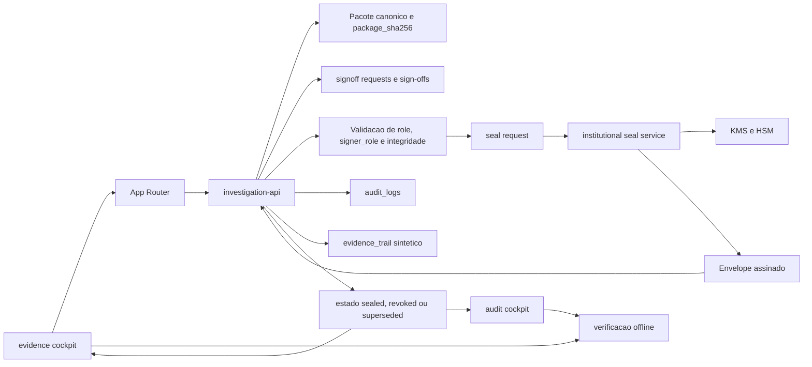
```mermaid
flowchart LR
    E[evidence cockpit] --> AR[App Router]
    AR --> I[investigation-api]
    I --> PK[Pacote canonico e package_sha256]
    I --> SO[signoff requests e sign-offs]
    I --> V[Validacao de role, signer_role e integridade]
    V --> SR[seal request]
    SR --> SS[institutional seal service]
    SS --> K[KMS e HSM]
    SS --> ENV[Envelope assinado]
    ENV --> I
    I --> AU[audit_logs]
    I --> ET[evidence_trail sintetico]
    I --> ST[estado sealed, revoked ou superseded]
    ST --> AC[audit cockpit]
    ST --> E
    E --> OFF[verificacao offline]
    AC --> OFF
```

### 4. Fluxo de validação local

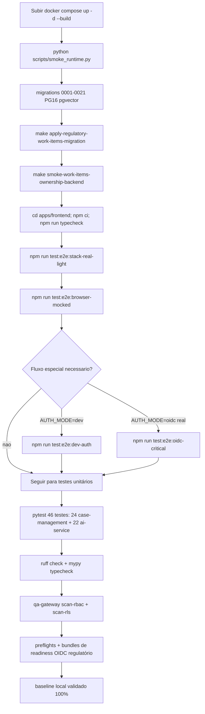
```mermaid
flowchart TD
    A[Subir docker compose up -d --build] --> B[python scripts/smoke_runtime.py]
    B --> B2[migrations 0001-0021 PG16 pgvector]
    B2 --> C[make apply-regulatory-work-items-migration]
    C --> C2[make smoke-work-items-ownership-backend]
    C2 --> D[cd apps/frontend; npm ci; npm run typecheck]
    D --> E[npm run test:e2e:stack-real-light]
    E --> F[npm run test:e2e:browser-mocked]
    F --> G{Fluxo especial necessario?}
    G -->|AUTH_MODE=dev| H[npm run test:e2e:dev-auth]
    G -->|AUTH_MODE=oidc real| I[npm run test:e2e:oidc-critical]
    G -->|nao| J[Seguir para testes unitários]
    H --> J
    I --> J
    J --> K[pytest 46 testes: 24 case-management + 22 ai-service]
    K --> L[ruff check + mypy typecheck]
    L --> M[qa-gateway scan-rbac + scan-rls]
    M --> N[preflights + bundles de readiness OIDC regulatório]
    N --> O[baseline local validado 100%]
```

### 5. Fluxo de readiness regulatório real

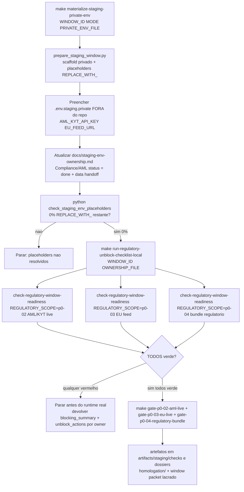
```mermaid
flowchart TD
    A[make materialize-staging-private-env\nWINDOW_ID MODE PRIVATE_ENV_FILE] --> B[prepare_staging_window.py\nscaffold privado + placeholders REPLACE_WITH_]
    B --> C[Preencher .env.staging.private FORA do repo\nAML_KYT_API_KEY EU_FEED_URL]
    C --> D[Atualizar docs/staging-env-ownership.md\nCompliance/AML status = done + data handoff]
    D --> E[python check_staging_env_placeholders\n0% REPLACE_WITH_ restante?]
    E -->|nao| Stop[Parar: placeholders nao resolvidos]
    E -->|sim 0%| F[make run-regulatory-unblock-checklist-local\nWINDOW_ID OWNERSHIP_FILE]
    F --> G[check-regulatory-window-readiness REGULATORY_SCOPE=p0-02 AML/KYT live]
    F --> H[check-regulatory-window-readiness REGULATORY_SCOPE=p0-03 EU feed]
    F --> I[check-regulatory-window-readiness REGULATORY_SCOPE=p0-04 bundle regulatorio]
    G --> J{TODOS verde?}
    H --> J
    I --> J
    J -->|qualquer vermelho| Stop2[Parar antes do runtime real\ndevolver blocking_summary + unblock_actions por owner]
    J -->|sim todos verde| K[make gate-p0-02-aml-live + gate-p0-03-eu-live + gate-p0-04-regulatory-bundle]
    K --> L[artefatos em artifacts/staging/checks e dossiers\nhomologation/ + window packet lacrado]
```

### 6. Fluxo da janela seria

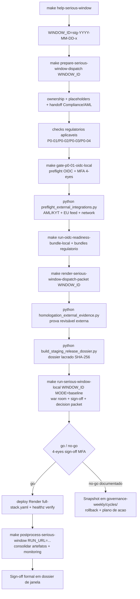
```mermaid
flowchart TD
    A[make help-serious-window] --> A2[WINDOW_ID=stg-YYYY-MM-DD-x]
    A2 --> B[make prepare-serious-window-dispatch WINDOW_ID]
    B --> C[ownership + placeholders + handoff Compliance/AML]
    C --> D[checks regulatorios aplicaveis\nP0-01/P0-02/P0-03/P0-04]
    D --> E[make gate-p0-01-oidc-local\npreflight OIDC + MFA 4-eyes]
    E --> F[python preflight_external_integrations.py\nAML/KYT + EU feed + network]
    F --> G[make run-oidc-readiness-bundle-local + bundles regulatorio]
    G --> H[make render-serious-window-dispatch-packet WINDOW_ID]
    H --> I[python homologation_external_evidence.py\nprova revisável externa]
    I --> J[python build_staging_release_dossier.py\ndossier lacrado SHA-256]
    J --> K[make run-serious-window-local WINDOW_ID MODE=baseline\nwar room + sign-off + decision packet]
    K --> L{go / no-go\n4-eyes sign-off MFA}
    L -->|go| M[deploy Render full-stack.yaml + healthz verify]
    L -->|no-go documentado| N[Snapshot em governance-weekly/cycles/\nrollback + plano de acao]
    M --> O[make postprocess-serious-window RUN_URL=...\nconsolidar artefatos + monitoring]
    O --> P[Sign-off formal em dossier de janela]
```

### 7. Fluxo de governança semanal

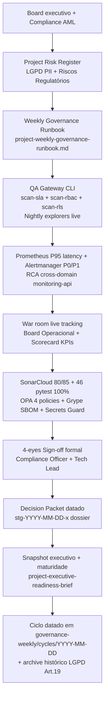
```mermaid
flowchart TD
    A[Board executivo + Compliance AML] --> B[Project Risk Register\nLGPD PII + Riscos Regulatórios]
    B --> C[Weekly Governance Runbook\nproject-weekly-governance-runbook.md]
    C --> D[QA Gateway CLI\nscan-sla + scan-rbac + scan-rls\nNightly explorers live]
    D --> E[Prometheus P95 latency + Alertmanager P0/P1\nRCA cross-domain monitoring-api]
    E --> F[War room live tracking\nBoard Operacional + Scorecard KPIs]
    F --> G[SonarCloud 80/85 + 46 pytest 100%\nOPA 4 policies + Grype SBOM + Secrets Guard]
    G --> H[4-eyes Sign-off formal\nCompliance Officer + Tech Lead]
    H --> I[Decision Packet datado\nstg-YYYY-MM-DD-x dossier]
    I --> J[Snapshot executivo + maturidade\nproject-executive-readiness-brief]
    J --> K[Ciclo datado em governance-weekly/cycles/YYYY-MM-DD\n+ archive histórico LGPD Art.19]
```

### 7b. RCA Cross-Domain Incidente (Alertmanager → monitoring-api → work_item → RCA → Governança)

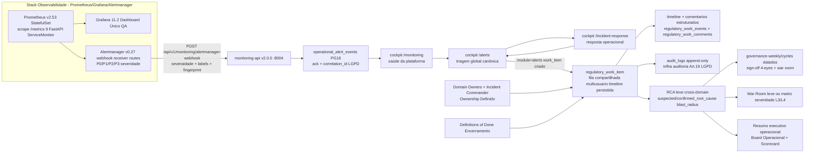
```mermaid
flowchart LR
    subgraph StackObserv[Stack Observabilidade  -  Prometheus/Grafana/Alertmanager]
      direction TB
      PRO[Prometheus v2.53 StatefulSet<br/>scrape /metrics 9 FastAPI ServiceMonitor]
      GRA[Grafana 11.2 Dashboard Único QA]
      AM[Alertmanager v0.27 webhook receiver routes<br/>P0/P1/P2/P3 severidade]
      PRO --> GRA; PRO --> AM
    end
    AM -->|POST /api/v1/monitoring/alertmanager-webhook<br/>severaidade + labels + fingerprint| M[monitoring-api v2.0.0 :8004]
    M --> O[operational_alert_events PG16<br/>ack + correlation_id LGPD]
    O --> MON[cockpit /monitoring<br/>saúde da plataforma]
    MON --> AL[cockpit /alerts<br/>triagem global canônica]
    AL --> IR[cockpit /incident-response<br/>resposta operacional]
    IR --> AL
    AL -->|module=alerts work_item criado| W[regulatory_work_item<br/>fila compartilhada multiusuario timeline persistida]
    W --> T[timeline + comentarios estruturados<br/>regulatory_work_events + regulatory_work_comments]
    W --> AU[audit_logs append-only<br/>trilha auditoria Art.19 LGPD]
    W --> RCA[RCA leve cross-domain<br/>suspected/confirmed_root_cause blast_radius]
    RCA --> CY[governance-weekly/cycles datados<br/>sign-off 4-eyes + war room]
    RCA --> WR[War Room leve ou matriz severidade L3/L4]
    RCA --> RS[Resumo executivo operacional<br/>Board Operacional + Scorecard]
    DO[Domain Owners + Incident Commander<br/>Ownership Definido] --> W
    DEF[Definitions of Done Encerramento] --> W
```

### 8. Fluxo de CI/CD e promoção (macro)

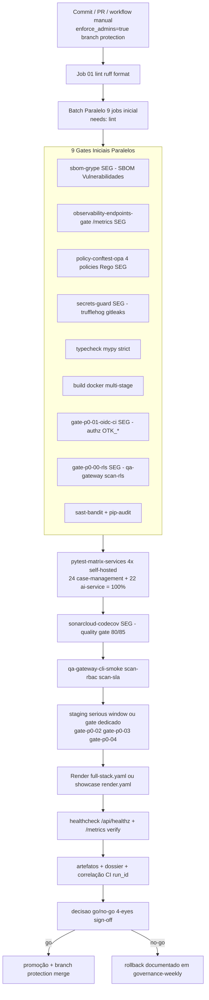
```mermaid
flowchart TD
    A[Commit / PR / workflow manual\nenforce_admins=true branch protection] --> B[Job 01 lint ruff format]
    B --> C[Batch Paralelo 9 jobs inicial\nneeds: lint]
    subgraph P_BATCH[9 Gates Iniciais Paralelos]
      C1[sbom-grype SEG - SBOM Vulnerabilidades]
      C2[observability-endpoints-gate /metrics SEG]
      C3[policy-conftest-opa 4 policies Rego SEG]
      C4[secrets-guard SEG - trufflehog gitleaks]
      C5[typecheck mypy strict]
      C6[build docker multi-stage]
      C7[gate-p0-01-oidc-ci SEG - authz OTK_*]
      C8[gate-p0-00-rls SEG - qa-gateway scan-rls]
      C9[sast-bandit + pip-audit]
    end
    C --> P_BATCH
    P_BATCH --> D[pytest-matrix-services 4x self-hosted\n24 case-management + 22 ai-service = 100%]
    D --> E[sonarcloud-codecov SEG - quality gate 80/85]
    E --> F[qa-gateway-cli-smoke scan-rbac scan-sla]
    F --> G[staging serious window ou gate dedicado\ngate-p0-02 gate-p0-03 gate-p0-04]
    G --> H[Render full-stack.yaml ou showcase render.yaml]
    H --> I[healthcheck /api/healthz + /metrics verify]
    I --> J[artefatos + dossier + correlação CI run_id]
    J --> K[decisao go/no-go 4-eyes sign-off]
    K -->|go| L[promoção + branch protection merge]
    K -->|no-go| M[rollback documentado em governance-weekly]
```

### 9. Fluxo de Validação Helm Chart Sprint 16 (NOVO)

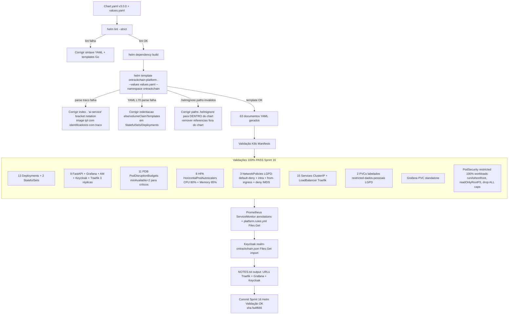
```mermaid
flowchart TD
    A[Chart.yaml v3.0.0 + values.yaml] --> B[helm lint --strict]
    B -->|lint falha| BErr[Corrigir sintaxe YAML + templates Go]
    B -->|lint OK| C[helm dependency build]
    C --> D[helm template ontrackchain-platform .\n--values values.yaml --namespace ontrackchain]
    D -->|parse traco falha| D1[Corrigir index . 'ai-service' bracket notation\nimage tpl com identificadores com traco]
    D -->|YAML L70 parse falha| D2[Corrigir indentacao else/volumeClaimTemplates\nem StatefulSets/Deployments]
    D -->|.helmignore paths invalidos| D3[Corrigir paths .helmignore para DENTRO do chart\nremover referencias fora do chart]
    D -->|template OK| E[63 documentos YAML gerados]
    E --> F[Validação K8s Manifests]
    subgraph V[Validações 100% PASS Sprint 16]
      direction TB
      F1[13 Deployments + 2 StatefulSets]
      F2[9 FastAPI + Grafana + AM + Keycloak + Traefik 3 réplicas]
      F3[11 PDB PodDisruptionBudgets\nminAvailable=2 para críticos]
      F4[8 HPA HorizontalPodAutoscalers\nCPU 80% + Memory 85%]
      F5[3 NetworkPolicies LGPD:\ndefault-deny + intra + from-ingress + deny IMDS]
      F6[15 Services ClusterIP + LoadBalancer Traefik]
      F7[2 PVCs labelados restricted-dados-pessoais LGPD]
      F8[Grafana PVC standalone]
      F9[PodSecurity restricted 100% workloads:\nrunAsNonRoot, readOnlyRootFS, drop ALL caps]
    end
    F --> V
    V --> G[Prometheus ServiceMonitor annotations + platform.rules.yml Files.Get]
    G --> H[Keycloak realm-ontrackchain.json Files.Get import]
    H --> I[NOTES.txt output: URLs Traefik + Grafana + Keycloak]
    I --> J[Commit Sprint 16 Helm Validação OK\nsha fa4f666]
```

### 10. Detalhamento CI 16 Jobs Bloqueantes (NOVO)


```mermaid
flowchart TD
    A[Trigger: push main / PR / workflow_dispatch] --> B[01 lint ruff format black]
    B --> C{needs: lint}
    subgraph PAR1[Gates de Segurança SEG - paralelos]
      direction LR
      C1[02 sbom-grype SBOM CycloneDX + vulns CRITICAL/HIGH block]
      C2[03 observability-endpoints-gate /metrics 9 FastAPI presentes]
      C3[04 policy-conftest-opa 4 policies Rego:\n- P0 continue-on-error proibido\n- heavy jobs self-hosted runner\n- timeout jobs 45min\n- endpoints /metrics obrigatorios]
      C4[05 secrets-guard trufflehog + gitleaks\nsecrets REPLACE_WITH_ permitidos só em staging EXAMPLE]
      C9[11 sast-bandit py SAST\n12 dependency-audit pip-audit]
    end
    subgraph PAR2[Build + Typecheck + Gates P0 - paralelos]
      direction LR
      C5[06 typecheck mypy strict\nFastAPI apps 9 serviços]
      C6[07 build docker multi-stage\nnon-root user + distroless]
      C7[08 gate-p0-01-oidc-ci SEG authz OTK_*\ncanonicalize_role em auth-service CI]
      C8[09 gate-p0-00-rls SEG qa-gateway scan-rls\nRLS Cross-Tenant set_config bypass disabled prod]
    end
    C --> PAR1
    C --> PAR2
    PAR1 --> D[10 pytest-matrix-services needs: lint, typecheck\n4x self-hosted runners paralelos:\ncase-management 24/24 PASS\nai-service 22/22 PASS]
    PAR2 --> D
    D --> E[13 sonarcloud-codecov needs: pytest-matrix, sast-bandit\nQuality Gate 80% coverage / 85% branch]
    E --> F[14 qa-gateway-cli-smoke scan-rbac + scan-sla]
    F --> G[15 nightlies: 6 workflows paralelos:\n- nightly-explorers-live Chainlink/BSC/Ethereum\n- nightly-rbac-baseline, nightly-rls-baseline\n- nightly-e2e-playwright-oidc-critical\n- nightly-dr-backup-restore PG16\n- nightly-regulatory-readiness P0/P1]
    G --> H[16 gates condicionais de deploy:\n- if production: gate-p0-02 AML gate-p0-03 EU gate-p0-04 bundle\n- if PR: e2e-pr-playwright.yml]
    H --> I[Branch Protection: enforce_admins=true\nmain exige 16/16 checks verde\ndevelop exige 10/16]
```

### 10b. ADR-029 Orquestrador 5 Gates FAIL-FAST (Q1→Q4 scans de risco; Q5 SEGREDOS SEMPRE roda)

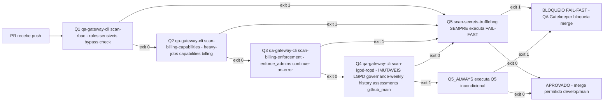
```mermaid
flowchart LR
    PR[PR recebe push] --> Q1[Q1 qa-gateway-cli scan-rbac - roles sensiveis bypass check]
    Q1 -->|exit 0| Q2[Q2 qa-gateway-cli scan-billing-capabilities - heavy-jobs capabilities billing]
    Q2 -->|exit 0| Q3[Q3 qa-gateway-cli scan-billing-enforcement - enforce_admins continue-on-error]
    Q3 -->|exit 0| Q4[Q4 qa-gateway-cli scan-lgpd-ropd - IMUTAVEIS LGPD governance-weekly history assessments github_main]
    Q1 -->|exit 1| Q5[Q5 scan-secrets-trufflehog SEMPRE executa FAIL-FAST]
    Q2 -->|exit 1| Q5
    Q3 -->|exit 1| Q5
    Q4 -->|exit 1| Q5_ALWAYS[Q5_ALWAYS executa Q5 incondicional]
    Q4 -->|exit 0| Q5
    Q5 -->|exit 1| RED_BLOCK[BLOQUEIO FAIL-FAST - QA Gatekeeper bloqueia merge]
    Q5_ALWAYS -->|exit 1| RED_BLOCK
    Q5 -->|exit 0| GREEN_MERGE[APROVADO - merge permitido develop/main]
    Q5_ALWAYS -->|exit 0| GREEN_MERGE
```

### 11. Mapeamento Federação Roles OTK_* (NOVO)

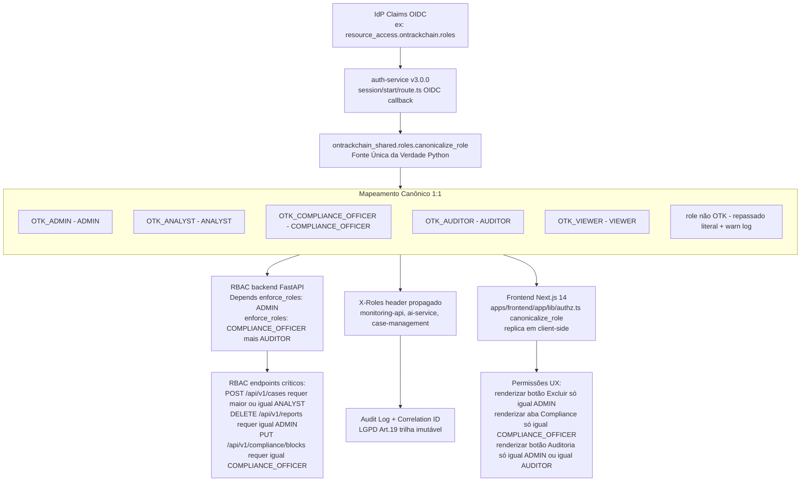
```mermaid
flowchart TD
    A[IdP Claims OIDC\nex: resource_access.ontrackchain.roles] --> B[auth-service v3.0.0\nsession/start/route.ts OIDC callback]
    B --> C[ontrackchain_shared.roles.canonicalize_role\nFonte Única da Verdade Python]
    subgraph MAP[Mapeamento Canônico 1:1]
      direction TB
      C1[OTK_ADMIN - ADMIN]
      C2[OTK_ANALYST - ANALYST]
      C3[OTK_COMPLIANCE_OFFICER - COMPLIANCE_OFFICER]
      C4[OTK_AUDITOR - AUDITOR]
      C5[OTK_VIEWER - VIEWER]
      C6[role não OTK - repassado literal + warn log]
    end
    C --> MAP
    MAP --> D[RBAC backend FastAPI\nDepends enforce_roles: ADMIN\nenforce_roles: COMPLIANCE_OFFICER mais AUDITOR]
    MAP --> E[X-Roles header propagado\nmonitoring-api, ai-service, case-management]
    MAP --> F[Frontend Next.js 14\napps/frontend/app/lib/authz.ts canonicalize_role\nreplica em client-side]
    D --> D1[RBAC endpoints críticos:\nPOST /api/v1/cases requer maior ou igual ANALYST\nDELETE /api/v1/reports requer igual ADMIN\nPUT /api/v1/compliance/blocks requer igual COMPLIANCE_OFFICER]
    E --> E1[Audit Log + Correlation ID\nLGPD Art.19 trilha imutável]
    F --> F1[Permissões UX:\nrenderizar botão Excluir só igual ADMIN\nrenderizar aba Compliance só igual COMPLIANCE_OFFICER\nrenderizar botão Auditoria só igual ADMIN ou igual AUDITOR]
```

### 12. Ordem de Ativação OIDC Keycloak v25 P0-01 (14 passos P0-01.01 → P0-01.14)


```mermaid
flowchart LR
    P0101["P0-01.01 Realm LGPD banner + privacy policy URL"] --> P0107["P0-01.07 Helm HA 3 réplicas + PG Patroni StatefulSet"]
    P0107 --> P0108["P0-01.08 Istio mTLS STRICT PeerAuth Keycloak ns"]
    P0108 --> P0102["P0-01.02 Clients PKCE 15min access / 7d refresh"]
    P0102 --> P0104["P0-01.04 Roles OTK_* federados realm/client scope + mappers"]
    P0104 --> P0103["P0-01.03 MFA Required TOTP + WebAuthn realm-wide"]
    P0103 --> P0106["P0-01.06 LDAP Sync User Federation MSAD + grupos OTK_*"]
    P0106 --> P0105["P0-01.05 SAML 2.0 IdP Corporate AzureAD ADFS First Login Broker"]
    P0105 --> P0109["P0-01.09 Cloudflare WAF + Bot Fight Mode + Rate Limit login"]
    P0109 --> P0110["P0-01.10 SIEM Splunk events 180d retenção + alertas P0"]
    P0110 --> P0111["P0-01.11 Backup PG 6h wal-g S3 + Export Realm JSON"]
    P0111 --> P0112["P0-01.12 Prometheus Alertas P0 email/Slack/MS Teams webhook"]
    P0112 --> P0113["P0-01.13 Playwright E2E Q3-07 passagem crítica MFA + token PKCE"]
    P0113 --> P0114["P0-01.14 Sign-off 4-Olhos CTO/DSI/DPO/Arquiteto"]
```

## Portas canônicas

### Portas de entrada

- [README tecnico da arvore ativa](./ontrackchain/README.md)
- [Indice canônico da documentação ativa](./ontrackchain/docs/README.md)

### Documentos principais

- [Arquitetura](./ontrackchain/docs/architecture.md)
- [Contratos de API](./ontrackchain/docs/api-contracts.md)
- [RBAC e Permissoes](./ontrackchain/docs/rbac-and-permissions.md)
- [Deploy e Staging](./ontrackchain/docs/deploy-and-staging.md)
- [Variaveis de Ambiente](./ontrackchain/docs/environment-variables.md)
- [Runbooks Operacionais](./ontrackchain/docs/runbooks.md)
- [Resumo Executivo de Readiness](./ontrackchain/docs/project-executive-readiness-brief.md)
- [Readiness regulatório](./ontrackchain/docs/regulatory-readiness.md)
- [Board Operacional](./ontrackchain/docs/project-operational-execution-board.md)
- [Gates de Release](./ontrackchain/docs/project-release-gates.md)
- [governança Semanal](./ontrackchain/docs/governance-weekly/README.md)

### evidência datada e historico

- [Ciclo ativo 2026-07-13](./ontrackchain/docs/governance-weekly/cycles/2026-07-13/README.md)
- [Historico de apoio](./ontrackchain/docs/history/README.md)
- [Arquivo historico da governança](./ontrackchain/docs/governance-weekly/archive/README.md)

## Leitura Recomendada por Perfil

### Arquiteto / lider tecnico

1. [architecture.md](./ontrackchain/docs/architecture.md)
2. [api-contracts.md](./ontrackchain/docs/api-contracts.md)
3. [rbac-and-permissions.md](./ontrackchain/docs/rbac-and-permissions.md)
4. [adrs/README.md](./ontrackchain/docs/adrs/README.md)

### operação / SRE / DevOps

1. [operations.md](./ontrackchain/docs/operations.md)
2. [deploy-and-staging.md](./ontrackchain/docs/deploy-and-staging.md)
3. [render-staging-blueprint.md](./ontrackchain/docs/render-staging-blueprint.md)
4. [runbooks.md](./ontrackchain/docs/runbooks.md)
5. [staging-env-ownership.md](./ontrackchain/docs/staging-env-ownership.md)

### Compliance / regulacao

1. [regulatory-readiness.md](./ontrackchain/docs/regulatory-readiness.md)
2. [evidence-and-audit-matrix.md](./ontrackchain/docs/evidence-and-audit-matrix.md)
3. [compliance-and-security-controls.md](./ontrackchain/docs/compliance-and-security-controls.md)
4. [project-maturity-evidence-execution-kit.md](./ontrackchain/docs/project-maturity-evidence-execution-kit.md)
5. [compliance-reports/README.md](./ontrackchain/docs/compliance-reports/README.md)

### Stakeholders executivos

1. [project-executive-readiness-brief.md](./ontrackchain/docs/project-executive-readiness-brief.md)
2. [project-kpi-scorecard.md](./ontrackchain/docs/project-kpi-scorecard.md)
3. [project-priority-board.md](./ontrackchain/docs/project-priority-board.md)
4. [project-risk-register.md](./ontrackchain/docs/project-risk-register.md)
5. [ciclo ativo](./ontrackchain/docs/governance-weekly/cycles/2026-07-13/README.md)

## Quick Start

### 1. Entrar na arvore ativa (FONTE ÚNICA DA VERDADE)

```bash
cd ontrackchain
```

### 2. Subir a stack local

```bash
cp .env.example .env
docker compose up -d --build
```

Para exercitar `OIDC` localmente:

```bash
docker compose --profile oidc up -d --build
```

### 3. Validar o baseline local

```bash
python3 scripts/smoke_runtime.py
make apply-regulatory-work-items-migration
make smoke-work-items-ownership-backend

cd apps/frontend
npm ci
npm run typecheck
npm run test:e2e:stack-real-light
npm run test:e2e:browser-mocked
```

observações:

- use `npm run test:e2e:dev-auth` apenas com `AUTH_MODE=dev`
- use `npm run test:e2e:oidc-critical` apenas quando o runtime real estiver em `AUTH_MODE=oidc`
- para mudancas server-side no frontend, prefira `docker compose up -d --build frontend`

### 4. Validar readiness serio

```bash
python3 scripts/preflight_external_integrations.py
make run-oidc-readiness-bundle-local WINDOW_ID=stg-$(date +%F)-oidc BASE_URL=http://localhost:8080
make check-regulatory-window-readiness REGULATORY_SCOPE=p0-02 PRIVATE_ENV_FILE=.env.staging.private OWNERSHIP_FILE=docs/staging-env-ownership.md
make check-regulatory-window-readiness REGULATORY_SCOPE=p0-03 PRIVATE_ENV_FILE=.env.staging.private OWNERSHIP_FILE=docs/staging-env-ownership.md
make check-regulatory-window-readiness REGULATORY_SCOPE=p0-04 PRIVATE_ENV_FILE=.env.staging.private OWNERSHIP_FILE=docs/staging-env-ownership.md
```

Se os readiness checks estiverem verdes, seguir para:

```bash
make gate-p0-02-aml-live PRIVATE_ENV_FILE=.env.staging.private
make gate-p0-03-eu-live WINDOW_ID=stg-$(date +%F)-eu PRIVATE_ENV_FILE=.env.staging.private
make gate-p0-04-regulatory-bundle WINDOW_ID=stg-$(date +%F)-reg PRIVATE_ENV_FILE=.env.staging.private
```

## Janela Seria

Comandos principais (executar SEMPRE dentro de ontrackchain/):

```bash
cd ontrackchain
make help-serious-window
make prepare-serious-window-dispatch WINDOW_ID=stg-2026-07-13-a
make render-serious-window-dispatch-packet WINDOW_ID=stg-2026-07-13-a
make run-serious-window-local WINDOW_ID=stg-2026-07-13-a MODE=baseline
make postprocess-serious-window RUN_URL="https://github.com/<org>/<repo>/actions/runs/<run_id>"
```

Estado atual:

- `stg-2026-07-13-a` segue em `pending_no_go`
- o bloqueio principal continua sendo insumo externo real, ownership material e prova revisável
- `ROS/COAF` segue sendo a trilha mais sensivel para validação fim a fim do staging
- para qualquer nova tentativa regulatoria real, o readiness de `P0-02/P0-03/P0-04` deve ficar verde antes do runtime real

## próximo Passo Recomendado

As frentes que mais movem a maturidade comprovada continuam sendo:

1. materializar `.env.staging.private` fora do repositorio
2. tirar `Compliance/AML` de `pending` em `docs/staging-env-ownership.md`
3. reexecutar `check-regulatory-window-readiness` para `p0-02`, `p0-03` e `p0-04`
4. fechar `P0-02` com provider `AML/KYT live`
5. fechar `P0-03` com feed UE tokenizado
6. homologar `P0-01` com evidências reais de `OIDC + MFA`
7. executar a janela seria completa com `go/no-go` formal

Atalho canônico para o passo 1, sem criar fluxo paralelo:

```bash
cd ontrackchain
make materialize-staging-private-env \
  WINDOW_ID=stg-YYYY-MM-DD-a \
  MODE=baseline \
  PRIVATE_ENV_FILE=.env.staging.private
```

Esse alvo reutiliza `prepare_staging_window.py`, gera o `window packet` redigido e materializa o scaffold privado com placeholders fora do runtime real; depois disso, o `check-regulatory-window-readiness` passa a devolver `blocking_summary` e `unblock_actions` por owner/variavel para acelerar o handoff de `Compliance/AML`.

Atalho recomendado para consolidar o handoff regulatório atual em um unico artefato por owner:

```bash
cd ontrackchain
make run-regulatory-unblock-checklist-local \
  WINDOW_ID=stg-YYYY-MM-DD-a \
  PRIVATE_ENV_FILE=.env.staging.private \
  OWNERSHIP_FILE=docs/staging-env-ownership.md
```

Trilha de prova tecnica prioritaria:

- usar `ROS/COAF` como fluxo de validação fim a fim do staging, porque ele exige identidade federada, usuario persistido, `report-api`, MFA e trilha auditavel coerentes

## Politica Documental

- este `README.md` da raiz existe para onboarding, navegacao e orientacao do repositorio
- a porta de entrada tecnica da aplicacao e [ontrackchain/README.md](./ontrackchain/README.md)
- o indice canônico da documentação ativa e [ontrackchain/docs/README.md](./ontrackchain/docs/README.md)
- artefatos datados ainda ativos devem viver em `ontrackchain/docs/governance-weekly/cycles/`
- historico datado de apoio deve viver em `ontrackchain/docs/history/`
- historico frio consolidado deve viver em `ontrackchain/docs/governance-weekly/archive/`
- outputs gerados devem viver em suas pastas canônicas e nao devem ser editados manualmente
- `.publish_repo/` foi aposentado e removido em `2026-07-15`
- documentos paralelos, redundantes ou supersedidos devem ser consolidados, arquivados ou removidos

### Precedencia de leitura

1. `ontrackchain/docs/README.md` e os documentos canonicamente indexados nele
2. `ontrackchain/docs/governance-weekly/cycles/` para evidência datada ainda navegavel
3. `ontrackchain/docs/history/` e `ontrackchain/docs/governance-weekly/archive/` apenas como contexto historico
