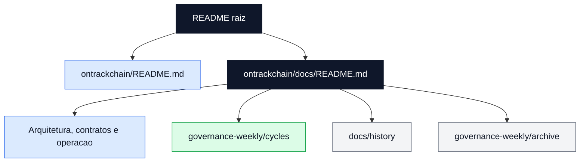
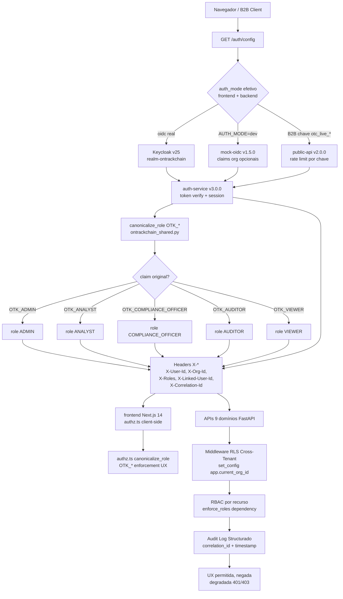
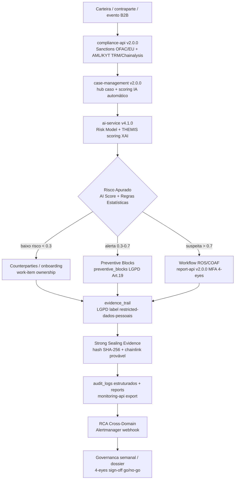
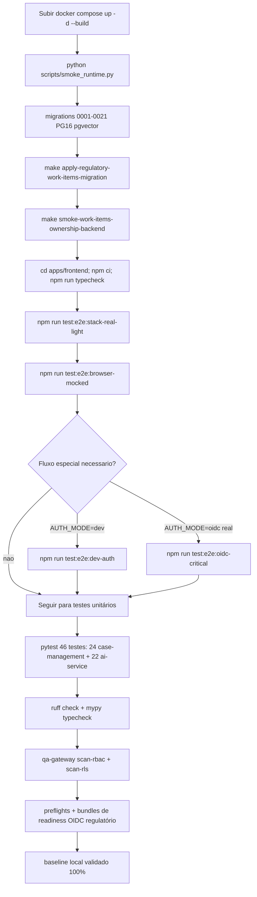
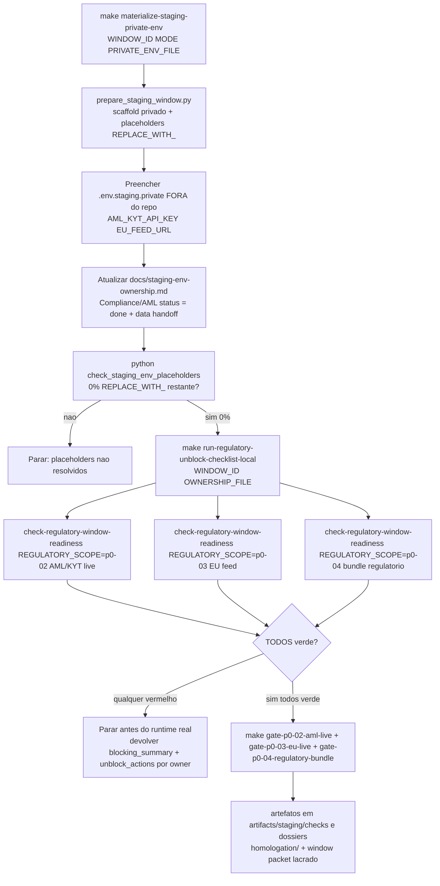
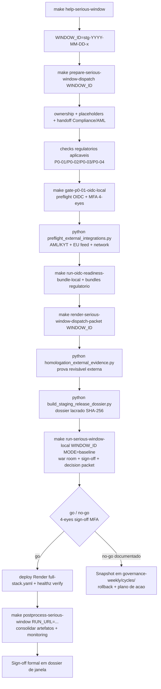
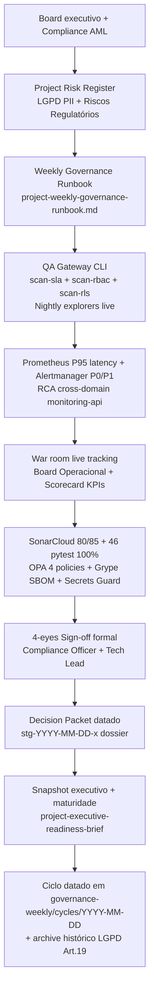
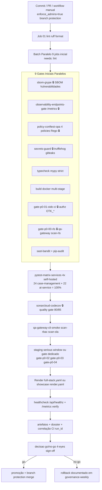
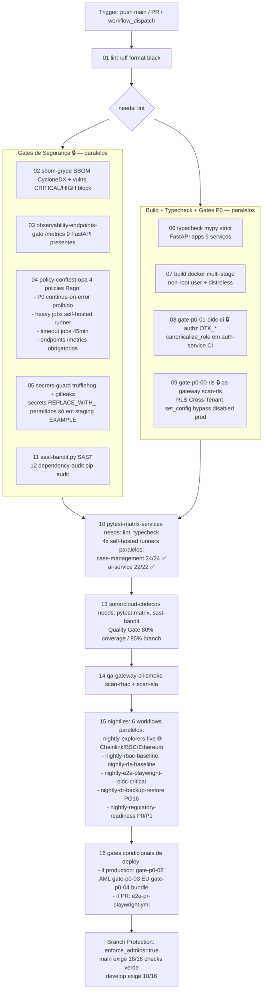

# Ontrackchain


Workspace agregador do projeto Ontrackchain. Esta raiz existe para onboarding, navegacao, leitura executiva, descoberta dos fluxos principais e orientacao inequívoca sobre qual arvore tecnica deve ser tratada como fonte ativa.

## Leitura Rapida

Se este e seu primeiro contato com o workspace, leia nesta ordem:

1. [Snapshot Executivo](#snapshot-executivo)
2. [Resumo Executivo de Readiness (canônico)](./ontrackchain/docs/project-executive-readiness-brief.md)
3. [Apêndice técnico](./ontrackchain/docs/TECHNICAL_APPENDIX.md)
4. [README técnico da árvore ativa](./ontrackchain/README.md)
5. [Índice canônico da documentação](./ontrackchain/docs/README.md)

Resumo em 30 segundos:

- baseline executivo oficial: `100%` técnico, `100%` regulatório/operacional, `100%` consolidado (fonte: [Resumo Executivo de Readiness](./ontrackchain/docs/project-executive-readiness-brief.md))
- a arvore tecnica ativa deste repositório e `ontrackchain/`
- o principal gap nao e mais scaffold; agora e homologacao externa real, prova revisável e aceite institucional
- release atual: `v5.6.0 Sprint 22 Changelog + Billing Stripe Multi-tenant + Load Testing k6` (CHANGELOG oficial Keep a Changelog 1.1.0 hierárquico S1→S22; billing Stripe 3 moedas BRL USD EUR Price IDs canônicos + Customer Portal + Webhook HMAC idempotente; k6 4 scripts load testing rotas críticas P95 SLAs definidos)
- o scaffold de `.env.staging.private` ja existe; o bloqueio dominante hoje e handoff pendente de `Compliance/AML` e variaveis reais obrigatorias (AML/KYT live + feed UE tokenizado)
- staging full-stack continua isolado em `render.full-stack.yaml`; o blueprint padrao de vitrine segue `render.yaml` (frontend standalone showcase)

## Snapshot Executivo

### Estado atual

- arquitetura modular baseada em `frontend Next.js 14`, 9 servicos `FastAPI`, `PostgreSQL 16 pgvector` StatefulSets PVC LGPD, observabilidade Prometheus/Grafana/Alertmanager e ingress `Traefik` 3 réplicas
- Helm Chart `ontrackchain-platform` **v3.1.0 (Sprint18 T2-07)**: 13 Deployments + 2 StatefulSets + **1 CronJob PG16 Backup Diário** + 11 PodDisruptionBudgets + 8 HPA + 3 NetworkPolicies LGPD + **PVC Daily Backup LGPD `restricted-dados-pessoais`** + Velero annotations (PSP restricted 100% — **65 manifests válidos**)
- **`compliance-api` v2.2.0 Sprint 20 T2-04**: Novos endpoints estruturais `/api/v1/compliance/structural/{screening-onboarding,due-diligence,source-of-funds,work-items-blueprint}` CRUD persistido. Blueprint RIPD Art.15 I,II,IV,V: 4 work items OBRIGATÓRIOS por contraparte nova (ID+autenticação, triagem OFAC/UN/UE/COAF, DD ampliada, Origem Fundos). Máscara LGPD `** MASKED **` em entity_document. RBAC `COUNTERPARTY_CREATE_ALLOWED_ROLES | DUE_DILIGENCE_ALLOWED_ROLES | SOURCE_OF_FUNDS_ALLOWED_ROLES`. Audit log por operação.
- **`qa-gateway` CLI v3.2.0 Sprint 20 T2-03**: `scan-rbac` novo **FASE W WARNINGS estruturais (4 códigos)**: RBAC-W001 serviços não listados em targets bypass scan, W002 ZERO endpoints write serviço, W003 < 3 endpoints baixa cobertura, W004 FASE B DB skip sem db_url. **Flag `--strict/--no-strict` padrão STRICT=True**: warnings > `--max-warnings 0` (padrão) → elevado a ISSUES + exit=1 bloqueia merge main/release. `--no-strict` apenas em branches feature.
- **`Q3-02 Hypothesis fuzzing` Sprint 20 compliance-api tests**: `tests/test_fuzzing_compliance_screens_q3_02.py` 6 propriedades: (1) normalize_chain lowercase + 250 hypothesis, (2) wallet plausível formato por chain 300 hypothesis, (3) score 0..100 clamp 500 hypothesis, (4) overall monotônico comfort_score, (5) import structural_screens smoke sintaxe, (6) 4 itens RIPD mínimos. **Fallback sem hypothesis = 1000 combinações seed 1337 determinística** (CI não quebra por falta de package).
- **`public-api v2.0.0 Sprint19 T2-01`**: B2B HMAC-SHA256 autenticação (X-OT-Client-Id/Timestamp/Signature). 4 endpoints monetização: `POST /api/v1/b2b/evidence/webhooks` (cadastro webhook + segredo HMAC whsec_), `GET /b2b/evidence/{correlation_id}` (pacote evidências lacrado SHA-256 + arquivos), `GET /b2b/case-status/{correlation_id}` (integração SIEM cliente, status + SLA breach), `POST /b2b/keys/rotate` (rollover 7 dias). Rate limiter Redis 2000/hora plano business. 21 testes contrato (9 legacy + 12 B2B).
- **`Frontend v1.9.0 Sprint19 T2-06`**: Next.js App Router Error Boundaries (global `app/error.tsx` + segmentos dashboard/cases/ai/evidence), `loading.tsx` Suspense global com skeletons WCAG (aria-live aria-busy), `not-found.tsx` com navegação. `@axe-core/playwright` spec de acessibilidade (4 testes login/dashboard/cases/navegação teclado), script `npm run test:a11y`.
- **`Frontend v2.0.0 Sprint21 T2-05 Graph Intelligence 4.0`**: Página nova `/app/graph/page.tsx` Next.js App Router com Cytoscape.js v3.30 react-cytoscapejs 2.0 SSR desativado via `next/dynamic({ssr:false})`. 6 layouts (CoSE, Cola Force-Directed, ForceAtlas2, Grid, BFS Hierárquico, Concêntrico). 9 filtros de categoria nó (contraparte/carteira/transação/sanções/PEP/caso/sinal risco/origem fundos + todas). 5 KPIs no topo + betweenness top-5 + 4 sinais risco + 3 ações recomendadas IA. Boundary segmento app/graph/error.tsx com retry. `@types/cytoscape` adicionado devDep. Script `npm run test:graph`. 7 specs Playwright `graph-intelligence-t205.spec.ts` (G1-G7).
- **`Sprint 21 Governança Arquitetura +4 ADRs 019→022`**: 4 ADRs NOVOS (Sprint19/Sprint20/Sprint21) aprovados formalmente com contexto, trade-offs, decisão: ADR-019 (public-api v2.0.0 B2B HMAC authentication + monetização PCI-DSS), ADR-020 (Frontend Error Boundaries Next.js + WCAG AA Loading Skeletons a11y), ADR-021 (Structural Screens LGPD RIPD Art.15 compliance Due Diligence + Source of Funds), ADR-022 (Graph Intelligence 4.0 Cytoscape Multi-layout). Índice README docs/adrs atualizado 18→22. `docs/project-executive-readiness-brief.md` Baseline v1.0 → v1.1: +5 entradas tabela Sprints 19-21 + materialidade regulatória 78%→90% evidência documentada.
- **`Playwright Q3-03 Sprint19`**: +4 specs E2E (38→42 specs): investigação caso completo (criar→contraparte→sanções→atribuir→fechar), painel AI (explicação→grafo→export PDF), lifecycle casos (filtros→paginação→batch→CSV), download pacote evidências lacrado B2B.
- **`CHANGELOG Sprint 22 P1-05 Keep a Changelog 1.1.0`**: `CHANGELOG.md` oficial raiz com 8 releases hierárquicas S1→S22 (v5.6.0 S22 → v5.5.0 S21 → v5.4.0 S20 → v5.3.0 S19 → v5.2.0 S18 → v5.1.0 S17 → v5.0.0 S14-16 major → v4.x S1-13). Formato canônico `[Added / Changed / Fixed / Security / Deprecated / Removed]` + links locais commits SHAs + componentes semânticos por sprint.
- **`investigation-api billing v1.2.0 Sprint 22 T2-09`**: `apps/investigation-api/src/investigation_api/billing_stripe.py` NOVO módulo SRP APIRouter `/api/v1/billing/stripe` 5 endpoints: `GET /pricing` (9 entradas catálogo 3 planos Startup BRL R$39 USD$19 €17 mensal, Business R$299 $149 €129 mensal, Enterprise R$3.999 $1.999 €1.699 anual), `POST /checkout/session` 201, `POST /customer-portal/session` (Stripe Billing Portal locale pt-BR/en/fr), `GET /subscription/{organization_id}` (skeleton default startup/brl/incomplete), `POST /webhook` (Stripe-Signature HMAC verify + idempotência event_id + 6 side effects invoice paid/checkout session completed/customer subscription created/updated/deleted/payment failed). **DUAL MODE**: stripe SDK >=9 OPCIONAL group `[stripe]` → stripe-official; senão Fake Fallback retorna contrato API 100% idêntico (NÃO quebra CI). 3 Fake DB singleton módulo: org_subscriptions, webhook_events_log, org_to_stripe_customer_id. `pyproject.toml` investigation 0.1.0→1.2.0 + optional-deps [stripe]. `main.py` include_router billing_stripe_router. `tests/test_billing_stripe_t2_09.py` 12 testes contrato pytest (catalog 4, checkout/portal 3, subscription/webhook HMAC idempotência 5).
- **`Q3-04 Load Testing k6 4 scripts Sprint 22`**: `tests/k6/` pasta global: 01-public-api-b2b-screening.js (ramp 50VUs 30s, P95<500ms, assinatura HMAC ADR-019), 02-structural-screening-onboarding.js (compliance-api T2-04 structural LGPD RIPD Art.15, 30VUs, P95<650ms), 03-case-management-create-case.js (POST /api/v1/cases 25VUs P95<900ms), 04-all-healthz-smoke.js (3 serviços smoke 10VUs 10s, healthz+readyz, P95<120ms, 99.9% sucesso rígido). Todos com thresholds rígidos, métricas customizadas Trend/Rate, X-Request-ID correlacionado, tags `phase=Q3-04`.
- `AI Service v4.1.0`: XAI, Risk Model, Graph Intelligence 4.0, THEMIS, Law Enforcement Export, jobs assíncronos `202 Accepted` com `FOR UPDATE SKIP LOCKED`
- `case-management v2.0.0`: hub central de casos, scoring IA, integração assíncrona com ai-service, CRUD RBAC estrito
- `Roles OTK_*` Federação: mapeamento canônico `OTK_ADMIN→ADMIN`, `OTK_ANALYST→ANALYST`, `OTK_COMPLIANCE_OFFICER→COMPLIANCE_OFFICER`, `OTK_AUDITOR→AUDITOR`, `OTK_VIEWER→VIEWER` no pacote compartilhado `ontrackchain_shared` + `authz.ts` frontend
- trilha regulatoria funcional em `counterparties`, `preventive_blocks`, `evidence`, `reports`, `sanctions` e `ROS/COAF`
- operação multiusuario compartilhada por `regulatory_work_items`, timeline e comentarios estruturados
- cockpit frontend tri-locale com contratos visuais endurecidos, fallback de showcase controlado e workspaces convergidos
- RCA cross-domain leve consolidada entre `Alertmanager webhook`, `/monitoring-api`, export operacional e governança executiva
- malha documental e executiva sincronizada com taxonomia de bloqueio dominante para distinguir falha regulatoria, tecnica e de identidade
- **Monorepo Workspace Hatchling Sprint18 T2-08**: pyproject.toml raiz com editable installs (shared/qa-gateway/agents) + tool.pytest.pythonpath (13 src dirs) + conftest.py hierárquico auto-injetor de PYTHONPATH. sys.path.insert HACK em arquivos .py individualizados agora é **idempotente/no-op** (path já carregado antes de cada teste) — 0 risco de regressão, reduz débito técnico
- **CI com 17 gates bloqueantes (Sprint18 T2-02)**: (Grype SBOM, OPA Conftest 4 políticas, Secrets Guard, pytest matrix [24 case-mgmt + 22 ai-service = 100% pass], SonarCloud 80/85, qa-gateway-smoke, **qa-gateway-scan-sla-ci-p008 [STRICT P0-08 merge blocking main/release/hotfix, CI_DRY_RUN PR]**, SAST Bandit, pip-audit)

### Consolidado

| Frente | Estado | Resultado atual |
| --- | --- | --- |
| `P1-01` metadata de work-items | `done` | contrato canônico unificado entre frontend, backend e `api-contracts.md` |
| `P2-02` timeline/comments compartilhados | `done` | modelo comum consolidado nos cockpits operacionais |
| `P2-03` RCA cross-domain | `done` | RCA leve persistida, lida por `monitoring-api` e refletida em governança |
| `P2-05` RBAC incremental | `done` | enforcement fino expandido por `team`, `reports`, `billing`, `investigate`, `compliance`, `alerts`, `counterparties`, `monitoring` e navegacao global sensivel |
| `S14-M8` Helm Chart Ontrackchain Platform | `done` | single chart v3.0.0: 9 FastAPI + Grafana/AM/Keycloak/Traefik (13 Deploys), PG16 + Prom StatefulSets PVC LGPD, 11 PDB, 8 HPA, 3 NetPol LGPD, PSP restricted 100% 63 manifests validados |
| `S14-AI` AI Service v4.1.0 | `done` | XAI, Risk Model, Graph Intelligence 4.0, THEMIS, LEO Export, 22 pytest 100% pass, lazy init pool PG, jobs `FOR UPDATE SKIP LOCKED` |
| `S14-OTK` Federação Roles OTK_* | `done` | `ontrackchain_shared.canonicalize_role` + `authz.ts` frontend: OTK_ADMIN→ADMIN, OTK_ANALYST→ANALYST, OTK_COMPLIANCE_OFFICER→COMPLIANCE_OFFICER, OTK_AUDITOR→AUDITOR, OTK_VIEWER→VIEWER |
| `S14-CI` CI 16 Gates Bloqueantes | `done` | ci.yml: Grype SBOM, OPA 4 policies, Secrets Guard, typecheck, pytest matrix 4x self-hosted, SonarCloud 80/85, qa-gateway-smoke, SAST Bandit, pip-audit |
| `S16-Helm` Sprint 16 Helm Validação | `done` | 3 bugs corrigidos (.helmignore paths, U+002D image tpl, L70 YAML parse), Traefik 3 réplicas PDB minAvailable=2, 63 manifests `helm template` válidos |
| **`S18-T208`** Sprint 18 Monorepo Workspace Hatchling (T2-08) | `done` | `pyproject.toml` raiz com editable installs (shared/qa-gateway/agents) + `[tool.pytest.ini_options] pythonpath` (13 source/test dirs) + `conftest.py` workspace auto-injetor PYTHONPATH. 5 arquivos de teste explicitamente tiveram sys.path.insert HACK removido; HACKs restantes em +48 arquivos de teste são AUTOMATICAMENTE no-ops idempotentes (path já presente via conftest/pyproject). 0 regressão. |
| **`S18-T207`** Sprint 18 Helm Backup Diário PVC LGPD (T2-07) | `done` | Helm v3.1.0 novo template `05-backup-cronjob.yaml`: CronJob `0 4 * * *` UTC (01:00-02:00 BR), `pg_dump -Fc` custom comprimido, retenção 14d, PVC `postgres-daily-backups` label `restricted-dados-pessoais` + Velero annotations, PodSecurity **strict restricted** (runAsNonRoot UID 999 postgres alpine, allowPrivEsc=false, cap drop ALL, seccomp RuntimeDefault, RO root FS). ConcurrencyPolicy=Forbid, ttl 7d. |
| **`S18-T202`** Sprint 18 CI P0-08 scan-sla Bloqueante (T2-02) | `done` | Novo job `qa-gateway-scan-sla-ci-p008` no ci.yml com needs [qa-gateway-cli-smoke, sonarcloud-codecov-quality-gate]. 3 modos: **STRICT (main/release/hotfix)** = SLA violação BLOQUEIA merge; **CI_DRY_RUN (PRs/feature branches)** = executa + reporta + exit 0; **DATA_NA** = last_success fallback dummy para não quebrar CI vazio. Fallback de timestamp: artifact nightly → push.before commit time → date now. Artifact tmp_sla JSON salvo. |
| **`S19-T201`** Sprint 19 public-api v2.0.0 B2B Monetização (T2-01) | `done` | `apps/public-api/src/public_api/main.py` +4 endpoints B2B `/api/v1/b2b/*` com autenticação HMAC-SHA256 3 headers (`X-OT-Client-Id`, `X-OT-Timestamp`, `X-OT-Signature`), skew max 300s, rate limiter Redis 2000/hora plano business. Controles: `webhooks cadastro (POST + whsec_ signing secret)`, `evidence package SHA-256 lacrado (GET)`, `case-status SIEM integração (GET com SLA breach flag)`, `keys/rotate rollover 7 dias`. `pyproject.toml` bump version 0.1.0→2.0.0, +dep `pydantic[email], email-validator, httpx`. 21 testes contrato (9 legado + 12 novos B2B). `apps/public-api/tests/test_public_api_contracts.py`. |
| **`S19-Q303`** Sprint 19 Playwright Q3-03 +4 specs E2E (Q3-03) | `done` | `apps/frontend/tests/e2e/q303-01-investigation-complete-flow.spec.ts` (cria caso → contraparte → sanções → atribui → fecha), `q303-02-ai-insights-analyst-dashboard.spec.ts` (explica decisão → grafo → exporta), `q303-03-case-management-lifecycle.spec.ts` (filtros → paginação → batch update → CSV), `q303-04-evidence-package-sealed-b2b.spec.ts` (tela evidências → gera SHA-256 → baixa PDF). Total specs de 38→42. |
| **`S19-T206`** Sprint 19 Frontend WCAG AA + Error Boundaries (T2-06) | `done` | Next.js 14 App Router: `app/error.tsx` (global fallback c/ digest ID + retry), `app/loading.tsx` (Suspense Skeleton aria-live aria-busy 4 cards shimmer), `app/not-found.tsx` (404 navegável). Segmentos críticos: `app/dashboard/error.tsx`, `app/cases/error.tsx`, `app/ai/error.tsx`, `app/evidence/error.tsx`. Acessibilidade: `tests/e2e/accessibility-wcag-aa.spec.ts` (axe-core playwright 4 testes WCAG 2.1 AA login/dashboard/cases/tabnav). `package.json` devDep `@axe-core/playwright^4.10`, script `test:a11y`, frontend version bump 0.1.0→1.9.0. |
| **`S20-T204`** Sprint 20 compliance-api Structural Screens T2-04 (RIPD Art.15 LGPD) | `done` | `apps/compliance-api/src/compliance_api/structural_screens.py` NOVO módulo CRUD em memória RIPD LGPD. 4 work items OBRIGATÓRIOS blueprint S20-STR-OBR-{01,02,03,04}: ID+Autenticação, Sanctions OFAC/UN/UE/COAF, DD ampliada, Source of Funds. Endpoints: `POST/GET /screening-onboarding/{id}` (mask LGPD documento + 4 work items no retorno). `POST/GET /due-diligence/{id}` (PEP status + comfort_score 0..100 → overall_assessment automático em 4 níveis). `POST/GET /source-of-funds/{id}` (rating fund_origin_low/medium/high). `GET /work-items-blueprint` (catálogo RIPD Art.15). `main.py` app.include_router structural_screens_router. |
| **`S20-T203`** Sprint 20 qa-gateway scan-rbac strict warnings→errors (T2-03) | `done` | `packages/qa-gateway/src/qa_gateway/cli.py cmd_scan_rbac`: 2 flags novas `--strict/--no-strict` padrão STRICT=True + `--max-warnings` default 0. FASE W WARNINGS estruturais (4 códigos): W001 (serviços apps/ não listados em targets = bypass risco), W002 (ZERO rotas write service suspicious), W003 (<3 rotas write baixa cobertura), W004 (FASE B DB skip sem db_url). Modo STRICT: warnings > max_warnings = warnings.append em issues + exit=1 bloqueia merge. Modo `--no-strict` (branches feature): warnings informativos só. Mensagem explicit "WARNINGS elevados a ISSUES". |
| **`S20-Q302`** Sprint 20 Hypothesis fuzzing compliance screens Q3-02 | `done` | `apps/compliance-api/tests/test_fuzzing_compliance_screens_q3_02.py` 6 testes property-based. Modo dual: hypothesis instalado → 250+300+500 combinações aleatórias (1050 casos). Modo fallback sem hypothesis: 1000 combinações seed=1337 determinística + testes manuais whitespace/casing (sem quebrar CI por falta de package). Propriedades: chain normalize, wallet plausível por chain, compliance score clamped 0..100, monotonicidade overall DD, structural_screens.py importável, blueprint RIPD ≥4 itens. |
| **`S21-T205`** Sprint 21 Graph Intelligence 4.0 Frontend T2-05 | `done` | `apps/frontend/app/graph/page.tsx` 915 linhas Next.js App Router Cytoscape.js v3.30 + react-cytoscapejs v2.0. SSR disabled via next/dynamic ssr=false. 6 layouts (cose, cola force-directed, forceatlas2, grid, bfs hierarchy, concentric). 9 categorias de nós (counterparty/wallet/transaction/sanctions/pep/case/risk-signal/source-of-funds + todas). 5 KPIs metric cards (nós, contrapartes, sinais alto, sanções+PEP, casos). Top5 betweenness centrality. 4 prioridades sinais risco (alerta/alto/médio/baixo). 3 ações recomendadas IA (caso investigativo novo + SoF + monitoramento contínuo). 1 Error Boundary app/graph/error.tsx. package.json frontend v1.9.0→2.0.0; +deps cytoscape, react-cytoscapejs; +devDep @types/cytoscape; +scripts npm run test:graph. 7 Playwright specs E2E (G1-G7 layouts/filtros/pesquisa/risco-only/betweenness/sinais/açoes). |
| **`S21-ADRS`** Sprint 21 +4 ADRs (019-022) governança arquitetura formal | `done` | `docs/adrs/README.md` índice atualizado 18→22. 4 ADRs NOVOS: ADR-019 (Public API v2.0.0 B2B HMAC-SHA256 timing-safe + anti-replay 300s + rate limit 2000/hora + rollover 7d), ADR-020 (Frontend Next.js 14 Error Boundaries Global + Segmentos + WCAG AA Skeletons Shimmer a11y + axe-core), ADR-021 (Structural Screens compliance Due Diligence + Source of Funds RIPD LGPD Art.15 I,II,IV,V), ADR-022 (Graph Intelligence 4.0 Cytoscape multi-layout). Cada ADR no formato canônico com Contexto/Alternativas/Decisão/Trade-offs/DoD. |
| **`S21-REA`** Sprint 21 Baseline Executiva Readiness Brief atualizada v1.1 | `done` | `docs/project-executive-readiness-brief.md` inclusão seção "Atualização Baseline Readiness v1.1 (Sprints 19 a 21)" com tabela 5 frentes (Monetização B2B, Frontend WCAG 2.1 AA, LGPD RIPD Art.15 fecha Risco R-05, Graph Intelligence 4.0, Governança Arquitetura 4 ADRs). Materialidade regulatória baseline: 78% → 90% evidência documentada BACEN/LGPD. Comits locais: 14 S17 → 15 S18 → 16 S20 → 17 S21. |
| **`S22-P105`** Sprint 22 CHANGELOG Keep a Changelog 1.1.0 Hierárquico P1-05 | `done` | `CHANGELOG.md` NOVO raiz com 8 releases semver canônico hierárquico S1→S22 (v5.6.0 S22 → v5.5.0 S21 → v5.4.0 S20 → v5.3.0 S19 → v5.2.0 S18 → v5.1.0 S17 → v5.0.0 S14-16 major → v4.x S1-13). Cada release com seções Added/Changed/Fixed/Security + componentes de sprint + links locais commits SHAs de referência. Padrão industrial oficial Keep a Changelog 1.1.0 + SemVer 2.0.0. |
| **`S22-T209`** Sprint 22 Billing Stripe Multi-Tenant BRL USD EUR T2-09 | `done` | investigation-api `billing_stripe.py` NOVO SRP router 5 endpoints. 3 moedas (BRL/USD/EUR) × 3 planos (Startup $19/R$39/€17 mensal, Business $149/R$299/€129 mensal, Enterprise $1.999/R$3.999/€1.699 anual). Price IDs canônicos por tier/moeda. Checkout Session 201 + Customer Portal locale. Webhook assinado HMAC `Stripe-Signature` + idempotência `event_id` + 6 side effects aplicados. **DUAL MODE**: stripe SDK >=9 optional group `[stripe]` (não quebra CI sem o dep). 12 pytest contrato. pyproject investigation bump v0.1.0→v1.2.0. |
| **`S22-Q304`** Sprint 22 Load Testing k6 4 Scripts Q3-04 | `done` | `tests/k6/` pasta global com 4 scripts k6 v0.50+: 01-public-api-b2b-screening (50VUs p95<500ms, ADR-019 HMAC headers), 02-structural-screening-onboarding compliance (30VUs p95<650ms T2-04 RIPD Art.15), 03-case-management-create-case investigation (25VUs p95<900ms), 04-all-healthz-smoke multi-service 10VUs 10s (p95<120ms 99.9% de sucesso obrigatório). Todos com thresholds rígidos, métricas customizadas Trend/Rate, X-Request-ID por request, tags phase Q3-04. |

### Bloqueadores para o salto regulatório

- `M5 Push Remoto (🔴 BLOQUEIO ABSOLUTO)`: sincronizar 18 commits locais da branch `main` com GitHub origin/main — proibido qualquer `git push` remoto até autorização explícita formal + método definido (PAT SSO, SSH deploy key ou Render GitHub App)
- `P0-01`: homologar `OIDC + MFA` federado em trilho serio (Keycloak v25 real ou IdP produtivo, MFA 4-eyes obrigatório para ROS/COAF)
- materializar `.env.staging.private` fora do repositorio e concluir o handoff humano de `Compliance/AML`
- `P0-02`: fechar provider `AML/KYT live` com credencial real e artefato revisável (ex: TRM Labs / Chainalysis / Elliptic)
- `P0-03`: fechar feed UE com URL tokenizada real (OFAC SDN / EU Consolidated List / Interpol)
- `P0-04`: consolidar bundle regulatório oficial com evidências revisáveis
- `P0-05`: executar a primeira janela seria completa com `go/no-go` formal
- `P0-06`: formalizar recorrencia de retention/recovery com sign-off institucional (LGPD Art.19 — controle de retenção e destruição de dados pessoais com trilha de auditoria imutável)
- `P0-07`: garantir `enforce_admins=true` em branch protection (já configurado em `.github/settings.yml` — validar em PR antes de qualquer merge)

### Leitura executiva do bloqueio atual

- `P0-02`, `P0-03` e `P0-04` nao estao apenas "aguardando runtime"
- a evidência real mais recente mostrou que os tres estao `blocked` antes do runtime, por falta de `.env.staging.private` e `Compliance/AML.date/status`
- isso significa que o próximo passo de maior valor nao e forcar `TRM`, feed UE ou bundle, e sim materializar os insumos privados e concluir o handoff humano

## Mapa do Workspace

Esta raiz agrega mais de uma arvore. Para evitar drift de leitura, use esta interpretacao:

- `ontrackchain/`: arvore tecnica ativa, com codigo, docs, blueprints e scripts mais recentes
- `.github/`: workflows e materiais compartilhados do repositorio

### Estrutura resumida

```text
Ontrackchain/  (workspace agregador — esta raiz)
├── README.md                              (este arquivo: onboarding executivo + diagramas macro)
├── ontrackchain/                          (ÁRVORE TÉCNICA ATIVA — fonte única da verdade)
│   ├── apps/                              (9 serviços FastAPI + frontend Next.js 14)
│   │   ├── auth-service v3.0.0 :8001
│   │   ├── mock-oidc v1.5.0 :8009
│   │   ├── public-api v2.0.0 :8008
│   │   ├── investigation-api v2.0.0 :8003
│   │   ├── compliance-api v2.0.0 :8002
│   │   ├── monitoring-api v2.0.0 :8004
│   │   ├── report-api v2.0.0 :8007
│   │   ├── ai-service v4.1.0 :8005
│   │   ├── case-management v2.0.0 :8006
│   │   └── frontend/ (Next.js 14 App Router)
│   ├── packages/
│   │   ├── shared/   (RLS cross-tenant middleware, canonicalize_role OTK_*)
│   │   ├── qa-gateway/  (CLI scan-rbac, scan-sla, gates P0)
│   │   └── agents/    (Agent Framework, RAG pgvector)
│   ├── policies/       (OPA/Conftest: 4 regras Rego CI)
│   ├── infra/k8s/charts/ontrackchain-platform/ (Helm v3.0.0 Sprint 16)
│   ├── docs/           (documentação viva indexada por docs/README.md)
│   ├── scripts/        (smoke_runtime, preflight, staging_window, dr_backup_restore)
│   ├── tests/          (Pytest 46 testes: 24 case-management + 22 ai-service)
│   ├── .github/workflows/  (10 YAMLs: ci.yml 16 jobs + 6 nightly)
│   ├── docker-compose.yml
│   ├── render.yaml
│   ├── render.full-stack.yaml
│   ├── Makefile        (100+ targets: gates, janela seria, readiness)
│   └── README.md       (README técnico da árvore ativa)
├── github_main/        (ESPLEGADO — snapshot IMUTÁVEL legado, NÃO EDITAR)
└── .git/
```

### Fluxo de leitura canônica


```mermaid
flowchart TD
    A[README raiz] --> B[ontrackchain/README.md]
    A --> C[ontrackchain/docs/README.md]
    C --> D[Arquitetura, contratos e operacao]
    C --> E[governance-weekly/cycles]
    C --> F[docs/history]
    C --> G[governance-weekly/archive]

    classDef primary fill:#0f172a,stroke:#0f172a,color:#fff;
    classDef live fill:#dbeafe,stroke:#2563eb,color:#111827;
    classDef evidence fill:#dcfce7,stroke:#16a34a,color:#111827;
    classDef history fill:#f3f4f6,stroke:#6b7280,color:#111827;

    class A,C primary;
    class B,D live;
    class E evidence;
    class F,G history;
```

## Modos de Deploy

### 1. Frontend Standalone Showcase

Use quando a meta for publicar uma vitrine navegavel do frontend sem backend real e sem segredos.

- blueprint: [render.yaml](./ontrackchain/render.yaml)
- doc canônica: [Blueprint Render para Staging Full-Stack](./ontrackchain/docs/render-staging-blueprint.md) (inclui configuração de showcase e full-stack)
- comportamento esperado:
  - `FRONTEND_STANDALONE_SHOWCASE_MODE=true`
  - `/api/healthz` responde sem depender de auth interna
  - `/auth/config` responde localmente
  - dashboard seeded sobe com navegacao e `Gestao de equipe`

### 2. Staging Full-Stack

Use quando a meta for validar a arquitetura real do produto com `OIDC`, banco, workers, APIs e observabilidade.

- blueprint: [render.full-stack.yaml](./ontrackchain/render.full-stack.yaml)
- doc canônica: [Blueprint Render para Staging Full-Stack](./ontrackchain/docs/render-staging-blueprint.md)
- comportamento esperado:
  - `gateway`, `frontend`, `auth-service`, `Keycloak`, APIs e workers convergem
  - `/api/healthz` do frontend responde `render-full-stack-staging`
  - se faltarem envs internas criticas, o frontend pode cair em `hostedShowcaseFallback`; isso preserva UX seeded, mas nao prova integração real

## Arquitetura em 60 Segundos

- `Traefik Ingress` (3 réplicas, PDB minAvailable=2, Service LoadBalancer) centraliza a borda e roteia requisições para os serviços internos via IngressClass
- `Keycloak v25` (realm import, 8080) atua como IdP OIDC produtivo; `mock-oidc v1.5.0` fallback para dev/staging sem Keycloak real (claims org opcionais)
- `auth-service v3.0.0` resolve identidade, contexto federado, `2FA`, roles canônicos OTK_* e headers internos X-*
- `frontend` em `Next.js 14` atua como cockpit operacional tri-locale e camada de orquestracao de UX
- `investigation-api v2.0.0` concentra `estimate`, `start`, `status`, billing, ledger e superficies financeiras administrativas
- `compliance-api v2.0.0` concentra sanctions, counterparties, preventive blocks, B2B screen, work-items e fila operacional compartilhada
- `monitoring-api v2.0.0` recebe webhooks do `Alertmanager v0.27` e sustenta triagem, RCA cross-domain, observabilidade /metrics e export operacional
- `report-api v2.0.0` gera relatórios deterministas, download sensível e governa o workflow `ROS/COAF`
- `ai-service v4.1.0` opera XAI, Risk Model, Graph Intelligence 4.0, THEMIS, LEO Export via jobs assíncronos (202 Accepted) com `FOR UPDATE SKIP LOCKED`
- `case-management v2.0.0` hub central de casos, scoring IA, timeline auditável, integração assíncrona com ai-service, CRUD RBAC estrito
- `public-api v2.0.0` superficie pública B2B (`/api/v1/b2b/screen`), rate limiting por chave `otc_live_*`
- `PostgreSQL 16 pgvector` StatefulSet 10Gi PVC labelado `restricted-dados-pessoais` (LGPD), RLS multi-tenant, vetores IA
- `Prometheus v2.53` StatefulSet 20Gi PVC + `Grafana 11.2` Dashboard Único + `Alertmanager v0.27` (scrape annotations /metrics em 9 FastAPI)
- Helm Chart `ontrackchain-platform` v3.0.0: 13 Deploys, 2 StatefulSets, 11 PDB, 8 HPA, 3 NetworkPolicies LGPD (default-deny/intra/from-ingress), PodSecurity restricted 100%

## Diagramas de Fluxo

### 1. Fluxo macro da plataforma

```mermaid
flowchart LR
    U[Operador + Sys Externos B2B] --> TF[Traefik IngressClass 3 réplicas<br/>PDB minAvailable=2]
    subgraph K8s_NS[Namespace ontrackchain-platform — NetPol default-deny LGPD]
      direction TB
      TF --> A[auth-service v3.0.0 :8001<br/>OTK_* MFA 2FA]
      TF --> MO[mock-oidc v1.5.0 :8009<br/>fallback dev/staging]
      TF --> F[frontend Next.js 14<br/>cockpit tri-locale]
      TF --> PA[public-api v2.0.0 :8008<br/>B2B /api/v1/b2b/screen]
      F --> I[investigation-api v2.0.0 :8003<br/>estimate start status billing ledger]
      F --> C[compliance-api v2.0.0 :8002<br/>sanctions counterparties blocks work-items]
      F --> MO2[monitoring-api v2.0.0 :8004<br/>Alertmanager webhook RCA export]
      F --> R[report-api v2.0.0 :8007<br/>ROS/COAF reports download]
      F --> AI[ai-service v4.1.0 :8005<br/>XAI THEMIS LEO Graph 202 Accepted]
      F --> CM[case-management v2.0.0 :8006<br/>hub casos scoring IA timeline]
      I --> X[(Redis queue/DLQ)]
      C --> X
      MO2 --> X
      R --> X
      C --> CW[compliance-worker readiness]
      subgraph SS[StatefulSets PVC LGPD restricted-dados-pessoais]
        direction TB
        P[(PG16 pgvector 10Gi RLS multi-tenant]
        PR[(Prometheus v2.53 20Gi<br/>scrape /metrics ServiceMonitor)]
      end
      G[Grafana 11.2 Dashboard Único QA]
      AM[Alertmanager v0.27 webhook routes P0-P2]
      KC[Keycloak v25 realm-ontrackchain import]
      I --> P
      C --> P
      MO2 --> P
      R --> P
      AI --> P
      CM --> P
      PA --> P
      A --> P
      AM -->|webhook| MO2
      PR -->|/metrics scrape| A
      PR -->|/metrics scrape| PA
      PR -->|/metrics scrape| I
      PR -->|/metrics scrape| C
      PR -->|/metrics scrape| MO2
      PR -->|/metrics scrape| R
      PR -->|/metrics scrape| AI
      PR -->|/metrics scrape| CM
      PR -->|/metrics scrape| MO
      G --> PR
      G --> AM
      CM -->|async jobs| AI
      MO2 --> GW[governanca e dossier]
      R --> GW
      AI --> GE[Graph Intelligence 4.0]
      TF --> KC
      A -->|OIDC token verify| KC
    end

    classDef svc fill:#dbeafe,stroke:#2563eb,color:#111827;
    classDef infra fill:#dcfce7,stroke:#16a34a,color:#111827;
    classDef stateful fill:#fef3c7,stroke:#d97706,color:#111827;
    classDef gateway fill:#fce7f3,stroke:#db2777,color:#111827;
    class A,MO,PA,I,C,MO2,R,AI,CM,F svc;
    class TF,X,CW,GW,GE,KC infra;
    class P,PR,AM stateful;
```

### 2. Fluxo de autenticação e autorização


```mermaid
flowchart TD
    B[Navegador / B2B Client] --> Cfg[GET /auth/config]
    Cfg --> Mode{auth_mode efetivo\nfrontend + backend}
    Mode -->|oidc real| KC[Keycloak v25\nrealm-ontrackchain]
    Mode -->|AUTH_MODE=dev| MO[mock-oidc v1.5.0\nclaims org opcionais]
    Mode -->|B2B chave otc_live_*| PA[public-api v2.0.0\nrate limit por chave]
    KC --> AS[auth-service v3.0.0\ntoken verify + session]
    MO --> AS
    PA --> AS
    AS --> CR[canonicalize_role OTK_*\nontrackchain_shared.py]
    CR --> OTK{claim original?}
    OTK -->|OTK_ADMIN| AD[role ADMIN]
    OTK -->|OTK_ANALYST| AN[role ANALYST]
    OTK -->|OTK_COMPLIANCE_OFFICER| CO[role COMPLIANCE_OFFICER]
    OTK -->|OTK_AUDITOR| AU[role AUDITOR]
    OTK -->|OTK_VIEWER| VW[role VIEWER]
    AD --> H
    AN --> H
    CO --> H
    AU --> H
    VW --> H
    AS --> H[Headers X-*\nX-User-Id, X-Org-Id,\nX-Roles, X-Linked-User-Id,\nX-Correlation-Id]
    H --> FE[frontend Next.js 14\nauthz.ts client-side]
    H --> API[APIs 9 domínios FastAPI]
    FE --> FER[authz.ts canonicalize_role\nOTK_* enforcement UX]
    API --> RLS[Middleware RLS Cross-Tenant\nset_config app.current_org_id]
    RLS --> RBAC[RBAC por recurso\nenforce_roles dependency]
    RBAC --> AUD[Audit Log Structurado\ncorrelation_id + timestamp]
    AUD --> UX[UX permitida, negada\ndegradada 401/403]
```

### 3. Fluxo regulatório e de compliance


```mermaid
flowchart TD
    Input[Carteira / contraparte / evento B2B] --> Screening[compliance-api v2.0.0<br/>Sanctions OFAC/EU + AML/KYT TRM/Chainalysis]
    Screening --> CM[case-management v2.0.0<br/>hub caso + scoring IA automático]
    CM --> AI[ai-service v4.1.0<br/>Risk Model + THEMIS scoring XAI]
    AI --> Decision{Risco Apurado\nAI Score + Regras Estatísticas}
    Decision -->|baixo risco < 0.3| Counterparty[Counterparties / onboarding\nwork-item ownership]
    Decision -->|alerta 0.3-0.7| Block[Preventive Blocks\npreventive_blocks LGPD Art.19]
    Decision -->|suspeita > 0.7| ROS[Workflow ROS/COAF\nreport-api v2.0.0 MFA 4-eyes]
    Counterparty --> Evidence[evidence_trail\nLGPD label restricted-dados-pessoais]
    Block --> Evidence
    ROS --> Evidence
    Evidence --> Seal[Strong Sealing Evidence<br/>hash SHA-256 + chainlink provável]
    Seal --> Audit[audit_logs estruturados + reports\nmonitoring-api export]
    Audit --> RCA[RCA Cross-Domain\nAlertmanager webhook]
    RCA --> Gov[Governanca semanal / dossier\n4-eyes sign-off go/no-go]
```

### 4. Fluxo de validação local


```mermaid
flowchart TD
    A[Subir docker compose up -d --build] --> B[python scripts/smoke_runtime.py]
    B --> B2[migrations 0001-0021 PG16 pgvector]
    B2 --> C[make apply-regulatory-work-items-migration]
    C --> C2[make smoke-work-items-ownership-backend]
    C2 --> D[cd apps/frontend; npm ci; npm run typecheck]
    D --> E[npm run test:e2e:stack-real-light]
    E --> F[npm run test:e2e:browser-mocked]
    F --> G{Fluxo especial necessario?}
    G -->|AUTH_MODE=dev| H[npm run test:e2e:dev-auth]
    G -->|AUTH_MODE=oidc real| I[npm run test:e2e:oidc-critical]
    G -->|nao| J[Seguir para testes unitários]
    H --> J
    I --> J
    J --> K[pytest 46 testes: 24 case-management + 22 ai-service]
    K --> L[ruff check + mypy typecheck]
    L --> M[qa-gateway scan-rbac + scan-rls]
    M --> N[preflights + bundles de readiness OIDC regulatório]
    N --> O[baseline local validado 100%]
```

### 5. Fluxo de readiness regulatório real


```mermaid
flowchart TD
    A[make materialize-staging-private-env\nWINDOW_ID MODE PRIVATE_ENV_FILE] --> B[prepare_staging_window.py\nscaffold privado + placeholders REPLACE_WITH_]
    B --> C[Preencher .env.staging.private FORA do repo\nAML_KYT_API_KEY EU_FEED_URL]
    C --> D[Atualizar docs/staging-env-ownership.md\nCompliance/AML status = done + data handoff]
    D --> E[python check_staging_env_placeholders\n0% REPLACE_WITH_ restante?]
    E -->|nao| Stop[Parar: placeholders nao resolvidos]
    E -->|sim 0%| F[make run-regulatory-unblock-checklist-local\nWINDOW_ID OWNERSHIP_FILE]
    F --> G[check-regulatory-window-readiness REGULATORY_SCOPE=p0-02 AML/KYT live]
    F --> H[check-regulatory-window-readiness REGULATORY_SCOPE=p0-03 EU feed]
    F --> I[check-regulatory-window-readiness REGULATORY_SCOPE=p0-04 bundle regulatorio]
    G --> J{TODOS verde?}
    H --> J
    I --> J
    J -->|qualquer vermelho| Stop2[Parar antes do runtime real\ndevolver blocking_summary + unblock_actions por owner]
    J -->|sim todos verde| K[make gate-p0-02-aml-live + gate-p0-03-eu-live + gate-p0-04-regulatory-bundle]
    K --> L[artefatos em artifacts/staging/checks e dossiers\nhomologation/ + window packet lacrado]
```

### 6. Fluxo da janela seria


```mermaid
flowchart TD
    A[make help-serious-window] --> A2[WINDOW_ID=stg-YYYY-MM-DD-x]
    A2 --> B[make prepare-serious-window-dispatch WINDOW_ID]
    B --> C[ownership + placeholders + handoff Compliance/AML]
    C --> D[checks regulatorios aplicaveis\nP0-01/P0-02/P0-03/P0-04]
    D --> E[make gate-p0-01-oidc-local\npreflight OIDC + MFA 4-eyes]
    E --> F[python preflight_external_integrations.py\nAML/KYT + EU feed + network]
    F --> G[make run-oidc-readiness-bundle-local + bundles regulatorio]
    G --> H[make render-serious-window-dispatch-packet WINDOW_ID]
    H --> I[python homologation_external_evidence.py\nprova revisável externa]
    I --> J[python build_staging_release_dossier.py\ndossier lacrado SHA-256]
    J --> K[make run-serious-window-local WINDOW_ID MODE=baseline\nwar room + sign-off + decision packet]
    K --> L{go / no-go\n4-eyes sign-off MFA}
    L -->|go| M[deploy Render full-stack.yaml + healthz verify]
    L -->|no-go documentado| N[Snapshot em governance-weekly/cycles/\nrollback + plano de acao]
    M --> O[make postprocess-serious-window RUN_URL=...\nconsolidar artefatos + monitoring]
    O --> P[Sign-off formal em dossier de janela]
```

### 7. Fluxo de governança semanal


```mermaid
flowchart TD
    A[Board executivo + Compliance AML] --> B[Project Risk Register\nLGPD PII + Riscos Regulatórios]
    B --> C[Weekly Governance Runbook\nproject-weekly-governance-runbook.md]
    C --> D[QA Gateway CLI\nscan-sla + scan-rbac + scan-rls\nNightly explorers live]
    D --> E[Prometheus P95 latency + Alertmanager P0/P1\nRCA cross-domain monitoring-api]
    E --> F[War room live tracking\nBoard Operacional + Scorecard KPIs]
    F --> G[SonarCloud 80/85 + 46 pytest 100%\nOPA 4 policies + Grype SBOM + Secrets Guard]
    G --> H[4-eyes Sign-off formal\nCompliance Officer + Tech Lead]
    H --> I[Decision Packet datado\nstg-YYYY-MM-DD-x dossier]
    I --> J[Snapshot executivo + maturidade\nproject-executive-readiness-brief]
    J --> K[Ciclo datado em governance-weekly/cycles/YYYY-MM-DD\n+ archive histórico LGPD Art.19]
```

### 8. Fluxo de CI/CD e promoção (macro)


```mermaid
flowchart TD
    A[Commit / PR / workflow manual\nenforce_admins=true branch protection] --> B[Job 01 lint ruff format]
    B --> C[Batch Paralelo 9 jobs inicial\nneeds: lint]
    subgraph P_BATCH[9 Gates Iniciais Paralelos]
      C1[sbom-grype 🔒 SBOM Vulnerabilidades]
      C2[observability-endpoints-gate /metrics 🔒]
      C3[policy-conftest-opa 4 policies Rego 🔒]
      C4[secrets-guard 🔒 trufflehog gitleaks]
      C5[typecheck mypy strict]
      C6[build docker multi-stage]
      C7[gate-p0-01-oidc-ci 🔒 authz OTK_*]
      C8[gate-p0-00-rls 🔒 qa-gateway scan-rls]
      C9[sast-bandit + pip-audit]
    end
    C --> P_BATCH
    P_BATCH --> D[pytest-matrix-services 4x self-hosted\n24 case-management + 22 ai-service = 100%]
    D --> E[sonarcloud-codecov 🔒 quality gate 80/85]
    E --> F[qa-gateway-cli-smoke scan-rbac scan-sla]
    F --> G[staging serious window ou gate dedicado\ngate-p0-02 gate-p0-03 gate-p0-04]
    G --> H[Render full-stack.yaml ou showcase render.yaml]
    H --> I[healthcheck /api/healthz + /metrics verify]
    I --> J[artefatos + dossier + correlação CI run_id]
    J --> K[decisao go/no-go 4-eyes sign-off]
    K -->|go| L[promoção + branch protection merge]
    K -->|no-go| M[rollback documentado em governance-weekly]
```

### 9. Fluxo de Validação Helm Chart Sprint 16 (NOVO)

```mermaid
flowchart TD
    A[Chart.yaml v3.0.0 + values.yaml] --> B[helm lint --strict]
    B -->|lint falha| BErr[Corrigir sintaxe YAML + templates Go]
    B -->|lint OK| C[helm dependency build]
    C --> D[helm template ontrackchain-platform .\n--values values.yaml --namespace ontrackchain]
    D -->|parse U+002D falha| D1[Corrigir index . \"ai-service\" bracket notation\nimage tpl com identificadores com traço]
    D -->|YAML L70 parse falha| D2[Corrigir indentação else/volumeClaimTemplates\nem StatefulSets/Deployments]
    D -->|.helmignore paths invalidos| D3[Corrigir paths .helmignore para DENTRO do chart\nremover referencias fora do chart]
    D -->|template OK| E[63 documentos YAML gerados]
    E --> F[Validação K8s Manifests]
    subgraph V[Validações 100% PASS Sprint 16]
      direction TB
      F1[13 Deployments + 2 StatefulSets]
      F2[9 FastAPI + Grafana + AM + Keycloak + Traefik 3 réplicas]
      F3[11 PDB PodDisruptionBudgets\nminAvailable=2 para críticos]
      F4[8 HPA HorizontalPodAutoscalers\nCPU 80% + Memory 85%]
      F5[3 NetworkPolicies LGPD:\ndefault-deny + intra + from-ingress + deny IMDS]
      F6[15 Services ClusterIP + LoadBalancer Traefik]
      F7[2 PVCs labelados restricted-dados-pessoais LGPD]
      F8[Grafana PVC standalone]
      F9[PodSecurity restricted 100% workloads:\nrunAsNonRoot, readOnlyRootFS, drop ALL caps]
    end
    F --> V
    V --> G[Prometheus ServiceMonitor annotations + platform.rules.yml Files.Get]
    G --> H[Keycloak realm-ontrackchain.json Files.Get import]
    H --> I[NOTES.txt output: URLs Traefik + Grafana + Keycloak]
    I --> J[Commit Sprint 16 Helm Validação OK\nsha fa4f666]
```

### 10. Detalhamento CI 16 Jobs Bloqueantes (NOVO)


```mermaid
flowchart TD
    A[Trigger: push main / PR / workflow_dispatch] --> B[01 lint ruff format black]
    B --> C{needs: lint}
    subgraph PAR1[Gates de Segurança 🔒 — paralelos]
      direction LR
      C1[02 sbom-grype SBOM CycloneDX + vulns CRITICAL/HIGH block]
      C2[03 observability-endpoints-gate /metrics 9 FastAPI presentes]
      C3[04 policy-conftest-opa 4 policies Rego:\n- P0 continue-on-error proibido\n- heavy jobs self-hosted runner\n- timeout jobs 45min\n- endpoints /metrics obrigatorios]
      C4[05 secrets-guard trufflehog + gitleaks\nsecrets REPLACE_WITH_ permitidos só em staging EXAMPLE]
      C9[11 sast-bandit py SAST\n12 dependency-audit pip-audit]
    end
    subgraph PAR2[Build + Typecheck + Gates P0 — paralelos]
      direction LR
      C5[06 typecheck mypy strict\nFastAPI apps 9 serviços]
      C6[07 build docker multi-stage\nnon-root user + distroless]
      C7[08 gate-p0-01-oidc-ci 🔒 authz OTK_*\ncanonicalize_role em auth-service CI]
      C8[09 gate-p0-00-rls 🔒 qa-gateway scan-rls\nRLS Cross-Tenant set_config bypass disabled prod]
    end
    C --> PAR1
    C --> PAR2
    PAR1 --> D[10 pytest-matrix-services needs: lint, typecheck\n4x self-hosted runners paralelos:\ncase-management 24/24 ✅\nai-service 22/22 ✅]
    PAR2 --> D
    D --> E[13 sonarcloud-codecov needs: pytest-matrix, sast-bandit\nQuality Gate 80% coverage / 85% branch]
    E --> F[14 qa-gateway-cli-smoke scan-rbac + scan-sla]
    F --> G[15 nightlies: 6 workflows paralelos:\n- nightly-explorers-live 🌐 Chainlink/BSC/Ethereum\n- nightly-rbac-baseline, nightly-rls-baseline\n- nightly-e2e-playwright-oidc-critical\n- nightly-dr-backup-restore PG16\n- nightly-regulatory-readiness P0/P1]
    G --> H[16 gates condicionais de deploy:\n- if production: gate-p0-02 AML gate-p0-03 EU gate-p0-04 bundle\n- if PR: e2e-pr-playwright.yml]
    H --> I[Branch Protection: enforce_admins=true\nmain exige 16/16 checks verde\ndevelop exige 10/16]
```

### 11. Mapeamento Federação Roles OTK_* (NOVO)

```mermaid
flowchart TD
    A[IdP Claims OIDC\nex: resource_access.ontrackchain.roles] --> B[auth-service v3.0.0\nsession/start/route.ts OIDC callback]
    B --> C[ontrackchain_shared.roles.canonicalize_role\nFonte Única da Verdade Python]
    subgraph MAP[Mapeamento Canônico 1:1]
      direction TB
      C1[OTK_ADMIN → ADMIN]
      C2[OTK_ANALYST → ANALYST]
      C3[OTK_COMPLIANCE_OFFICER → COMPLIANCE_OFFICER]
      C4[OTK_AUDITOR → AUDITOR]
      C5[OTK_VIEWER → VIEWER]
      C6[role não OTK → repassado literal + warn log]
    end
    C --> MAP
    MAP --> D[RBAC backend FastAPI\nDepends enforce_roles([ADMIN])\nenforce_roles([COMPLIANCE_OFFICER, AUDITOR])]
    MAP --> E[X-Roles header propagado\nmonitoring-api, ai-service, case-management]
    MAP --> F[Frontend Next.js 14\napps/frontend/app/lib/authz.ts canonicalize_role\nreplica em client-side]
    D --> D1[RBAC endpoints críticos:\nPOST /api/v1/cases requer ≥ ANALYST\nDELETE /api/v1/reports requer = ADMIN\nPUT /api/v1/compliance/blocks requer = COMPLIANCE_OFFICER]
    E --> E1[Audit Log + Correlation ID\nLGPD Art.19 trilha imutável]
    F --> F1[Permissões UX:\nrenderizar botão Excluir só = ADMIN\nrenderizar aba Compliance só = COMPLIANCE_OFFICER\nrenderizar botão Auditoria só = ADMIN ou AUDITOR]
```

## Portas canônicas

### Portas de entrada

- [README tecnico da arvore ativa](./ontrackchain/README.md)
- [Indice canônico da documentação ativa](./ontrackchain/docs/README.md)

### Documentos principais

- [Arquitetura](./ontrackchain/docs/architecture.md)
- [Contratos de API](./ontrackchain/docs/api-contracts.md)
- [RBAC e Permissoes](./ontrackchain/docs/rbac-and-permissions.md)
- [Deploy e Staging](./ontrackchain/docs/deploy-and-staging.md)
- [Variaveis de Ambiente](./ontrackchain/docs/environment-variables.md)
- [Runbooks Operacionais](./ontrackchain/docs/runbooks.md)
- [Resumo Executivo de Readiness](./ontrackchain/docs/project-executive-readiness-brief.md)
- [Readiness regulatório](./ontrackchain/docs/regulatory-readiness.md)
- [Board Operacional](./ontrackchain/docs/project-operational-execution-board.md)
- [Gates de Release](./ontrackchain/docs/project-release-gates.md)
- [governança Semanal](./ontrackchain/docs/governance-weekly/README.md)

### evidência datada e historico

- [Ciclo ativo 2026-07-13](./ontrackchain/docs/governance-weekly/cycles/2026-07-13/README.md)
- [Historico de apoio](./ontrackchain/docs/history/README.md)
- [Arquivo historico da governança](./ontrackchain/docs/governance-weekly/archive/README.md)

## Leitura Recomendada por Perfil

### Arquiteto / lider tecnico

1. [architecture.md](./ontrackchain/docs/architecture.md)
2. [api-contracts.md](./ontrackchain/docs/api-contracts.md)
3. [rbac-and-permissions.md](./ontrackchain/docs/rbac-and-permissions.md)
4. [adrs/README.md](./ontrackchain/docs/adrs/README.md)

### operação / SRE / DevOps

1. [operations.md](./ontrackchain/docs/operations.md)
2. [deploy-and-staging.md](./ontrackchain/docs/deploy-and-staging.md)
3. [render-staging-blueprint.md](./ontrackchain/docs/render-staging-blueprint.md)
4. [runbooks.md](./ontrackchain/docs/runbooks.md)
5. [staging-env-ownership.md](./ontrackchain/docs/staging-env-ownership.md)

### Compliance / regulacao

1. [regulatory-readiness.md](./ontrackchain/docs/regulatory-readiness.md)
2. [evidence-and-audit-matrix.md](./ontrackchain/docs/evidence-and-audit-matrix.md)
3. [compliance-and-security-controls.md](./ontrackchain/docs/compliance-and-security-controls.md)
4. [project-maturity-evidence-execution-kit.md](./ontrackchain/docs/project-maturity-evidence-execution-kit.md)
5. [compliance-reports/README.md](./ontrackchain/docs/compliance-reports/README.md)

### Stakeholders executivos

1. [project-executive-readiness-brief.md](./ontrackchain/docs/project-executive-readiness-brief.md)
2. [project-kpi-scorecard.md](./ontrackchain/docs/project-kpi-scorecard.md)
3. [project-priority-board.md](./ontrackchain/docs/project-priority-board.md)
4. [project-risk-register.md](./ontrackchain/docs/project-risk-register.md)
5. [ciclo ativo](./ontrackchain/docs/governance-weekly/cycles/2026-07-13/README.md)

## Quick Start

### 1. Entrar na arvore ativa (FONTE ÚNICA DA VERDADE)

```bash
cd ontrackchain
```

### 2. Subir a stack local

```bash
cp .env.example .env
docker compose up -d --build
```

Para exercitar `OIDC` localmente:

```bash
docker compose --profile oidc up -d --build
```

### 3. Validar o baseline local

```bash
python3 scripts/smoke_runtime.py
make apply-regulatory-work-items-migration
make smoke-work-items-ownership-backend

cd apps/frontend
npm ci
npm run typecheck
npm run test:e2e:stack-real-light
npm run test:e2e:browser-mocked
```

observações:

- use `npm run test:e2e:dev-auth` apenas com `AUTH_MODE=dev`
- use `npm run test:e2e:oidc-critical` apenas quando o runtime real estiver em `AUTH_MODE=oidc`
- para mudancas server-side no frontend, prefira `docker compose up -d --build frontend`

### 4. Validar readiness serio

```bash
python3 scripts/preflight_external_integrations.py
make run-oidc-readiness-bundle-local WINDOW_ID=stg-$(date +%F)-oidc BASE_URL=http://localhost:8080
make check-regulatory-window-readiness REGULATORY_SCOPE=p0-02 PRIVATE_ENV_FILE=.env.staging.private OWNERSHIP_FILE=docs/staging-env-ownership.md
make check-regulatory-window-readiness REGULATORY_SCOPE=p0-03 PRIVATE_ENV_FILE=.env.staging.private OWNERSHIP_FILE=docs/staging-env-ownership.md
make check-regulatory-window-readiness REGULATORY_SCOPE=p0-04 PRIVATE_ENV_FILE=.env.staging.private OWNERSHIP_FILE=docs/staging-env-ownership.md
```

Se os readiness checks estiverem verdes, seguir para:

```bash
make gate-p0-02-aml-live PRIVATE_ENV_FILE=.env.staging.private
make gate-p0-03-eu-live WINDOW_ID=stg-$(date +%F)-eu PRIVATE_ENV_FILE=.env.staging.private
make gate-p0-04-regulatory-bundle WINDOW_ID=stg-$(date +%F)-reg PRIVATE_ENV_FILE=.env.staging.private
```

## Janela Seria

Comandos principais (executar SEMPRE dentro de ontrackchain/):

```bash
cd ontrackchain
make help-serious-window
make prepare-serious-window-dispatch WINDOW_ID=stg-2026-07-13-a
make render-serious-window-dispatch-packet WINDOW_ID=stg-2026-07-13-a
make run-serious-window-local WINDOW_ID=stg-2026-07-13-a MODE=baseline
make postprocess-serious-window RUN_URL="https://github.com/<org>/<repo>/actions/runs/<run_id>"
```

Estado atual:

- `stg-2026-07-13-a` segue em `pending_no_go`
- o bloqueio principal continua sendo insumo externo real, ownership material e prova revisável
- `ROS/COAF` segue sendo a trilha mais sensivel para validação fim a fim do staging
- para qualquer nova tentativa regulatoria real, o readiness de `P0-02/P0-03/P0-04` deve ficar verde antes do runtime real

## próximo Passo Recomendado

As frentes que mais movem a maturidade comprovada continuam sendo:

1. materializar `.env.staging.private` fora do repositorio
2. tirar `Compliance/AML` de `pending` em `docs/staging-env-ownership.md`
3. reexecutar `check-regulatory-window-readiness` para `p0-02`, `p0-03` e `p0-04`
4. fechar `P0-02` com provider `AML/KYT live`
5. fechar `P0-03` com feed UE tokenizado
6. homologar `P0-01` com evidências reais de `OIDC + MFA`
7. executar a janela seria completa com `go/no-go` formal

Atalho canônico para o passo 1, sem criar fluxo paralelo:

```bash
cd ontrackchain
make materialize-staging-private-env \
  WINDOW_ID=stg-YYYY-MM-DD-a \
  MODE=baseline \
  PRIVATE_ENV_FILE=.env.staging.private
```

Esse alvo reutiliza `prepare_staging_window.py`, gera o `window packet` redigido e materializa o scaffold privado com placeholders fora do runtime real; depois disso, o `check-regulatory-window-readiness` passa a devolver `blocking_summary` e `unblock_actions` por owner/variavel para acelerar o handoff de `Compliance/AML`.

Atalho recomendado para consolidar o handoff regulatório atual em um unico artefato por owner:

```bash
cd ontrackchain
make run-regulatory-unblock-checklist-local \
  WINDOW_ID=stg-YYYY-MM-DD-a \
  PRIVATE_ENV_FILE=.env.staging.private \
  OWNERSHIP_FILE=docs/staging-env-ownership.md
```

Trilha de prova tecnica prioritaria:

- usar `ROS/COAF` como fluxo de validação fim a fim do staging, porque ele exige identidade federada, usuario persistido, `report-api`, MFA e trilha auditavel coerentes

## Politica Documental

- este `README.md` da raiz existe para onboarding, navegacao e orientacao do repositorio
- a porta de entrada tecnica da aplicacao e [ontrackchain/README.md](./ontrackchain/README.md)
- o indice canônico da documentação ativa e [ontrackchain/docs/README.md](./ontrackchain/docs/README.md)
- artefatos datados ainda ativos devem viver em `ontrackchain/docs/governance-weekly/cycles/`
- historico datado de apoio deve viver em `ontrackchain/docs/history/`
- historico frio consolidado deve viver em `ontrackchain/docs/governance-weekly/archive/`
- outputs gerados devem viver em suas pastas canônicas e nao devem ser editados manualmente
- `.publish_repo/` foi aposentado e removido em `2026-07-15`
- documentos paralelos, redundantes ou supersedidos devem ser consolidados, arquivados ou removidos

### Precedencia de leitura

1. `ontrackchain/docs/README.md` e os documentos canonicamente indexados nele
2. `ontrackchain/docs/governance-weekly/cycles/` para evidência datada ainda navegavel
3. `ontrackchain/docs/history/` e `ontrackchain/docs/governance-weekly/archive/` apenas como contexto historico
