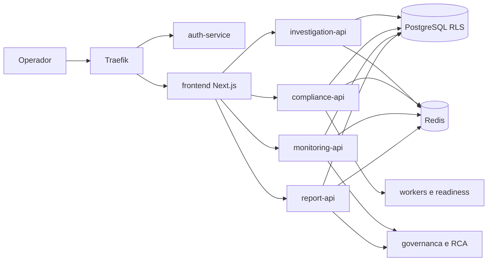
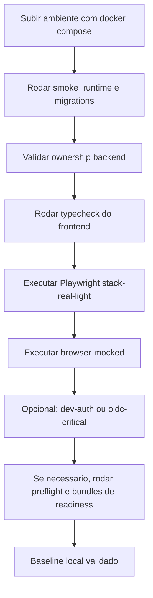
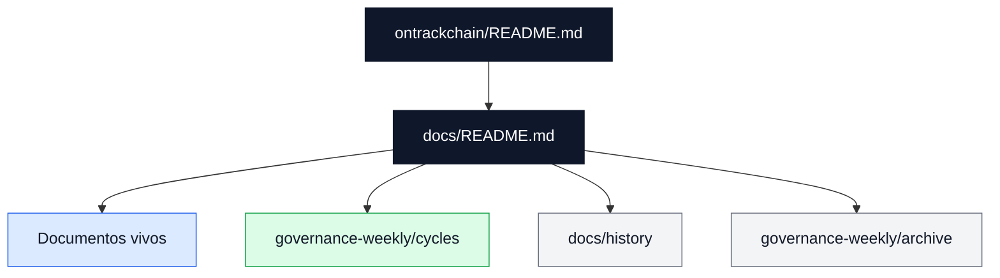

# Ontrackchain


Aplicacao principal do projeto: servicos `FastAPI` por dominio, frontend `Next.js 14`, infraestrutura local com `docker compose`, bundles de readiness, trilha regulatoria auditavel e documentacao canônica do produto.

## Leitura Tecnica Rapida

Se voce vai trabalhar no codigo ou operar o ambiente, leia nesta ordem:

1. [Snapshot Tecnico](#snapshot-tecnico)
2. [Servicos e Dominios](#servicos-e-dominios)
3. [Quick Start](#quick-start)
4. [Documentacao Canonica](#documentacao-canonica)

Resumo tecnico:

- baseline oficial: **100%** técnico, **100%** regulatório/operacional, **100%** consolidado
- a baseline viva está em `docs/README.md`, `docs/project-kpi-scorecard.md` e `docs/project-maturity-assessment.md`
- o blueprint padrão hospedado passou a ser `frontend standalone showcase` e serviços `FastAPI` em produção
- suporte a APIs B2B Institucionais (`/api/v1/b2b/screen`) e Monetização Stripe Billing SaaS (`StripeBillingManager`, `/api/stripe/webhook`)
- resiliência DR e Restore PostgreSQL automatizada e validada (`test_postgres_backup_restore.py`)

## Escopo Deste Diretorio

Aqui vivem:

- servicos de negocio e APIs
- frontend operacional
- infraestrutura local e observabilidade
- scripts de readiness, bundles e janela seria
- testes automatizados
- ADRs e documentacao canônica

Nota de workspace:

- alguns artefatos operacionais, especialmente workflows do GitHub Actions, vivem no repositorio agregador pai `/home/jistriane/Ontrackchain`; quando um documento desta arvore apontar para `../.github/workflows/`, trate isso como referencia intencional ao workspace agregado e nao como drift tecnico

## Snapshot Tecnico

### Estado atual

- `P1-01` consolidou metadata de `work-items` entre frontend, backend e contrato canonico
- `P2-02` consolidou `timeline/comments` compartilhados nos cockpits operacionais
- `P2-03` consolidou RCA cross-domain leve entre `alerts`, `/monitoring` e governanca
- `P2-05` segue em expansao incremental com enforcement fino em `team`, `reports`, `billing`, `investigate`, `compliance`, `alerts`, `counterparties` e navegacao global
- a taxonomia documental ja foi saneada para separar documento vivo, ciclo ativo, historico de apoio e historico arquivado

### Gargalos tecnicos atuais

- `P0-01`: homologar `OIDC + MFA` federado em trilho serio
- `P0-02`: fechar provider `AML/KYT live` com credencial real
- `P0-03`: fechar feed UE com URL tokenizada real
- `P0-04`: consolidar bundle regulatorio oficial com evidencias revisaveis
- `P0-05`: executar a primeira janela seria completa com `go/no-go` formal
- `P0-06`: formalizar recorrencia de retention/recovery com sign-off institucional

## Fluxo Tecnico da Plataforma

O diagrama abaixo resume como os componentes cooperam em runtime.



## Servicos e Dominios

| Componente | Papel principal |
| --- | --- |
| `auth-service` | autenticacao `dev` e `oidc`, `2FA`, RBAC e contexto de sessao |
| `public-api` | superficie publica e catalogos expostos pelo gateway |
| `investigation-api` | `estimate`, `start`, `status`, billing, ledger e superficies financeiras administrativas |
| `investigation-worker` | fila, retry/backoff e processamento assincrono |
| `compliance-api` | sanctions, counterparties, blocks, work-items e controles regulatorios |
| `compliance-worker` | sync de listas, readiness regulatorio e checks de provider |
| `monitoring-api` | webhooks do `Alertmanager`, triagem, RCA leve e export operacional |
| `report-api` | relatorios deterministas, download sensivel e fluxo `ROS/COAF` |
| `frontend` | cockpits operacionais, audit, monitoring, billing, evidence, reports e callbacks `OIDC` |

## Frontend Operacional

O frontend em `apps/frontend` segue estas linhas estruturais:

- tri-locale obrigatorio: `pt-BR`, `en`, `es`
- contratos compartilhados em `app/lib/`
- workspaces operacionais convergidos para o mesmo modelo de `timeline/comments`
- `monitoring` modularizado em hooks, loaders e paineis dedicados
- `billing` com snapshot reconciliavel alem do saldo consolidado
- UX preventiva e contratos visuais endurecidos para superficies sensiveis
- bootstrap de autenticacao centralizado em `/auth/config`, consumido pelo login para resolver `auth_mode`, `effective_auth_mode`, `oidc` e `mfa`
- fallback hospedado para `standalone showcase` quando o frontend de `staging` perde envs internas criticas de auth

Classes de suite Playwright institucionalizadas:

| Classe | Uso | Comando canonico |
| --- | --- | --- |
| `stack real leve` | smoke SSR local | `npm run test:e2e:stack-real-light` |
| `browser-mocked` | mocks por `page.route(...)` com frontend local | `npm run test:e2e:browser-mocked` |
| `ssr-mocked` | backend SSR mockado + frontend local | `npm run test:e2e:ssr-mocked` |
| `dev-auth` | regressao local com `AUTH_MODE=dev` | `npm run test:e2e:dev-auth` |
| `oidc-critical` | validacao seria OIDC e fluxo real | `npm run test:e2e:oidc-critical` |

### Fluxo de Validacao Local



## Quick Start

### 1. Subir o ambiente local

```bash
cp .env.example .env
docker compose up -d --build
```

Para exercitar `OIDC` localmente:

```bash
docker compose --profile oidc up -d --build
```

### 2. Validar runtime, banco e frontend

```bash
python3 scripts/smoke_runtime.py
make apply-regulatory-work-items-migration
make smoke-work-items-ownership-backend

cd apps/frontend
npm ci
npm run typecheck
npm run test:e2e:stack-real-light
npm run test:e2e:browser-mocked
```

Observacoes:

- use `npm run test:e2e:dev-auth` apenas com `AUTH_MODE=dev`
- use `npm run test:e2e:oidc-critical` apenas quando o runtime real estiver em `AUTH_MODE=oidc`
- para mudancas server-side no frontend, prefira `docker compose up -d --build frontend`

### 3. Validar readiness serio

```bash
python3 scripts/preflight_external_integrations.py
make check-compliance-provider-runtime \
  INTERNAL_BASE_URL=http://compliance-api:8002 \
  PUBLIC_BASE_URL=http://localhost:8080
make run-oidc-readiness-bundle-local WINDOW_ID=stg-$(date +%F)-oidc BASE_URL=http://localhost:8080
make gate-p0-04-regulatory-bundle \
  WINDOW_ID=stg-$(date +%F)-reg \
  PRIVATE_ENV_FILE=.env.staging.private \
  CHECKS_DIR=artifacts/staging/checks \
  DOSSIERS_DIR=artifacts/staging/dossiers \
  COMPLIANCE_INTERNAL_BASE_URL=http://compliance-api:8002 \
  COMPLIANCE_PUBLIC_BASE_URL=http://localhost:8080
```

## Janela Seria

Comandos principais:

```bash
make help-serious-window
make prepare-serious-window-dispatch WINDOW_ID=stg-2026-07-13-a
make render-serious-window-dispatch-packet WINDOW_ID=stg-2026-07-13-a
make run-serious-window-local WINDOW_ID=stg-2026-07-13-a MODE=baseline
make postprocess-serious-window RUN_URL="https://github.com/<org>/<repo>/actions/runs/<run_id>"
```

Estado atual da janela:

- `stg-2026-07-13-a` segue em `pending_no_go`
- o bloqueio principal continua sendo insumo externo real, ownership material e prova revisavel
- `ROS/COAF` segue sendo a trilha mais sensivel para validacao fim a fim do staging

## Trilhas de Validacao Prioritarias

Para o staging atual, a ordem de prova recomendada e:

1. validar `OIDC` no `gateway` com `auth-service` e `Keycloak`
2. validar `ROS/COAF` com `report-api` real e ator persistido
3. validar `monitoring` e a malha de observabilidade
4. validar `compliance` com providers reais ou fallback controlado

`ROS/COAF` e a trilha mais sensivel para homologacao tecnica porque depende de:

- `X-Linked-User-Id` resolvido a partir da identidade federada
- consistencia da migration `0016_team_users_directory.sql`
- segregacao de papeis para aprovacao e submissao manual
- MFA forte para a trilha regulatoria
- persistencia auditavel no banco real

## Documentacao Canonica

### Portas de entrada

- [Indice Canonico](./docs/README.md)
- [Arquitetura](./docs/architecture.md)
- [Contratos de API](./docs/api-contracts.md)
- [RBAC e Permissoes](./docs/rbac-and-permissions.md)

### Operacao e validacao

- [Operacao Local](./docs/operations.md)
- [Deploy e Staging](./docs/deploy-and-staging.md)
- [Validacao e Auditoria](./docs/validation-and-audit.md)
- [Runbook Semanal de Governanca](./docs/project-weekly-governance-runbook.md)

### Readiness executiva

- [Resumo Executivo de Readiness](./docs/project-executive-readiness-brief.md)
- [Scorecard Oficial](./docs/project-kpi-scorecard.md)
- [Avaliacao de Maturidade](./docs/project-maturity-assessment.md)
- [Board Operacional](./docs/project-operational-execution-board.md)

## Evidencia Datada e Historico

- [Ciclo ativo 2026-07-13](./docs/governance-weekly/cycles/2026-07-13/README.md)
- [Governanca Semanal](./docs/governance-weekly/README.md)
- [Historico de apoio](./docs/history/README.md)
- [Arquivo historico da governanca](./docs/governance-weekly/archive/README.md)

## Politica de Leitura Documental

- `docs/README.md` e os arquivos canonicamente indexados nele sao a fonte primaria
- `docs/governance-weekly/cycles/` guarda evidencias datadas ainda navegaveis por ciclo
- `docs/history/` guarda apoio historico fora da trilha viva
- `docs/governance-weekly/archive/` guarda historico frio consolidado de governanca
- o espelho legado `.publish_repo/` foi aposentado e removido em `2026-07-15`; a baseline, os contratos e o status oficial vivem apenas nesta arvore ativa

Use esta precedencia quando houver conflito:

1. `docs/README.md` e documentos canonicamente indexados
2. `docs/governance-weekly/cycles/` para prova datada por janela ou semana
3. `docs/history/` e `docs/governance-weekly/archive/` apenas como contexto historico

### Fluxo de Precedencia Documental



## Estrutura do Workspace

```text
ontrackchain/
├── apps/
│   ├── auth-service/
│   ├── public-api/
│   ├── investigation-api/
│   ├── compliance-api/
│   ├── monitoring-api/
│   ├── report-api/
│   └── frontend/
├── docs/
├── infra/
├── packages/
├── scripts/
├── tests/
├── docker-compose.yml
├── Makefile
└── .env.example
```

## Riscos Residuais

- integracoes externas serias ainda dependem de credenciais e URLs reais
- `due_diligence` e `source_of_funds` permanecem em rito manual por decisao de produto
- `legal_report`, `ROS/COAF` e `block lift` exigem MFA forte homologado
- retention/recovery e sign-off institucional ainda precisam de recorrencia formal

## Proximo Passo Recomendado

1. fechar `P0-02` com provider `AML/KYT live`
2. fechar `P0-03` com feed UE tokenizado
3. homologar `P0-01` com evidencias reais
4. executar uma janela seria completa com `go/no-go` formal
