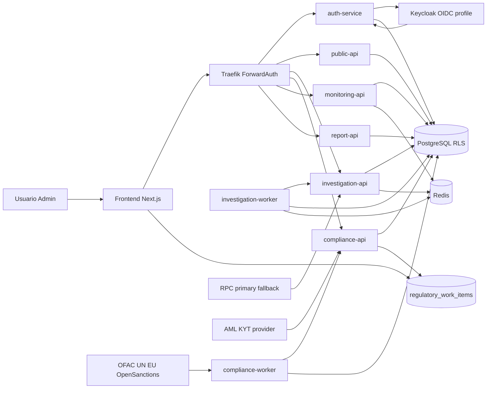

# Ontrackchain


Plataforma multi-tenant de investigacao e compliance on-chain com foco em trilha auditavel, isolamento por organizacao, screening local de sancoes e enforcement regulatorio em fluxos sensiveis.

## Visao Geral

Este diretorio contem a aplicacao principal do projeto:

- servicos FastAPI por dominio
- frontend `Next.js 14`
- `docker-compose` local
- migrations e infra observavel
- scripts de preflight, staging e homologacao
- testes, docs canonicas e ADRs

O estado atual do produto e de plataforma tecnicamente funcional, mas ainda com gaps relevantes de prontidao regulatoria forte e execucao recorrente de janela seria com evidencias reais.

## Estado Atual

- leituras oficiais do projeto:
  - `91%` de construcao tecnica (consolidado com paineis de historico em todos 7 cockpits)
  - `78%` de prontidao regulatoria/operacional
  - `87%` de construcao total consolidada
- **Sprint 6 concluida**: todos os paineis de historico de workspace entregues nos 7 cockpits regulatorios (`counterparties` DD/SoF, `sanctions` por endereco, `evidence` rastreadas, `reports` casos, `blocks`, `ros-coaf`, `alerts`)
- stack local executavel com:
  - `Traefik`
  - `FastAPI`
  - `Next.js`
  - `PostgreSQL`
  - `Redis`
  - `Prometheus`
  - `Alertmanager`
  - `Grafana`
  - `Keycloak` no profile `oidc`
- servicos ativos no monolito modular:
  - `auth-service`
  - `public-api`
  - `investigation-api`
  - `investigation-worker`
  - `compliance-api`
  - `compliance-worker`
  - `monitoring-api`
  - `report-api`
  - `frontend`
- trilha operacional e regulatoria implementada:
  - `audit_logs`
  - `evidence_trail` append-only com `SHA-256`
  - `regulatory_work_items` + `regulatory_work_events` + `regulatory_work_comments`
  - `preventive_blocks`
  - `counterparties` + `counterparty_history`
  - `sanctions_lists_meta` + `sanctions_hits_cache`
  - `ros_records`
- camada operacional compartilhada ja conectada ao frontend:
  - `sanctions` usa backend como fonte primaria da fila operacional, com fallback local + painel de historico por endereco
  - `alerts` rastreia incidentes em `work-items` e sincroniza o encerramento via `ack` + painel de alertas rastreados
  - `counterparties` com painel DD/SoF manual review + historico rastreado
  - `evidence` com painel de eventos rastreados + navegacao para timeline
  - `reports` com painel de casos rastreados com busca
  - `blocks` com painel de avaliacoes historicas
  - `ros-coaf` com painel de registros historicos
- janela seria consolidada com:
  - `prepare_staging_window.py`
  - `run_staging_window.py`
  - `run_regulatory_readiness_bundle.py`
  - war room
  - live tracking
  - sign-off
  - dossier anexavel

## Scorecard e Bloqueadores

| Lente | Estado Atual | Fonte Canonica |
| --- | ---: | --- |
| Construcao tecnica | `91%` | [`docs/project-kpi-scorecard.md`](./docs/project-kpi-scorecard.md) |
| Prontidao regulatoria/operacional | `78%` | [`docs/project-kpi-scorecard.md`](./docs/project-kpi-scorecard.md) |
| Total consolidado | `87%` | [`docs/project-kpi-scorecard.md`](./docs/project-kpi-scorecard.md) |

Bloqueadores e dependencias executivas:

| Iniciativa | Estado | Falta para fechar |
| --- | --- | --- |
| `P0-01` OIDC + MFA federado serio | `blocked` | homologacao formal recorrente e prova real em trilho serio |
| `P0-02` `AML/KYT live` | `ready` | credencial real, gate de runtime verde e evidencia da janela |
| `P0-03` feed UE `EU_CONSOLIDATED` | `ready` | URL tokenizada real e JSONs persistidos da janela |
| Janela `stg-2026-07-06-a` | `no-go` | owners, handoff, channels, bridges e secrets reais |

## Objetivo do MVP

Entregar uma base operacional para:

- investigacao on-chain multi-chain com foco inicial EVM
- compliance e relatorios auditaveis
- screening local de sancoes sem dependencia de API externa por request
- onboarding regulado de contrapartes
- bloqueio preventivo e fluxo `ROS/COAF`
- observabilidade e governanca de staging serio

## Principios Arquiteturais

- `multi-tenant by design`: isolamento por `organization_id` em banco, headers e servicos
- `audit + evidence`: fluxos operacionais relevantes deixam trilha em `audit_logs`; fluxos regulatorios deixam tambem trilha em `evidence_trail`
- `on-chain minimo`: o MVP trabalha majoritariamente off-chain, preservando ancora futura para evidencias finais
- `quote -> start`: operacoes cobraveis exigem cotacao previa e respeitam `plan lock`
- `seguranca > funcionalidade`: `legal_report`, `ROS/COAF` e `block lift` exigem auth forte e MFA homologado
- `degradacao honesta`: contratos publicos expõem `degraded` quando provider real nao esta operacional

## Arquitetura em 60 Segundos

- edge: `Traefik + ForwardAuth` concentram roteamento e enforcement inicial
- identidade: `auth-service` suporta `dev` e `oidc`; `Keycloak` entra como provider no profile `oidc`
- investigacao: `investigation-api` + `investigation-worker` fazem fila real, retry/backoff e metadados do provider RPC
- compliance: `compliance-api` expõe `kyc-wallet`, `sanctions-check`, `preventive blocks` e `counterparties`
- operacoes: `compliance-api` tambem expõe `work-items` multiusuario por modulo para fila compartilhada, timeline e comentarios
- sync regulatorio: `compliance-worker` sincroniza OFAC, UN, UE e deadlines de ROS
- reports: `report-api` gera relatorios deterministas e implementa o fluxo `ROS/COAF`
- monitoring: `monitoring-api` recebe webhooks do `Alertmanager` e alimenta o backlog global
- dados: `PostgreSQL` usa `RLS`; `Redis` suporta fila/cache; migrations regulam o core evolutivo e a fila compartilhada



## Modulos Regulatorios

| Modulo | Estado Atual | Fonte Canonica |
| --- | --- | --- |
| Screening de sancoes | `GET /api/v1/compliance/sanctions-check/{address}` usa cache local com `provider_status=live` | [`docs/api-contracts.md`](./docs/api-contracts.md) |
| Catalogo de compliance | `kyc_wallet` reflete readiness do provider; `due_diligence` e `source_of_funds` seguem `manual_review_required` | [`docs/api-contracts.md`](./docs/api-contracts.md) |
| Bloqueio preventivo | `POST /api/v1/compliance/blocks/evaluate` persiste decisao, hash e evidencia | [`docs/architecture.md`](./docs/architecture.md) |
| Lift de bloqueio | exige `X-MFA-Mode=external_provider` e `X-MFA-Provider-Homologated=true` | [`docs/compliance-and-security-controls.md`](./docs/compliance-and-security-controls.md) |
| Contrapartes | onboarding/listagem com KYC/KYB, PEP e historico regulado | [`docs/architecture.md`](./docs/architecture.md) |
| ROS/COAF | geracao, aprovacao/rejeicao e submissao manual com trilha auditada | [`docs/api-contracts.md`](./docs/api-contracts.md) |
| Fila operacional compartilhada | `POST/GET/PATCH /api/v1/operations/work-items*` para handoff, prioridade, prazo, comentarios e timeline | [`docs/api-contracts.md`](./docs/api-contracts.md) |
| Sync de listas | `compliance-worker` sincroniza OFAC, UN, UE e suporta override de `source_url` | [`docs/operations.md`](./docs/operations.md) |

## Fluxos Canonicos

### Investigacao + Billing

```text
estimate -> start -> PRE_HOLD -> queue -> RPC -> CONFIRMED ou REFUND
```

### Screening + Bloqueio + ROS

```text
compliance-worker -> sanctions_hits_cache
  -> GET sanctions-check
  -> preventive_blocks quando aplicavel
  -> ros_records quando o caso exige ROS
  -> evidence_trail + audit_logs
```

### Operacao Global

```text
Prometheus -> Alertmanager -> monitoring-api -> UI /monitoring -> export auditado
```

### Janela Seria

```text
ownership + placeholders -> preflight -> bundle regulatorio -> run workflow -> dossier -> sign-off
```

## Navegacao Rapida

- [`docs/README.md`](./docs/README.md): indice canonico da documentacao
- [`docs/architecture.md`](./docs/architecture.md): arquitetura real dos servicos, tabelas e regras criticas
- [`docs/api-contracts.md`](./docs/api-contracts.md): contratos HTTP e catalogos operacionais
- [`docs/operations.md`](./docs/operations.md): operacao local, migrations e troubleshooting
- [`docs/deploy-and-staging.md`](./docs/deploy-and-staging.md): fluxo tecnico `prepare -> validate -> preflight -> run`
- [`docs/project-release-gates.md`](./docs/project-release-gates.md): decisao executiva de `go/no-go`
- [`docs/validation-and-audit.md`](./docs/validation-and-audit.md): smoke, E2E, preflights e evidencias
- [`docs/project-kpi-scorecard.md`](./docs/project-kpi-scorecard.md): baseline oficial `91% / 78% / 87%`

## Quick Start

### 1. Subir a stack local

```bash
cp .env.example .env
docker compose up -d --build
```

Para exercitar OIDC localmente:

```bash
docker compose --profile oidc up -d --build
```

### 2. Validar runtime local

```bash
python scripts/smoke_runtime.py
make apply-regulatory-work-items-migration
make smoke-work-items-ownership-backend

cd apps/frontend
npm ci
npm run typecheck
npm run test:e2e:dev-auth
```

### 3. Validar trilhos serios e integracoes externas

```bash
python scripts/preflight_external_integrations.py
make check-compliance-provider-runtime \
  INTERNAL_BASE_URL=http://compliance-api:8002 \
  PUBLIC_BASE_URL=http://localhost:8080
make run-oidc-readiness-bundle-local WINDOW_ID=stg-$(date +%F)-oidc \
  BASE_URL=http://localhost:8080
export WINDOW_ID=stg-$(date +%F)-eu
make run-eu-sanctions-window-local WINDOW_ID=$WINDOW_ID
make run-regulatory-readiness-bundle-local WINDOW_ID=$WINDOW_ID \
  INTERNAL_BASE_URL=http://compliance-api:8002 \
  PUBLIC_BASE_URL=http://localhost:8080
python scripts/check_sanctions_sync_status.py
```

O alvo local do bundle regulatório gera dois artefatos padronizados para revisão humana:

- `artifacts/staging/checks/<janela>-regulatory-readiness-bundle.json`
- `artifacts/staging/dossiers/<janela>-regulatory-readiness-bundle.md`

O alvo local do bundle OIDC gera dois artefatos padronizados para `P0-01`:

- `artifacts/staging/checks/<janela>-oidc-readiness-bundle.json`
- `artifacts/staging/dossiers/<janela>-oidc-readiness-bundle.md`

### 4. Executar a janela seria local

```bash
make help-serious-window
make run-serious-window-local WINDOW_ID=stg-2026-07-06-a MODE=baseline
```

## Estrutura do Repositorio

```text
ontrackchain/
├── apps/
│   ├── auth-service/
│   ├── public-api/
│   ├── investigation-api/
│   ├── compliance-api/
│   ├── monitoring-api/
│   ├── report-api/
│   └── frontend/
├── docs/
├── infra/
│   ├── keycloak/
│   ├── observability/
│   ├── postgres/
│   └── traefik/
├── packages/
│   ├── agents/
│   └── shared/
├── scripts/
├── tests/
├── docker-compose.yml
├── Makefile
└── .env.example
```

## Riscos Residuais Conhecidos

- `AML/KYT` live ainda depende de credenciais reais e homologacao recorrente
- `due_diligence` e `source_of_funds` seguem intencionalmente em `manual_review_required`
- o feed `EU_CONSOLIDATED` ainda depende de URL tokenizada real para fechar prova operacional forte
- `legal_report`, `ROS/COAF` e `block lift` exigem MFA serio homologado para janela forte
- retention/recovery, owners e sign-off ainda precisam de aceite institucional recorrente
- a janela `stg-2026-07-06-a` continua `no-go` ate o preenchimento humano dos placeholders e handoffs

## Proximo Passo Recomendado

Focar nas quatro frentes que mais movem o scorecard e destravam a janela seria:

- fechar `P0-02` com provider `AML/KYT live` real
- fechar `P0-03` com feed UE tokenizado e bundle anexado
- avancar `P0-01` com MFA/OIDC federado serio homologado
- executar a primeira janela seria completa com owners online, artefatos reais e sign-off formal
