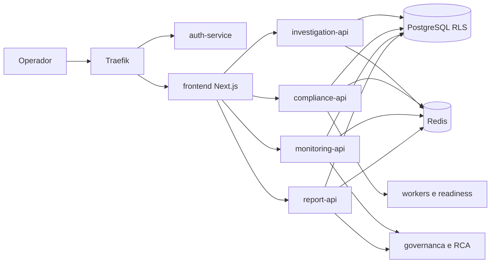
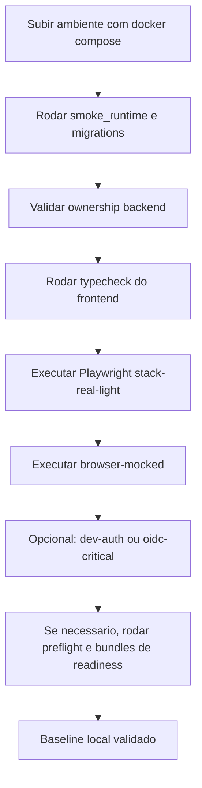
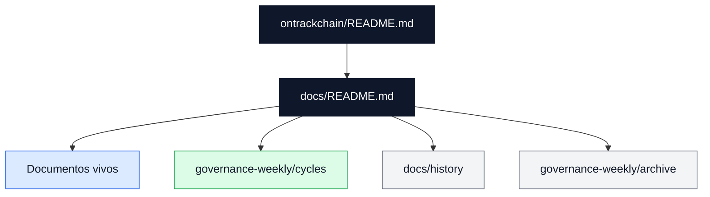

# Ontrackchain


Aplicacao principal do projeto: servicos `FastAPI` por dominio, frontend `Next.js 14`, infraestrutura local com `docker compose`, bundles de readiness, trilha regulatoria auditavel e documentacao canônica do produto.

## Escopo Deste Diretorio

Aqui vivem:

- servicos de negocio e APIs
- frontend operacional
- infraestrutura local e observabilidade
- scripts de readiness, bundles e janela seria
- testes automatizados
- ADRs e documentacao canônica

## Snapshot Tecnico Atual

- baseline oficial: `92%` tecnico, `79%` regulatorio/operacional, `88%` consolidado
- o assessment formal datado continua em `docs/assessments/PROJECT_STATUS_ASSESSMENT_2026_07_03.md`, mas a baseline viva esta em `docs/README.md`, `docs/project-kpi-scorecard.md` e `docs/project-maturity-assessment.md`
- a leitura documental do workspace agora separa explicitamente fonte viva, evidência de ciclo, historico de apoio e historico frio
- o blueprint publico atual no Render foi reduzido para `frontend-only`; a trilha de staging serio full-stack continua documentada em `docs/deploy-and-staging.md`
- frentes recentes ja consolidadas:
  - `P1-01` metadata de work-items padronizada entre frontend, backend e contrato
  - `P2-02` timeline/comments compartilhados nos 7 cockpits
  - `P2-03` RCA cross-domain leve indexada na trilha operacional
  - `P2-05` RBAC incremental em andamento com `REVIEWER` e `BILLING_ADMIN`

## Diagramas de Fluxo

### Fluxo Tecnico da Plataforma

O diagrama abaixo resume como os componentes do workspace cooperam em runtime e onde cada domínio principal se conecta.



## Servicos e Dominios

| Componente | Papel principal |
| --- | --- |
| `auth-service` | autenticacao `dev` e `oidc`, `2FA`, RBAC e contexto de sessao |
| `public-api` | superficie publica e catalogos expostos pelo gateway |
| `investigation-api` | `estimate`, `start`, `status`, billing, ledger e surfaces financeiras administrativas |
| `investigation-worker` | fila, retry/backoff e processamento assincrono |
| `compliance-api` | sanctions, counterparties, blocks, work-items e controles regulatorios |
| `compliance-worker` | sync de listas, readiness regulatorio e checks de provider |
| `monitoring-api` | webhooks do `Alertmanager`, triagem, RCA leve e export operacional |
| `report-api` | relatorios deterministas, download sensivel e fluxo `ROS/COAF` |
| `frontend` | cockpits operacionais, audit, monitoring, billing, evidence, reports e callbacks OIDC |

## Frontend Operacional

O frontend em `apps/frontend` segue estas linhas estruturais:

- tri-locale obrigatorio (`pt-BR`, `en`, `es`)
- contratos compartilhados em `app/lib/`
- workspaces operacionais convergidos para o mesmo modelo de `timeline/comments`
- `monitoring` modularizado em hooks, loaders e paineis dedicados
- `billing` agora com snapshot reconciliavel alem do saldo consolidado

Classes de suite Playwright institucionalizadas:

| Classe | Uso | Comando canonico |
| --- | --- | --- |
| `stack real leve` | smoke SSR local | `npm run test:e2e:stack-real-light` |
| `browser-mocked` | mocks por `page.route(...)` com frontend local | `npm run test:e2e:browser-mocked` |
| `ssr-mocked` | backend SSR mockado + frontend local | `npm run test:e2e:ssr-mocked` |
| `dev-auth` | regressao local com `AUTH_MODE=dev` | `npm run test:e2e:dev-auth` |
| `oidc-critical` | validacao seria OIDC e fluxo real | `npm run test:e2e:oidc-critical` |

### Fluxo de Validacao Local

O diagrama abaixo mostra a ordem prática de validação local antes de qualquer promoção para readiness séria ou governança.



## Quick Start

### 1. Subir o ambiente local

```bash
cp .env.example .env
docker compose up -d --build
```

Para exercitar `OIDC` localmente:

```bash
docker compose --profile oidc up -d --build
```

### 2. Validar runtime, banco e frontend

```bash
python3 scripts/smoke_runtime.py
make apply-regulatory-work-items-migration
make smoke-work-items-ownership-backend

cd apps/frontend
npm ci
npm run typecheck
npm run test:e2e:stack-real-light
npm run test:e2e:browser-mocked
```

Observacoes:

- use `npm run test:e2e:dev-auth` apenas com `AUTH_MODE=dev`
- use `npm run test:e2e:oidc-critical` apenas quando o runtime real estiver em `AUTH_MODE=oidc`
- para mudancas server-side no frontend, prefira `docker compose up -d --build frontend`

### 3. Validar readiness serio

```bash
python3 scripts/preflight_external_integrations.py
make check-compliance-provider-runtime \
  INTERNAL_BASE_URL=http://compliance-api:8002 \
  PUBLIC_BASE_URL=http://localhost:8080
make run-oidc-readiness-bundle-local WINDOW_ID=stg-$(date +%F)-oidc BASE_URL=http://localhost:8080
make run-regulatory-readiness-bundle-local \
  WINDOW_ID=stg-$(date +%F)-reg \
  INTERNAL_BASE_URL=http://compliance-api:8002 \
  PUBLIC_BASE_URL=http://localhost:8080
```

## Operacao de Janela Seria

Comandos principais:

```bash
make help-serious-window
make prepare-serious-window-dispatch WINDOW_ID=stg-2026-07-13-a
make render-serious-window-dispatch-packet WINDOW_ID=stg-2026-07-13-a
make run-serious-window-local WINDOW_ID=stg-2026-07-13-a MODE=baseline
make postprocess-serious-window RUN_URL="https://github.com/<org>/<repo>/actions/runs/<run_id>"
```

Situacao executiva atual:

- `P0-01`: `OIDC + MFA` federado serio segue bloqueado por homologacao externa
- `P0-02`: provider `AML/KYT live` pronto para fechar com credencial real
- `P0-03`: feed UE pronto para fechar com URL tokenizada real
- `stg-2026-07-13-a`: segue em `pending_no_go` ate confirmar insumos externos e ownership material

## Documentacao Canonica

- [Indice Canonico](./docs/README.md)
- [Arquitetura](./docs/architecture.md)
- [Contratos de API](./docs/api-contracts.md)
- [RBAC e Permissoes](./docs/rbac-and-permissions.md)
- [Cobertura do Frontend](./docs/frontend-coverage-matrix.md)
- [Operacao Local](./docs/operations.md)
- [Deploy e Staging](./docs/deploy-and-staging.md)
- [Validacao e Auditoria](./docs/validation-and-audit.md)
- [Resumo Executivo de Readiness](./docs/project-executive-readiness-brief.md)
- [Scorecard Oficial](./docs/project-kpi-scorecard.md)
- [Avaliacao de Maturidade](./docs/project-maturity-assessment.md)

## Evidencia Datada e Historico

- [Ciclo ativo 2026-07-13](./docs/governance-weekly/cycles/2026-07-13/README.md)
- [Governanca Semanal](./docs/governance-weekly/README.md)
- [Historico de apoio](./docs/history/README.md)
- [Arquivo historico da governanca](./docs/governance-weekly/archive/README.md)

## Politica de Leitura Documental

- `docs/README.md` e os arquivos canonicamente indexados nele sao a fonte primaria
- `docs/governance-weekly/cycles/` guarda evidencias datadas ainda navegaveis por ciclo
- `docs/history/` guarda apoio historico fora da trilha viva
- `docs/governance-weekly/archive/` guarda historico frio consolidado de governanca
- `.publish_repo/`, se existir fora deste diretorio, deve ser tratado apenas como espelho de publicacao e nunca como baseline, contrato ou status oficial

Use esta precedencia quando houver conflito:

1. `docs/README.md` e documentos canonicamente indexados
2. `docs/governance-weekly/cycles/` para prova datada por janela ou semana
3. `docs/history/` e `docs/governance-weekly/archive/` apenas como contexto historico

### Fluxo de Precedencia Documental

O diagrama abaixo ajuda a distinguir decisão corrente, prova datada e contexto histórico dentro deste diretório técnico.



## Estrutura

```text
ontrackchain/
├── apps/
│   ├── auth-service/
│   ├── public-api/
│   ├── investigation-api/
│   ├── compliance-api/
│   ├── monitoring-api/
│   ├── report-api/
│   └── frontend/
├── docs/
├── infra/
├── packages/
├── scripts/
├── tests/
├── docker-compose.yml
├── Makefile
└── .env.example
```

## Riscos Residuais

- integracoes externas serias ainda dependem de credenciais e URLs reais
- `due_diligence` e `source_of_funds` permanecem em rito manual por decisao de produto
- `legal_report`, `ROS/COAF` e `block lift` exigem MFA forte homologado
- retention/recovery e sign-off institucional ainda precisam de recorrencia formal

## Proximo Passo Recomendado

1. fechar `P0-02` com provider `AML/KYT live`
2. fechar `P0-03` com feed UE tokenizado
3. homologar `P0-01` com evidencias reais
4. executar uma janela seria completa com `go/no-go` formal
