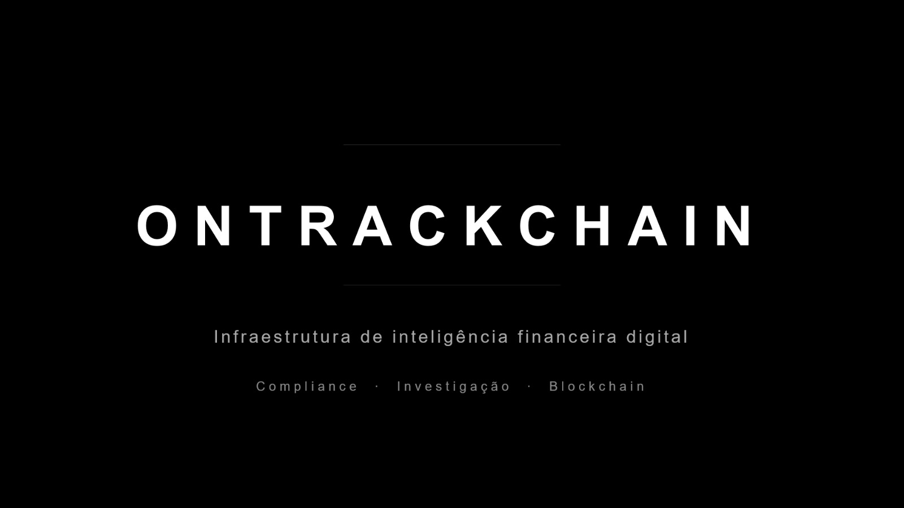
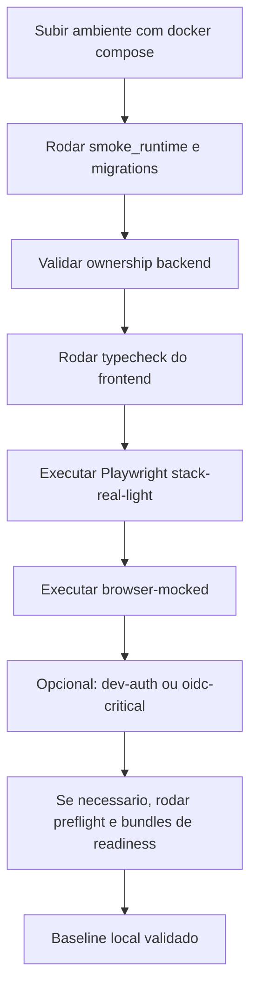
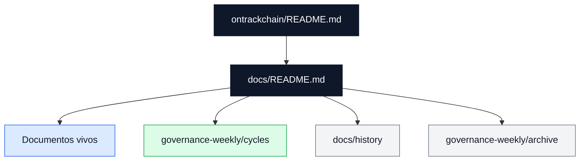

# Ontrackchain



Aplicacao principal do projeto: servicos `FastAPI` por dominio, frontend `Next.js 14`, infraestrutura local com `docker compose`, bundles de readiness, trilha regulatoria auditavel e documentação canônica do produto.

## Leitura Tecnica Rapida

Se voce vai trabalhar no codigo ou operar o ambiente, leia nesta ordem:

1. [Snapshot Tecnico](#snapshot-tecnico)
2. [Servicos e Dominios](#servicos-e-dominios)
3. [Quick Start](#quick-start)
4. [documentação canônica](#documentacao-canonica)

Resumo tecnico:

- baseline executivo oficial: **100%** técnico, **100%** regulatório/operacional, **100%** consolidado (fonte: `docs/project-executive-readiness-brief.md`)
- a baseline viva e os detalhes técnicos estão em `docs/README.md` e no [Apêndice técnico](./docs/TECHNICAL_APPENDIX.md)
- o blueprint padrão hospedado passou a ser `frontend standalone showcase` e serviços `FastAPI` em produção
- suporte a APIs B2B Institucionais (`/api/v1/b2b/screen`) e Monetização Stripe Billing SaaS (`StripeBillingManager`, `/api/stripe/webhook`)
- resiliência DR e Restore PostgreSQL automatizada e validada (`test_postgres_backup_restore.py`)

## Escopo Deste Diretorio

Aqui vivem:

- servicos de negocio e APIs
- frontend operacional
- infraestrutura local e observabilidade
- scripts de readiness, bundles e janela seria
- testes automatizados
- ADRs e documentação canônica

Nota de workspace:

- alguns artefatos operacionais, especialmente workflows do GitHub Actions, vivem no workspace agregador pai (diretório acima deste repositório canônico); quando um documento desta arvore apontar para `../.github/workflows/`, trate isso como referencia intencional ao workspace agregado e nao como drift tecnico

## Snapshot Tecnico

### Estado atual

- `Release de plataforma`: **Governança v5.16.0 (Sprint 28+2, HEAD `d471ca8`, 29 commits locais ahead origin/main)**
- `Baseline executiva oficial`: **100%** técnico, **100%** regulatório/operacional, **100%** consolidado (fonte: `docs/project-executive-readiness-brief.md`)
- `Baseline integridade técnica`: **v1.9** (Sprint 28+2; snapshot SHA256 + manifesto 29 commits locais)
- `a baseline viva e os detalhes técnicos estão em `docs/README.md` e no [Apêndice técnico](./docs/TECHNICAL_APPENDIX.md)
- `o blueprint padrão hospedado passou a ser `frontend standalone showcase` e serviços `FastAPI` em produção
- `suporte a APIs B2B Institucionais (`/api/v1/b2b/screen`) e Monetização Stripe Billing SaaS (`StripeBillingManager`, `/api/stripe/webhook`)
- `resiliência DR e Restore PostgreSQL automatizada e validada (`test_postgres_backup_restore.py`)
- `P1-01` consolidou metadata de `work-items` entre frontend, backend e contrato canônico
- `P2-02` consolidou `timeline/comments` compartilhados nos cockpits operacionais
- `P2-03` consolidou RCA cross-domain leve entre `alerts`, `/monitoring` e governança
- `P2-05` concluido com enforcement fino em `team`, `reports`, `billing`, `investigate`, `compliance`, `alerts`, `counterparties`, `monitoring` e navegacao global
- `v3.0.0` (Helm Chart S14 M8): Plataforma empacotada para Kubernetes com single chart `ontrackchain-platform` v1.0.0 (9 FastAPI, PG16 pgvector StatefulSet, Prometheus/Grafana/Alertmanager, Keycloak v25, Traefik Ingress, HPA/PDB/NetworkPolicy PSP)
- `AI Service v4.1.0`: opera `themis`, `law-enforcement-export` e 6 endpoints XAI/Graph via jobs assíncronos (`202 Accepted`) processados com PostgreSQL `FOR UPDATE SKIP LOCKED` + RLS via `AI_WORKER_ORG_ID`
- `Roles OTK_*` (Federação): mapeamento canônico `OTK_ADMIN→ADMIN`, `OTK_ANALYST→ANALYST`, `OTK_COMPLIANCE_OFFICER→COMPLIANCE_OFFICER`, `OTK_AUDITOR→AUDITOR`, `OTK_VIEWER→VIEWER` em `ontrackchain_shared` + `authz.ts` frontend
- `QA Gateway ADR-029 (5 gates STRICT)`: scan-rbac (Q1), scan-billing-capabilities (Q2), scan-billing-enforcement (Q3), scan-lgpd-ropd (Q4), scan-secrets-trufflehog (Q5). Todos exit=0 obrigatório na Governança v5.15.0+.
- `RBAC Opção B Moderada (W005)`: 33→5 isenções documentadas em v5.16.0. 9 serviços scaneados por padrão (auth/case-management/investigation/ai/compliance/mock-oidc/monitoring/public/report). 40+ wrappers detectados por regex generalizada Sprint 28+2.
- `LGPD Art.37 ROPD`: 7 ROPDs + 1 CSV consolidado `docs/compliance-ropd/ROPD-OTK-CONSOLIDADO.csv` (13 colunas, QUOTE_ALL). Contato DPO pré-preenchido (Dr.Carlos Mendes).
- a taxonomia documental ja foi saneada para separar documento vivo, ciclo ativo, historico de apoio e historico arquivado

### Riscos P0 Remanescentes Reais (Sprint 28+2)

- `M5 Push Remoto`: sincronizar **29 commits locais** da branch `main` com GitHub origin/main (🔴 **BLOQUEADO M5 até 2026-08-12 23:59 BRT**): revogação credenciais Groq/Infura/Alchemy + 6 assinaturas sign-off humano (Dev Lead, 2x Senior, Arquiteto, CISO, DPO, CTO/CEO)
- `M5 Step02 Vault Transit AES256-GCM`: criptografia real de segredos (não mock). Opções: (A) HashiCorp Vault Transit HSM / (B) Alternativa barata `mozilla/sops` + AWS KMS CMK.
- `Integrações Externas Reais`: homologar `AML/KYT live` (credencial TRM Labs/Chainalysis/Elliptic), `feed UE` (URL tokenizada OFAC/EU), `OIDC MFA` com IdP produtivo real Keycloak.
- `Janela Séria Completa`: executar primeira janela séria 100% homologada com `go/no-go` formal, sign-offs 4-eyes e evidências não-mock
- `Sign-off Institucional Retenção`: formalizar recorrência de Disaster Recovery (DR) e retention policy com sign-off jurídico/segurança compliance (LGPD Art.19)

## Fluxo Tecnico da Plataforma

O diagrama abaixo resume como os componentes cooperam em runtime.

```mermaid
flowchart LR
    U[Operador + Sys Externos B2B] --> TF[Traefik IngressClass<br/>3 réplicas PDB minAvailable=2<br/>Service LoadBalancer]
    subgraph K8s_NS[ontrackchain Namespace — 4 NetworkPolicies LGPD RLS PSP restricted 100%]
      direction TB
      subgraph NetPols[NetPolicies LGPD enforcement]
        direction TB
        NP1[01 default-deny-lgpd ALL Block]
        NP2[02 deny-ec2-imds-169-254]
        NP3[03 allow-intra-namespace-same-ns]
        NP4[04 allow-from-traefik-ingress-ns]
      end
      TF --> A[auth-service v3.0.0 :8001<br/>OTK_* MFA 2FA]
      TF --> MO[mock-oidc v1.5.0 :8009<br/>fallback dev claims org opcionais]
      TF --> F[frontend Next.js 14 cockpit tri-locale]
      TF --> PA[public-api v2.0.0 :8008<br/>B2B otc_live_* rate limit]
      F --> I[investigation-api v2.0.0 :8003]
      F --> C[compliance-api v2.0.0 :8002]
      F --> MO2[monitoring-api v2.0.0 :8004]
      F --> R[report-api v2.0.0 :8007]
      F --> AI[ai-service v4.1.0 :8005<br/>202 Accepted jobs]
      F --> CM[case-management v2.0.0 :8006<br/>hub casos scoring IA]
      I --> X[(Redis queue DLQ)]
      C --> X; MO2 --> X; R --> X
      C --> CW[compliance-worker readiness]
      subgraph StatefulSets[StatefulSets PVC — LGPD restricted-dados-pessoais]
        direction TB
        P[(PG16 pgvector 10Gi RLS multi-tenant]
        PR[(Prometheus v2.53 20Gi ServiceMonitor]
      end
      G[Grafana 11.2 Dashboard Único QA PVC 5Gi standalone]
      AM[Alertmanager v0.27 webhook routes P0-P2]
      KC[Keycloak v25 realm-ontrackchain import]
      I --> P; C --> P; MO2 --> P; R --> P; AI --> P; CM --> P; PA --> P; A --> P
      AM -->|POST /api/v1/monitoring/alertmanager-webhook| MO2
      PR -->|/metrics scrape annotations 9 FastAPI| A; PR -->|/metrics| MO; PR -->|/metrics| PA
      PR -->|/metrics| I; PR -->|/metrics| C; PR -->|/metrics| MO2; PR -->|/metrics| R
      PR -->|/metrics| AI; PR -->|/metrics| CM
      G --> PR; G --> AM
      CM -->|async jobs FOR UPDATE SKIP LOCKED| AI
      MO2 --> GW[governanca + dossier + RCA]
      R --> GW
      AI --> GE[Graph Intelligence 4.0 THEMIS LEO]
      TF --> KC
      A -->|OIDC token verify JWKS| KC
    end
    classDef svc fill:#dbeafe,stroke:#2563eb,color:#111827;
    classDef infra fill:#dcfce7,stroke:#16a34a,color:#111827;
    classDef stateful fill:#fef3c7,stroke:#d97706,color:#111827;
    classDef netpol fill:#f1f5f9,stroke:#475569,color:#111827,stroke-dasharray:5 5;
    classDef gateway fill:#fce7f3,stroke:#db2777,color:#111827;
    class A,MO,PA,I,C,MO2,R,AI,CM,F svc;
    class TF,X,CW,GW,GE,KC infra;
    class P,PR,AM,G stateful;
    class NP1,NP2,NP3,NP4 netpol;
```

## Servicos e Dominios

| Componente | Versão | Papel principal | Porta |
| --- | ---: | --- | ---: |
| `auth-service` | v3.0.0 | autenticação `dev` e `oidc`, `2FA`, RBAC canônico OTK_*, roles federadas e contexto de sessão | 8001 |
| `mock-oidc` | v1.5.0 | mock IdP OIDC leve para dev/staging sem Keycloak real, claims org opcionais | 8009 |
| `public-api` | v2.0.0 | superficie pública B2B, rate limiting por chave `otc_live_*`, catalogos expostos pelo gateway | 8008 |
| `investigation-api` | v2.0.0 | `estimate`, `start`, `status`, billing, ledger e superficies financeiras administrativas | 8003 |
| `compliance-api` | v2.0.0 | sanctions, counterparties, blocks, work-items, B2B screen e controles regulatórios | 8002 |
| `monitoring-api` | v2.0.0 | webhooks do `Alertmanager`, triagem, RCA leve, observabilidade endpoints e export operacional | 8004 |
| `report-api` | v2.0.0 | relatórios deterministas, download sensivel e fluxo `ROS/COAF` | 8007 |
| `ai-service` | v4.1.0 | IA Explicativa (XAI), Risk Model, Graph Intelligence 4.0, THEMIS, Law Enforcement Export, jobs assíncronos | 8005 |
| `case-management` | v2.0.0 | gerenciamento avancado de casos, scoring IA, timeline auditável, CRUD RBAC estrito | 8006 |
| `frontend` | Next.js 14 | cockpits operacionais, audit, monitoring, billing, evidence, reports, AI e callbacks `OIDC` | 3000/8080 |
| `PostgreSQL` | 16 pgvector | RLS multi-tenant, trilha regulatoria, vetores IA pgvector, StatefulSet PVC 10Gi LGPD | 5432 |
| `Prometheus` | v2.53 | scraping /metrics 9 FastAPI, ServiceMonitor kube-prometheus-stack, StatefulSet PVC 20Gi | 9090 |
| `Grafana` | 11.2 | Dashboard Único QA: RLS, E2E, pytest, Load P95, SLA por serviço | 3000 |
| `Alertmanager` | v0.27 | webhook receiver routes → monitoring-api, P0/P1/P2 severidade | 9093 |
| `Keycloak` | v25 | IdP OIDC realm import, auth-service federado | 8080 |

## Frontend Operacional

O frontend em `apps/frontend` segue estas linhas estruturais:

- tri-locale obrigatorio: `pt-BR`, `en`, `es`
- contratos compartilhados em `app/lib/`
- workspaces operacionais convergidos para o mesmo modelo de `timeline/comments`
- `monitoring` modularizado em hooks, loaders e paineis dedicados
- `billing` com snapshot reconciliavel alem do saldo consolidado
- UX preventiva e contratos visuais endurecidos para superficies sensiveis
- bootstrap de autenticação centralizado em `/auth/config`, consumido pelo login para resolver `auth_mode`, `effective_auth_mode`, `oidc` e `mfa`
- fallback hospedado para `standalone showcase` quando o frontend de `staging` perde envs internas criticas de auth

Classes de suite Playwright institucionalizadas:

| Classe | Uso | Comando canônico |
| --- | --- | --- |
| `stack real leve` | smoke SSR local | `npm run test:e2e:stack-real-light` |
| `browser-mocked` | mocks por `page.route(...)` com frontend local | `npm run test:e2e:browser-mocked` |
| `ssr-mocked` | backend SSR mockado + frontend local | `npm run test:e2e:ssr-mocked` |
| `dev-auth` | regressao local com `AUTH_MODE=dev` | `npm run test:e2e:dev-auth` |
| `oidc-critical` | validação seria OIDC e fluxo real | `npm run test:e2e:oidc-critical` |

### Fluxo de validação Local


```mermaid
flowchart TD
    A[Subir ambiente com docker compose] --> B[Rodar smoke_runtime e migrations]
    B --> C[Validar ownership backend]
    C --> D[Rodar typecheck do frontend]
    D --> E[Executar Playwright stack-real-light]
    E --> F[Executar browser-mocked]
    F --> G[Opcional: dev-auth ou oidc-critical]
    G --> H[Se necessario, rodar preflight e bundles de readiness]
    H --> I[Baseline local validado]
```

## Quick Start

### 1. Subir o ambiente local

```bash
cp .env.example .env
docker compose up -d --build
```

Para exercitar `OIDC` localmente:

```bash
docker compose --profile oidc up -d --build
```

### 2. Validar runtime, banco e frontend

```bash
python3 scripts/smoke_runtime.py
make apply-regulatory-work-items-migration
make smoke-work-items-ownership-backend

cd apps/frontend
npm ci
npm run typecheck
npm run test:e2e:stack-real-light
npm run test:e2e:browser-mocked
```

observações:

- use `npm run test:e2e:dev-auth` apenas com `AUTH_MODE=dev`
- use `npm run test:e2e:oidc-critical` apenas quando o runtime real estiver em `AUTH_MODE=oidc`
- para exercitar jobs do AI Service, defina `AI_WORKER_ORG_ID` (UUID) no `.env` para manter o `ai-worker` ativo (ver `docs/operations.md`)
- para mudancas server-side no frontend, prefira `docker compose up -d --build frontend`

### 3. Validar readiness serio

```bash
python3 scripts/preflight_external_integrations.py
make check-compliance-provider-runtime \
  INTERNAL_BASE_URL=http://compliance-api:8002 \
  PUBLIC_BASE_URL=http://localhost:8080
make run-oidc-readiness-bundle-local WINDOW_ID=stg-$(date +%F)-oidc BASE_URL=http://localhost:8080
make gate-p0-04-regulatory-bundle \
  WINDOW_ID=stg-$(date +%F)-reg \
  PRIVATE_ENV_FILE=.env.staging.private \
  CHECKS_DIR=artifacts/staging/checks \
  DOSSIERS_DIR=artifacts/staging/dossiers \
  COMPLIANCE_INTERNAL_BASE_URL=http://compliance-api:8002 \
  COMPLIANCE_PUBLIC_BASE_URL=http://localhost:8080
```

## Janela Seria

Comandos principais:

```bash
make help-serious-window
make prepare-serious-window-dispatch WINDOW_ID=stg-2026-07-13-a
make render-serious-window-dispatch-packet WINDOW_ID=stg-2026-07-13-a
make run-serious-window-local WINDOW_ID=stg-2026-07-13-a MODE=baseline
make postprocess-serious-window RUN_URL="https://github.com/<org>/<repo>/actions/runs/<run_id>"
```

Estado atual da janela:

- `stg-2026-07-13-a` segue em `pending_no_go`
- o bloqueio principal continua sendo insumo externo real, ownership material e prova revisável
- `ROS/COAF` segue sendo a trilha mais sensivel para validação fim a fim do staging

## Trilhas de validação Prioritarias

Para o staging atual, a ordem de prova recomendada e:

1. validar `OIDC` no `gateway` com `auth-service` e `Keycloak`
2. validar `ROS/COAF` com `report-api` real e ator persistido
3. validar `monitoring` e a malha de observabilidade
4. validar `compliance` com providers reais ou fallback controlado

`ROS/COAF` e a trilha mais sensivel para homologacao tecnica porque depende de:

- `X-Linked-User-Id` resolvido a partir da identidade federada
- consistencia da migration `0016_team_users_directory.sql`
- segregacao de papeis para aprovacao e submissao manual
- MFA forte para a trilha regulatoria
- persistencia auditavel no banco real

## documentação canônica

### Portas de entrada

- [Indice canônico](./docs/README.md)
- [Arquitetura](./docs/architecture.md)
- [Contratos de API](./docs/api-contracts.md)
- [RBAC e Permissoes](./docs/rbac-and-permissions.md)

### operação e validação

- [operação Local](./docs/operations.md)
- [Deploy e Staging](./docs/deploy-and-staging.md)
- [validação e Auditoria](./docs/validation-and-audit.md)
- [Runbook Semanal de governança](./docs/project-weekly-governance-runbook.md)

### Readiness executiva

- [Resumo Executivo de Readiness](./docs/project-executive-readiness-brief.md)
- [Scorecard Oficial](./docs/project-kpi-scorecard.md)
- [Avaliacao de Maturidade](./docs/project-maturity-assessment.md)
- [Board Operacional](./docs/project-operational-execution-board.md)

## evidência Datada e Historico

- [Ciclo ativo 2026-07-13](./docs/governance-weekly/cycles/2026-07-13/README.md)
- [governança Semanal](./docs/governance-weekly/README.md)
- [Historico de apoio](./docs/history/README.md)
- [Arquivo historico da governança](./docs/governance-weekly/archive/README.md)

## Politica de Leitura Documental

- `docs/README.md` e os arquivos canonicamente indexados nele sao a fonte primaria
- `docs/governance-weekly/cycles/` guarda evidências datadas ainda navegaveis por ciclo
- `docs/history/` guarda apoio historico fora da trilha viva
- `docs/governance-weekly/archive/` guarda historico frio consolidado de governança
- o espelho legado `.publish_repo/` foi aposentado e removido em `2026-07-15`; a baseline, os contratos e o status oficial vivem apenas nesta arvore ativa

Use esta precedencia quando houver conflito:

1. `docs/README.md` e documentos canonicamente indexados
2. `docs/governance-weekly/cycles/` para prova datada por janela ou semana
3. `docs/history/` e `docs/governance-weekly/archive/` apenas como contexto historico

### Fluxo de Precedencia Documental


```mermaid
flowchart TD
    A[ontrackchain/README.md] --> B[docs/README.md]
    B --> C[Documentos vivos]
    B --> D[governance-weekly/cycles]
    B --> E[docs/history]
    B --> F[governance-weekly/archive]

    classDef primary fill:#0f172a,stroke:#0f172a,color:#fff;
    classDef live fill:#dbeafe,stroke:#2563eb,color:#111827;
    classDef evidence fill:#dcfce7,stroke:#16a34a,color:#111827;
    classDef history fill:#f3f4f6,stroke:#6b7280,color:#111827;

    class A,B primary;
    class C live;
    class D evidence;
    class E,F history;
```

## Estrutura do Workspace

```text
ontrackchain/
├── apps/
│   ├── auth-service/          (v3.0.0, porta 8001)
│   ├── mock-oidc/             (v1.5.0, porta 8009)
│   ├── public-api/            (v2.0.0, porta 8008)
│   ├── investigation-api/     (v2.0.0, porta 8003)
│   ├── compliance-api/        (v2.0.0, porta 8002)
│   ├── monitoring-api/        (v2.0.0, porta 8004)
│   ├── report-api/            (v2.0.0, porta 8007)
│   ├── ai-service/            (v4.1.0, porta 8005)
│   ├── case-management/       (v2.0.0, porta 8006)
│   └── frontend/              (Next.js 14 App Router)
├── packages/
│   ├── shared/                (middleware_rls.py RLS cross-tenant, canonização OTK_*)
│   ├── qa-gateway/            (CLI scan-rbac, scan-sla, scan-rls, gate-p0-00/01/04)
│   └── agents/                (Agent Framework, RAG pgvector)
├── policies/                  (OPA/Conftest 4 regras Rego: P0 continue-on-error / heavy self-hosted / timeout / endpoints obs)
├── infra/
│   ├── postgres/              (init.sql + migrations 0001-0021)
│   ├── keycloak/              (realm-ontrackchain.json v25)
│   └── k8s/charts/
│       └── ontrackchain-platform/  (Helm v1.0.0 — 9 deployments, PG/Prom StatefulSets, HPA/PDB/NetPol/PSP)
├── docs/                      (docs vivos canônicos indexados por docs/README.md)
├── scripts/                   (smoke_runtime, preflight, staging_window, dr_backup_restore)
├── tests/                     (Pytest 46 testes: 24 case-management + 22 ai-service)
├── .github/
│   ├── workflows/             (10 YAMLs: ci.yml 16 jobs + 6 nightly + 2 aux)
│   └── settings.yml           (Branch Protection: main=16 checks, develop=10, enforce_admins=true BOTH)
├── policies/                  (OPA Rego 01-04)
├── .env-secrets.template      (SSOT 10 placeholders REPLACE_WITH_, UI one-shot 4-eyes)
├── docker-compose.yml
├── Makefile
└── .env.example
```

## Riscos Residuais

- integrações externas serias ainda dependem de credenciais e URLs reais
- `due_diligence` e `source_of_funds` permanecem em rito manual por decisao de produto
- `legal_report`, `ROS/COAF` e `block lift` exigem MFA forte homologado
- retention/recovery e sign-off institucional ainda precisam de recorrencia formal

## próximo Passo Recomendado

1. fechar `P0-02` com provider `AML/KYT live`
2. fechar `P0-03` com feed UE tokenizado
3. homologar `P0-01` com evidências reais
4. executar uma janela seria completa com `go/no-go` formal
