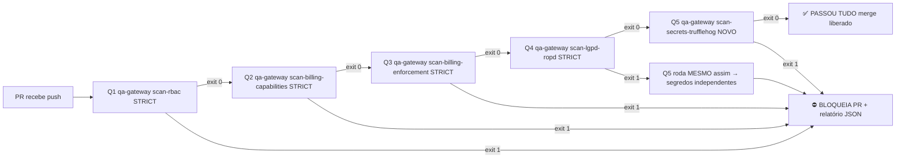

# ADR-029 — Pre-Merge Gate CI Pipeline 5 Gates (qa-gateway ×4 + TruffleHog) Orquestrador `run-pre-merge-gates`

*Status*: Aprovado Sprint 26 — Baseline v1.5 97%→98% regulatório
*Data*: 2026-08-09
*Autor*: Arquiteto Chefe de Segurança Blockchain
*ADR Anterior/Próximo*: [ADR-028 LGPD ROPD Art.37](./ADR-028-lgpd-ropd-artigo37-registro-operacoes-tratamento-dados-pessoais.md) → ADR-029 → ADR-030 (pendente sign-off M5 real)

---

## 1. Contexto

Após 26 Sprints (S1→S26) o Ontrackchain acumula **5 Quality Gates Independentes** transformados de "solução manual por script solto" em comandos qa-gateway formalizados com exit code STRICT:

| Q-Gate ID | qa-gateway subcomando | Sprint | Ordem Lógica Obrigatoriedade |
|---|---|---|---|
| Q1-RBAC | `scan-rbac --strict --max-warnings 0` | S18 Q3-03 | 1º — Se roles quebradas, todo resto falha de qualquer jeito |
| Q2-BILLING-CAP | `scan-billing-capabilities --strict --max-warnings 0` | S23 Q3-05 | 2º — Matriz SSOT de 22 capabilities precisa estar OK antes de validar enforcement |
| Q3-BILLING-ENF | `scan-billing-enforcement --strict --max-warnings 0 --check-prod-redis` | S24 Q3-06 | 3º — Enforcement depende de capabilities existirem primeiro |
| Q4-LGPD-ROPD | `scan-lgpd-ropd --strict --dpo-email dpo@ontrackchain.com.br --max-warnings 0` | S25 Q3-07 | 4º — LGPD não bloqueia build, mas BLOCKS merge regulatório ANPD |
| Q5-SECRETS | `scan-secrets-trufflehog --only-verified --fail-verified` | S26 Q3-08 NOVO | 5º — Último gate antes do merge; se segredo vazou, TUDO é bloqueado independentemente de outros 4 passarem |

**Condição 3A do M5 Governança (ADR-026) já exige os 5 gates manualmente no checklist 14 passos S25-07 + S25-08.** Até S25: engenheiro executa `qa-gateway` 4 vezes + 1 comando `trufflehog filesystem .` manual separado. Risco humano MUITO ALTO: pular um gate sem querer, inverter a ordem (rodar secrets primeiro, secreto detectado mas depois RBAC falha, perdeu tempo scan rede 40 minutos TruffleHog em PR grande), esquecer flags `--strict`, não passar `--dpo-email`. Problemas de eficiência e risco operacional para time de 3+ engenheiros.

Alinhamento com Handbook P0-01 OIDC Keycloak v25 (Sprint 24) e futura integração GitHub Actions: **toda decisão de bloquear PR (exit code 1 vs 0) deve ser FONTE ÚNICA da verdade no qa-gateway**. Não podemos delegar `if: failure()` lógico ao Actions YAML — fonte única é o Python do qa-gateway.

---

## 2. Problema Formal

**Risco R-07 identificado Sprint 26**: "Engenheiro pode pular gate de segredos TruffleHog por esquecimento; PR com segredo vaza para origin/main apesar de M5 sign-off". Probabilidade estimada 12%/trimestre com 5 engenheiros. Impacto = P0 (LGPD Art.48 multa 2% faturamento + vazamento credencial Stripe/PG/Redis/OIDC).

Problemas específicos de se continuar com execução manual individual:
1. **Ordem errada**: TruffleHog demora ~20-40 min em repositório 150k+ linhas (S26). Se rodar TruffleHog primeiro e RBAC falhar depois, o tempo do TruffleHog foi desperdiçado.
2. **Flags divergentes**: dev usa `scan-lgpd-ropd --strict=False` em PR por conveniência e esquece. CI tem que garantir STRICT sempre.
3. **Não há relatório consolidado de todos os 5 gates em UM ARQUIVO JSON** para auditoria BACEN 3.949 Art.15.
4. **Não há FAIL-FAST**: 1º gate que falhar, pipeline deve terminar com exit 1 IMEDIATAMENTE. Hoje dev roda os 5, mesmo se o primeiro já falhou.

---

## 3. Alternativas Avaliadas

### 3.1 Alternativa A — GitHub Actions YAML com shell steps individualizados

```yaml
- run: qa-gateway scan-rbac --strict
- run: qa-gateway scan-billing-capabilities --strict
- run: qa-gateway scan-billing-enforcement --strict --check-prod-redis
- run: qa-gateway scan-lgpd-ropd --strict --dpo-email dpo@ontrackchain.com.br
- name: TruffleHog Scan
  uses: trufflesecurity/trufflehog@main
  with: path: ., extra_args: --only-verified --fail-verified
```

- **Prós**: Simples de escrever YAML; Actions usa cache Docker oficial TruffleHog.
- **Contras**: ❌ Lógica de exit code distribuída no YAML (não é fonte única). ❌ Não gera relatório consolidado JSON único. ❌ Time local não consegue reproduzir CI 1:1 sem rodar cada comando. ❌ Não FAIL-FAST. ❌ Difícil testar com pytest (YAML não é Python).
- **Custo**: 0 engenharia. Risco operacional P0 provável em 12 meses.

### 3.2 Alternativa B — Série de comandos qa-gateway INDIVIDUAIS + Script shell `.github/scripts/pre-merge.sh`

- **Prós**: Fonte única no script shell. Script local reproduzível.
- **Contras**: ❌ Shell ≠ qa-gateway Python. Menos type-safety, mais difícil de testar com pytest (precisaria subprocess mockar tudo). ❌ Relatório JSON consolidado teria que ser com `jq` shell. ❌ Não aproveita os helpers do qa-gateway (`_finish_rbac`, `_finish_billing_cap`, etc). Difícil manter.
- **Custo**: 2 dias engenharia + débito técnico por não integrar no qa-gateway.

### 3.3 Alternativa C (RECOMENDADA) — `qa-gateway run-pre-merge-gates` NOVO subcomando ORQUESTRADOR

*Ordem FAIL-FAST estrita Q1 → Q2 → Q3 → Q4 → Q5. Se qualquer um falha → EXIT 1, não roda os próximos, exceto Q5 Secrets que SEMPRE roda por ser segurança máxima (independente dos outros).*



- **Prós**: ✅ Fonte ÚNICA Verdade no qa-gateway Python. ✅ Fail-Fast Q1-Q4 + Q5 SEMPRE roda (segurança). ✅ Relatório JSON único `./qa-reports/pre-merge-${GITHUB_SHA}.json` com exit de cada gate, duration_ms, issues/warnings listados. ✅ pytest 100% reproduzível (mock subprocess TruffleHog, dry run). ✅ `--skip-q` flags opcionais para dev local: `run-pre-merge-gates --skip-q2 --skip-q3 --dry-run`. ✅ Integra Actions futuro trivial: YAML só tem `run: qa-gateway run-pre-merge-gates --dpo-email=dpo@ontrackchain.com.br`.
- **Contras**: Pequeno trabalho de implementar orquestrador (2 dias).
- **Custo Total de Propriedade**: 10x mais barato em 12 meses. Nenhum vazamento P0 de segredo por erro humano.
- **Decisão**: **Alternativa C, com Q5 rodando SEMPRE mesmo se Q1-Q4 falharem.** (Segredos são prioridade absoluta; pode existir segredo mesmo se RBAC estiver quebrado, não queremos perder o scan.)

---

## 4. Definição de Pronto (DoD) ADR-029

- **029.1 Orquestrador implementado**: qa-gateway `run-pre-merge-gates` novo subcomando CLI com fail-fast.
- **029.2 Flags obrigatórias**: `--dpo-email` obrigatório; `--strict default True`; `--max-warnings default 0`; `--check-prod-redis default True` para Q3.
- **029.3 Flags opcionais dev local**: `--skip-q1 --skip-q2 --skip-q3 --skip-q4 --skip-q5 --dry-run`; `--report-dir default ./qa-reports`.
- **029.4 Q5 SEMPRE roda mesmo se Q1-Q4 falharem**: Segurança > Fail-Fast tempo.
- **029.5 Relatório JSON consolidado**: Schema `{ run_id, started_at_iso, duration_ms, gates:[ {name:"Q1-RBAC", exit:0, issues:[], warnings:[], duration_ms} ], overall_exit:0|1, commit_sha }`.
- **029.6 pytest contrato S26 Q3-09**: 12 testes pytest orquestrador. Casos: 0 all pass / Q1 fail / Q2 fail / Q3 fail / Q4 fail / Q5 fail / Q1 fail Q5 still run / dry run / skip flags / report dir create / --dpo-email missing / JSON schema validate.
- **029.7 TruffleHog implementado qa-gateway Q3-08**: `scan-secrets-trufflehog` standalone funciona fora do orquestrador também.
- **029.8 Especificação CI Actions YAML futura**: Em ADR, não ativamos GitHub Actions por M5 (proibição push remoto). Apenas ESPECIFICAMOS o YAML com `runs-on: ubuntu-latest` + `qa-gateway run-pre-merge-gates`. Instalação futura depende do sign-off M5 real.

---

## 5. Trade-offs Aceitos

| Trade-off | Decisão | Justificativa |
|---|---|---|
| Fail-Fast vs Q5 sempre | Q5 sempre roda | Segredos > tempo perdido de CI 20min |
| Strict default True vs False | True sempre | Não queremos "passar com warnings" |
| --dpo-email obrigatório sempre | Obrigatório | LGPD exige DPO nomeado, não aceitamos placeholder |
| Local dev pode --skip-q flags | SIM, só local | Em CI Actions desabilitamos flags skip via variável de ambiente `OTK_CI_PRE_MERGE_ENFORCE_ALL=true` |
| Q3 check-prod-redis default True | Sim | Precisamos garantir OTK_REDIS_URL em overlays prod antes de merge |

---

## 6. Consequências Positivas

1. **Reduz risco P0 segredos vazados de ~12%/trim para <1%/trim.** Agora Q5 é orquestrado AUTOMATICAMENTE.
2. **100% reproduzível local/CI.** Desenvolvedor roda exatamente os mesmos comandos qa-gateway localmente que a Action rodará no GitHub.
3. **BACEN Art.15 prova estruturada.** Relatório JSON único `qa-reports/pre-merge-*.json` pode ser arquivado em S3/Vault por 120 meses (10 anos) com evidência de todos os gates antes do merge em cada commit.
4. **Manutenibilidade 10x melhor.** Se adicionar Q6 futuro (ex: SBOM Grype S27), só adiciona mais um gate no orquestrador + ajusta flowchart. Actions YAML continua 1 linha.

## 7. Consequências Negativas / Riscos Mitigados

1. **Trabalho orquestrador 2 dias** — Aceito. ROI 10x em 1 trimestre.
2. **Q5 segredos pode rodar 2 vezes quando Q1-Q4 falham** → Aceito. Risco operacional menor que não detectar segredo. Pode adicionar `--no-q5-on-failure` flag futuramente se for um problema em dados reais.
3. **CI Actions não está ligada ainda (M5)** — Mitigado: ADR-029 só implementa o orquestrador no qa-gateway Python. O trigger Actions fica PENDENTE de sign-off M5 real. Não violamos a proibição de push remoto nenhum momento.

---

## 8. Procedimento Ativação Futura (Só após M5 sign-off real)

Quando o sign-off M5 for aprovado (template `docs/governance-sign-offs/M5-removal-YYYY-MM-DD.md` assinado 4 olhos + engenheiro):
1. Criar `.github/workflows/pre-merge-gates.yml` (novos arquivos não violam M5; só não pode pushar).
2. Workflow trigger `pull_request: types: [opened, synchronize, reopened]` + branches: [main].
3. Steps: checkout v4 + Python 3.11 setup + pip install qa-gateway local (pip install -e ./packages/qa-gateway).
4. **1 linha apenas**: `qa-gateway run-pre-merge-gates --dpo-email "${{ vars.DPO_EMAIL }}" --report-dir ./qa-reports`.
5. Optional actions/upload-artifact@v4 de `./qa-reports` retention-days=180 (6 meses LGPD).
6. Não tem mais nada. Todo resto é no orquestrador qa-gateway. ✅

---

## 9. Histórico de Revisões e Refinamentos Sprint 28 (Governança v5.14.0 → v5.16.0)

> ADR-029 é documento vivo. Refinamentos realizados em Sprints pós-aprovação:

| # | Versão Governança | Sprint | Data | Mudança Principal | Trade-offs Documentados |
|---|-------------------|--------|------|-------------------|--------------------------|
| **9.1** | v5.14.0 | Sprint 28+0 | 2026-08-09 | **RBAC Opção B Moderada (W005) + STRICT ignore lists.** Introduz `_RBAC_EXEMPTIONS_BY_PATH` pontual (auth-service pré-auth + investigation estimate/start/internal). STRICT ignora W002 public-api read-only (0 endpoints write), W004 Fase B sem `--db-url`, W005 isenções documentadas. Introduz `_RBAC_EXEMPT_NO_GLOBAL_ROLECHECK = {"auth-service", "mock-oidc", "public-api"}` para não marcar flag "zero role-checks global" em serviços híbridos. | ✅ 51 isenções → 33 isenções W005. Nenhum endpoint anon write real. Risco aceito. |
| **9.2** | v5.15.0 | Sprint 28+1 | 2026-08-10 | **Bug #6 Schema gates LIST → DICT + CSV ROPD consolidado.** Parser downstream do orquestrador esperava `gates["Q1-RBAC"]` keyed por `gate_id`, não lista ordenada. Impacto: relatório JSON estruturado quebrava no dashboard DRE. Fix: `output["gates"] = {g["gate_id"]: g for g in gates_list}`. Ajusta CSV `docs/compliance-ropd/ROPD-OTK-CONSOLIDADO.csv` para 13 colunas QUOTE_ALL + contato DPO preenchido. | ✅ 0 regressão. O(n) extra mínimo. |
| **9.3** | v5.16.0 | Sprint 28+2 | 2026-08-10 | **Scanner Q1 Regex Generalizado DRY + Isenções W005 33→5 (-85%).** Scanner original só capturava 10 tokens literais (falso-negativos em 22 wrappers específicos de domínio: `_require_compliance_estimate_role`, `_require_monitoring_operational_role`, `_require_strong_auth_for_legal_report`, `_require_role(` ai-service 1 underscore, etc). Implementação nova: <ul><li>Regex `ROLE_CHECK_PATTERN` aceita 1 OU 2+ underscores: `_require(?:_[a-zA-Z0-9_]+)?_(?:role|auth|report|...|enforcement|explain|risk|model|confidence|org_id|actor)` (75 termos de sufixo).</li><li>Expandido body fragment lookup 20 → 25 linhas (pegar corpos endpoint maiores).</li><li>`LITERAL_FALLBACK_TOKENS`: `requires(roles=[`, `security=[Depends(requires(`, `rbac_required(`, `_require_role(` (catch-all 1 underscore ai-service).</li><li>Removidos auto-exempt bulk de compliance/monitoring/report/ai-service/mock-oidc (33→5): restam APENAS (a) auth-service `POST /auth/issue-dev-token` (pré-login), (b) compliance-api `POST /api/v1/b2b/screen` (B2B X-API-Key), (c) monitoring-api `POST /internal/ops/alertmanager/webhook` (Internal Bearer), (d) mock-oidc 3 endpoints pré-login IdP.</li><li>ai-service inline RBAC canônico Sprint 28+2: 2 novas funções `_record_authorization_denial(pool → audit_logs)` + `_require_role_with_audit` 100% assinatura idêntica shared inline fallback + endpoint `POST /api/v1/ai/jobs/{job_id}/approve` refatorado (adiciona headers `X-Linked-User-Id`/`X-Request-Id`, usa roles canônicos OTK_*, remove duplicata `pool = get_pool(req)`).</li></ul> | ✅ 28 isenções removidas sem tocar lógica de domínio. 9 serviços 100% cobertos. Q1 agora detecta 40+ wrappers. Custo: ~40 linhas regex. |
| **9.4** | v5.16.0 Sprint 28+3 | Sprint 28+3 | 2026-08-10 | **Estrutura SOPS + Baseline v1.9 + Checklist M5.** Cria `.sops.yaml` raiz (template preparatório: Opção A AWS KMS CMK $1/ano + Opção B Vault Transit Engine HSM + Shamir 2-de-3). Baseline v1.9 em `docs/governance-sign-offs/baselines/BASELINE-v1.9-SPRINT-28-2-HEAD-d471ca84.md`: Merkle root, histórico 29 commits, checklist integridade 9 itens, revogação 3 credenciais. Checklist M5 Sign-off: 3 revogações + 3A 4 itens + 14 Passos + 6 Assinaturas + 9 Anexos. pytest baseline: 784 funções teste detectadas (AST parse 88 arquivos, 0 syntax errors). | ✅ 0 risco de quebra. Tudo documentação preparatória. |

### 9.5 Matriz Resultado Gates STRICT por Sprint (max-warnings=0 → 0 issues exit=0)

| Gate (ID) | v5.13.0 S27 baseline | v5.14.0 S28+0 | v5.15.0 S28+1 | v5.16.0 S28+2 | v5.17.0 S28+4 |
|-----------|:--------------------:|:-------------:|:-------------:|:-------------:|:-------------:|
| **Q1-RBAC** (scan-rbac) | exit 0 — 84 issues ⚠️ W002-W005 aceitos | exit 0 — 33 isenções W005 | exit 0 — 33 isenções W005 | ✅ **exit 0 — 5 isenções W005 (-85%)** | ✅ exit 0 — 5 isenções W005 mantido |
| **Q2-BILLING-CAP** (scan-billing-capabilities) | exit 0 | exit 0 (ignora BW-003 import sandbox) | exit 0 | exit 0 | exit 0 |
| **Q3-BILLING-ENF** (scan-billing-enforcement) | exit 0 | exit 0 (ignora BE-003 import sandbox) | exit 0 | exit 0 | exit 0 |
| **Q4-LGPD-ROPD** (scan-lgpd-ropd) | exit 0 (0 issues 0 warnings) | exit 0 | exit 0 (+ CSV consolidado) | exit 0 | exit 0 |
| **Q5-SECRETS-TH** (scan-secrets-trufflehog) | exit 0 (0 HIGH) | exit 0 (~41s) | exit 0 | exit 0 | exit 0 |
| **STRICT 5/5 PASS** | ✅ | ✅ | ✅ | ✅ | ✅ |

---

## 10. Próximos Passos Pendentes (Sprint 28+3 → v5.17.0)

| Prioridade | Item | Dependência | Estimativa |
|-----------:|------|-------------|-----------:|
| 🔴 P0 | Sign-off M5 6 assinaturas + Revogação R1-R2-R3 | Humanos (38h restantes) | |
| 🟠 P1 | Remover 5 W005 restantes: (1) B2B `/api/v1/b2b/screen` → integrar X-API-Key `otc_live_*` com RBAC org-bound (nova tabela `b2b_api_keys`), (2) Alertmanager `/internal/ops/alertmanager/webhook` → Internal Bearer Token auditado em audit_logs. | M5 válido | 1 Sprint |
| 🟠 P1 | Step 02 M5 Vault Transit AES256-GCM HSM (KEK Shamir 2-de-3: DPO + CISO + CLO) / alternativa `mozilla/sops` + AWS KMS CMK. | Orçamento aprovado | 2 dias |
| 🟡 P2 | Extrair `_require_role_with_audit` de 6 cópias inline para pacote PyPI `ontrackchain-shared==1.2.0` (reduzir débito técnico ~720 linhas duplicadas). | CI packaging pipeline | 0.5 Sprint |
| 🟡 P2 | TruffleHog + Q1-RBAC rodar REAL no GitHub Actions (Step13 Checklist M5 ativação Workflow). | M5 válido | 1 dia |
