# Handbook P0-01 OIDC — Keycloak v25 Self-Hosted via Helm (Produção Corporativa)

Data base: Sprint 24 (2026-08-09)
Status: 🟡 **PREPARADO PARA EXECUÇÃO** (aguardando sign-off jurídico + budget K8s node pool extra)
Previsão handoff institucional: **8–21 dias úteis** após aprovação do conselho.
Stack alvo: Keycloak v25 nightly (Quarkus JVM 21 LTS) + Helm chart `codecentric/keycloakx` (recomendado CNCF) + PostgreSQL 16 HA (separado do DB investigação) + Istio 1.23 mTLS STRICT + Infinispan caches replicados.

---

## 1. Aplicabilidade & Relação com Capabilities T2-10

- **Startup**: NÃO usa Keycloak IdP federado. Apenas auth local via `OTK_VIEWER` / `OTK_ANALYST` (roles família T2-10).
- **Business**: Usa Keycloak com **usuários sincronizados LDAP/AD**, mas SAML SAML OIDC Federation = `has_sso_saml_oidc_federation = false` (T2-10 padrão).
- **Enterprise**: Tier obrigatoriamente usa **SSO SAML Enterprise IdP-initiated** + MFA WebAuthn hardware security key (YubiKey 5). Capability `has_sso_saml_oidc_federation = true` e `has_sso_saml_oidc_federation = true` (ADR-027 envia 401 se não configurado).

---

## 2. Checklist 14 Itens Obrigatórios — 4-Olhos

| # | Item | Categoria | Responsável | Status | Evidência de Conclusão |
|---|---|---|---|---|---|
| P0-01.01 | **Reino criado `otk-realm`**; display name = "Ontrackchain Regulatory Platform". Login theme corporativo + banner LGPD DPO contato dpo@ontrackchain.com.br visível em todas as telas de auth. | Configuração IdP | Engenheiro IAM | ❌ | JSON export realm `otk-realm-2026MMDD.json` + screenshot tela login |
| P0-01.02 | **Clients OIDC criados** (confidential com PKCE S256 obrigatório): (A) `ontrackchain-frontend-nextjs` callback URLs whitelist (sem wildcard `*`); (B) `ontrackchain-investigation-api` audience `investigation-api`; (C) `ontrackchain-grafana-monitoring`; (D) `ontrackchain-qa-gateway`. TODOS clients com lifespan token access 15min, refresh 12h. | Configuração OIDC | Engenheiro IAM + Arquiteto | ❌ | JSON clients com `tokenLifespan` 900s (15min) |
| P0-01.03 | **MFA OBRIGATÓRIO para roles OTK_ADMIN, OTK_COMPLIANCE_OFFICER, OTK_AUDITOR (BACEN Circular 3.978 Art. 12)**. Métodos permitidos: WebAuthn Roaming Authenticator (YubiKey/Nitrokey) + TOTP (autenticador app). Métodos PROIBIDOS: SMS OTP, Email OTP. | Segurança MFA | DSI + CISO | ❌ | Policy "Required Action" MFA mapeada roles 3 famílias |
| P0-01.04 | **Roles OTK_* Federação mapeadas como Client Roles investigation-api**: 5 roles canônicas = `OTK_ADMIN`, `OTK_ANALYST`, `OTK_COMPLIANCE_OFFICER`, `OTK_AUDITOR`, `OTK_VIEWER`. NÃO criar nenhuma role extra. NÃO usar realm-level roles. | RBAC Federação | Arquiteto + Engenheiro IAM | ❌ | Screenshot Client Roles aba investigation-api 5 roles mapeadas |
| P0-01.05 | **Protocolo mappers SAML 2.0 IdP-Initiated** para clientes Enterprise Tier: Single Sign-On Service URL `https://<keycloak>/auth/realms/otk-realm/protocol/saml`, NameID format = `urn:oasis:names:tc:SAML:2.0:nameid-format:persistent`. Assinatura SHA-256 RSA-4096 (NÃO SHA-1). Certificate auto-rotacionado a cada 90 dias. | SAML Enterprise | Engenheiro IAM + Cliente Enterprise Contato | ❌ | Metadata XML enterprise + sucesso login em 2 contas de teste |
| P0-01.06 | **User Federation LDAP / Active Directory**: Vendor LDAP = `ad` (Microsoft AD DS 2022). Sync users FULL 1 vez às 03:00 UTC. Mapper atributos: `sAMAccountName → username`, `mail → email`, `memberOf → roles (mapeamento por grupo AD, NÃO por usuário individual)`. | LDAP Sync | Engenheiro IAM | ❌ | Log sync LDAP 0 usuários com erro + 100% sincronizados |
| P0-01.07 | **Infra Keycloak HA (Alta Disponibilidade)**: Helm values `replicaCount = 3`, `image.tag=25.0.1-0`, PostgreSQL 16 **separado cluster patroni** (NÃO usa PG investigação). Resources requests 2 CPU / 4Gi; limits 4 CPU / 8Gi por réplica. Infinispan caches authSessions, sessions, realms, users, offlineSessions replicados. | Helm Kubernetes | SRE + Engenheiro IAM | ❌ | `kubectl get sts keycloak` = 3/3 READY, pg patroni `+1 sync rep` |
| P0-01.08 | **Istio mTLS STRICT**: PeerAuthentication `keycloak` namespace `mode=STRICT`. AuthorizationPolicy `ALLOW` apenas portas 8443 HTTPS e 7800 JGroups Infinispan discovery entre réplicas Keycloak. PROIBIR acesso 8080 HTTP plaintext. | Rede Zero-Trust | SRE + DSI | ❌ | `istioctl pc authz <pod> -o json` mode=STRICT |
| P0-01.09 | **Roda da Morte & DDoS Protected**: Cloudflare WAF Ruleset "Auth Attacks Mitigation" com Managed Rules + Rate Limit 5 requests/min/IP no `/auth/realms/otk-realm/protocol/openid-connect/token` (sem afetar endpoints autenticados internos VPC). Bot Fight Mode ativo. | Perímetro Segurança | DSI + Cloudflare SRE | ❌ | Dashboard WAF 24h, bloqueio de 1 IP de ataque simulado |
| P0-01.10 | **Auditoria Logs SIEM**: Eventos Keycloak `ADMIN_EVENT`, `LOGIN`, `LOGIN_ERROR`, `CLIENT_LOGIN`, `REGISTER`, `REVOKE_GRANT`, `CODE_TO_TOKEN` enviados a Logstash → Elasticsearch → SIEM Splunk on-prem. Retenção 180 dias criptografados AES-256. Nível INFO = NÃO logar tokens de acesso em plaintext (MÁSCARA `***`). | Auditoria LGPD BACEN | DPO + SRE | ❌ | Busca Splunk `index=ontrackchain_auth` últimos 7d ≥ 1 evento de cada tipo |
| P0-01.11 | **Backup Full Infinispan + PG**: Snapshots AWS EBS volume PG a cada 6h, retidos 30 dias. Export diário realm JSON `otk-realm` 02:00 UTC para S3 Bucket com KMS CMK. RPO ≤ 6h. RTO ≤ 2h. RODADA SIMULADA de restore: PG dump + realm JSON import em sandbox — deve funcionar em ≤90 min. | DR / BCP | SRE + DSI | ❌ | Relatório restore assinado SRE + CISO data |
| P0-01.12 | **Monitoramento Prometheus / Grafana**: Alertas críticos P0 (sinalização SMS / chamada / Slack): Keycloak replicas available < 2; CPU > 90% 5min; heap used > 85% 10min; login failures > 100/min (Ataque Force Bruta); PG replication lag > 60s. | Observabilidade | SRE | ❌ | Grafana dashboard Keycloak v25 importado + 1 teste alerta disparado |
| P0-01.13 | **Testes Canários QA**: Playwright E2E novos specs (adicionar Q3-07): (1) Login usuário business MFA TOTP; (2) Acesso enterprise SAML IdP-initiated; (3) Reset senha primeiro login; (4) Revogação sessão admin após 30 min idle → redirect login. Todos passar em CI antes de promote produção. | QA / Qualidade | QA Lead + Engenheiro E2E | ❌ | Playwright relatório HTML todos specs Q3-07 PASS |
| P0-01.14 | **Sign-off 4-Olhos Final (PRODUÇÃO)**: (1) CTO (arquitetura correta); (2) DSI (riscos mitigados, Istio STRICT, WAF ativo, MFA obrigatório); (3) DPO (LGPD Art.32 medida segurança técnica adequada, logs 180d com AES256, contato DPO visível tela login); (4) Arquiteto Chefe (integração investigation-api billing_enforcement corretamente bloqueia 401 se capability `has_sso_saml_oidc_federation = false` em startup/business). | Governança | Conselho Executivo + Arquiteto | ❌ | Arquivo `docs/governance-sign-offs/P0-01-keycloak-2026MMDD.md` |

---

## 3. Ordem de Execução Recomendada (evita deadlocks)

```mermaid
flowchart LR
    P0101[A: P0-01.01 Realm otk-realm LGPD banner] --> P0107
    P0107[B: P0-01.07 Helm HA 3 replicas + PG Patroni separado] --> P0108
    P0108[C: P0-01.08 Istio mTLS STRICT + Authz 8443] --> P0102
    P0102[D: P0-01.02 4 Clients OIDC PKCE lifespan 15min] --> P0104
    P0104[E: P0-01.04 Roles OTK_* mapeadas Client-Level] --> P0103
    P0103[F: P0-01.03 MFA Required 3 roles OTK_ADMIN/COMPLIANCE/AUDITOR] --> P0106
    P0106[G: P0-01.06 LDAP Sync memberOf group mapeamento roles] --> P0105
    P0105[H: P0-01.05 SAML 2.0 IdP-initiated Enterprise] --> P0109
    P0109[I: P0-01.09 Cloudflare WAF Auth DDoS] --> P0110
    P0110[J: P0-01.10 Auditoria SIEM Splunk 180d] --> P0111
    P0111[K: P0-01.11 Backup Full PG + Realm JSON 6h] --> P0112
    P0112[L: P0-01.12 Prometheus Alertas P0] --> P0113
    P0113[M: P0-01.13 Playwright E2E Q3-07] --> P0114
    P0114[N: P0-01.14 Sign-off 4-Olhos CTO/DSI/DPO/Arquiteto]
```

---

## 4. Riscos & Mitigações (P0 Pending)

| Risco | Prob | Impacto | Mitigação |
|---|---|---|---|
| Keycloak upgrade v25.x quebra custom SPI LDAP mapper | Média 25% | Alto | Helm `image.tag` fixado em `25.0.1-0` e atualizações só após ambiente sandbox 2 dias QA |
| Enterprise SAML NameID diferente do esperado IdP cliente Salesforce OKTA | Média 30% | Médio | Sandbox integration test 2 dias antes de produção, suporte cliente IdP em call |
| WAF Cloudflare bloqueia requests VPC internos legítimos | Baixa 10% | Médio | Cloudflare WAF bypass rule para VPC CIDR bloc ASN corporativo |
| Rotina restore backup NÃO funciona em DR simulado | Baixa 10% | Muito Alto | Roda da Morte: 1 simulação restore **obrigatória a cada sprint final** até P0-01 sign-off |

---

## 5. Relação com 4 Perguntas do Arquiteto

| Pergunta | Resposta S24 |
|---|---|
| 1. Atende objetivos de negócio? | ✅ Sim. Fecha capability `has_sso_saml_oidc_federation=true` enterprise tier. |
| 2. Conformidade restrições? | ✅ Sim. LGPD Art.32, BACEN Circular 3949 Art. 12/16 controles de acesso. |
| 3. Atributos qualidade? | ✅ SLA HA 99,9% 3 réplicas. RPO ≤ 6h RTO ≤ 2h. mTLS ISTIO STRICT zero-trust. |
| 4. Opção mais barata / menos arriscada? | ✅ Sim. Keycloak open source / Helm chart maduro CNCF = menor risco operacional vs SaaS Cognito/Azure AD em clientes BACEN que recusam multi-tenant público. |
