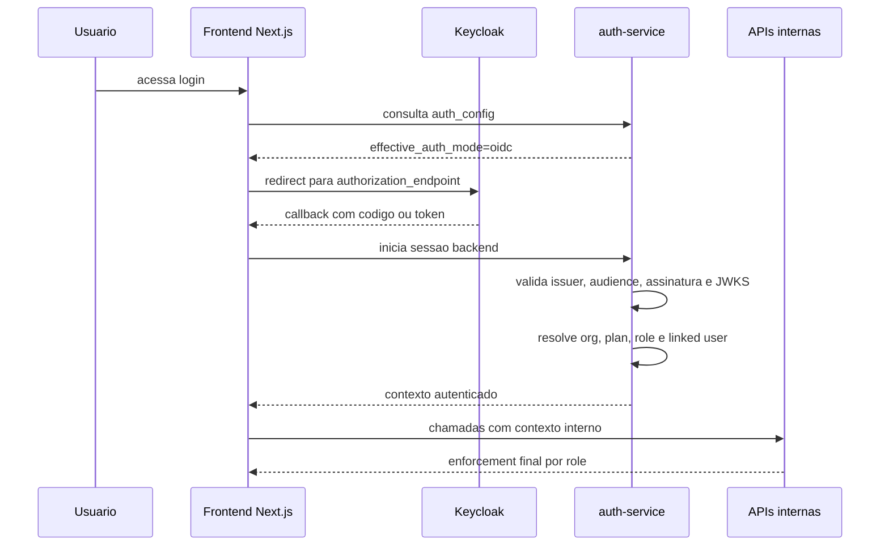

# Template de Configuracao Keycloak para OIDC

## Objetivo

Fornecer um template pronto para configurar o `WP-01` com `Keycloak` como IdP e `Redirect Web` como primeiro corte do login serio.

Este documento assume a arquitetura decidida para a `Sprint 1`:

- `OIDC_PROVIDER=keycloak`
- `AUTH_MODE=oidc` nos ambientes serios
- `Keycloak` exposto por subdominio dedicado, preferencialmente `auth.ontrackchain.com`
- fluxo iniciado pelo frontend via redirecionamento para o `authorization_endpoint`
- validacao de token no `auth-service` via `issuer` + `JWKS`
- `audience` das APIs validada contra `ontrackchain-api`

## Escopo do Primeiro Corte

Inclui:

- login OIDC iniciado pelo navegador
- validacao de token pelo `auth-service`
- propagacao de contexto (`org`, `plan`, `role`)
- bloqueio do fluxo `dev` fora de `local|test`

Nao inclui ainda:

- logout federado
- refresh token persistido
- callback PKCE completo no frontend
- mapeamento dinamico multi-tenant por realm

## Topologia Esperada

O diagrama abaixo resume o fluxo esperado de autenticacao federada, do redirect inicial ate o enforcement efetivo nas APIs.



## Template de Variaveis

Preencher os valores abaixo no ambiente alvo:

```env
APP_ENV=staging
AUTH_MODE=oidc
DEV_AUTH_ENABLED=false
NEXT_PUBLIC_AUTH_MODE=oidc
NEXT_PUBLIC_APP_ENV=staging
NEXT_PUBLIC_DEV_AUTH_ENABLED=false

OIDC_PROVIDER=keycloak
OIDC_ISSUER_URL=https://auth.ontrackchain.com/realms/ontrackchain
OIDC_CLIENT_ID=ontrackchain-web
OIDC_AUDIENCE=ontrackchain-api
OIDC_JWKS_URL=https://auth.ontrackchain.com/realms/ontrackchain/protocol/openid-connect/certs
OIDC_AUTHORIZATION_URL=https://auth.ontrackchain.com/realms/ontrackchain/protocol/openid-connect/auth
OIDC_ORG_CLAIM=org
OIDC_PLAN_CLAIM=plan
OIDC_ROLE_CLAIM=otk_role
```

Notas:

- `OIDC_CLIENT_ID=ontrackchain-web` identifica o client de browser
- `OIDC_AUDIENCE=ontrackchain-api` representa a audience exigida pelas APIs FastAPI
- para isso, o token do usuario precisa incluir `ontrackchain-api` em `aud`, seja como audience principal ou audience adicional
- `OIDC_JWKS_URL` e `OIDC_AUTHORIZATION_URL` podem ser inferidos via discovery, mas devem ser explicitados no rollout inicial para reduzir ambiguidade operacional
- a referencia de producao e `https://auth.ontrackchain.com`; para MVP de VPS, o subdominio continua recomendado para evitar conflito com a exposicao atual do app em `:8080`

## Template de Realm e Client

### Realm

Sugestao:

- realm: `ontrackchain`
- issuer:
  - `https://auth.ontrackchain.com/realms/ontrackchain`
  - opcionalmente no MVP provisório: `http://auth.ontrackchain.com/realms/ontrackchain` enquanto HTTPS ainda nao estiver fechado

### Client Web

Sugestao:

- client id: `ontrackchain-web`
- tipo: `public`
- `PKCE` obrigatorio com `S256`
- `Standard Flow Enabled=ON`
- `Direct Access Grants Enabled=OFF`

Configuracoes minimas:

- `Valid Redirect URIs`
  - `http://localhost:8080/login`
  - `http://localhost:8080/oidc/callback`
  - `http://129.121.38.250/`
  - `http://129.121.38.250/oidc/callback`
  - `https://app.ontrackchain.com/`
  - `https://app.ontrackchain.com/oidc/callback`
  - `https://ontrackchain.com/oidc/callback`
- `Web Origins`
  - `http://localhost:8080`
  - `http://129.121.38.250`
  - `https://app.ontrackchain.com`
  - `https://ontrackchain.com`
- `Standard Flow Enabled`
  - `ON`
- `Direct Access Grants Enabled`
  - `OFF`

### Client API

Sugestao:

- client id: `ontrackchain-api`
- tipo: `bearer-only` ou `confidential`, conforme a estrategia de validacao escolhida
- papel arquitetural: audience das APIs e superficie reservada ao backend FastAPI

Configuracoes minimas:

- audience disponivel para os tokens do frontend
- `issuer` identico ao realm unico
- segredo configurado apenas se o modo final usar client confidencial em alguma troca server-side

### Client B2B

Sugestao:

- client id: `ontrackchain-b2b`
- tipo: `confidential`
- `service accounts enabled=ON`
- uso exclusivo para integracoes B2B e automacoes

## Template de Claims

Decisao final de mapeamento:

- `org`
- `plan`
- `otk_role`

Mapeamento recomendado no Keycloak:

| Contexto | Claim | Exemplo |
| --- | --- | --- |
| Organizacao | `org` | `00000000-0000-0000-0000-000000000001` |
| Plano | `plan` | `enterprise` |
| Papel | `otk_role` | `otk_admin` |

Se o realm usar claims diferentes, preencher:

```env
OIDC_ORG_CLAIM=<claim_real_de_org>
OIDC_PLAN_CLAIM=<claim_real_de_plan>
OIDC_ROLE_CLAIM=<claim_real_de_role>
```

Origem recomendada no Keycloak:

- `org` vindo de `User Attribute` `organization_id`
- `plan` vindo de `User Attribute` `plan`
- `otk_role` vindo de role de realm filtrada da aplicacao

Roles recomendadas:

- `otk_admin`
- `otk_analyst`
- `otk_tester`
- `otk_auditor`
- `otk_viewer`

## Checklist de Provisionamento

### Infra/Identidade

- realm criado
- client `ontrackchain-web` criado
- client `ontrackchain-api` criado
- client `ontrackchain-b2b` criado
- `issuer` confirmado
- `authorization endpoint` confirmado
- `JWKS` acessivel
- `redirect URIs` cadastradas
- `web origins` cadastradas

### Claims e Autorizacao

- claim de organizacao definida
- claim de plano definida
- claim de papel definida
- pelo menos um usuario de teste com `org`, `plan` e `role`
- pelo menos um usuario negativo sem `org` para validar `invalid_claims`
- mapper de audience garantindo `ontrackchain-api` para tokens consumidos pelas APIs

### Projeto

- `.env` do ambiente com `AUTH_MODE=oidc`
- `DEV_AUTH_ENABLED=false`
- `NEXT_PUBLIC_AUTH_MODE=oidc`
- `OIDC_PROVIDER=keycloak`
- `OIDC_ISSUER_URL`, `OIDC_CLIENT_ID`, `OIDC_JWKS_URL` e `OIDC_AUTHORIZATION_URL` preenchidos

## Critérios de Aceite do WP-01

O incremento de `Keycloak + Redirect Web` pode ser considerado pronto quando:

1. `/auth/config` expuser `effective_auth_mode=oidc`
2. o frontend exibir CTA claro de login via `Keycloak`
3. o usuario conseguir autenticar sem colar token manualmente
4. o `auth-service` validar assinatura e `issuer` via `JWKS`
5. o `auth-service` validar `aud=ontrackchain-api` para tokens de usuario
6. o contexto de `org`, `plan` e `otk_role` chegar corretamente ao frontend e aos proxies
7. `AUTH_MODE=dev` nao voltar silenciosamente em `staging|production`
8. um usuario mal provisionado falhar com `401` e contrato explicito `invalid_claims`

## Baseline Local Validado

No scaffold local atual, o realm importado ja contem:

- usuarios positivos:
  - `system@ontrackchain.com`
  - `kmd@ontrackchain.com`
  - `jibso@ontrackchain.com`
  - `auditor@ontrackchain.com`
  - `analyst@ontrackchain.com`
  - `viewer@ontrackchain.com`
- usuario negativo:
  - `sem-org@ontrackchain.com`

Contrato esperado do usuario negativo:

- nao possui `organization_id`
- autentica no `Keycloak`, mas falha em `/validate`
- deve produzir `401 { "error": "invalid_claims" }` em `apps/frontend/app/api/session/start/route.ts`
- serve para regressao do caso negativo em `apps/frontend/tests/e2e/oidc-auth.spec.ts`

## Riscos Tecnicos

| Risco | Probabilidade | Impacto | Mitigacao |
| --- | --- | --- | --- |
| Claims reais nao coincidirem com `org`, `plan`, `otk_role` | alta | P1 | parametrizar `OIDC_*_CLAIM` antes de iniciar teste E2E |
| Realm nao emitir `aud=ontrackchain-api` para tokens de usuario | alta | P0 | adicionar mapper de audience antes de integrar as APIs |
| Redirect URI incorreta bloquear login | alta | P1 | cadastrar `localhost` e `staging` antes do primeiro smoke |
| Token vir sem contexto de negocio suficiente | media | P0 | definir mapper explicito no Keycloak antes da homologacao |

## Proximo Passo Imediato

Assim que os valores reais estiverem disponiveis, preencher este template e aplicar o corte em:

- `apps/auth-service/src/auth_service/main.py`
- `apps/frontend/app/login/page.tsx`
- `apps/frontend/app/api/session/start/route.ts`
- `apps/frontend/tests/e2e/`
- `.env.example`
