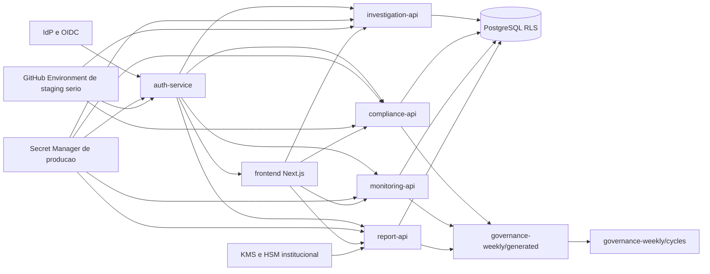

# Roadmap de Secrets e RBAC para Producao

## Objetivo

Consolidar em um unico artefato o caminho recomendado para fechar os gaps `P2-04` e `P2-05`, cobrindo:

- estrategia de `vault/secrets` para producao
- evolucao de `RBAC` por dominio
- sequenciamento tecnico ate um estado mais convincente para ambiente regulado

## Contexto Atual

O projeto ja tem:

- `RLS` como baseline de isolamento multi-tenant
- controles fortes em superficies administrativas (`audit`, `monitoring/admin`, `investigation/admin`, `legal_report`)
- contrato operacional de janela seria via `.env.staging.private` e `GitHub Environment`
- trilha institucional de selagem DD/SoF com abstracao pronta para backend definitivo de `KMS/HSM`

O projeto ainda nao tem:

- secret manager de producao homologado e integrado ponta a ponta
- matriz RBAC fina por dominio para `ANALYST`, `VIEWER`, `TESTER` e futuros papeis especializados
- alinhamento formal entre papeis de produto, claims do IdP, enforcement de backend e UX dos cockpits

## Requisitos Funcionais

- retirar segredos criticos de runtime de qualquer dependencia permanente em `.env` de producao
- definir papeis operacionais por dominio sem quebrar os fluxos ja estabilizados
- manter trilha auditavel de negacao, handoff e aprovacao em recursos sensiveis
- preservar compatibilidade com `OIDC`, `JWT`, `API Key` e `X-Linked-User-Id`

## Requisitos Nao Funcionais

- seguranca: principio de menor privilegio, segregacao de funcoes e rotacao de segredos
- disponibilidade: leitura de segredo sem SPOF operacional desnecessario
- auditabilidade: trilha de negacao, uso e mudanca de segredo documentada
- manutenibilidade: naming padrao, ownership claro e rollout incremental
- reversibilidade: migrar sem exigir big bang em todos os servicos

## Frentes e Bounded Contexts

O diagrama abaixo mostra como a trilha de `secrets` e a trilha de RBAC convergem para o mesmo endurecimento operacional pos-90%.

## Opcoes de Arquitetura

| Opcao | Secrets | RBAC | Vantagens | Desvantagens | Complexidade |
| --- | --- | --- | --- | --- | --- |
| A | manter `GitHub Environment` + `.env.staging.private` como modelo dominante | manter RBAC misto atual com pequenos patches | baixo esforco inicial | nao fecha producao com seguranca forte; continua difuso | baixa |
| B | `Vault/Secrets Manager` apenas para producao, mantendo staging como esta | matriz RBAC por dominio aplicada primeiro em recursos mais sensiveis | melhor equilibrio entre risco, custo e velocidade | exige dual-mode operacional por um tempo | media |
| C | migracao completa imediata para secret manager + RBAC fino em todos os dominios | enforcement integral desde ja | estado final mais forte | alto risco de refactor e atraso, baixa reversibilidade | alta |

## Recomendacao

Recomendo a **Opcao B**.

### Por que

- fecha o gap de producao sem desestabilizar o rito serio de `staging`
- permite mover `P2-04` e `P2-05` por fases com evidencia real
- respeita o principio de promocao baseada em evidencia: primeiro endurecer superficies criticas, depois expandir
- preserva a abstracao atual da selagem institucional para um backend definitivo de `KMS/HSM`

## Modelo de Secrets Recomendado

### Escopo

- producao: usar `Vault Transit`, `AWS Secrets Manager`, `AWS KMS + Parameter Store` ou equivalente institucional
- staging serio: manter `GitHub Environment` como contrato operacional de janela, com rotacao disciplinada
- desenvolvimento: continuar com `.env` controlado e valores nao-produtivos

### Componentes Principais

| Componente | Responsabilidade | Entradas | Saidas | Erros principais |
| --- | --- | --- | --- | --- |
| `Secret Manager` | armazenar e versionar segredos criticos | credenciais rotacionadas, politicas de acesso | leitura segura por servico | segredo ausente, permissao negada, timeout |
| `Platform/SRE` | provisionar e rotacionar segredos | owner, ambiente, politica | segredo publicado no backend seguro | drift de naming, owner indefinido |
| `auth-service` | consumir secrets de identidade e MFA | client secret, issuer, JWKS config | contexto autenticado | fallback indevido, claims inconsistentes |
| `investigation-api` e demais APIs | consumir segredos especificos de integracao | URL/token/api key | runtime coerente | degradação silenciosa, segredo expirado |
| `selagem institucional` | consumir backend definitivo de assinatura | chave nao exportavel, trust bundle | envelope verificado | indisponibilidade do provedor, trust bundle divergente |

### Nomenclatura Minima Recomendada

- `ontrackchain/<env>/auth/jwt_hs256_secret`
- `ontrackchain/<env>/auth/oidc_client_secret`
- `ontrackchain/<env>/auth/mfa_totp_secret`
- `ontrackchain/<env>/compliance/trm_api_key`
- `ontrackchain/<env>/compliance/eu_feed_url`
- `ontrackchain/<env>/platform/postgres_password`
- `ontrackchain/<env>/seal/signing_backend_ref`

## Modelo RBAC Recomendado

### Papeis-alvo

| Papel | Escopo principal | Pode aprovar? | Pode operar admin? | Pode apenas ler? |
| --- | --- | --- | --- | --- |
| `ADMIN` | operacao global e administracao | sim | sim | sim |
| `AUDITOR` | leitura privilegiada e trilhas | nao | nao | sim |
| `ANALYST` | operacao core por dominio | limitado ao dominio | nao | sim |
| `VIEWER` | leitura segura do proprio dominio | nao | nao | sim |
| `TESTER` | QA e ambientes nao-produtivos | nao por default | nao por default | limitado |
| `REVIEWER` | aprovacao regulatoria formal | sim, em recursos definidos | nao | sim |
| `BILLING_ADMIN` | saldo, conciliacao e export financeiro | nao regulatorio | admin financeiro | sim |

### Dominio por Dominio

| Dominio | Leitura | Operacao | Aprovacao | Administracao |
| --- | --- | --- | --- | --- |
| `audit` | `ADMIN`, `AUDITOR` | n/a | n/a | `ADMIN` |
| `monitoring` administrativo | `ADMIN`, `AUDITOR` | `ADMIN` | n/a | `ADMIN` |
| `investigation` core | `ADMIN`, `AUDITOR`, `ANALYST`, `VIEWER` | `ADMIN`, `ANALYST` | `REVIEWER` quando aplicavel | `ADMIN` |
| `compliance` core | `ADMIN`, `AUDITOR`, `ANALYST`, `VIEWER` | `ADMIN`, `ANALYST` | `REVIEWER` para gates formais | `ADMIN` |
| `reports/ROS-COAF` | `ADMIN`, `AUDITOR`, `ANALYST`, `VIEWER` por contexto | `ANALYST` | `REVIEWER`, `ADMIN` | `ADMIN` |
| `evidence/manual-package seal` | `ADMIN`, `AUDITOR` | `ADMIN`, `AUDITOR` | `REVIEWER` futuro ou papeis equivalentes por sign-off | `ADMIN` |
| `billing` | `ADMIN`, `BILLING_ADMIN` | `BILLING_ADMIN` | n/a | `ADMIN` |

Fatia incremental ja endurecida em `billing`:

- `GET /api/v1/billing/balance` protegido para `ADMIN|BILLING_ADMIN|OTK_BILLING_ADMIN`
- `GET /api/v1/billing/reconciliation` protegido para `ADMIN|BILLING_ADMIN|OTK_BILLING_ADMIN`, expondo saldo consolidado, backlog de `quotes` e movimentos recentes de `credit_ledger`

## Estrategia de Implementacao

### Fase 1 - Decisao e Inventario

- escolher a tecnologia oficial de secret manager
- inventariar segredos por servico, owner e criticidade
- classificar endpoints por dominio e sensibilidade
- congelar a semantica de papeis-alvo em ADR ou roadmap aprovado

### Fase 2 - Produção primeiro, staging preservado

- integrar producao ao secret manager sem quebrar o contrato atual de `staging`
- manter `GitHub Environment` apenas como ponte para janela seria
- implementar dual-read controlado onde necessario
- adicionar checagens de drift de naming e segredos ausentes

### Fase 3 - RBAC fino em recursos sensiveis

- expandir enforcement primeiro em `compliance`, `reports`, `evidence` e fluxos de aprovacao
- alinhar frontend para esconder ou degradar CTAs sem permissao
- persistir `authorization_denied` com contexto de dominio e role efetiva

### Fase 4 - Selagem institucional e segredo criptografico

- substituir backend local de assinatura por backend institucional definitivo atras da abstracao existente
- versionar `trust bundle`
- testar indisponibilidade e comportamento `424` como gate formal

## Roadmap Sugerido

| Sprint/Fase | Entrega | Owner sugerido | Evidencia de fechamento |
| --- | --- | --- | --- |
| `S+1` | decisao da tecnologia de secrets e naming padrao | `Platform/Security` | ADR ou documento aprovado |
| `S+1` | matriz RBAC alvo por dominio | `Security + Produto` | documento aprovado e indexado |
| `S+2` | inventario de segredos criticos por servico | `Platform/SRE` | tabela completa com owner |
| `S+2` | enforcement RBAC em `compliance` write/read sensivel | `Backend/Auth + Compliance` | testes + eventos `authorization_denied` |
| `S+3` | rollout de secret manager em producao | `Platform/SRE` | checklist + smoke + rollback validado |
| `S+3` | rollout RBAC em `reports/evidence` | `Backend/Auth + Frontend` | testes, UX coerente e docs sincronizadas |
| `S+4` | binding institucional de selagem (`KMS/HSM`) | `Security + Backend` | prova tecnica + trust bundle versionado |

## Riscos Tecnicos

| Risco | Probabilidade | Impacto | Mitigacao |
| --- | --- | --- | --- |
| migracao de secret manager quebrar bootstrap operacional | media | alta | dual-read controlado + rollback testado |
| matriz RBAC fina bloquear fluxos legitimos | media | alta | rollout por dominio + auditoria de negacoes |
| divergencia entre claims do IdP e roles internas | alta | alta | contrato canônico de mapping no `auth-service` |
| frontend continuar expondo CTA sem permissao | media | media | alinhar UX + E2E focado em autorizacao |
| backend definitivo de selagem atrasar | media | alta | manter abstracao atual e medir gap separadamente |

## Definition of Done

### `P2-04` Secrets

- tecnologia de secret manager aprovada
- inventario critico completo por servico
- producao sem dependencia estrutural de `.env` plain text
- rotacao e rollback testados

### `P2-05` RBAC

- papeis-alvo aprovados
- matriz por dominio publicada
- enforcement aplicado ao menos em `compliance`, `reports` e `evidence`
- negacao auditada e UX coerente nos cockpits

## Decisao Recomendada

- tratar `vault/secrets` e `RBAC` como trilha conjunta de endurecimento pos-90%
- nao bloquear o rito atual de `staging`, mas impedir que ele vire modelo final de producao
- usar este documento como ponte entre [RBAC e Permissoes](./rbac-and-permissions.md), [Variaveis de Ambiente](./environment-variables.md), [Deploy e Staging](./deploy-and-staging.md) e [Arquitetura da Selagem DD/SoF](./evidence-manual-package-strong-sealing-architecture.md)
