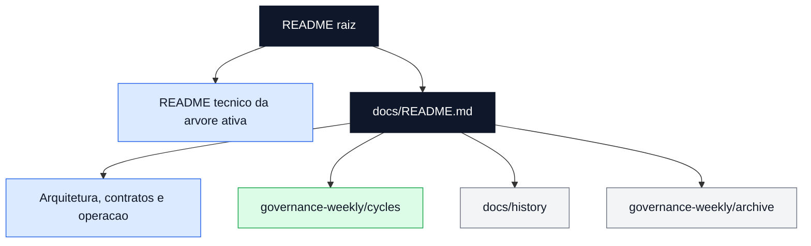
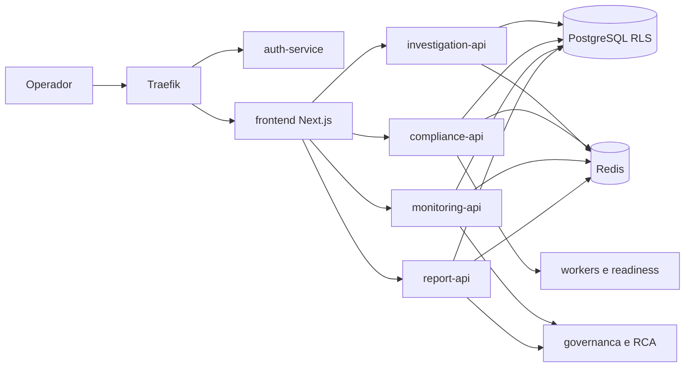
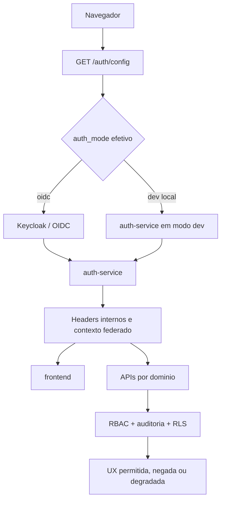
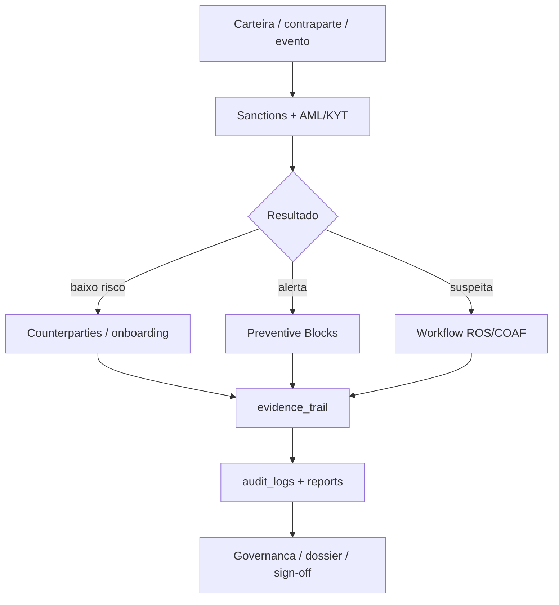
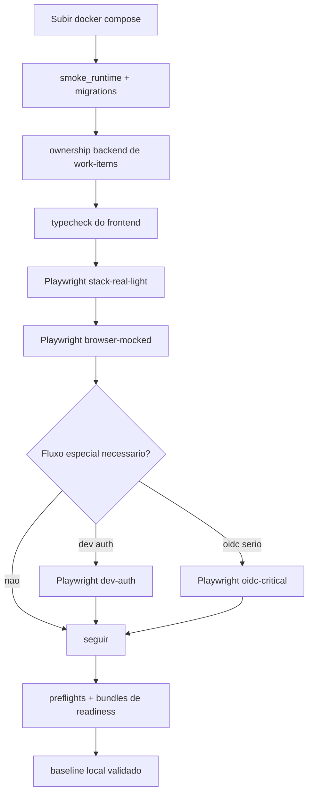
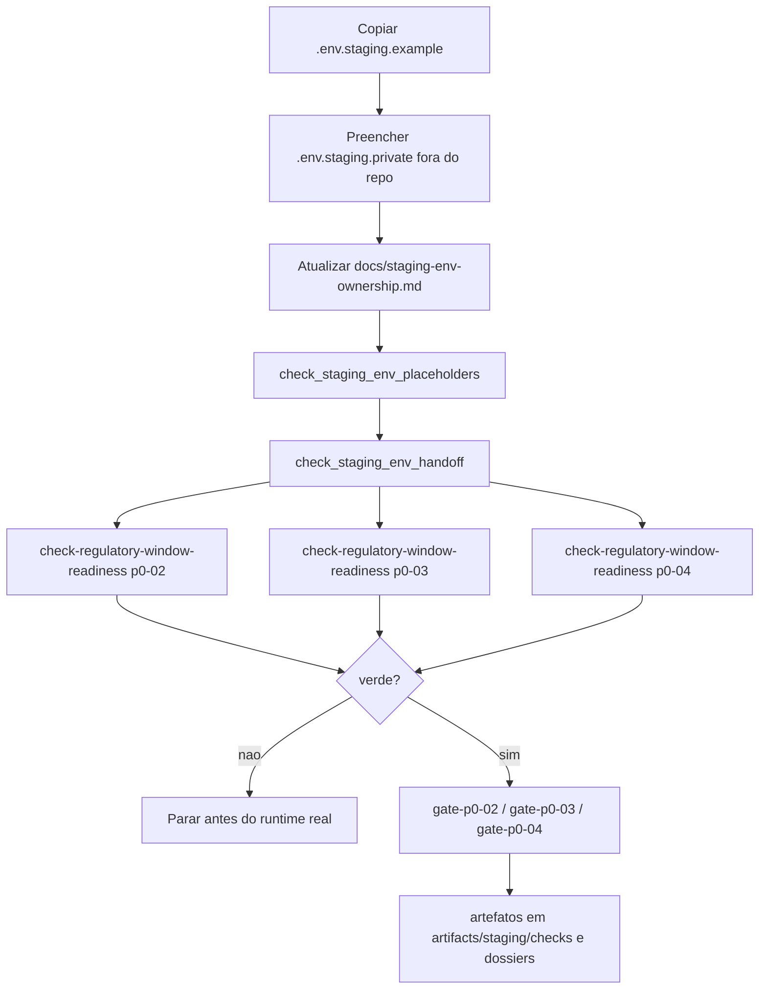
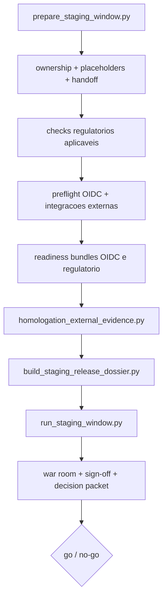
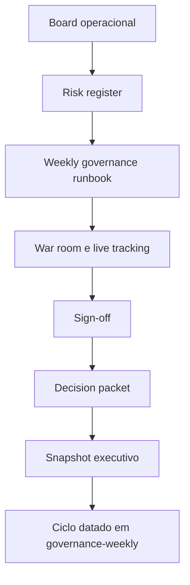
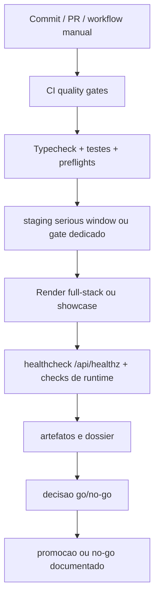

# Ontrackchain


Espelho documental do `README.md` da raiz do workspace. Este arquivo existe para preservar dentro da pasta `docs/` a mesma leitura executiva e de navegação do workspace agregador, sem depender de um arquivo fora do repositório ativo.

## Leitura Rapida

Se este e seu primeiro contato com o workspace, leia nesta ordem:

1. [Snapshot Executivo](#snapshot-executivo)
2. [Mapa do Workspace](#mapa-do-workspace)
3. [Diagramas de Fluxo](#diagramas-de-fluxo)
4. [README tecnico da arvore ativa](../README.md)
5. [Indice canonico da documentacao ativa](./README.md)

Resumo em 30 segundos:

- baseline oficial atual: `93%` tecnico, `79%` regulatorio/operacional, `89%` consolidado
- a arvore tecnica ativa desta workspace e `github_main/ontrackchain`
- o principal gap nao e mais scaffold; agora e homologacao externa real, prova revisavel e aceite institucional
- o ciclo ativo continua ancorado em `2026-07-13`, com a janela `stg-2026-07-13-a` ainda em `pending_no_go`
- o blueprint padrao do Render passou a ser `frontend standalone showcase`; o staging real ficou isolado em `render.full-stack.yaml`
- o frontend ativo expõe `GET /auth/config` como bootstrap canonico do login
- a execucao real local mais recente confirmou `P0-02`, `P0-03` e `P0-04` em `blocked` por `.env.staging.private` ausente e handoff pendente de `Compliance/AML`

## Snapshot Executivo

### Estado atual

- arquitetura modular baseada em `frontend Next.js 14`, servicos `FastAPI`, `PostgreSQL`, `Redis`, workers e observabilidade
- trilha regulatoria funcional em `counterparties`, `preventive_blocks`, `evidence`, `reports`, `sanctions` e `ROS/COAF`
- operacao multiusuario compartilhada por `regulatory_work_items`, timeline e comentarios estruturados
- cockpit frontend tri-locale com contratos visuais endurecidos, fallback de showcase controlado e workspaces convergidos
- RCA cross-domain leve consolidada entre `alerts`, `/monitoring`, export operacional e governanca executiva
- malha documental e executiva sincronizada com taxonomia de bloqueio dominante para distinguir falha regulatoria, tecnica e de identidade

### Consolidado

| Frente | Estado | Resultado atual |
| --- | --- | --- |
| `P1-01` metadata de work-items | `done` | contrato canonico unificado entre frontend, backend e `api-contracts.md` |
| `P2-02` timeline/comments compartilhados | `done` | modelo comum consolidado nos cockpits operacionais |
| `P2-03` RCA cross-domain | `done` | RCA leve persistida, lida por `monitoring` e refletida em governanca |
| `P2-05` RBAC incremental | `in_progress` | enforcement fino expandido por `team`, `reports`, `billing`, `investigate`, `compliance`, `alerts`, `counterparties` e navegacao global sensivel |

### Bloqueadores para o salto regulatorio

- `P0-01`: homologar `OIDC + MFA` federado em trilho serio
- materializar `.env.staging.private` fora do repositorio e concluir o handoff humano de `Compliance/AML`
- `P0-02`: fechar provider `AML/KYT live` com credencial real e artefato revisavel
- `P0-03`: fechar feed UE com URL tokenizada real
- `P0-04`: consolidar bundle regulatorio oficial com evidencias revisaveis
- `P0-05`: executar a primeira janela seria completa com `go/no-go` formal
- `P0-06`: formalizar recorrencia de retention/recovery com sign-off institucional

### Leitura executiva do bloqueio atual

- `P0-02`, `P0-03` e `P0-04` nao estao apenas "aguardando runtime"
- a evidencia real mais recente mostrou que os tres estao `blocked` antes do runtime, por falta de `.env.staging.private` e `Compliance/AML.date/status`
- isso significa que o proximo passo de maior valor nao e forcar `TRM`, feed UE ou bundle, e sim materializar os insumos privados e concluir o handoff humano

## Mapa do Workspace

Esta raiz agrega mais de uma arvore. Para evitar drift de leitura, use esta interpretacao:

- `github_main/ontrackchain/`: arvore tecnica ativa, com codigo, docs, blueprints e scripts mais recentes
- `github_main/.github/`: workflows e automacoes associados a essa arvore ativa
- `.github/`: workflows e materiais compartilhados do workspace agregador
- `ontrackchain/`: copia paralela ainda presente no workspace; pode servir como referencia historica/comparativa, mas nao deve ser tratada como fonte primaria quando houver divergencia

### Estrutura resumida

```text
Ontrackchain/
├── .github/
├── README.md
├── github_main/
│   ├── .github/
│   ├── README.md
│   └── ontrackchain/
│       ├── apps/
│       ├── docs/
│       ├── infra/
│       ├── packages/
│       ├── scripts/
│       ├── tests/
│       ├── docker-compose.yml
│       ├── render.yaml
│       ├── render.full-stack.yaml
│       └── README.md
└── ontrackchain/
    └── ...
```

### Fluxo de leitura canonica



## Modos de Deploy

### 1. Frontend Standalone Showcase

Use quando a meta for publicar uma vitrine navegavel do frontend sem backend real e sem segredos.

- blueprint: [render.yaml](../render.yaml)
- doc canonica: [Blueprint Render para Staging Full-Stack](./render-staging-blueprint.md)
- comportamento esperado:
  - `FRONTEND_STANDALONE_SHOWCASE_MODE=true`
  - `/api/healthz` responde sem depender de auth interna
  - `/auth/config` responde localmente
  - dashboard seeded sobe com navegacao e `Gestao de equipe`

### 2. Staging Full-Stack

Use quando a meta for validar a arquitetura real do produto com `OIDC`, banco, workers, APIs e observabilidade.

- blueprint: [render.full-stack.yaml](../render.full-stack.yaml)
- doc canonica: [Blueprint Render para Staging Full-Stack](./render-staging-blueprint.md)
- comportamento esperado:
  - `gateway`, `frontend`, `auth-service`, `Keycloak`, APIs e workers convergem
  - `/api/healthz` do frontend responde `render-full-stack-staging`
  - se faltarem envs internas criticas, o frontend pode cair em `hostedShowcaseFallback`; isso preserva UX seeded, mas nao prova integracao real

## Arquitetura em 60 Segundos

- `Traefik` centraliza a borda e roteia requisicoes para os servicos internos
- `auth-service` resolve identidade, contexto federado, `2FA`, roles e headers internos
- `frontend` em `Next.js 14` atua como cockpit operacional e camada de orquestracao de UX
- `investigation-api` concentra `estimate`, `start`, `status`, ledger e superficies financeiras
- `compliance-api` concentra sanctions, counterparties, blocks, screening e fila operacional compartilhada
- `monitoring-api` recebe webhooks do `Alertmanager` e sustenta triagem, RCA e export operacional
- `report-api` gera relatorios deterministas e governa o workflow `ROS/COAF`
- `PostgreSQL` com `RLS` sustenta o dominio multi-tenant; `Redis` cobre fila, retry, DLQ e concorrencia

## Diagramas de Fluxo

### 1. Fluxo macro da plataforma



### 2. Fluxo de autenticacao e autorizacao



### 3. Fluxo regulatorio e de compliance



### 4. Fluxo de validacao local



### 5. Fluxo de readiness regulatorio real



### 6. Fluxo da janela seria



### 7. Fluxo de governanca semanal



### 8. Fluxo de CI/CD e promocao



## Portas Canonicas

### Portas de entrada

- [README tecnico da arvore ativa](../README.md)
- [Indice canonico da documentacao ativa](./README.md)

### Documentos principais

- [Arquitetura](./architecture.md)
- [Contratos de API](./api-contracts.md)
- [RBAC e Permissoes](./rbac-and-permissions.md)
- [Deploy e Staging](./deploy-and-staging.md)
- [Variaveis de Ambiente](./environment-variables.md)
- [Runbooks Operacionais](./runbooks.md)
- [Resumo Executivo de Readiness](./project-executive-readiness-brief.md)
- [Readiness Regulatorio](./regulatory-readiness.md)
- [Board Operacional](./project-operational-execution-board.md)
- [Gates de Release](./project-release-gates.md)
- [Governanca Semanal](./governance-weekly/README.md)

### Evidencia datada e historico

- [Ciclo ativo 2026-07-13](./governance-weekly/cycles/2026-07-13/README.md)
- [Historico de apoio](./history/README.md)
- [Arquivo historico da governanca](./governance-weekly/archive/README.md)

## Leitura Recomendada por Perfil

### Arquiteto / lider tecnico

1. [architecture.md](./architecture.md)
2. [api-contracts.md](./api-contracts.md)
3. [rbac-and-permissions.md](./rbac-and-permissions.md)
4. [adrs/README.md](./adrs/README.md)

### Operacao / SRE / DevOps

1. [operations.md](./operations.md)
2. [deploy-and-staging.md](./deploy-and-staging.md)
3. [render-staging-blueprint.md](./render-staging-blueprint.md)
4. [runbooks.md](./runbooks.md)
5. [staging-env-ownership.md](./staging-env-ownership.md)

### Compliance / regulacao

1. [regulatory-readiness.md](./regulatory-readiness.md)
2. [evidence-and-audit-matrix.md](./evidence-and-audit-matrix.md)
3. [compliance-and-security-controls.md](./compliance-and-security-controls.md)
4. [project-maturity-evidence-execution-kit.md](./project-maturity-evidence-execution-kit.md)
5. [compliance-reports/README.md](./compliance-reports/README.md)

### Stakeholders executivos

1. [project-executive-readiness-brief.md](./project-executive-readiness-brief.md)
2. [project-kpi-scorecard.md](./project-kpi-scorecard.md)
3. [project-priority-board.md](./project-priority-board.md)
4. [project-risk-register.md](./project-risk-register.md)
5. [ciclo ativo](./governance-weekly/cycles/2026-07-13/README.md)

## Quick Start

### 1. Entrar na arvore ativa

```bash
cd github_main/ontrackchain
```

### 2. Subir a stack local

```bash
cp .env.example .env
docker compose up -d --build
```

Para exercitar `OIDC` localmente:

```bash
docker compose --profile oidc up -d --build
```

### 3. Validar o baseline local

```bash
python3 scripts/smoke_runtime.py
make apply-regulatory-work-items-migration
make smoke-work-items-ownership-backend

cd apps/frontend
npm ci
npm run typecheck
npm run test:e2e:stack-real-light
npm run test:e2e:browser-mocked
```

Observacoes:

- use `npm run test:e2e:dev-auth` apenas com `AUTH_MODE=dev`
- use `npm run test:e2e:oidc-critical` apenas quando o runtime real estiver em `AUTH_MODE=oidc`
- para mudancas server-side no frontend, prefira `docker compose up -d --build frontend`

### 4. Validar readiness serio

```bash
python3 scripts/preflight_external_integrations.py
make run-oidc-readiness-bundle-local WINDOW_ID=stg-$(date +%F)-oidc BASE_URL=http://localhost:8080
make check-regulatory-window-readiness REGULATORY_SCOPE=p0-02 PRIVATE_ENV_FILE=.env.staging.private OWNERSHIP_FILE=docs/staging-env-ownership.md
make check-regulatory-window-readiness REGULATORY_SCOPE=p0-03 PRIVATE_ENV_FILE=.env.staging.private OWNERSHIP_FILE=docs/staging-env-ownership.md
make check-regulatory-window-readiness REGULATORY_SCOPE=p0-04 PRIVATE_ENV_FILE=.env.staging.private OWNERSHIP_FILE=docs/staging-env-ownership.md
```

Se os readiness checks estiverem verdes, seguir para:

```bash
make gate-p0-02-aml-live PRIVATE_ENV_FILE=.env.staging.private
make gate-p0-03-eu-live WINDOW_ID=stg-$(date +%F)-eu PRIVATE_ENV_FILE=.env.staging.private
make gate-p0-04-regulatory-bundle WINDOW_ID=stg-$(date +%F)-reg PRIVATE_ENV_FILE=.env.staging.private
```

## Janela Seria

Comandos principais:

```bash
cd ..
make help-serious-window
make prepare-serious-window-dispatch WINDOW_ID=stg-2026-07-13-a
make render-serious-window-dispatch-packet WINDOW_ID=stg-2026-07-13-a
make run-serious-window-local WINDOW_ID=stg-2026-07-13-a MODE=baseline
make postprocess-serious-window RUN_URL="https://github.com/<org>/<repo>/actions/runs/<run_id>"
```

Estado atual:

- `stg-2026-07-13-a` segue em `pending_no_go`
- o bloqueio principal continua sendo insumo externo real, ownership material e prova revisavel
- `ROS/COAF` segue sendo a trilha mais sensivel para validacao fim a fim do staging
- para qualquer nova tentativa regulatoria real, o readiness de `P0-02/P0-03/P0-04` deve ficar verde antes do runtime real

## Proximo Passo Recomendado

As frentes que mais movem a maturidade comprovada continuam sendo:

1. materializar `.env.staging.private` fora do repositorio
2. tirar `Compliance/AML` de `pending` em `docs/staging-env-ownership.md`
3. reexecutar `check-regulatory-window-readiness` para `p0-02`, `p0-03` e `p0-04`
4. fechar `P0-02` com provider `AML/KYT live`
5. fechar `P0-03` com feed UE tokenizado
6. homologar `P0-01` com evidencias reais de `OIDC + MFA`
7. executar a janela seria completa com `go/no-go` formal

Trilha de prova tecnica prioritaria:

- usar `ROS/COAF` como fluxo de validacao fim a fim do staging, porque ele exige identidade federada, usuario persistido, `report-api`, MFA e trilha auditavel coerentes

## Politica Documental

- este arquivo espelha o `README.md` da raiz do workspace dentro da trilha `docs/`
- a porta de entrada tecnica da aplicacao e [../README.md](../README.md)
- o indice canonico da documentacao ativa e [README.md](./README.md)
- artefatos datados ainda ativos devem viver em `governance-weekly/cycles/`
- historico datado de apoio deve viver em `history/`
- historico frio consolidado deve viver em `governance-weekly/archive/`
- outputs gerados devem viver em suas pastas canonicas e nao devem ser editados manualmente
- documentos paralelos, redundantes ou supersedidos devem ser consolidados, arquivados ou removidos

### Precedencia de leitura

1. `docs/README.md` e os documentos canonicamente indexados nele
2. `docs/governance-weekly/cycles/` para evidencia datada ainda navegavel
3. `docs/history/` e `docs/governance-weekly/archive/` apenas como contexto historico
